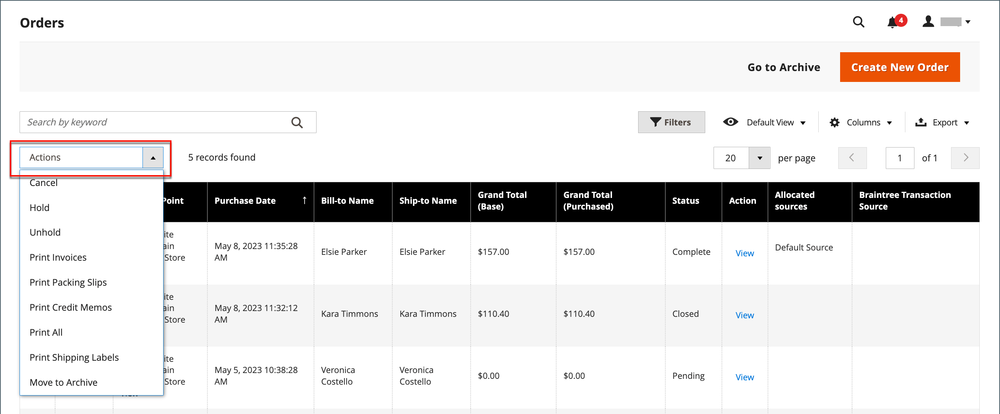

# Ordini

La griglia _Ordini_ elenca tutti gli ordini correnti e ne tiene traccia dell&#39;avanzamento e dello [stato ordine](order-status.md) tramite il [flusso di lavoro](order-processing.md). Un modo semplice per capire il processo di base è che un ordine diventa una [fattura](invoices.md) e una fattura diventa una [spedizione](shipments.md). La griglia rappresenta la prima fase del processo ed è il punto in cui è possibile [aggiornare](order-update.md) ordini esistenti e creare ordini.

Di solito, gli ordini vengono creati quando i clienti completano il processo di pagamento dalla vetrina. Tuttavia, se un cliente ha bisogno di assistenza, puoi anche accedere al suo [carrello](shopping-assisted-cart-manage.md) o [creare un ordine](customer-account-create-order.md) dalla griglia _Ordini_ o direttamente dal suo account cliente.

## Area di lavoro Ordini

L&#39;area di lavoro Ordini elenca tutti gli ordini correnti e consente di modificare gli ordini esistenti e [creare](customer-account-create-order.md) ordini. Ogni riga della griglia rappresenta un ordine cliente e ogni colonna rappresenta un attributo o un campo dati. Utilizza i [controlli](../getting-started/admin-grid-controls.md) standard per ordinare e filtrare l&#39;elenco, trovare gli ordini e applicare [azioni](../getting-started/admin-actions-control.md) agli ordini selezionati. Utilizzare le schede sopra i controlli di impaginazione per filtrare l&#39;elenco, modificare la visualizzazione predefinita, modificare e ridisporre le colonne ed esportare i dati.

{width="700" zoomable="yes"}

### Layout griglia

La selezione delle colonne e il relativo ordine nella griglia possono essere modificati in base alle preferenze dell&#39;utente. Il nuovo layout può essere salvato come griglia _vista_. Per impostazione predefinita, nella griglia sono incluse solo nove delle 20 colonne disponibili.

{width="600" zoomable="yes"}

#### Modificare la selezione delle colonne

Nell&#39;angolo superiore destro fare clic sul controllo _Colonne_ (  ) ed eseguire le operazioni seguenti:

- Selezionare la casella di controllo delle colonne che si desidera aggiungere alla griglia.
- Deselezionare la casella di controllo delle colonne che si desidera rimuovere dalla griglia.

#### Reimposta la selezione della colonna

1. Fare clic sul controllo _Colonne_ (  ).

1. Per reimpostare le colonne della griglia, fare clic su **[!UICONTROL Reset]**.

   Il layout della griglia verrà modificato in modo da visualizzare solo [colonne predefinite](#column-descriptions).

#### Spostare una colonna

1. Fai clic su e tieni premuto sull’intestazione della colonna.

1. Trascinare la colonna nella nuova posizione e rilasciare.

#### Salvare una vista griglia

1. Fare clic sul controllo **[!UICONTROL View]** (  ).

1. Fare clic su **[!UICONTROL Save Current View]**.

1. Immettere **[!UICONTROL name]** per la visualizzazione.

1. Per salvare tutte le modifiche, fare clic sulla freccia (  ).

   Il nome della vista viene ora visualizzato come vista corrente.

#### Modificare la visualizzazione

Fare clic sul controllo **[!UICONTROL View]** (  ). Quindi, effettuate una delle seguenti operazioni:

- Per utilizzare una visualizzazione diversa, fare clic sul nome della visualizzazione.

- Per modificare il nome di una visualizzazione, fare clic sull&#39;icona _Modifica_ (  ) e aggiornare il nome.

### Controlli Workspace

| Controllo | Descrizione |
|--- |--- |
| [!UICONTROL Create New Order] | Crea un ordine. Per ulteriori informazioni, vedere [Creazione di un ordine](customer-account-create-order.md). |
| [!UICONTROL Go to Archive] | Visualizza l&#39;elenco degli ordini archiviati. |
| [!UICONTROL Search] | Avvia una ricerca degli ordini in base ai filtri correnti. |
| [!UICONTROL Filters] | Definisce un insieme di parametri di ricerca utilizzati per filtrare i record visualizzati nella griglia. |
| [!UICONTROL Default View] | Determina il layout di colonna predefinito della griglia. |
| [!UICONTROL Columns] | Determina la selezione delle colonne e il relativo ordine nella griglia. Il layout delle colonne può essere modificato e salvato come _visualizzazione_. Per impostazione predefinita, nella griglia sono incluse solo alcune colonne. |
| [!UICONTROL Export] | Esporta i record selezionati come file CSV o XML di Excel. |

{style="table-layout:auto"}

### Azioni

Per applicare un&#39;azione a ordini specifici, seleziona la casella di controllo nella prima colonna di ciascun ordine. Per selezionare o deselezionare tutti gli ordini, utilizzare il controllo nella parte superiore della colonna.

{width="600" zoomable="yes"}

| Controllo | Descrizione |
|--- |--- |
| [!UICONTROL Actions] | Elenca tutte le azioni applicabili agli ordini selezionati. Per applicare un&#39;azione a un ordine o a un gruppo di ordini, selezionare la casella di controllo nella prima colonna di ciascun ordine.  Azioni ordine: `Cancel` / `Hold` / `Unhold` / `Print Invoices` / `Print Packing Slips` / `Print Credit Memos` / `Print All` / `Print Shipping Labels` / `Move to Archive`  (solo Adobe Commerce) |
| [!UICONTROL Mass Actions] | Può essere utilizzato per selezionare più record come destinazione dell&#39;azione. Selezionare la casella di controllo nella prima colonna di ogni record soggetto all&#39;azione. Opzioni: `Select All` / `Unselect All` / `Select Visible` / `Unselect Visible` |
| [!UICONTROL Submit] | Applica l&#39;azione corrente ai record ordine selezionati. |
| [!UICONTROL Edit] | Apre l&#39;ordine in modalità di modifica. |

{style="table-layout:auto"}

### Descrizioni delle colonne

| Colonna | Descrizione |
|--- |--- |
| [!UICONTROL Select] | Selezionare le caselle di controllo per le virgolette da sottoporre a un&#39;azione oppure utilizzare il controllo di selezione nell&#39;intestazione di colonna. Opzioni: Seleziona tutto / Deseleziona tutto |
| [!UICONTROL ID] | Numero sequenziale univoco assegnato al primo salvataggio di un nuovo ordine. |
| [!UICONTROL Purchase Point] | Identifica la visualizzazione del punto vendita in cui è stato effettuato l&#39;ordine. |
| [!UICONTROL Purchase Date] | La data e l’ora in cui è stato effettuato l’ordine. Viene sempre visualizzato in base al fuso orario predefinito. |
| [!UICONTROL Bill-to Name] | Il nome della persona responsabile del pagamento dell’ordine. |
| [!UICONTROL Ship-to Name] | Nome della persona a cui deve essere spedito l&#39;ordine. |
| [!UICONTROL Grand Total (Base)] | Totale complessivo dell&#39;ordine. |
| [!UICONTROL Grand Total (Purchased)] | Il totale complessivo dei prodotti acquistati nell’ordine. |
| [!UICONTROL Status] | Stato dell&#39;ordine corrente. |
| [!UICONTROL Action] | _[!UICONTROL View]_apre l&#39;ordine in modalità di modifica. |
| [!UICONTROL Allocated sources] | Le origini allocate a tale ordine specifico. |

{style="table-layout:auto"}

Colonne aggiuntive disponibili:

| Colonna | Descrizione |
|--- |--- |
| [!UICONTROL Billing Address] | L’indirizzo di fatturazione del cliente che ha effettuato l’ordine. |
| [!UICONTROL Shipping Address] | L’indirizzo dove deve essere spedito l’ordine. |
| [!UICONTROL Shipping Information] | Metodo da utilizzare per la spedizione dell&#39;ordine. |
| [!UICONTROL Customer Email] | L’indirizzo e-mail della persona che ha effettuato l’ordine. |
| [!UICONTROL Customer Group] | Il gruppo di clienti a cui è assegnata la persona che ha effettuato l’ordine. |
| [!UICONTROL Subtotal] | Il subtotale dell&#39;ordine, senza spedizione e movimentazione, e le imposte. |
| [!UICONTROL Shipping and Handling] | Importo addebitato per la spedizione e la movimentazione. |
| [!UICONTROL Customer Name] | Il nome e il cognome del cliente che ha effettuato l’ordine. |
| [!UICONTROL Payment Method] | Il metodo di pagamento da utilizzare per l’ordine. |
| [!UICONTROL Total Refunded] | Qualsiasi importo dell&#39;ordine da rimborsare al cliente. |
| [!UICONTROL Refunded to Store Credit] |  (solo Adobe Commerce) Qualsiasi importo dell&#39;ordine da rimborsare al credito del negozio del cliente. |
| [!UICONTROL Company Name] |  (disponibile con Adobe Commerce B2B) Il nome della [società](../b2b/account-companies.md) che ha effettuato l&#39;ordine. |

{style="table-layout:auto"}

## Ricerca per ordine

È possibile utilizzare la casella di ricerca nella parte superiore sinistra della griglia Ordini per trovare ordini specifici per parola chiave o filtrando i record degli ordini nella griglia.

{width="600" zoomable="yes"}

### Cerca una corrispondenza

1. Immetti un termine di ricerca nella casella di ricerca della pagina.

1. Per visualizzare i risultati, fare clic su _Cerca_ (  ).

### Filtrare la ricerca

1. Per visualizzare la selezione dei filtri di ricerca, fare clic sulla scheda _Filtri_ (  ).

   {width="600" zoomable="yes"}

1. Completa tutti i filtri che desideri per descrivere gli ordini che desideri trovare.

1. Fare clic su **[!UICONTROL Apply Filters]** per visualizzare i risultati.

### Filtri di ricerca

| Filtro | Descrizione |
|--- |--- |
| [!UICONTROL Purchase Date] | Filtra la ricerca in base alla data di acquisto. Per trovare gli ordini compresi in un intervallo di date, immettere le date **[!UICONTROL from]** e **[!UICONTROL to]**. |
| [!UICONTROL ID] | Filtra la ricerca in base all’ID dell’ordine. |
| [!UICONTROL Grand Total (Base)] | Filtra la ricerca in base al totale complessivo di ciascun ordine, che include tutti i crediti applicati all’ordine. |
| [!UICONTROL Grand Total (Purchased)] | Filtra la ricerca in base al totale complessivo degli articoli acquistati in ogni ordine. |
| [!UICONTROL Bill-to Name] | Filtra la ricerca in base al nome della persona responsabile del pagamento dell’ordine. |
| [!UICONTROL Ship-to Name] | Filtra la ricerca in base al nome della persona a cui viene spedito ogni ordine. |
| [!UICONTROL Purchase Point] | Filtra la ricerca in base alla visualizzazione del sito web, del negozio o del negozio in cui è stato effettuato l’ordine. |
| [!UICONTROL Status] | Filtra la ricerca in base allo stato dell’ordine. Opzioni: `Canceled` / `Closed` / `Complete` / `Suspected Fraud` / `On Hold` / `Payment Review` / `PayPal Canceled Reversal` /` PayPal Reversed` /` Pending` / `Pending Payment` / `Pending PayPal` / `Processing` |
| [!UICONTROL Braintree Transaction Source] | Filtra la ricerca in base all&#39;origine della transazione. |

{style="table-layout:auto"}

### Strumenti di ricerca

| Strumento | Descrizione |
|--- |--- |
| [!UICONTROL Apply Filters] | Applica tutti i filtri ai risultati della ricerca. |
| [!UICONTROL Cancel] | Annulla la ricerca corrente. |
| [!UICONTROL Clear All] | Cancella tutti i filtri di ricerca. |

{style="table-layout:auto"}

## Risorse per la risoluzione dei problemi

Per informazioni sulla risoluzione dei problemi relativi agli ordini, vedere i seguenti articoli della Knowledge Base di supporto Commerce:

- [Errore di visualizzazione ordini](https://experienceleague.adobe.com/docs/commerce-knowledge-base/kb/troubleshooting/storefront/magento-2.4.0-known-issue-orders-display-error.html)
- [Ordini non visualizzati nella griglia Ordini dell&#39;amministratore](https://experienceleague.adobe.com/docs/commerce-knowledge-base/kb/troubleshooting/known-issues-patches-attached/orders-not-displayed-in-the-orders-grid-in-the-admin.html)
