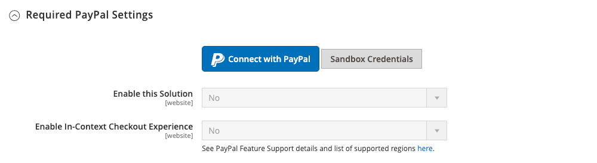
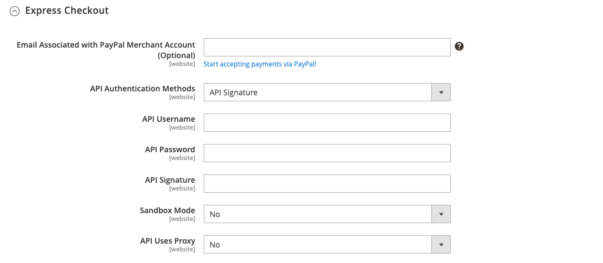

# Pagamento PayPal Express

PayPal Express Checkout aiuta a incrementare le vendite offrendo ai tuoi clienti la possibilità di pagare con carta di credito o dalla sicurezza dei loro account PayPal personali. Durante il pagamento, il cliente viene reindirizzato al sito PayPal sicuro per completare le informazioni di pagamento. Il cliente viene quindi riportato nel tuo negozio per completare il resto del processo di pagamento. Scegliendo il Checkpoint rapido si aggiunge il noto pulsante PayPal al tuo negozio, che è stato segnalato per aumentare le vendite.

>[!IMPORTANT]
>
>**Requisiti PSD2:**  
>A partire dal 14 settembre 2019, le banche europee potrebbero rifiutare i pagamenti che non soddisfano [PSD2](../getting-started/compliance-payment-services-directive.md) requisiti. Non è necessaria alcuna azione affinché PayPal Express Checkout sia conforme a PSD2 perché tutti i requisiti sono gestiti da PayPal.

I clienti con i conti PayPal correnti possono effettuare un acquisto in un unico passaggio facendo clic sul pulsante _[!UICONTROL Check out with PayPal]_pulsante. Il Checkout rapido può essere utilizzato come soluzione indipendente o con una delle soluzioni PayPal all-in-one. Se accetti già le carte di credito online, puoi offrire il Checkout rapido come opzione aggiuntiva per attirare nuovi clienti che preferiscono pagare con PayPal.

>[!NOTE]
>
>PayPal ha dichiarato obsoleto il supporto per la vendita di beni digitali tramite PayPal Express Checkout e consiglia di utilizzare [Pagamenti PayPal Standard](paypal-payments-standard.md) o un altro gateway di pagamento PayPal per elaborare qualsiasi ordine che includa [prodotti virtuali](../catalog/product-create-virtual.md).

## Requisiti

- Commerciante: [Conto PayPal aziendale][1]
- Cliente: [Conto PayPal personale][2]

## Flusso di lavoro di pagamento rapido

A differenza di altri metodi di pagamento, PayPal Express Checkout consente al cliente di effettuare il check-out all&#39;inizio del normale flusso di lavoro dalla pagina del prodotto, dal mini carrello e dal carrello.

1. **Il cliente effettua l&#39;ordine** - Il cliente fa clic/tocca il _[!UICONTROL Check out with PayPal]_pulsante.
1. **Il cliente viene reindirizzato al sito PayPal** - Il cliente viene reindirizzato al sito PayPal per completare la transazione.
1. **Il cliente accede al proprio conto PayPal** - Il cliente deve effettuare l&#39;accesso al proprio conto PayPal per completare la transazione. Il sistema di pagamento utilizza le informazioni di fatturazione e spedizione dal proprio conto PayPal.
1. **Il cliente ritorna alla pagina di pagamento** - Il cliente viene reindirizzato alla pagina di pagamento del negozio per rivedere l&#39;ordine.
1. **Il cliente effettua l&#39;ordine** - Il cliente effettua l&#39;ordine e le informazioni sull&#39;ordine vengono inviate a PayPal.
1. **PayPal liquida la transazione** - PayPal riceve l&#39;ordine e salda la transazione.

>[!NOTE]
>
>PayPal Express Checkout non supporta gli ordini con più indirizzi.

## Check-out nel contesto

PayPal _Checkout nel contesto_ rende più facile che mai pagare online. I clienti non perdono mai di vista il tuo negozio durante questo check-out semplificato di uno o due clic senza soluzione di continuità. Il check-out nel contesto funziona ugualmente bene su Mac e PC e offre un&#39;esperienza coerente su computer desktop, tablet e dispositivi mobili. Per ulteriori informazioni, consulta [Check-out nel contesto in Check-Out rapido][5].

{width="700" zoomable="yes"}

[_Demo di pagamento contestuale PayPal_][6]

Quando configuri il tuo store per [!DNL PayPal Express Checkout], puoi abilitare questa opzione.

## Configura il tuo conto PayPal

Prima di configurare PayPal Express Checkout nell’amministratore di Commerce, devi configurare il tuo account esercente sul sito Web PayPal.

1. Accedi al tuo conto PayPal Advanced all&#39;indirizzo [manager.paypal.com][3].

1. Vai a **[!UICONTROL Service Settings]** > **[!UICONTROL Hosted Checkout Pages]** > **[!UICONTROL Set Up]** ed effettuare le seguenti impostazioni:

   - **[!UICONTROL AVS]**: `No`
   - **[!UICONTROL CSC]**: `No`
   - **[!UICONTROL Enable Secure Token]**: `Yes`

1. Clic **[!UICONTROL Save Changes]**.

1. Configura un altro utente (consigliato da PayPal):

   - Vai a [manager.paypal.com][3] e accedi al tuo account.

   - Per impostare un altro utente, seguire le istruzioni.

   - Clic **[!UICONTROL Update]**.

## Imposta il Checkout PayPal Express in Commerce

Puoi avere due soluzioni PayPal attive contemporaneamente: PayPal Express Checkout e una soluzione all-in-one. Se abiliti una soluzione diversa, quella utilizzata in precedenza viene disattivata automaticamente.

>[!NOTE]
>
>Clic **[!UICONTROL Save Config]** in qualsiasi momento per salvare i tuoi progressi.

### Passaggio 1: avviare la configurazione

1. Il giorno _Amministratore_ barra laterale, vai a **[!UICONTROL Stores]** > _[!UICONTROL Settings]_>**[!UICONTROL Configuration]**.

1. Nel pannello a sinistra, espandi **[!UICONTROL Sales]** e scegli **[!UICONTROL Payment Methods]**.

1. Se nell&#39;installazione sono presenti più siti Web, store o visualizzazioni, impostare **[!UICONTROL Store View]** nella vista Store in cui desideri applicare questa configurazione.

1. In _[!UICONTROL Merchant Location]_, seleziona la sezione **[!UICONTROL Merchant Country]**dove si trova la tua azienda.

   Questa impostazione determina la selezione delle soluzioni PayPal visualizzate nella configurazione.

   {width="600" zoomable="yes"}

1. Sotto _[!UICONTROL Recommended Solutions]_, fai clic su **[!UICONTROL Configure]**per **[!UICONTROL PayPal Express Checkout]**.

   {width="600"}

### Passaggio 2: abilita e collega il tuo conto PayPal

1. Se necessario, espandere  il **[!UICONTROL Required PayPal Settings]** sezione.

   {width="600" zoomable="yes"}

1. Connetti il tuo account per test o produzione:

   - Per verificare la modalità di sviluppo, fai clic su **[!UICONTROL Sandbox Credentials]** e inserisci il [Sandbox PayPal][7] credenziali.
   - Per la modalità di produzione, fai clic su **[!UICONTROL Connect with PayPal]** e inserisci le credenziali dell’account di produzione.

   Una volta convalidata la connessione, puoi procedere.

1. Imposta **[!UICONTROL Enable this Solution]** a `Yes`.

1. Per abilitare [Pagamento in contesto PayPal](#in-context-checkout):

   - Imposta **[!UICONTROL Enable In-Context Checkout Experience]** a `Yes`.

   - Inserisci PayPal **[!UICONTROL Merchant Account ID]**.

     L&#39;ID dell&#39;account esercente si trova nel profilo dell&#39;account aziendale PayPal.

>[!NOTE]
>
>[Credito PayPal](paypal.md#paypal-credit-and-pay-later) è abilitato per impostazione predefinita per questa opzione di pagamento.

### Passaggio 3: Completa le impostazioni PayPal richieste

1. Se necessario, espandere  il **[!UICONTROL Express Checkout]** sezione.

   {width="600" zoomable="yes"}

1. (Facoltativo) Inserisci il **[!UICONTROL Email Associated with PayPal Merchant Account]**.

   >[!IMPORTANT]
   >
   >Gli indirizzi e-mail fanno distinzione tra maiuscole e minuscole. Per ricevere il pagamento, l&#39;indirizzo email che immetti deve corrispondere a quello specificato nel tuo conto PayPal dell&#39;esercente.

   Se non hai un conto PayPal, fai clic su **[!UICONTROL Start accepting payments via PayPal]**.

1. Imposta **[!UICONTROL API Authentication Methods]** a uno dei seguenti elementi:

   - `API Signature` - Questo metodo di autenticazione PayPal è il più semplice da implementare ed è basato sul nome utente, la password e una stringa univoca di caratteri e numeri che identifica il tuo account. Le credenziali della firma API non scadono.
   - `API Certificate` - Questo metodo di autenticazione PayPal è più sicuro, si basa sul tuo nome utente, password e un certificato scaricabile. Le credenziali API scadono dopo tre anni e devono essere rinnovate.

   Se necessario, completare quanto segue:

   - **[!UICONTROL API Username]**
   - **[!UICONTROL API Password]**
   - **[!UICONTROL API Signature]**

1. Se utilizzi le credenziali dell’account sandbox, imposta **[!UICONTROL Sandbox Mode]** a `Yes`.

   Quando esegui il test della configurazione in una sandbox, utilizza solo [numeri di carta di credito][4] che sono consigliati da PayPal. Quando sei pronto per passare alla produzione, torna alla configurazione e imposta la modalità sandbox su `No` e collegati al tuo conto PayPal di produzione.

1. Se il sistema utilizza un server proxy per stabilire la connessione tra Commerce e il sistema di pagamento PayPal, impostare **[!UICONTROL API Uses Proxy]** a `Yes` e completano quanto segue:

   - **[!UICONTROL Proxy Host]**
   - **[!UICONTROL Proxy Port]**

Al termine di questa sequenza di passaggi, le impostazioni PayPal richieste sono completate. Puoi continuare con le Impostazioni di base e avanzate oppure fare clic su **[!UICONTROL Save Config]** e tornare in seguito per regolare la configurazione

### Passaggio 4: Impostare Advertise PayPal Credit / Advertise PayPal PayLater (facoltativo)

A partire dalla versione 2.4.3, PayPal PayLater è supportato nelle implementazioni che includono PayPal. Questa funzione consente ai clienti di pagare un ordine in rate bi-settimanali invece di pagare l’intero importo al momento dell’acquisto. L&#39;esperienza di credito PayPal è obsoleta.

Imposta **[!UICONTROL Enable PayPal PayLater Experience]** a uno dei seguenti elementi:

- `Yes` - Per impostare Advertise PayPal PayLater
- `No` - Per impostare il credito PayPal di Advertising

>[!NOTE]
>
>Il **[!UICONTROL Enable PayPal PayLater Experience]** non disabilita l&#39;impostazione [!DNL PayPal PayLater] e non rimuove **_[!UICONTROL PayPal PayLater]_** pulsanti dalla vetrina. Per disattivare entrambi **_[!UICONTROL PayPal PayLater]_** e **_[!UICONTROL PayPal Credit]_** sulla vetrina, è necessario selezionare i pulsanti `PayPal Credit` valore per **[!UICONTROL Disable Funding Options]** impostazione ([!UICONTROL Advanced Settings] in [!UICONTROL Frontend Experience Settings]).

#### Pubblicizza credito PayPal

1. Espandi  il **[!UICONTROL Advertise PayPal Credit]** sezione.

1. Per ottenere le informazioni sull&#39;account, fare clic su **[!UICONTROL Get Publisher ID from PayPal]** e seguire le istruzioni.

1. Immetti il **[!UICONTROL Publisher ID]**.

   {width="600" zoomable="yes"}

1. Espandi  il **[!UICONTROL Home Page]** sezione.

1. Per inserire un banner nella pagina, imposta **[!UICONTROL Display]** a `Yes`.

1. Imposta **[!UICONTROL Position]** a uno dei seguenti elementi:

   - `Header (center)`
   - `Sidebar (right)`

1. Imposta **[!UICONTROL Size]** a uno dei seguenti elementi:

   - `190 x 100`
   - `234 x 60`
   - `300 x 50`
   - `468 x 60`
   - `728 x 90`
   - `800 x 66`

   {width="600" zoomable="yes"}

1. Espandi  nelle sezioni rimanenti e ripetere i passaggi precedenti:

   - [!UICONTROL Catalog Category Page]
   - [!UICONTROL Catalog Product Page]
   - [!UICONTROL Checkout Cart Page]

#### Pubblicizza PayPal PayLater

1. Espandi  il **[!UICONTROL Advertise PayPal PayLater]** sezione.

1. Imposta **[!UICONTROL Enable PayPal PayLater]** a `Yes`.

1. Espandi  il **[!UICONTROL Home Page]** sezione.

1. Per inserire un banner nella pagina, imposta **[!UICONTROL Display]** a `Yes`.

1. Imposta **[!UICONTROL Position]** a uno dei seguenti elementi:

   - `Header (center)`
   - `Sidebar`

1. Imposta **[!UICONTROL Style Layout]** a uno dei seguenti elementi:

   - `Text`
   - `Flex`

1. Per [!UICONTROL Style Layout] **[!UICONTROL Text]** solo, imposta **[!UICONTROL Logo Type]** a uno dei seguenti elementi:

   - `Primary`
   - `Alternative`
   - `Inline`
   - `None`

1. Per [!UICONTROL Style Layout] **[!UICONTROL Text]** solo, imposta **[!UICONTROL Logo Position]** a uno dei seguenti elementi:

   - `Left`
   - `Right`
   - `Top`

1. Per [!UICONTROL Style Layout] **[!UICONTROL Text]** solo, imposta **[!UICONTROL Text Color]** a uno dei seguenti elementi:

   - `Black`
   - `White`
   - `Monochrome`
   - `Grayscale`

1. Per [!UICONTROL Style Layout] **[!UICONTROL Text]** solo, imposta **[!UICONTROL Text Size]** a uno dei seguenti elementi:

   - `10px`
   - `11px`
   - `12px`
   - `13px`
   - `14px`
   - `15px`
   - `16px`

1. Per [!UICONTROL Style Layout] **[!UICONTROL Flex]** solo, imposta **[!UICONTROL Ratio]** a uno dei seguenti elementi:

   - `1x1`
   - `1x4`
   - `8x1`
   - `20x1`

1. Per [!UICONTROL Style Layout] **[!UICONTROL Flex]** solo, imposta **[!UICONTROL Color]** a uno dei seguenti elementi:

   - `Blue`
   - `Black`
   - `White`
   - `White No Border`
   - `Gray`
   - `Monochrome`
   - `Grayscale`

   {width="600" zoomable="yes"}

1. Espandi  nelle sezioni rimanenti e ripetere i passaggi precedenti:

   - [!UICONTROL Catalog Product Page]
   - [!UICONTROL Checkout Cart Page]
   - [!UICONTROL Checkout Payment Step]
   - [!UICONTROL Catalog Category Page]

### Passaggio 5: completare le impostazioni di base

1. Espandi  il **[!UICONTROL Basic Settings - PayPal Express Checkout]** sezione.

   {width="600" zoomable="yes"}

1. Per **[!UICONTROL Title]**, immettere un titolo che identifichi questo metodo di pagamento durante il pagamento.

   Si consiglia di utilizzare il titolo _PayPal_ per tutte le visualizzazioni dello store.

1. Se vengono offerti più metodi di pagamento, immettere un numero per **[!UICONTROL Sort Order]** per determinare la sequenza in cui appare PayPal Express Checkout quando elencato con gli altri metodi di pagamento.

   Questo numero è relativo agli altri metodi di pagamento. (`0` = innanzitutto, `1` = secondo, `2` = terzo e così via.)

1. Imposta **[!UICONTROL Payment Action]** a uno dei seguenti elementi:

   - `Authorization` - Approva l&#39;acquisto e blocca i fondi. L&#39;importo non viene prelevato fino al _acquisito_ dal mercante.
   - `Sale` - L&#39;importo dell&#39;acquisto è autorizzato e immediatamente prelevato dal conto del cliente.
   - `Order` - L&#39;importo dell&#39;ordine non viene acquisito o autorizzato nel saldo cliente, nel conto bancario o nella carta di credito di PayPal. L&#39;azione di pagamento dell&#39;ordine rappresenta un accordo tra il sistema di pagamento PayPal e l&#39;esercente. Consente al commerciante di acquisire uno o più importi fino al totale ordinato dal conto dell’acquirente del cliente, in un periodo massimo di 29 giorni. Una volta ordinati i fondi, il commerciante può catturarli in qualsiasi momento durante il successivo periodo di 29 giorni. L’acquisizione dell’importo dell’ordine può essere eseguita solo dall’amministratore di Commerce creando una o più fatture.

1. Per visualizzare _[!UICONTROL Check out with PayPal]_sulla pagina del prodotto, impostare **[!UICONTROL Display on Product Details Page]**a `Yes`.

1. Se l&#39;azione di pagamento è impostata su `Order`, completa quanto segue

   - **[!UICONTROL Authorization Honor Period (days)]** - Determina per quanto tempo l&#39;autorizzazione primaria rimane valida. Il valore deve essere uguale al valore corrispondente nel tuo conto PayPal dell&#39;esercente. Il valore predefinito nel tuo conto PayPal è `3`. Per aumentare questo numero, devi contattare PayPal. L&#39;autorizzazione non è più valida alle 23:49, ora del Pacifico USA, dell&#39;ultimo giorno.

   - **[!UICONTROL Order Valid Period (days)]** - Determina per quanto tempo l&#39;ordine rimane valido. Quando l&#39;ordine non è più valido, non è più possibile creare le relative fatture. Specifica il valore uguale al valore del periodo valido per l&#39;ordine nel tuo conto PayPal per esercenti. Il valore predefinito nel tuo conto PayPal è `29`. Per cambiare questo numero, devi contattare PayPal.

   - **[!UICONTROL Number of Child Authorizations]** - Specifica il numero massimo di autorizzazioni per un singolo ordine, che determina il numero massimo di fatture parziali online che è possibile creare per un ordine. Questo valore deve essere uguale all&#39;impostazione corrispondente nel tuo conto PayPal per esercenti. Il numero predefinito di autorizzazioni figlio nel tuo conto PayPal è `1`. Per aumentare questo numero, devi contattare PayPal.

### Passaggio 6: completare le impostazioni avanzate

1. Espandi  il **[!UICONTROL Advanced Settings]** sezione.

   {width="600" zoomable="yes"}

1. Imposta **[!UICONTROL Display on Shopping Cart]** a `Yes`.

1. Imposta **[!UICONTROL Payment Applicable From]** a uno dei seguenti elementi:

   - `All Allowed Countries` - I clienti di tutti i paesi specificati nella configurazione del negozio possono utilizzare questo metodo di pagamento.
   - `Specific Countries` - Dopo aver scelto questa opzione, il _[!UICONTROL Payment from Specific Countries]_viene visualizzato. Per selezionare più paesi, tenere premuto il tasto Ctrl (PC) o il tasto Comando (Mac) e fare clic su ogni elemento.

1. Per scrivere le comunicazioni con il sistema di pagamento nel file di registro, impostare **[!UICONTROL Debug Mode]** a `Yes`.

   Il file di registro per PayPal Payments Advanced è `_payflow_advanced.log`.

   >[!NOTE]
   >
   >In conformità agli standard di sicurezza dei dati PCI, le informazioni sulla carta di credito non vengono registrate nel file di registro.

1. Per abilitare la verifica dell’autenticità dell’host, imposta **[!UICONTROL Enable SSL Verification]** a `Yes`.

1. Per visualizzare un riepilogo completo dell&#39;ordine cliente per voce dalla sede PayPal, impostare **[!UICONTROL Transfer Cart Line Items]** a `Yes`.

1. Per includere nel riepilogo fino a dieci opzioni di spedizione, impostare **[!UICONTROL Transfer Shipping Options]** a `Yes`. Questa opzione viene visualizzata solo se gli elementi riga sono impostati per il trasferimento.

1. Per determinare il tipo di immagine utilizzata per il pulsante di accettazione PayPal, imposta **[!UICONTROL Shortcut Buttons Flavor]** a uno dei seguenti elementi:

   - `Dynamic` - (Consigliato) Visualizza un&#39;immagine che può essere modificata dinamicamente dal server PayPal.
   - `Static` - Visualizza un&#39;immagine specifica che non può essere modificata dinamicamente.

1. Per consentire ai clienti senza account PayPal di effettuare un acquisto con questo metodo, imposta **[!UICONTROL Enable PayPal Guest Checkout]** a `Yes`.

1. Imposta **[!UICONTROL Require Customer's Billing Address]** a uno dei seguenti elementi:

   - `Yes` - Richiede l&#39;indirizzo di fatturazione del cliente per tutti gli acquisti.
   - `No` - Non richiede l&#39;indirizzo di fatturazione del cliente per nessun acquisto.
   - `For Virtual Quotes Only` - Richiede l&#39;indirizzo di fatturazione del cliente solo per i preventivi virtuali.

   >[!NOTE]
   >
   >Questa funzione deve essere abilitata per il conto esercente tramite il supporto tecnico PayPal.

1. (Facoltativo) Imposta il **[!UICONTROL Billing Agreement Signup]** per consentire ai clienti di firmare un [contratto di fatturazione](paypal-billing-agreements.md) con il tuo Negozio nel sistema di pagamento PayPal quando non sono disponibili contratti di fatturazione attivi nel conto cliente:

   - `Auto` - Il cliente può firmare un contratto di fatturazione durante il Checkout rapido o utilizzare un altro metodo di pagamento.
   - `Ask Customer` - Il cliente può decidere se firmare un accordo di fatturazione durante il flusso di pagamento rapido.
   - `Never` - Il cliente non può firmare un contratto di fatturazione durante il flusso di pagamento rapido.

   >[!NOTE]
   >
   >I commercianti devono chiedere [Assistenza tecnica per gli esercenti PayPal](https://developer.paypal.com/support/) per abilitare gli accordi di fatturazione nei loro conti. Il _Iscrizione al contratto di fatturazione_ Il parametro viene abilitato solo dopo che PayPal conferma che gli accordi di fatturazione sono abilitati per il tuo account esercente.

1. Per consentire al cliente di completare la transazione dal sito PayPal senza tornare al negozio per la revisione dell&#39;ordine, impostare **[!UICONTROL Skip Order Review Step]** a `Yes`.

1. Completa le sezioni aggiuntive, in base alle esigenze del tuo negozio:

   - [Impostazioni contratto di fatturazione PayPall](#paypal-billing-agreement-settings)
   - [Impostazioni rapporto liquidazione](#settlement-report-settings)
   - [Impostazioni esperienza front-end](#frontend-experience-settings)
   - [Personalizzare i pulsanti avanzati](#customize-smart-buttons)
   - [Funzioni](#features)

1. Al termine, fai clic su **[!UICONTROL Save Config]**.

#### Impostazioni contratto di fatturazione PayPal

A [contratto di fatturazione](paypal-billing-agreements.md) è un contratto di vendita tra l&#39;esercente e il cliente che è stato autorizzato da PayPal per l&#39;utilizzo con più ordini. Durante il processo di pagamento, l&#39;opzione di pagamento del contratto di fatturazione viene visualizzata solo per i clienti che hanno già stipulato un contratto di fatturazione con la società. Dopo che PayPal ha autorizzato il contratto, il sistema di pagamento emette un ID di riferimento univoco per identificare ogni ordine associato al contratto. Analogamente a un ordine di acquisto, non esiste alcun limite al numero di accordi di fatturazione che un cliente può impostare con la società.

1. Espandi  il **[!UICONTROL PayPal Billing Agreement Settings]** sezione.

   {width="600" zoomable="yes"}

1. Imposta **[!UICONTROL Enabled]** a `Yes`.

1. Per **[!UICONTROL Title]**, inserisci un titolo che identifichi il metodo PayPal Billing Agreement durante il pagamento.

1. Se vengono offerti più metodi di pagamento, immettere un numero in **[!UICONTROL Sort Order]** per determinare la sequenza in cui viene visualizzato il contratto di fatturazione quando viene elencato con altri metodi di pagamento durante il pagamento.

1. Imposta **[!UICONTROL Payment Action]** a uno dei seguenti elementi:

   - `Authorization` - Approva l&#39;acquisto e blocca i fondi. L&#39;importo non viene prelevato fino a quando non viene &quot;catturato&quot; dal mercante.
   - `Sale` - L&#39;importo dell&#39;acquisto è autorizzato e immediatamente prelevato dal conto del cliente.

1. Imposta **[!UICONTROL Payment Applicable From]** a uno dei seguenti elementi:

   - `All Allowed Countries` - I clienti di tutti i paesi specificati nella configurazione del negozio possono utilizzare questo metodo di pagamento.
   - `Specific Countries` - Dopo aver scelto questa opzione, il _[!UICONTROL Payment from Specific Countries]_viene visualizzato. Per selezionare più paesi, tenere premuto il tasto Ctrl (PC) o il tasto Comando (Mac) e fare clic su ciascuno di essi.

1. Per registrare le comunicazioni con il sistema di pagamento nel file di registro, impostare **[!UICONTROL Debug Mode]** a `Yes`.

   >[!NOTE]
   >
   >Il file di registro viene archiviato sul server ed è accessibile solo agli sviluppatori. In conformità agli standard di sicurezza dei dati PCI, le informazioni sulla carta di credito non vengono registrate nel file di registro.

1. Per abilitare la verifica SSL, imposta **[!UICONTROL Enable SSL Verification]** a `Yes`.

1. Per visualizzare un riepilogo di ogni voce nell&#39;ordine del cliente nella pagina dei pagamenti PayPal, impostare **[!UICONTROL Transfer Cart Line Items]** a `Yes`.

1. Per consentire ai clienti di avviare un contratto di fatturazione dal dashboard del proprio account cliente, impostare **[!UICONTROL Allow in Billing Agreement Wizard]** a `Yes`.

#### Impostazioni rapporto liquidazione

1. Espandi  il **[!UICONTROL Settlement Report Settings]** sezione.

   {width="600" zoomable="yes"}

1. Per **[!UICONTROL SFTP Credentials]**, eseguire le operazioni seguenti:

   - Se ti sei iscritto al server FTP protetto PayPal, immetti le seguenti credenziali di accesso SFTP:

      - Login
      - Password

   - Per eseguire i rapporti sui test prima di _andare in diretta_ con Express Checkout sul sito, impostare **[!UICONTROL Sandbox Mode]** a `Yes`.

   - Inserisci il **[!UICONTROL Custom Endpoint Hostname or IP Address]**.

     Per impostazione predefinita, il valore è: `reports.paypal.com`

   - Inserisci il **[!UICONTROL Custom Path]** in cui vengono salvati i rapporti.

     Per impostazione predefinita, il valore è: `/ppreports/outgoing`

1. Per generare i rapporti in base a una pianificazione, completa la **[!UICONTROL Scheduled Fetching]** impostazioni:

   - Imposta **[!UICONTROL Enable Automatic Fetching]** a `Yes`.

   - Imposta **[!UICONTROL Schedule]** a uno dei seguenti elementi:

      - `Daily`
      - `Every 3 Days`
      - `Every 7 Days`
      - `Every 10 Days`
      - `Every 14 Days`
      - `Every 30 Days`
      - `Every 40 Days`

     PayPal conserva ogni rapporto per 45 giorni.

   - Imposta **[!UICONTROL Time of Day]** all’ora, al minuto e al secondo quando desideri generare i rapporti.

#### Impostazioni esperienza front-end

Utilizza le impostazioni di esperienza front-end per scegliere quali logo PayPal visualizzare sul tuo sito e per personalizzare l&#39;aspetto delle tue pagine di esercenti PayPal.

1. Espandi  il **[!UICONTROL Frontend Experience Settings]** sezione.

   {width="600" zoomable="yes"}

1. Seleziona la **[!UICONTROL PayPal Product Logo]** che desideri visualizzare nel blocco PayPal del tuo negozio.

   I logo PayPal sono disponibili in quattro stili e due dimensioni:

   - `No Logo`
   - `We Prefer PayPal (150 x 60 or 150 x 40)`
   - `Now Accepting PayPal (150 x 60 or 150 x 40)`
   - `Payments by PayPal (150 x 60 or 150 x 40)`
   - `Shop Now Using PayPal (150 x 60 or 150 x 40)`

1. Per personalizzare l&#39;aspetto delle pagine di PayPal per esercenti, eseguire le operazioni seguenti:

   - Inserisci il nome del **[!UICONTROL Page Style]** che desideri applicare alle tue pagine PayPal per esercenti:

      - `paypal` - Utilizza lo stile di pagina PayPal.
      - `primary` - Utilizza lo stile di pagina identificato come _primario_ nel profilo del tuo account.
      - `your_custom_value` - Utilizza uno stile di pagina di pagamento personalizzato, specificato nel profilo del tuo account.

   - Per **[!UICONTROL Header Image URL]**, immetti l&#39;URL dell&#39;immagine da visualizzare nell&#39;angolo superiore sinistro della pagina di pagamento. La dimensione massima del file è di 750 pixel di larghezza per 90 pixel di altezza.

     >[!NOTE]
     >
     >PayPal consiglia che l&#39;immagine risieda su un server protetto (https). In caso contrario, un browser potrebbe avvertire che _la pagina contiene elementi protetti e non protetti_.

   - Per impostare il colore delle pagine, immettere il codice esadecimale a sei caratteri, senza `#` simbolo, per ciascuno dei seguenti elementi:

      - **[!UICONTROL Header Background Color]** - Colore di sfondo per l&#39;intestazione della pagina di pagamento.
      - **[!UICONTROL Header Border Color]** - Colore per il bordo di due pixel attorno all&#39;intestazione.
      - **[!UICONTROL Page Background Color]** - Colore di sfondo per la pagina di pagamento e intorno all&#39;intestazione e al modulo di pagamento.

#### Personalizzare i pulsanti avanzati

Il _Pulsanti di pagamento avanzato_ La funzione ti consente di personalizzare il pulsante PayPal, che può essere visualizzato nelle pagine Checkout, Dettagli prodotto, Carrello e Mini Carrello. La ricerca interna di PayPal suggerisce che le opzioni predefinite sono altamente riconoscibili e potrebbero portare ad un aumento dei tassi di acquisto, ma i loro valori predefiniti potrebbero non corrispondere allo stile del tuo negozio. Puoi scegliere:

- Dimensioni, colore e forma del pulsante PayPal
- Testo visualizzato sul pulsante PayPal
- Layout, quando sono visualizzati più pulsanti (orizzontale o verticale)

Per personalizzare i pulsanti, espandere  ciascuna delle sezioni seguenti e regola le impostazioni:

- **[!UICONTROL Checkout Page]**
- **[!UICONTROL Product Pages]**
- **[!UICONTROL Cart Page]**
- **[!UICONTROL Mini Cart]**

{width="600" zoomable="yes"}

**_Per configurare la visualizzazione del pulsante per ogni tipo di pagina:_**

1. Espandi  la sezione.

1. Imposta **[!UICONTROL Customize Button]** a `Yes`.

1. Per impostare il testo visualizzato da PayPal sul pulsante Pagamento avanzato, impostare **[!UICONTROL Label]** a uno dei seguenti elementi:

   - `Checkout` - Pagamento PayPal
   - `Pay` - Pagamento PayPal
   - `Buy Now` - Acquista ora con PayPal
   - `PayPal` - PayPal
   - `Installment`  - PayPal
   - `Credit` - Credito PayPal

1. Imposta **[!UICONTROL Layout]** a uno dei seguenti elementi:

   - `Vertical` - (Impostazione predefinita) Visualizza i pulsanti avanzati PayPal in verticale. L&#39;acquirente deve effettuare l&#39;accesso a PayPal o creare un conto PayPal indipendentemente dal fatto che **[!UICONTROL Enable Guest Checkout]** è selezionato.
   - `Horizontal` - Visualizza i pulsanti avanzati PayPal in orizzontale. Quando **[!UICONTROL Enable Guest Checkout]** è selezionato, il **[!UICONTROL Pay with Debit Card or Credit Card]** nella finestra popup PayPal. In caso contrario, l&#39;acquirente deve effettuare l&#39;accesso a PayPal o creare un conto PayPal.

1. Imposta **[!UICONTROL Size]** a uno dei seguenti elementi:

   - `Medium` - 250 x 35 pixel.
   - `Large` - 350 x 40 pixel.
   - `Responsive` - (Impostazione predefinita) Regola in base alla larghezza del contenitore. La larghezza minima è di 100 pixel e la larghezza massima è di 500 pixel. L&#39;altezza viene regolata dinamicamente in base alla larghezza.

1. Imposta **[!UICONTROL Shape]** a uno dei seguenti elementi:

   - `Pill` - (Impostazione predefinita) Il pulsante ha la forma di una pillola (lunga al centro e curva alle estremità).
   - `Rectangle` - Forma quadrata, senza curve, in un rettangolo.

1. Imposta **[!UICONTROL Color]** a uno dei seguenti elementi:

   - `Gold` (Predefinito)
   - `Blue`
   - `Silver`
   - `Black`

#### Funzioni

Le impostazioni delle funzionalità consentono di disabilitare alcune funzionalità relative a questa soluzione PayPal.

1. Espandi  il **[!UICONTROL Features]** sezione.

   {width="600" zoomable="yes"}

1. Imposta il **[!UICONTROL Disable Funding Options]** per determinare quali altre opzioni di finanziamento PayPal vengono visualizzate sul _Pagamento_ pagina.

   Le opzioni selezionate non vengono visualizzate nel _Pagamento_ pagina. Le opzioni non selezionate vengono visualizzate solo se PayPal supporta la valuta del negozio e l&#39;ubicazione dell&#39;acquirente. Le opzioni includono:

   - Credito PayPal
   - Venmo
   - PayPal Guest Checkout Icone della carta di credito
   - Elektronisches Lastschriftverfahren — ELV tedesco

[1]: https://www.paypal.com/webapps/mpp/how-to-sell-online
[2]: https://www.paypal.com/webapps/mpp/buying-online
[3]: https://manager.paypal.com/
[4]: https://www.paypalobjects.com/en_AU/vhelp/paypalmanager_help/credit_card_numbers.htm
[5]: https://www.paypal.com/rs/webapps/mpp/express-checkout
[6]: https://demo.paypal.com/us/demo/navigation?merchant=bigbox&amp;amp;page=incontextProductCheckout
[7]: https://developer.paypal.com/docs/api-basics/sandbox/
