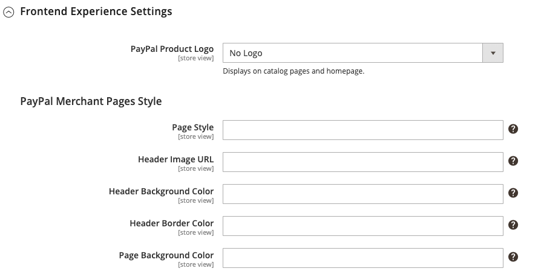

# Collegamento flusso di pagamento PayPal

PayPal Payflow Link è disponibile solo per gli esercenti negli Stati Uniti e in Canada. I clienti non devono avere un conto PayPal personale e inserire le informazioni sulla carta di credito in un modulo ospitato da PayPal. Le informazioni non vengono mai memorizzate sul server Adobe Commerce o Magento Open Source. Il collegamento del flusso di pagamento non può essere utilizzato per gli ordini creati dall’amministratore.

Le note di credito sono supportate per i rimborsi online e offline. Tuttavia, non sono supportati più rimborsi online.

>[!IMPORTANT]
>
>**Requisiti di PSD2:**  
>A partire dal 14 settembre 2019, le banche europee potrebbero rifiutare i pagamenti che non soddisfano i requisiti di [PSD2](../getting-started/compliance-payment-services-directive.md). Per rispettare PSD2, PayPal Payflow Link deve essere integrato con Cardinal Commerce. Per ulteriori informazioni, vedere [3D Secure for Payflow](https://developer.paypal.com/api/nvp-soap/payflow/3d-secure-overview/).

## Requisiti

- [Account commerciale PayPal][1] Il gateway PayPal Payflow Pro collega il conto commerciale di PayPal al sito Web del commerciante, fungendo sia da gateway che da conto commerciale.

- Se gestisci più siti Web Commerce, devi disporre di un conto PayPal separato per ciascun sito Web.

## Flusso di lavoro cliente

1. **Il cliente accede al pagamento** - Durante il pagamento, il cliente sceglie di effettuare il pagamento tramite il collegamento Payflow PayPal e immette le informazioni sulla carta di credito. Il cliente non deve avere un conto PayPal personale.
1. **Il cliente sceglie Paga ora**. Per inviare l&#39;ordine, il cliente tocca il pulsante Paga ora.
1. **Il cliente inserisce le informazioni sulla carta di credito** - Il cliente inserisce le informazioni sulla carta di credito in un modulo ospitato da PayPal. Se il cliente fa clic sul collegamento _Annulla pagamento_, ritorna alla fase Informazioni pagamento dell&#39;estrazione e lo stato dell&#39;ordine diventa _Annullato_.
1. **Il cliente invia l&#39;ordine** - Le informazioni sulla carta di credito vengono inviate direttamente a PayPal e non vengono conservate in alcun punto del sito Commerce.

## Flusso di lavoro ordini

1. **PayPal riceve la richiesta** - PayPal riceve la richiesta dal cliente di effettuare il pagamento immediato.
1. **PayPal verifica le informazioni sul pagamento** - PayPal verifica le informazioni sulla carta di credito e assegna lo stato appropriato:
   - **Pagamento verificato:** Se verificato, lo stato _Pagamento in sospeso_ viene inizialmente assegnato all&#39;ordine fino alla liquidazione della transazione.
   - **Elaborazione** - Transazione riuscita.
   - **Pagamento in sospeso** - Il sistema non ha ricevuto risposta da PayPal.
   - **Annullato** - Transazione non riuscita per qualche motivo.
   - **Sospetta frode** - La transazione non ha superato alcuni dei [filtri di frode PayPal](paypal.md#paypal-fraud-management-filters). Il sistema riceve la risposta da PayPal che la transazione è sotto esame da Fraud Service.
   - **Annulla pagamento:** Se il cliente fa clic sul collegamento _Annulla pagamento_, ritorna alla fase Informazioni pagamento dell&#39;estrazione e lo stato dell&#39;ordine diventa _Annullato_.
1. **Il cliente viene reindirizzato alla pagina di conferma**. Se la transazione viene completata correttamente, il cliente viene reindirizzato alla pagina di conferma dell&#39;ordine nel tuo store. Se la transazione non riesce per qualsiasi motivo, nella pagina di pagamento viene visualizzato un messaggio di errore e il cliente viene invitato a ripetere il processo di pagamento. Queste situazioni sono gestite da PayPal.
1. **Il commerciante evade l&#39;ordine** - Il commerciante fattura e spedisce l&#39;ordine come di consueto.

## Configura il tuo conto PayPal

1. Accedi al tuo account aziendale [PayPal][2].

1. Configura le [Pagine di pagamento in hosting][4] utilizzando PayPal Manager con le impostazioni seguenti:

   - In **[!UICONTROL Security Options]**, completare le impostazioni seguenti:

     **[!UICONTROL AVS]**: `No`

     **[!UICONTROL CSC]**: `No`

     **[!UICONTROL Enable Secure Token]**: `Yes`

   - Scegliere **[!UICONTROL Customize]**, quindi **[!UICONTROL Layout C]**.

     Il layout C mostra solo i campi della carta di credito e di debito e può essere incorniciato sul sito o utilizzato come finestra a comparsa autonoma. La dimensione è fissa a 490 x 565 pixel, con spazio aggiuntivo per i messaggi di errore. Su alcuni sistemi, questa impostazione corregge un problema di reindirizzamento trasparente.

1. Al termine delle impostazioni di configurazione, fare clic su **[!UICONTROL Save and Publish]**.

1. Imposta un utente aggiuntivo (consigliato da PayPal):

   - Nella seconda riga del menu principale fare clic su **[!UICONTROL Manage Users]**.

   - Per aggiungere un altro utente all&#39;account, scegliere **[!UICONTROL Add User]**.

   - Compila i campi obbligatori nelle sezioni seguenti del modulo _Aggiungi utente_:

      - [!UICONTROL Admin Confirmation]
      - [!UICONTROL User Information]
      - [!UICONTROL User Login Information]
      - [!UICONTROL Assign Privilege to User]

   - Fare clic su **[!UICONTROL Update]**.

## Imposta collegamento flusso di pagamento PayPal

>[!TIP]
>
>Fai clic su **[!UICONTROL Save Config]** in qualsiasi momento per salvare l&#39;avanzamento.

### Passaggio 1: avviare la configurazione

Questo metodo di impostazione presuppone che sia presente un conto PayPal.

1. Nella barra laterale _Admin_, passa a **[!UICONTROL Stores]** > _[!UICONTROL Settings]_>**[!UICONTROL Configuration]**.

1. Nel pannello a sinistra, espandi **[!UICONTROL Sales]** e scegli **[!UICONTROL Payment Methods]**.

1. Se nell&#39;installazione di Commerce sono presenti più siti Web, store o visualizzazioni, impostare **[!UICONTROL Store View]** sulla visualizzazione dello store in cui si desidera applicare questa configurazione.

1. Nella sezione _[!UICONTROL Merchant Location]_, seleziona **[!UICONTROL Merchant Country]**in cui si trova la tua azienda.

   Questa impostazione determina la selezione delle soluzioni PayPal visualizzate nella configurazione.

   {width="600" zoomable="yes"}

1. Espandere **[!UICONTROL PayPal Payment Gateways]** (se necessario) e fare clic su **[!UICONTROL Configure]** per **[!UICONTROL Payflow Link]**.

   {width="600" zoomable="yes"}

### Passaggio 2: completa le impostazioni PayPal richieste

{width="600" zoomable="yes"}

1. (Facoltativo) Immetti **[!UICONTROL Email Associated with your PayPal Merchant Account]**.

   >[!IMPORTANT]
   >
   >Gli indirizzi e-mail fanno distinzione tra maiuscole e minuscole. Per ricevere il pagamento, l&#39;indirizzo email deve corrispondere a quello specificato nel tuo conto PayPal.

1. Immetti una delle seguenti credenziali che utilizzi per accedere al tuo conto PayPal per esercenti:

   - **[!UICONTROL Partner]** - ID partner PayPal.
   - **[!UICONTROL User]** - L&#39;ID di un altro utente configurato sul tuo conto PayPal.
   - **[!UICONTROL Vendor]** - Nome di accesso utente PayPal.

1. Immetti **[!UICONTROL Password]** associato al tuo conto PayPal.

1. Per eseguire le transazioni di test, impostare **[!UICONTROL Test Mode]** su `Yes`.

   Durante il test della configurazione in una sandbox, utilizza solo [numeri di carta di credito][3] consigliati da PayPal. Quando si è pronti per passare alla produzione, tornare alla configurazione e impostare la modalità di test su `No`.

1. Se il sistema utilizza un server proxy per stabilire la connessione al sistema PayPal, impostare **[!UICONTROL Test Mode]** su `Yes` e procedere come segue:

   - Immettere l&#39;indirizzo IP di **[!UICONTROL Proxy Host]**.

   - Immettere il numero di porta di **[!UICONTROL Proxy Port]**.

     Un proxy viene utilizzato quando il firewall del server impedisce l&#39;accesso diretto al server PayPal. In questo caso, per inoltrare il traffico viene utilizzato un server di terze parti.

1. Imposta **[!UICONTROL Enable Payflow Link]** su `Yes`.

1. Se vuoi abilitare le opzioni [Pagamento rapido PayPal](paypal-express-checkout.md) per i clienti, imposta **[!UICONTROL Enable Express Checkout]** su `Yes`.

1. Se vuoi offrire [il credito PayPal](paypal.md#paypal-credit-and-pay-later) ai tuoi clienti, imposta **[!UICONTROL Enable PayPal Credit]** su `Yes`.

### Passaggio 3: Impostare Advertise PayPal Credit / Advertise PayPal PayLater (facoltativo)

A partire dalla versione 2.4.3, PayPal PayLater è supportato nelle implementazioni che includono PayPal. Questa funzione consente ai clienti di pagare un ordine in rate bi-settimanali invece di pagare l’intero importo al momento dell’acquisto. L&#39;esperienza di credito PayPal è obsoleta.

Imposta **[!UICONTROL Enable PayPal PayLater Experience]** su uno dei seguenti:

- `Yes` - Per impostare PayPal PayLater come annuncio
- `No` - Per impostare il credito PayPal per la pubblicità

#### Pubblicizza credito PayPal

1. Espandere  nella sezione **[!UICONTROL Advertise PayPal Credit]**.

   {width="600" zoomable="yes"}

1. Per ottenere le informazioni sul tuo account, fai clic su **[!UICONTROL Get Publisher ID from PayPal]** e segui le istruzioni.

1. Immetti **[!UICONTROL Publisher ID]**.

1. Espandere  nella sezione **[!UICONTROL Home Page]**.

   {width="600" zoomable="yes"}

1. Per inserire un banner nella pagina, impostare **[!UICONTROL Display]** su `Yes`.

1. Imposta **[!UICONTROL Position]** su uno dei seguenti:

   - `Header (center)`
   - `Sidebar (right)`

1. Imposta **[!UICONTROL Size]** su uno dei seguenti:

   - `190 x 100`
   - `234 x 60`
   - `300 x 50`
   - `468 x 60`
   - `728 x 90`
   - `800 x 66`

1. Espandi  le sezioni rimanenti e ripeti i passaggi precedenti per la configurazione della home page:

   - **[!UICONTROL Catalog Category Page]**
   - **[!UICONTROL Catalog Product Page]**
   - **[!UICONTROL Checkout Cart Page]**

#### Pubblicizza PayPal PayLater

1. Espandere  nella sezione **[!UICONTROL Advertise PayPal PayLater]**.

1. Imposta **[!UICONTROL Enable PayPal PayLater]** su `Yes`.

1. Espandere  nella sezione **[!UICONTROL Home Page]**.

   {width="600" zoomable="yes"}

1. Per inserire un banner nella pagina, impostare **[!UICONTROL Display]** su `Yes`.

1. Imposta **[!UICONTROL Position]** su uno dei seguenti:

   - `Header (center)`
   - `Sidebar`

1. Imposta **[!UICONTROL Style Layout]** su uno dei seguenti:

   - `Text`
   - `Flex`

1. Solo per [!UICONTROL Style Layout] **[!UICONTROL Text]**, impostare **[!UICONTROL Logo Type]** su uno dei seguenti:

   - `Primary`
   - `Alternative`
   - `Inline`
   - `None`

1. Solo per [!UICONTROL Style Layout] **[!UICONTROL Text]**, impostare **[!UICONTROL Logo Position]** su uno dei seguenti:

   - `Left`
   - `Right`
   - `Top`

1. Solo per [!UICONTROL Style Layout] **[!UICONTROL Text]**, impostare **[!UICONTROL Text Color]** su uno dei seguenti:

   - `Black`
   - `White`
   - `Monochrome`
   - `Grayscale`

1. Solo per [!UICONTROL Style Layout] **[!UICONTROL Text]**, impostare **[!UICONTROL Text Size]** su uno dei seguenti:

   - `10px`
   - `11px`
   - `12px`
   - `13px`
   - `14px`
   - `15px`
   - `16px`

1. Solo per [!UICONTROL Style Layout] **[!UICONTROL Flex]**, impostare **[!UICONTROL Ratio]** su uno dei seguenti:

   - `1x1`
   - `1x4`
   - `8x1`
   - `20x1`

1. Solo per [!UICONTROL Style Layout] **[!UICONTROL Flex]**, impostare **[!UICONTROL Color]** su uno dei seguenti:

   - `Blue`
   - `Black`
   - `White`
   - `White No Border`
   - `Gray`
   - `Monochrome`
   - `Grayscale`

1. Espandere  le sezioni rimanenti e ripetere i passaggi precedenti:

   - **[!UICONTROL Catalog Product Page]**
   - **[!UICONTROL Checkout Cart Page]**
   - **[!UICONTROL Checkout Payment Step]**
   - **[!UICONTROL Catalog Category Page]**

### Passaggio 4: completare le impostazioni di base

1. Espandere  nella sezione **[!UICONTROL Basic Settings - PayPal Payflow Link]**.

   {width="600" zoomable="yes"}

1. Per **[!UICONTROL Title]**, inserisci un titolo che identifichi PayPal Payflow Link durante l&#39;acquisto.

   È consigliabile utilizzare il titolo _Carta di debito o carta di credito_.

1. Se offri più metodi di pagamento, immetti un numero per **[!UICONTROL Sort Order]** per determinare la sequenza in cui viene visualizzato il collegamento del flusso di pagamento quando elencato con gli altri metodi di pagamento.

   Questo numero è relativo agli altri metodi di pagamento. (`0` = primo, `1` = secondo, `2` = terzo e così via).

1. Imposta **[!UICONTROL Payment Action]** su uno dei seguenti:

   - `Authorization` - Approva l&#39;acquisto e blocca i fondi. L&#39;importo non viene prelevato fino a quando non viene catturato dal mercante.
   - `Sale` - L&#39;importo dell&#39;acquisto è autorizzato e immediatamente ritirato dal conto del cliente.

### Passaggio 5: completare le impostazioni avanzate

1. Espandere  nella sezione **[!UICONTROL Advanced Settings]**.

   {width="600" zoomable="yes"}

1. Imposta **[!UICONTROL Payment Applicable From]** su uno dei seguenti:

   - `All Allowed Countries` - I clienti di tutti i [paesi](../getting-started/store-details.md#country-options) specificati nella configurazione del tuo negozio possono utilizzare questo metodo di pagamento.
   - `Specific Countries` - Dopo aver scelto questa opzione, viene visualizzato l&#39;elenco _[!UICONTROL Payment from Specific Countries]_. Tenere premuto il tasto Ctrl e selezionare ogni paese nell&#39;elenco in cui i clienti possono effettuare acquisti dal negozio.

1. Per scrivere le comunicazioni con il sistema di pagamento nel file di registro, impostare **[!UICONTROL Debug Mode]** su `Yes`.

   >[!NOTE]
   >
   >In conformità agli standard di sicurezza dei dati PCI, le informazioni sulla carta di credito non vengono registrate nel file di registro.

1. Per abilitare la verifica dell&#39;autenticità host, impostare **[!UICONTROL Enable SSL Verification]** su `Yes`.

1. Se si desidera consentire al cliente di correggere l&#39;immissione del codice di sicurezza CVV a tre cifre dal retro di una carta di credito, impostare **[!UICONTROL CVV Entry is Editable]** su `Yes`.

1. Per richiedere ai clienti di immettere un codice CVV, impostare **[!UICONTROL Require CVV Entry]** su `Yes`.

1. Per inviare una conferma del pagamento al cliente, impostare **[!UICONTROL Send Email Confirmation]** su `Yes`.

1. Per determinare il metodo utilizzato per scambiare informazioni con il server PayPal durante una transazione, impostare **[!UICONTROL URL method for Cancel URL and Return URL]** su uno dei seguenti valori:

   - `GET` - Recupera le informazioni risultanti da un processo (metodo predefinito).
   - `POST` - Fornisce un blocco di dati, ad esempio i dati immessi in un modulo, a un processo di gestione dei dati.

   L&#39;_URL annullamento_ e l&#39;_URL restituzione_ fanno riferimento alla pagina in cui il cliente restituisce dopo aver completato o annullato la parte di pagamento del processo di pagamento sul server PayPal

1. Completa le seguenti sezioni, in base alle esigenze del tuo negozio:

   - [Impostazioni rapporto liquidazione](#settlement-report-settings)
   - [Impostazioni esperienza front-end](#frontend-experience-settings)

#### Impostazioni rapporto liquidazione

1. Espandere  nella sezione **[!UICONTROL Settlement Report Settings]**.

   {width="600" zoomable="yes"}

1. Per **[!UICONTROL SFTP Credentials]**, eseguire le operazioni seguenti:

   - Se ti sei iscritto al server FTP protetto PayPal, immetti le seguenti credenziali di accesso SFTP:

      - Login
      - Password

   - Per eseguire i report di test prima della pubblicazione con il Checkout rapido sul sito, impostare **[!UICONTROL Sandbox Mode]** su `Yes`.

   - Immettere **[!UICONTROL Custom Endpoint Hostname or IP Address]**.

     Il valore predefinito è `reports.paypal.com`.

   - Immettere **[!UICONTROL Custom Path]** in cui salvare i report.

     Il valore predefinito è `/ppreports/outgoing`.

1. Per generare i report in base a una pianificazione, completare le impostazioni di **[!UICONTROL Scheduled Fetching]**:

   - Imposta **[!UICONTROL Enable Automatic Fetching]** su `Yes`.

   - Imposta **[!UICONTROL Schedule]** su uno dei seguenti:

      - `Daily`
      - `Every 3 Days`
      - `Every 7 Days`
      - `Every 10 Days`
      - `Every 14 Days`
      - `Every 30 Days`
      - `Every 40 Days`

     PayPal conserva ogni rapporto per 45 giorni.

   - Impostare **[!UICONTROL Time of Day]** sull&#39;ora, il minuto e il secondo in cui si desidera generare i report.

#### Impostazioni esperienza front-end

Utilizza _[!UICONTROL Frontend Experience Settings]_per scegliere quali logo PayPal visualizzare sul tuo sito e per personalizzare l&#39;aspetto delle tue pagine di esercenti PayPal.

1. Espandere  nella sezione **[!UICONTROL Frontend Experience Settings]**.

   {width="600" zoomable="yes"}

1. Seleziona **[!UICONTROL PayPal Product Logo]** che vuoi visualizzare nel blocco PayPal del tuo Negozio.

   I logo PayPal sono disponibili in quattro stili e due dimensioni:

   - `No Logo`
   - `We Prefer PayPal (150 x 60 or 150 x 40)`
   - `Now Accepting PayPal (150 x 60 or 150 x 40)`
   - `Payments by PayPal (150 x 60 or 150 x 40)`
   - `Shop Now Using PayPal (150 x 60 or 150 x 40)`

1. Per personalizzare l&#39;aspetto delle pagine di PayPal:

   - Immetti il nome di **[!UICONTROL Page Style]** che desideri applicare alle pagine dell&#39;esercente PayPal:

      - `paypal` - Utilizza lo stile di pagina PayPal.
      - `primary` - Utilizza lo stile di pagina identificato come _primario_ nel profilo dell&#39;account.
      - `your_custom_value` - Utilizza uno stile di pagina di pagamento personalizzato, specificato nel profilo del tuo account.

   - Per **[!UICONTROL Header Image URL]**, immettere l&#39;URL dell&#39;immagine che si desidera visualizzare nell&#39;angolo superiore sinistro della pagina di pagamento. La dimensione massima del file è di 750 pixel di larghezza per 90 pixel di altezza.

     >[!NOTE]
     >
     >PayPal consiglia che l&#39;immagine risieda su un server protetto (https). In caso contrario, un browser potrebbe segnalare che _la pagina contiene elementi protetti e non protetti_.

   - Per impostare il colore delle pagine, immettere il codice esadecimale a sei caratteri, senza il simbolo `#`, per ognuno dei seguenti elementi:

      - **[!UICONTROL Header Background Color]** - Colore di sfondo per l&#39;intestazione della pagina di pagamento.
      - **[!UICONTROL Header Border Color]** - Colore per il bordo di due pixel attorno all&#39;intestazione.
      - **[!UICONTROL Page Background Color]** - Colore di sfondo per la pagina di pagamento e attorno all&#39;intestazione e al modulo di pagamento.

### Passo 6: Completare le impostazioni di base per PayPal Express Checkout

1. Espandere  nella sezione **[!UICONTROL Basic Settings - PayPal Express Checkout]**.

   {width="600" zoomable="yes"}

1. Per **[!UICONTROL Title]**, immettere un titolo che identifichi questo metodo di pagamento durante l&#39;estrazione.

   Si consiglia di impostare il titolo su _PayPal_ per ogni visualizzazione dello store.

1. Se si offrono più metodi di pagamento, immettere un numero per **[!UICONTROL Sort Order]** per determinare la sequenza di visualizzazione del Checkpoint PayPal Express elencato con gli altri metodi di pagamento.

   Questo numero è relativo agli altri metodi di pagamento. (`0` = primo, `1` = secondo, `2` = terzo e così via).

1. Imposta **[!UICONTROL Payment Action]** su uno dei seguenti:

   - `Authorization` - Approva l&#39;acquisto e blocca i fondi. L&#39;importo non viene prelevato finché non viene _acquisito_ dal commerciante.
   - `Sale` - L&#39;importo dell&#39;acquisto è autorizzato e immediatamente ritirato dal conto del cliente.

1. Per visualizzare il pulsante _[!UICONTROL Check out with PayPal]_nella pagina del prodotto, impostare **[!UICONTROL Display on Product Details Page]**su `Yes`.

### Passo 7: Completare le impostazioni avanzate per PayPal Express Checkout

1. Espandere  nella sezione **[!UICONTROL Advanced Settings]**.

   {width="600" zoomable="yes"}

1. Imposta **[!UICONTROL Display on Shopping Cart]** su `Yes`.

1. Imposta **[!UICONTROL Payment Applicable From]** su uno dei seguenti:

   - `All Allowed Countries` - I clienti di tutti i paesi specificati nella configurazione del tuo negozio possono utilizzare questo metodo di pagamento.
   - `Specific Countries` - Dopo aver scelto questa opzione, viene visualizzato l&#39;elenco _[!UICONTROL Payment from Specific Countries]_. Per selezionare più paesi, tenere premuto il tasto Ctrl (PC) o il tasto Comando (Mac) e fare clic su ogni elemento.

1. Per scrivere le comunicazioni con il sistema di pagamento nel file di registro, impostare **[!UICONTROL Debug Mode]** su `Yes`.

   >[!NOTE]
   >
   >In conformità agli standard di sicurezza dei dati PCI, le informazioni sulla carta di credito non vengono registrate nel file di registro.

1. Per abilitare la verifica dell&#39;autenticità host, impostare **[!UICONTROL Enable SSL Verification]** su `Yes`.

1. Per visualizzare un riepilogo completo dell&#39;ordine cliente per voce dal sito PayPal, impostare **[!UICONTROL Transfer Cart Line Items]** su `Yes`.

1. Per consentire al cliente di completare la transazione dal sito PayPal senza tornare allo store per la revisione dell&#39;ordine, impostare **[!UICONTROL Skip Order Review Step]** su `Yes`.

1. Al termine, fare clic su **[!UICONTROL Save Config]**.

[1]: https://www.paypal.com/webapps/mpp/how-to-sell-online
[2]: https://manager.paypal.com/
[3]: https://www.paypalobjects.com/en_AU/vhelp/paypalmanager_help/credit_card_numbers.htm
[4]: https://developer.paypal.com/docs/payflow/integration-guide/configure-hosted-checkout/#configuring-hosted-pages-using-paypal-manager
