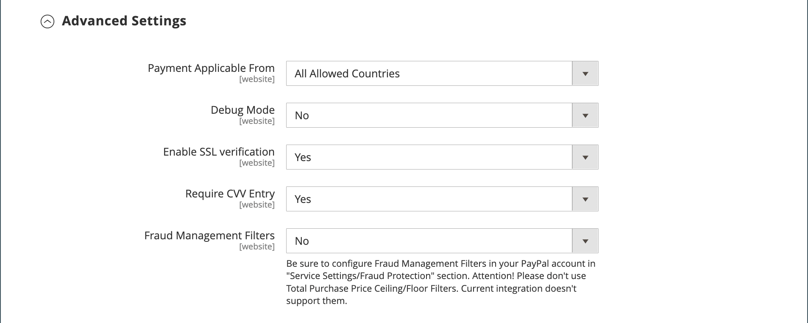

# Pagamenti PayPal Pro

[Pagamenti PayPal Pro][3] offre tutti i vantaggi di un account esercente e di un gateway di pagamento in uno, oltre alla possibilità di creare la propria esperienza di pagamento completamente personalizzata. PayPal Express Checkout è abilitato automaticamente con PayPal Payments Pro, in modo da poter accedere a più di 110 milioni di utenti PayPal attivi.

{width="700" zoomable="yes"}

>[!IMPORTANT]
>
>**Requisiti PSD2:**  
>A partire dal 14 settembre 2019, le banche europee potrebbero rifiutare i pagamenti che non soddisfano [PSD2](../getting-started/compliance-payment-services-directive.md) requisiti. Per rispettare PSD2, PayPal Payments Pro deve essere integrato con un plug-in di terze parti.

>[!NOTE]
>
>Attualmente, PayPal Payments Pro è disponibile negli Stati Uniti, nel Regno Unito e in Canada.

## Requisiti

- [Conto PayPal per esercenti][1] (con Pagamenti diretti attivati)

## Flusso di lavoro di cassa

1. **Il cliente accede al pagamento** - Il cliente aggiunge prodotti al carrello e fa clic/tocca _Procedi all&#39;estrazione_.|
1. **Il cliente sceglie il metodo di pagamento** - Durante il pagamento, il cliente sceglie _Pagamento diretto PayPal_ e immette le informazioni sulla carta di credito.
   - Se paghi con PayPal Payments Pro, il cliente rimane sul tuo sito durante il processo di pagamento.
   - Se il pagamento viene effettuato tramite PayPal Express Checkout, il cliente viene reindirizzato al sito PayPal per completare la transazione.

Su richiesta del cliente, l&#39;amministratore del negozio può anche creare un ordine dall&#39;amministratore ed elaborare la transazione con PayPal Payments Pro.

## Flusso di lavoro di elaborazione degli ordini

1. **Ordine effettuato** - L&#39;ordine può essere elaborato dall&#39;amministratore del tuo negozio o dal tuo conto PayPal commerciante.

1. **[!UICONTROL Payment Action]** - L’azione di pagamento specificata nella configurazione viene applicata all’ordine. Le opzioni includono:

   - **Autorizza** - Commerce crea un ordine di vendita con _Elaborazione_ stato. In questo caso, l&#39;importo di denaro da autorizzare è in attesa di approvazione.
   - **Vendita** - Commerce crea sia un ordine di vendita che una fattura.
   - **Acquisizione** - PayPal trasferisce l&#39;importo dell&#39;ordine dal saldo del cliente, dal conto bancario o dalla carta di credito al conto dell&#39;esercente.

1. **Fatturazione** - Viene creata una fattura in Commerce dopo che PayPal invia un messaggio di notifica di pagamento immediato a Commerce.

   Assicurati che le notifiche di pagamento istantaneo siano abilitate nel tuo conto PayPal per esercenti.

   >[!NOTE]
   >
   >Se necessario, un ordine può essere parzialmente fatturato per una determinata quantità di prodotti. Per ogni fattura parziale sottomessa, diventa disponibile una transazione di acquisizione separata con un ID univoco e viene generata una fattura separata.

   Le transazioni di pagamento per sola autorizzazione vengono chiuse solo dopo l&#39;acquisizione dell&#39;intero importo dell&#39;ordine.

   Un ordine può essere annullato online in qualsiasi momento fino a quando l&#39;importo dell&#39;ordine non viene completamente fatturato.

1. **Restituisce** - Se il cliente restituisce i prodotti acquistati e richiede un rimborso, come per l&#39;acquisizione dell&#39;importo dell&#39;ordine e la creazione della fattura, puoi creare un rimborso online dall&#39;amministratore o dal tuo conto PayPal dell&#39;esercente.

## Configura il tuo conto PayPal

Prima di configurare PayPal Payments Pro in Commerce, devi configurare il tuo account esercente sul sito Web PayPal.

1. Accedi al tuo [Account aziendale PayPal](https://manager.paypal.com/).

1. Nel menu PayPal Manager, scegli **[!UICONTROL Service Settings]**.

1. Sotto **[!UICONTROL Hosted Checkout Pages]**, fai clic su **[!UICONTROL Set Up]**.

1. Sotto **[!UICONTROL Choose your settings]**, impostato **[!UICONTROL Transaction Process Mode]** a `Live`.

1. Sotto **[!UICONTROL Display options on payment page]**, impostato **[!UICONTROL Cancel URL Method]** a `POST`.

1. Sotto **[!UICONTROL Billing Information]**, seleziona il codice di sicurezza della carta **[!UICONTROL CSC]** caselle di controllo per i campi obbligatori e modificabili.

1. Sotto **[!UICONTROL Payment Confirmation]**, impostato **[!UICONTROL Return URL Method]** a `POST`.

1. Sotto **[!UICONTROL Security Options]**, configura quanto segue:

   - **[!UICONTROL AVS]**: `No`
   - **[!UICONTROL CSC]**: `No`
   - **[!UICONTROL Enable Secure Token]**: `Yes`

1. Clic **[!UICONTROL Save Changes]**.

1. In _Gestore PayPal_ menu, scegliere **[!UICONTROL Service Settings]** e sotto _Pagine di estrazione ospitate_, scegli **[!UICONTROL Customize]**.

1. Scegli **[!UICONTROL Layout C]**.

   Il layout C mostra solo i campi della carta di credito e di debito e può essere incorniciato sul sito o utilizzato come finestra a comparsa autonoma. La dimensione è fissa a 490 x 565 pixel, con spazio aggiuntivo per i messaggi di errore. Su alcuni sistemi, questa impostazione corregge un problema di reindirizzamento trasparente.

1. Clic **[!UICONTROL Save and Publish]**.

1. Nel menu PayPal Manager, scegli **[!UICONTROL Account Administration]**. Sotto **[!UICONTROL Manage Security]**, fai clic su **[!UICONTROL Transaction Settings]**.

1. Imposta **[!UICONTROL Allow reference transactions]** a `Yes`.

1. Clic **[!UICONTROL Confirm]**.

   >[!NOTE]
   >
   >Se hai più siti Web Commerce, devi creare un account PayPal Payments Pro separato per ciascuno di essi.

1. Configura un altro utente (consigliato da PayPal):

   - Nella seconda riga del menu principale, fai clic su **[!UICONTROL Manage Users]**.

   - Per aggiungere un altro utente all&#39;account, fare clic su **[!UICONTROL Add User]**. Il collegamento si trova appena sopra il titolo Gestisci utenti.

   - Compila i campi obbligatori nelle sezioni seguenti della _[!UICONTROL Add User]_forma:

      - [!UICONTROL Admin Confirmation]
      - [!UICONTROL User Information]
      - [!UICONTROL User Login Information]
      - [!UICONTROL Assign Privilege to User]

   - Clic **[!UICONTROL Update]**.

1. Assicurati di disconnetterti dal tuo conto PayPal.

## Impostare PayPal Payments Pro in Commerce

>[!NOTE]
>
>Puoi avere due soluzioni PayPal attive contemporaneamente: [Pagamento PayPal Express](paypal-express-checkout.md), più uno dei [soluzioni complete](paypal.md#paypal-all-in-one-payment-solutions). Se modifichi le soluzioni di pagamento, quella utilizzata in precedenza viene disabilitata automaticamente.

>[!TIP]
>
>Clic **[!UICONTROL Save Config]** in qualsiasi momento per salvare i tuoi progressi.

### Passaggio 1: avviare la configurazione

1. Il giorno _Amministratore_ barra laterale, vai a **[!UICONTROL Stores]** > _[!UICONTROL Settings]_>**[!UICONTROL Configuration]**.

1. Nel pannello a sinistra, espandi **[!UICONTROL Sales]** e scegli **[!UICONTROL Payment Methods]**.

1. Se nell’installazione di Commerce sono presenti più siti web, store o visualizzazioni, imposta **[!UICONTROL Store View]** nella vista Store in cui desideri applicare questa configurazione.

1. In _[!UICONTROL Merchant Location]_, seleziona la sezione **[!UICONTROL Merchant Country]**dove si trova la tua azienda.

   Questa impostazione determina la selezione delle soluzioni PayPal visualizzate nella configurazione.

   {width="600" zoomable="yes"}

1. Espandi **[!UICONTROL PayPal All-in-One Payment Solution]** e fai clic su **[!UICONTROL Configure]** per **[!UICONTROL Payments Pro]**.

   {width="600" zoomable="yes"}

### Passaggio 2: completa le impostazioni PayPal richieste

1. Espandi  il **[!UICONTROL Payments Pro and Express Checkout]** sezione.

   {width="600" zoomable="yes"}

1. (Facoltativo) Inserisci il **[!UICONTROL Email Associated with your PayPal Merchant Account]**.

   >[!IMPORTANT]
   >
   >Gli indirizzi e-mail fanno distinzione tra maiuscole e minuscole. Per ricevere il pagamento, l&#39;indirizzo email deve corrispondere a quello specificato nel tuo conto PayPal.

   Se non hai un conto PayPal, fai clic su **[!UICONTROL Start accepting payments via PayPal]**.

1. Immetti una delle seguenti credenziali che utilizzi per accedere al tuo conto PayPal per esercenti:

   - **[!UICONTROL Partner]** - Il tuo PayPal Partner ID.
   - **[!UICONTROL Vendor]** - Nome di accesso dell&#39;utente PayPal.
   - **[!UICONTROL User]** - L&#39;ID di un altro utente che è configurato sul tuo conto PayPal.

1. Inserisci il **[!UICONTROL Password]** associato al tuo conto PayPal.

1. Per eseguire transazioni di test, impostare **[!UICONTROL Test Mode]** a `Yes`.

   Quando esegui il test della configurazione in una sandbox, utilizza solo [numeri di carta di credito][2] che sono consigliati da PayPal. Quando sei pronto per passare alla produzione, torna alla configurazione e imposta Modalità di test su `No`.

1. Se il sistema utilizza un server proxy per stabilire la connessione al sistema PayPal, impostare **[!UICONTROL Use Proxy]** a `Yes` ed effettuare le seguenti operazioni:

   - Inserisci l’indirizzo IP del **[!UICONTROL Proxy Host]**.

   - Immettere il numero di porta del **[!UICONTROL Proxy Port]**.

   Un proxy viene utilizzato quando il firewall del server impedisce l&#39;accesso diretto al server PayPal. In questo caso, per inoltrare il traffico viene utilizzato un server di terze parti.

1. Imposta **[!UICONTROL Enable this Solution]** a `Yes`.

1. Se desideri offrire [Credito PayPal](paypal.md#paypal-credit-and-pay-later) ai clienti, imposta **[!UICONTROL Enable PayPal Credit]** a `Yes`.

1. Se si desidera memorizzare in modo sicuro i dettagli relativi al pagamento o alla carta di credito del cliente, in modo che i clienti non debbano immettere nuovamente le informazioni di pagamento ogni volta, impostare **[!UICONTROL Vault Enabled]** a `Yes`.

### Passaggio 3: Impostare Advertise PayPal Credit / Advertise PayPal PayLater (facoltativo)

A partire dalla versione 2.4.3, PayPal PayLater è supportato nelle implementazioni che includono PayPal. Questa funzione consente ai clienti di pagare un ordine in rate bi-settimanali invece di pagare l’intero importo al momento dell’acquisto. L&#39;esperienza di credito PayPal è obsoleta.

Imposta **[!UICONTROL Enable PayPal PayLater Experience]** a uno dei seguenti elementi:

- `Yes` - Per impostare Advertise PayPal PayLater
- `No` - Per impostare il credito PayPal di Advertising

#### Pubblicizza credito PayPal

1. Espandi  il **[!UICONTROL Advertise PayPal Credit]** sezione.

   {width="600" zoomable="yes"}

1. Per ottenere le informazioni sull&#39;account, fare clic su **[!UICONTROL Get Publisher ID from PayPal]** e seguire le istruzioni.

1. Immetti il **[!UICONTROL Publisher ID]**.

1. Espandi  il **[!UICONTROL Home Page]** sezione.

   {width="600" zoomable="yes"}

1. Per inserire un banner nella pagina, imposta **[!UICONTROL Display]** a `Yes`.

1. Imposta **[!UICONTROL Position]** a uno dei seguenti elementi:

   - `Header (center)`
   - `Sidebar (right)`

1. Imposta **[!UICONTROL Size]** a uno dei seguenti elementi:

   - `190 x 100`
   - `234 x 60`
   - `300 x 50`
   - `468 x 60`
   - `728 x 90`
   - `800 x 66`

1. Espandi  nelle sezioni rimanenti e ripetere i passaggi precedenti:

   - **[!UICONTROL Catalog Category Page]**
   - **[!UICONTROL Catalog Product Page]**
   - **[!UICONTROL Checkout Cart Page]**

#### Pubblicizza PayPal PayLater

1. Espandi  il **[!UICONTROL Advertise PayPal PayLater]** sezione.

1. Imposta **[!UICONTROL Enable PayPal PayLater]** a `Yes`.

1. Espandi  il **[!UICONTROL Home Page]** sezione.

   {width="600" zoomable="yes"}

1. Per inserire un banner nella pagina, imposta **[!UICONTROL Display]** a `Yes`.

1. Imposta **[!UICONTROL Position]** a uno dei seguenti elementi:

   - `Header (center)`
   - `Sidebar`

1. Imposta **[!UICONTROL Style Layout]** a uno dei seguenti elementi:

   - `Text`
   - `Flex`

1. Per [!UICONTROL Style Layout] **[!UICONTROL Text]** solo, imposta **[!UICONTROL Logo Type]** a uno dei seguenti elementi:

   - `Primary`
   - `Alternative`
   - `Inline`
   - `None`

1. Per [!UICONTROL Style Layout] **[!UICONTROL Text]** solo, imposta **[!UICONTROL Logo Position]** a uno dei seguenti elementi:

   - `Left`
   - `Right`
   - `Top`

1. Per [!UICONTROL Style Layout] **[!UICONTROL Text]** solo, imposta **[!UICONTROL Text Color]** a uno dei seguenti elementi:

   - `Black`
   - `White`
   - `Monochrome`
   - `Grayscale`

1. Per [!UICONTROL Style Layout] **[!UICONTROL Text]** solo, imposta **[!UICONTROL Text Size]** a uno dei seguenti elementi:

   - `10px`
   - `11px`
   - `12px`
   - `13px`
   - `14px`
   - `15px`
   - `16px`

1. Per [!UICONTROL Style Layout] **[!UICONTROL Flex]** solo, imposta **[!UICONTROL Ratio]** a uno dei seguenti elementi:

   - `1x1`
   - `1x4`
   - `8x1`
   - `20x1`

1. Per [!UICONTROL Style Layout] **[!UICONTROL Flex]** solo, imposta **[!UICONTROL Color]** a uno dei seguenti elementi:

   - `Blue`
   - `Black`
   - `White`
   - `White No Border`
   - `Gray`
   - `Monochrome`
   - `Grayscale`

1. Espandi  nelle sezioni rimanenti e ripetere i passaggi precedenti:

   - **[!UICONTROL Catalog Product Page]**
   - **[!UICONTROL Checkout Cart Page]**
   - **[!UICONTROL Checkout Payment Step]**
   - **[!UICONTROL Catalog Category Page]**

### Passaggio 4: completare le impostazioni di base

1. Espandi  il **[!UICONTROL Basic Settings - PayPal Payments Pro]** sezione.

   {width="600" zoomable="yes"}

1. Per **[!UICONTROL Title]**, inserisci un titolo che identifichi PayPal Payments Pro durante il pagamento.

   Si consiglia di utilizzare il titolo _Carta di debito o di credito_.

1. Se vengono offerti più metodi di pagamento, immettere un numero per **[!UICONTROL Sort Order]** per determinare la sequenza di visualizzazione di PayPal Payments Pro quando viene elencato con altri metodi di pagamento durante il pagamento.

   Questo numero è relativo agli altri metodi di pagamento. (`0` = innanzitutto, `1` = secondo, `2` = terzo e così via.)

1. Imposta **[!UICONTROL Payment Action]** a uno dei seguenti elementi:

   - `Authorization` - Approva l&#39;acquisto, ma blocca i fondi. L&#39;importo non viene prelevato fino al _acquisito_ dal mercante.
   - `Sale` - L&#39;importo dell&#39;acquisto è autorizzato e immediatamente prelevato dal conto del cliente.

1. Per **[!UICONTROL Credit Card Settings]**, seleziona le carte di credito accettate per il pagamento nel tuo Negozio.

   Per selezionare più schede, tenete premuto il tasto Ctrl (PC) o Comando (Mac) e fate clic su ciascuna scheda.

   >[!NOTE]
   >
   >American Express richiede un accordo aggiuntivo.

### Passaggio 5: completare le impostazioni avanzate

1. Espandi  il **[!UICONTROL Advanced Settings]** sezione.

   {width="600" zoomable="yes"}

1. Imposta **[!UICONTROL Payment Applicable From]** a uno dei seguenti elementi:

   - `All Allowed Countries` - Clienti di tutti [paesi](../getting-started/store-details.md#country-options) specificato nella configurazione del negozio può utilizzare questo metodo di pagamento.
   - `Specific Countries` - Dopo aver scelto questa opzione, il _[!UICONTROL Payment from Specific Countries]_viene visualizzato. Tenere premuto il tasto Ctrl (PC) o il tasto Comando (Mac) e selezionare ogni paese nell&#39;elenco in cui i clienti possono effettuare acquisti dal negozio.

1. Per scrivere le comunicazioni con il sistema di pagamento nel file di registro, impostare **[!UICONTROL Debug Mode]** a `Yes`.

   >[!NOTE]
   >
   >In conformità agli standard di sicurezza dei dati PCI, le informazioni sulla carta di credito non vengono registrate nel file di registro.

1. Per abilitare la verifica dell’autenticità dell’host, imposta **[!UICONTROL Enable SSL Verification]** a `Yes`.

1. Per richiedere ai clienti di inserire un codice CVV, imposta **[!UICONTROL Require CVV Entry]** a `Yes`.

1. Espandi  il **[!UICONTROL CVV and AVS Settings]** sezione.

1. Per determinare quando una transazione deve essere rifiutata quando il sistema di verifica degli indirizzi identifica una mancata corrispondenza, specificare come gestire ciascuno dei seguenti scenari:

   - Per rifiutare una transazione in base a una mancata corrispondenza delle strade, impostare **[!UICONTROL AVS Street Does Not Match]** a `Yes`.

   - Per rifiutare una transazione basata su un CAP non corrispondente, impostare **[!UICONTROL AVS Zip Does Not Match]** a `Yes`.

   - Per rifiutare una transazione basata su un identificatore di paese non corrispondente, impostare **[!UICONTROL International AVS Indicator Does Not Match]** a `Yes`.

   - Per rifiutare una transazione basata su un codice CVV non corrispondente, impostare **[!UICONTROL International Card Security Code Does Not Match]** a `Yes`.

   {width="600" zoomable="yes"}

1. Completa le seguenti sezioni, in base alle esigenze del tuo negozio:

   - [Impostazioni rapporto liquidazione](#settlement-report-settings)
   - [Impostazioni esperienza front-end](#frontend-experience-settings)

#### Impostazioni rapporto liquidazione

1. Espandi  il **[!UICONTROL Settlement Report Settings]** sezione.

   {width="600" zoomable="yes"}

1. Per **[!UICONTROL SFTP Credentials]**, eseguire le operazioni seguenti:

   - Se ti sei iscritto al server FTP protetto di PayPal, immetti le seguenti credenziali di accesso SFTP:

      - Login
      - Password

   - Per eseguire i report di test prima di andare in diretta con Payments Pro sul tuo sito, imposta **[!UICONTROL Sandbox Mode]** a `Yes`.

   - Inserisci il **[!UICONTROL Custom Endpoint Hostname or IP Address]**.

     Per impostazione predefinita, il valore è `reports.paypal.com`.

   - Inserisci il **[!UICONTROL Custom Path]** in cui vengono salvati i rapporti.

     Per impostazione predefinita, il valore è `/ppreports/outgoing`.

1. Per generare i rapporti in base a una pianificazione, completa la **[!UICONTROL Scheduled Fetching]** impostazioni:

   - Imposta **[!UICONTROL Enable Automatic Fetching]** a `Yes`.

   - Imposta **[!UICONTROL Schedule]** a uno dei seguenti elementi:

      - `Daily`
      - `Every 3 Days`
      - `Every 7 Days`
      - `Every 10 Days`
      - `Every 14 Days`
      - `Every 30 Days`
      - `Every 40 Days`

     PayPal conserva ogni rapporto per 45 giorni.

   - Imposta **[!UICONTROL Time of Day]** all’ora, al minuto e al secondo quando desideri generare i rapporti.

#### Impostazioni esperienza front-end

Utilizza il _[!UICONTROL Frontend Experience Settings]_per scegliere i logo PayPal da visualizzare sul sito e per personalizzare l&#39;aspetto delle pagine di PayPal.

1. Espandi  il **[!UICONTROL Frontend Experience Settings]** sezione.

   {width="600" zoomable="yes"}

1. Seleziona la **[!UICONTROL PayPal Product Logo]** che desideri visualizzare nel blocco PayPal del tuo negozio.

   I logo PayPal sono disponibili in quattro stili e due dimensioni:

   - `No Logo`
   - `We Prefer PayPal (150 x 60 or 150 x 40)`
   - `Now Accepting PayPal (150 x 60 or 150 x 40)`
   - `Payments by PayPal (150 x 60 or 150 x 40)`
   - `Shop Now Using PayPal (150 x 60 or 150 x 40)`

1. Per personalizzare l&#39;aspetto delle pagine di PayPal per esercenti, eseguire le operazioni seguenti:

   - Inserisci il nome del **[!UICONTROL Page Style]** che desideri applicare alle tue pagine PayPal per esercenti:

      - `paypal` - Utilizza lo stile di pagina PayPal.
      - `primary` - Utilizza lo stile di pagina identificato come _primario_ nel profilo del tuo account.
      - `your_custom_value` - Utilizza uno stile di pagina di pagamento personalizzato, specificato nel profilo del tuo account.

   - Per **[!UICONTROL Header Image URL]**, immetti l&#39;URL dell&#39;immagine da visualizzare nell&#39;angolo superiore sinistro della pagina di pagamento. La dimensione massima del file è di 750 pixel di larghezza per 90 pixel di altezza.

     >[!NOTE]
     >
     >PayPal consiglia che l&#39;immagine risieda su un server protetto (https). In caso contrario, un browser potrebbe avvertire che _la pagina contiene elementi protetti e non protetti_.

   - Per impostare il colore delle pagine, immettere il codice esadecimale a sei caratteri, senza `#` simbolo, per ciascuno dei seguenti elementi:

      - **[!UICONTROL Header Background Color]** - Colore di sfondo per l&#39;intestazione della pagina di pagamento.
      - **[!UICONTROL Header Border Color]** - Colore per il bordo di due pixel attorno all&#39;intestazione.
      - **[!UICONTROL Page Background Color]** - Colore di sfondo per la pagina di pagamento e intorno all&#39;intestazione e al modulo di pagamento.

### Passo 6: Completare le impostazioni di base per PayPal Express Checkout

1. Espandi  il **[!UICONTROL Basic Settings - PayPal Express Checkout]** sezione.

   {width="600" zoomable="yes"}

1. Per **[!UICONTROL Title]**, immettere un titolo che identifichi questo metodo di pagamento durante il pagamento.

   Impostazione del titolo su _PayPal_ per ogni visualizzazione store.

1. Se vengono offerti più metodi di pagamento, immettere un numero per **[!UICONTROL Sort Order]** per determinare la sequenza in cui appare PayPal Express Checkout quando elencato con gli altri metodi di pagamento.

   Questo numero è relativo agli altri metodi di pagamento. (`0` = innanzitutto, `1` = secondo, `2` = terzo e così via.)

1. Imposta **[!UICONTROL Payment Action]** a uno dei seguenti elementi:

   - `Authorization` - Approva l&#39;acquisto e blocca i fondi. L&#39;importo non viene prelevato fino al _acquisito_ dal mercante.
   - `Sale` - L&#39;importo dell&#39;acquisto è autorizzato e immediatamente prelevato dal conto del cliente.

1. Per visualizzare _[!UICONTROL Check out with PayPal]_sulla pagina del prodotto, impostare **[!UICONTROL Display on Product Details Page]**a `Yes`.

### Passo 7: Completare le impostazioni avanzate per PayPal Express Checkout

1. Espandi  il **[!UICONTROL Advanced Settings]** sezione.

   {width="600" zoomable="yes"}

1. Imposta **[!UICONTROL Display on Shopping Cart]** a `Yes`.

1. Imposta **[!UICONTROL Payment Applicable From]** a uno dei seguenti elementi:

   - `All Allowed Countries` - Clienti di tutti [paesi](../getting-started/store-details.md#country-options) specificato nella configurazione del negozio può utilizzare questo metodo di pagamento.
   - `Specific Countries` - Dopo aver scelto questa opzione, il _[!UICONTROL Payment from Specific Countries]_viene visualizzato. Per selezionare più paesi, tenere premuto il tasto Ctrl (PC) o il tasto Comando (Mac) e fare clic su ogni elemento.

1. Per scrivere le comunicazioni con il sistema di pagamento nel file di registro, impostare **[!UICONTROL Debug Mode]** a `Yes`.

   >[!NOTE]
   >
   >In conformità agli standard di sicurezza dei dati PCI, le informazioni sulla carta di credito non vengono registrate nel file di registro.

1. Per abilitare la verifica dell’autenticità dell’host, imposta **[!UICONTROL Enable SSL Verification]** a `Yes`.

1. Per visualizzare un riepilogo completo dell&#39;ordine cliente per voce dalla sede PayPal, impostare **[!UICONTROL Transfer Cart Line Items]** a `Yes`.

1. Per consentire al cliente di completare la transazione dal sito PayPal senza tornare al negozio per la revisione dell&#39;ordine, impostare **[!UICONTROL Skip Order Review Step]** a `Yes`.

1. Al termine, fai clic su **[!UICONTROL Save Config]**.

[1]: https://www.paypal.com/webapps/mpp/how-to-sell-online
[2]: https://www.paypalobjects.com/en_AU/vhelp/paypalmanager_help/credit_card_numbers.htm
[3]: https://developer.paypal.com/docs/paypal-payments-pro/
