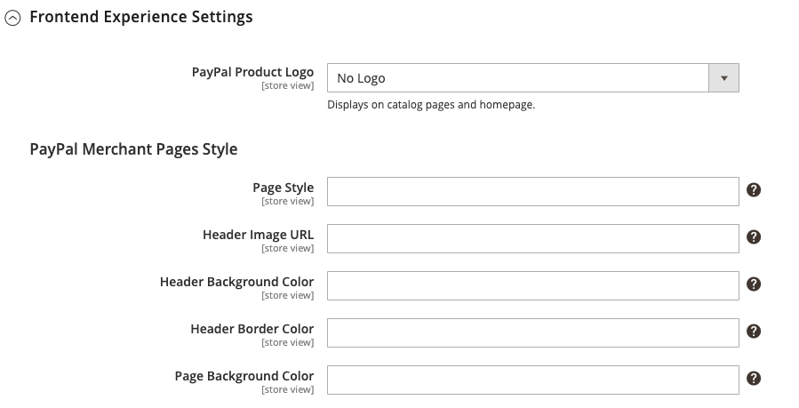

# Pagamenti PayPal Standard

[PayPal Payments Standard](https://developer.paypal.com/docs/paypal-payments-standard/mobile-paypal-payments-standard/) è il modo più semplice per accettare i pagamenti online. Puoi offrire ai tuoi clienti la comodità del pagamento sia con carta di credito che con PayPal semplicemente aggiungendo un pulsante di pagamento al tuo negozio.

>[!NOTE]
>
>Per i commercianti al di fuori degli Stati Uniti, si chiama _PayPal Web Payments Standard_.

Con PayPal Payments Standard puoi scorrere le carte di credito sui dispositivi mobili. Non esiste alcun costo mensile e puoi ricevere il pagamento tramite eBay. Le carte di credito supportate sono Visa, MasterCard, Discover e American Express. Inoltre, i clienti possono pagare direttamente dai loro account PayPal personali. PayPal Payments Standard è disponibile in tutti i paesi dell&#39;elenco di riferimento di PayPal a livello mondiale.

>[!IMPORTANT]
>
>**Requisiti di PSD2:**  
>A partire dal 14 settembre 2019, le banche europee potrebbero rifiutare i pagamenti che non soddisfano i requisiti di [PSD2](../getting-started/compliance-payment-services-directive.md). Non è necessaria alcuna azione affinché PayPal Payments Standard si conformi a PSD2 perché tutti i requisiti sono gestiti da PayPal.

## Esigenze degli esercenti

- [Account aziendale PayPal](https://www.paypal.com/webapps/mpp/how-to-sell-online)

## Flusso di lavoro di cassa

Per i clienti, PayPal Payments Standard è un processo in un&#39;unica fase se le informazioni sulla carta di credito sui loro conti PayPal personali sono aggiornate.

1. **Ordine di collocazione cliente** - Il cliente fa clic o tocca il pulsante _Paga ora_ per completare l&#39;acquisto.

1. **PayPal elabora la transazione**. Il cliente viene reindirizzato al sito PayPal per completare la transazione.

## Imposta Pagamenti PayPal Standard

>[!NOTE]
>
>PayPal Payments Standard non può essere utilizzato contemporaneamente a qualsiasi altro metodo PayPal, incluso Express Checkout. Se modifichi le soluzioni di pagamento, quella utilizzata in precedenza è disabilitata.

>[!TIP]
>
>Fai clic su **[!UICONTROL Save Config]** in qualsiasi momento per salvare l&#39;avanzamento.

### Passaggio 1: avviare la configurazione

Questo metodo di impostazione presuppone che sia presente un conto PayPal.

1. Nella barra laterale _Admin_, passa a **[!UICONTROL Stores]** > _[!UICONTROL Settings]_>**[!UICONTROL Configuration]**.

1. Nel pannello a sinistra, espandi **[!UICONTROL Sales]** e scegli **[!UICONTROL Payment Methods]**.

1. Se nell&#39;installazione di Commerce sono presenti più siti Web, store o visualizzazioni, impostare **[!UICONTROL Store View]** sulla visualizzazione dello store in cui si desidera applicare questa configurazione.

1. Nella sezione _[!UICONTROL Merchant Location]_, seleziona **[!UICONTROL Merchant Country]**&#x200B;in cui si trova la tua azienda.

   Questa impostazione determina la selezione delle soluzioni PayPal visualizzate nella configurazione.

   {width="600" zoomable="yes"}

1. Espandere **[!UICONTROL PayPal All-in-One Payment Solutions]** e fare clic su **[!UICONTROL Configure]** per **[!UICONTROL Payments Standard]**.

   {width="700" zoomable="yes"}

### Passaggio 2: abilita e collega il tuo conto PayPal

{width="600" zoomable="yes"}

1. Connetti il tuo account per test o produzione:

   - Per verificare la modalità di sviluppo, fai clic su **[!UICONTROL Sandbox Credentials]** e immetti le tue credenziali per la sandbox [PayPal](https://developer.paypal.com/docs/api-basics/sandbox/).
   - Per la modalità di produzione, fare clic su **[!UICONTROL Connect with PayPal]** e immettere le credenziali dell&#39;account di produzione.

   Una volta convalidata la connessione, puoi procedere.

1. Imposta **[!UICONTROL Enable this Solution]** su `Yes`.

1. Se vuoi offrire [il credito PayPal](paypal.md#paypal-credit-and-pay-later) ai tuoi clienti, imposta **[!UICONTROL Enable PayPal Credit]** su `Yes`.

### Passaggio 3: completare le impostazioni di Payments Standard

1. Espandere  nella sezione **[!UICONTROL Payments Standard]**.

   {width="600" zoomable="yes"}

1. Immettere **[!UICONTROL Email Associated with your PayPal Merchant Account]**.

   >[!IMPORTANT]
   >
   >Gli indirizzi e-mail fanno distinzione tra maiuscole e minuscole. Per ricevere il pagamento, l&#39;indirizzo email che immetti deve corrispondere a quello specificato nel tuo conto PayPal dell&#39;esercente.

   Se non hai un conto PayPal, fai clic su **[!UICONTROL Start accepting payments via PayPal]**.

1. Imposta **[!UICONTROL API Authentication Methods]** su uno dei seguenti:

   - `API Signature` - Questo metodo di autenticazione PayPal è il più semplice da implementare ed è basato sul nome utente, la password e una stringa univoca di caratteri e numeri che identifica il tuo account. Le credenziali della firma API non scadono.
   - `API Certificate` - Questo metodo di autenticazione PayPal è più sicuro, si basa sul nome utente, sulla password e su un certificato scaricabile. Le credenziali API scadono dopo tre anni e devono essere rinnovate.

   Se necessario, completare quanto segue:

   - **[!UICONTROL API Username]**
   - **[!UICONTROL API Password]**
   - **[!UICONTROL API Signature]**

1. Se utilizzi le credenziali dell&#39;account sandbox, imposta **[!UICONTROL Sandbox Mode]** su `Yes`.

   Durante il test della configurazione in una sandbox, utilizza solo [numeri di carta di credito](https://www.paypalobjects.com/en_AU/vhelp/paypalmanager_help/credit_card_numbers.htm) consigliati da PayPal. Quando sei pronto per passare alla produzione, torna alla configurazione e imposta la modalità sandbox su `No` e collegati al tuo account PayPal di produzione.

1. Se il sistema utilizza un server proxy per stabilire la connessione tra Adobe Commerce o Magento Open Source e il sistema di pagamento PayPal, impostare **[!UICONTROL API Uses Proxy]** su `Yes` e completare le operazioni seguenti:

   - **[!UICONTROL Proxy Host]**
   - **[!UICONTROL Proxy Port]**

### Passaggio 4: Impostare Advertise PayPal Credit / Advertise PayPal PayLater (facoltativo)

A partire dalla versione 2.4.3, PayPal PayLater è supportato nelle implementazioni che includono PayPal. Questa funzione consente ai clienti di pagare un ordine in rate bi-settimanali invece di pagare l’intero importo al momento dell’acquisto. L&#39;esperienza di credito PayPal è obsoleta.

Imposta **[!UICONTROL Enable PayPal PayLater Experience]** su uno dei seguenti:

- `Yes` - Per impostare PayPal PayLater come annuncio
- `No` - Per impostare il credito PayPal per la pubblicità

#### Pubblicizza credito PayPal

1. Espandere  nella sezione **[!UICONTROL Advertise PayPal Credit]**.

   {width="600" zoomable="yes"}

1. Per ottenere le informazioni sul tuo account, fai clic su **[!UICONTROL Get Publisher ID from PayPal]** e segui le istruzioni.

1. Immetti **[!UICONTROL Publisher ID]**.

   {width="600" zoomable="yes"}

1. Espandere  nella sezione **[!UICONTROL Home Page]**.

1. Per inserire un banner nella pagina, impostare **[!UICONTROL Display]** su `Yes`.

1. Imposta **[!UICONTROL Position]** su uno dei seguenti:

   - `Header (center)`
   - `Sidebar (right)`

1. Imposta **[!UICONTROL Size]** su uno dei seguenti:

   - `190 x 100`
   - `234 x 60`
   - `300 x 50`
   - `468 x 60`
   - `728 x 90`
   - `800 x 66`

1. Espandere  le sezioni rimanenti e ripetere i passaggi precedenti:

   - **[!UICONTROL Catalog Category Page]**
   - **[!UICONTROL Catalog Product Page]**
   - **[!UICONTROL Checkout Cart Page]**

#### Pubblicizza PayPal PayLater

1. Espandere  nella sezione **[!UICONTROL Advertise PayPal PayLater]**.

1. Imposta **[!UICONTROL Enable PayPal PayLater]** su `Yes`.

1. Espandere  nella sezione **[!UICONTROL Home Page]**.

   {width="600" zoomable="yes"}

1. Per inserire un banner nella pagina, impostare **[!UICONTROL Display]** su `Yes`.

1. Imposta **[!UICONTROL Position]** su uno dei seguenti:

   - `Header (center)`
   - `Sidebar`

1. Imposta **[!UICONTROL Style Layout]** su uno dei seguenti:

   - `Text`
   - `Flex`

1. Solo per [!UICONTROL Style Layout] **[!UICONTROL Text]**, impostare **[!UICONTROL Logo Type]** su uno dei seguenti:

   - `Primary`
   - `Alternative`
   - `Inline`
   - `None`

1. Solo per [!UICONTROL Style Layout] **[!UICONTROL Text]**, impostare **[!UICONTROL Logo Position]** su uno dei seguenti:

   - `Left`
   - `Right`
   - `Top`

1. Solo per [!UICONTROL Style Layout] **[!UICONTROL Text]**, impostare **[!UICONTROL Text Color]** su uno dei seguenti:

   - `Black`
   - `White`
   - `Monochrome`
   - `Grayscale`

1. Solo per [!UICONTROL Style Layout] **[!UICONTROL Text]**, impostare **[!UICONTROL Text Size]** su uno dei seguenti:

   - `10px`
   - `11px`
   - `12px`
   - `13px`
   - `14px`
   - `15px`
   - `16px`

1. Solo per [!UICONTROL Style Layout] **[!UICONTROL Flex]**, impostare **[!UICONTROL Ratio]** su uno dei seguenti:

   - `1x1`
   - `1x4`
   - `8x1`
   - `20x1`

1. Solo per [!UICONTROL Style Layout] **[!UICONTROL Flex]**, impostare **[!UICONTROL Color]** su uno dei seguenti:

   - `Blue`
   - `Black`
   - `White`
   - `White No Border`
   - `Gray`
   - `Monochrome`
   - `Grayscale`

1. Espandere  le sezioni rimanenti e ripetere i passaggi precedenti:

   - **[!UICONTROL Catalog Product Page]**
   - **[!UICONTROL Checkout Cart Page]**
   - **Pagamento per cassa**
   - **[!UICONTROL Catalog Category Page]**

### Passaggio 5: completare le impostazioni di base

1. Espandere  nella sezione **[!UICONTROL Basic Settings - PayPal Website Payments Standard]**.

   {width="600" zoomable="yes"}

1. Per **[!UICONTROL Title]**, immettere un titolo che identifichi questo metodo di pagamento durante l&#39;estrazione.

   È consigliabile utilizzare il titolo _PayPal_ per tutte le visualizzazioni dello store.

1. Se si offrono più metodi di pagamento, immettere un numero per **[!UICONTROL Sort Order]** per determinare la sequenza in cui PayPal Payments Standard viene visualizzato quando elencato con gli altri metodi di pagamento.

   Questo numero è relativo agli altri metodi di pagamento. (`0` = primo, `1` = secondo, `2` = terzo e così via).

1. Imposta **[!UICONTROL Payment Action]** su uno dei seguenti:

   - `Authorization` - Approva l&#39;acquisto e blocca i fondi. L&#39;importo non viene prelevato fino a quando non viene catturato dal mercante.
   - `Sale` - L&#39;importo dell&#39;acquisto è autorizzato e immediatamente ritirato dal conto del cliente.

1. Per visualizzare il pulsante _[!UICONTROL Check out with PayPal]_&#x200B;nella pagina del prodotto, impostare **[!UICONTROL Display on Product Details Page]**&#x200B;su `Yes`.

### Passaggio 6: completare le impostazioni avanzate

1. Espandere  nella sezione **[!UICONTROL Advanced Settings]**.

   {width="600" zoomable="yes"}

1. Per rendere PayPal Payments Standard disponibile sia nel carrello che nel mini-carrello, impostare **[!UICONTROL Display on Shopping Cart]** su `Yes`.

1. Imposta **[!UICONTROL Payment from Applicable Countries]** su uno dei seguenti:

   - `All Allowed Countries` - I clienti di tutti i [paesi](../getting-started/store-details.md#country-options) specificati nella configurazione del tuo negozio possono utilizzare questo metodo di pagamento.
   - `Specific Countries` - Dopo aver scelto questa opzione, viene visualizzato l&#39;elenco _[!UICONTROL Payment from Specific Countries]_. Per selezionare più paesi, tenere premuto il tasto Ctrl (PC) o il tasto Comando (Mac) e fare clic su ciascuna opzione.

1. Per registrare le comunicazioni con il sistema di pagamento nel file di registro, impostare **[!UICONTROL Debug Mode]** su `Yes`.

   >[!NOTE]
   >
   >Il file di registro viene archiviato sul server ed è accessibile solo agli sviluppatori. In conformità agli standard di sicurezza dei dati PCI, le informazioni sulla carta di credito non vengono registrate nel file di registro.

1. Per abilitare la verifica SSL, impostare **[!UICONTROL Enable SSL Verification]** su `Yes`.

1. Per visualizzare un riepilogo di ogni voce dell&#39;ordine nella pagina dei pagamenti PayPal, impostare **[!UICONTROL Transfer Cart Line Items]** su `Yes`.

   Per includere nel riepilogo fino a dieci opzioni di spedizione, impostare **[!UICONTROL Transfer Shipping Options]** su `Yes`. Questa opzione viene visualizzata solo se gli elementi riga sono impostati per il trasferimento.

1. Per determinare il tipo di immagine utilizzata per il pulsante di accettazione PayPal, impostare **[!UICONTROL Shortcut Buttons Flavor]** su uno dei seguenti valori:

   - `Dynamic` - (Consigliato) Visualizza un&#39;immagine che può essere modificata dinamicamente dal server PayPal.
   - `Static` - Visualizza un&#39;immagine specifica che non può essere modificata dinamicamente.

1. Per consentire ai clienti che non dispongono di un conto PayPal di effettuare un acquisto con questo metodo, impostare **[!UICONTROL Enable PayPal Guest Checkout]** su `Yes`.

1. Imposta **[!UICONTROL Require Customer's Billing Address]** su uno dei seguenti:

   - `Yes` - Richiede l&#39;indirizzo di fatturazione del cliente per tutti gli acquisti.
   - `No` - Non richiede l&#39;indirizzo di fatturazione del cliente per alcun acquisto.
   - `For Virtual Quotes Only` - Richiede l&#39;indirizzo di fatturazione del cliente solo per i preventivi virtuali.

1. Per consentire a un cliente di stipulare un [contratto di fatturazione PayPal](paypal-billing-agreements.md) con lo store quando non sono disponibili contratti di fatturazione attivi nel conto cliente, impostare **[!UICONTROL Billing Agreement Signup]** su uno dei seguenti:

   - `Auto` - Il cliente può stipulare un contratto di fatturazione durante il Checkout rapido o utilizzare un altro metodo di pagamento.
   - `Ask Customer` - Il cliente può decidere se stipulare un contratto di fatturazione durante il flusso di lavoro Pagamento rapido.
   - `Never` - Il cliente non può stipulare un contratto di fatturazione durante il flusso di lavoro Pagamento rapido.

   >[!NOTE]
   >
   >I commercianti devono richiedere l&#39;assistenza tecnica PayPal per abilitare gli accordi di fatturazione nei loro account. Il parametro _Registrazione contratto di fatturazione_ può essere abilitato solo dopo che PayPal conferma che gli accordi di fatturazione sono abilitati per il tuo account esercente.

1. Per consentire al cliente di completare la transazione dal sito PayPal senza tornare allo store per la revisione dell&#39;ordine, impostare **[!UICONTROL Skip Order Review Step]** su `Yes`.

### Passaggio 7: completare e salvare le impostazioni di configurazione

1. Completa le seguenti sezioni, in base alle esigenze del tuo negozio:

   - [Impostazioni contratto di fatturazione PayPal](#paypal-billing-agreement-settings)
   - [Impostazioni rapporto liquidazione](#settlement-report-settings)
   - [Impostazioni esperienza front-end](#frontend-experience-settings)

1. Al termine, fare clic su **[!UICONTROL Save Config]**.

#### Impostazioni contratto di fatturazione PayPal

Un [contratto di fatturazione](paypal-billing-agreements.md) è un contratto di vendita tra l&#39;esercente e il cliente che è stato autorizzato da PayPal per l&#39;utilizzo con più ordini. Durante il processo di pagamento, l&#39;opzione di pagamento del contratto di fatturazione viene visualizzata solo per i clienti che hanno già stipulato un contratto di fatturazione con la società. Dopo che PayPal ha autorizzato il contratto, il sistema di pagamento emette un ID di riferimento univoco per identificare ogni ordine associato al contratto. Analogamente a un ordine di acquisto, non esiste alcun limite al numero di accordi di fatturazione che un cliente può impostare con la società.

1. Espandere  nella sezione **[!UICONTROL PayPal Billing Agreement Settings]**.

   {width="600" zoomable="yes"}

1. Imposta **[!UICONTROL Enabled]** su `Yes`.

1. Per **[!UICONTROL Title]**, inserisci un titolo che identifichi il metodo del contratto di fatturazione PayPal durante il pagamento.

1. Se si offrono più metodi di pagamento, immettere un numero nel campo **[!UICONTROL Sort Order]** per determinare la sequenza in cui viene visualizzato il contratto di fatturazione quando viene elencato con altri metodi di pagamento durante l&#39;estrazione.

1. Imposta **[!UICONTROL Payment Action]** su uno dei seguenti:

   - `Authorization` - Approva l&#39;acquisto e blocca i fondi. L&#39;importo non viene prelevato fino a quando non viene &quot;catturato&quot; dal mercante.
   - `Sale` - L&#39;importo dell&#39;acquisto è autorizzato e immediatamente ritirato dal conto del cliente.

1. Imposta **[!UICONTROL Payment Applicable From]** su uno dei seguenti:

   - `All Allowed Countries` - I clienti di tutti i paesi specificati nella configurazione del tuo negozio possono utilizzare questo metodo di pagamento.
   - `Specific Countries` - Dopo aver scelto questa opzione, viene visualizzato l&#39;elenco _[!UICONTROL Payment from Specific Countries]_. Per selezionare più paesi, tenere premuto il tasto Ctrl (PC) o il tasto Comando (Mac) e fare clic su ciascuno di essi.

1. Per registrare le comunicazioni con il sistema di pagamento nel file di registro, impostare **[!UICONTROL Debug Mode]** su `Yes`.

   >[!NOTE]
   >
   >Il file di registro viene archiviato sul server ed è accessibile solo agli sviluppatori. In conformità agli standard di sicurezza dei dati PCI, le informazioni sulla carta di credito non vengono registrate nel file di registro.

1. Per abilitare la verifica SSL, impostare **[!UICONTROL Enable SSL Verification]** su `Yes`.

1. Per visualizzare un riepilogo di ogni voce nell&#39;ordine del cliente nella pagina dei pagamenti PayPal, impostare **[!UICONTROL Transfer Cart Line Items]** su `Yes`.

1. Per consentire ai clienti di avviare un contratto di fatturazione dal dashboard dell&#39;account cliente, impostare **[!UICONTROL Allow in Billing Agreement Wizard]** su `Yes`.

#### Impostazioni rapporto liquidazione

1. Espandere  nella sezione **[!UICONTROL Settlement Report Settings]**.

   {width="600" zoomable="yes"}

1. Per **[!UICONTROL SFTP Credentials]**, eseguire le operazioni seguenti:

   - Se ti sei iscritto al server FTP protetto PayPal, immetti le seguenti credenziali di accesso SFTP:

      - Login
      - Password

   - Per eseguire i report di test prima della pubblicazione con il Checkout rapido sul sito, impostare **[!UICONTROL Sandbox Mode]** su `Yes`.

   - Immettere **[!UICONTROL Custom Endpoint Hostname or IP Address]**.

     Il valore predefinito è `reports.paypal.com`.

   - Immettere **[!UICONTROL Custom Path]** in cui salvare i report.

     Il valore predefinito è `/ppreports/outgoing`.

1. Per generare i report in base a una pianificazione, completare le impostazioni di **[!UICONTROL Scheduled Fetching]**:

   - Imposta **[!UICONTROL Enable Automatic Fetching]** su `Yes`.

   - Imposta **[!UICONTROL Schedule]** su uno dei seguenti:

      - `Daily`
      - `Every 3 Days`
      - `Every 7 Days`
      - `Every 10 Days`
      - `Every 14 Days`
      - `Every 30 Days`
      - `Every 40 Days`

     PayPal conserva ogni rapporto per 45 giorni.

   - Impostare **[!UICONTROL Time of Day]** sull&#39;ora, il minuto e il secondo in cui si desidera generare i report.

#### Impostazioni esperienza front-end

Utilizza _[!UICONTROL Frontend Experience Settings]_&#x200B;per scegliere quali logo PayPal visualizzare sul tuo sito e per personalizzare l&#39;aspetto delle tue pagine di esercenti PayPal.

1. Espandere  nella sezione **[!UICONTROL Frontend Experience Settings]**.

   {width="600" zoomable="yes"}

1. Seleziona **[!UICONTROL PayPal Product Logo]** che vuoi visualizzare nel blocco PayPal del tuo Negozio.

   I logo PayPal sono disponibili in quattro stili e due dimensioni:

   - `No Logo`
   - `We Prefer PayPal (150 x 60 or 150 x 40)`
   - `Now Accepting PayPal (150 x 60 or 150 x 40)`
   - `Payments by PayPal (150 x 60 or 150 x 40)`
   - `Shop Now Using PayPal (150 x 60 or 150 x 40)`

1. Per personalizzare l&#39;aspetto delle pagine di PayPal:

   - Immetti il nome di **[!UICONTROL Page Style]** che desideri applicare alle pagine dell&#39;esercente PayPal:

      - `paypal` - Utilizza lo stile di pagina PayPal.
      - `primary` - Utilizza lo stile di pagina identificato come _primario_ nel profilo dell&#39;account.
      - `your_custom_value` - Utilizza uno stile di pagina di pagamento personalizzato, specificato nel profilo del tuo account.

   - Per **[!UICONTROL Header Image URL]**, immettere l&#39;URL dell&#39;immagine che si desidera visualizzare nell&#39;angolo superiore sinistro della pagina di pagamento. La dimensione massima del file è di 750 pixel di larghezza per 90 pixel di altezza.

     >[!NOTE]
     >
     >PayPal consiglia che l&#39;immagine risieda su un server protetto (https). In caso contrario, un browser potrebbe segnalare che _la pagina contiene elementi protetti e non protetti_.

   - Per impostare il colore delle pagine, immettere il codice esadecimale a sei caratteri, senza il simbolo `#`, per ognuno dei seguenti elementi:

      - **[!UICONTROL Header Background Color]** - Colore di sfondo per l&#39;intestazione della pagina di pagamento.
      - **[!UICONTROL Header Border Color]** - Colore per il bordo di due pixel attorno all&#39;intestazione.
      - **[!UICONTROL Page Background Color]** - Colore di sfondo per la pagina di pagamento e attorno all&#39;intestazione e al modulo di pagamento.
