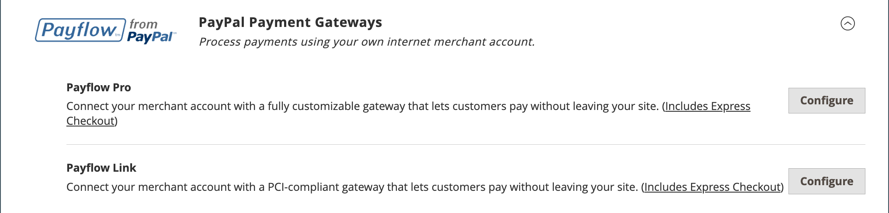

# Soluzioni di pagamento PayPal

PayPal è un leader globale nei pagamenti online e un modo veloce e sicuro per i tuoi clienti di pagare online. La selezione delle soluzioni PayPal disponibili varia in base alla posizione dell&#39;esercente. PayPal Express Checkout e PayPal Payments Standard possono essere utilizzati in tutte le parti del mondo. Per ulteriori informazioni, consulta [Soluzioni PayPal per paese](#paypal-solutions-by-country).

>[!IMPORTANT]
>
>**Requisiti di PSD2:**  
>A partire dal 14 settembre 2019, le banche europee potrebbero rifiutare i pagamenti che non soddisfano i requisiti di [PSD2](../getting-started/compliance-payment-services-directive.md). Per la maggior parte delle soluzioni PayPal, non è richiesta alcuna azione per conformarsi a PSD2 perché questi requisiti sono gestiti da PayPal.

## Account aziendale PayPal

Per offrire PayPal come metodo di pagamento nel tuo Negozio, devi disporre di un conto PayPal [business][1] e/o di un conto PayPal [Payflow][2]. I requisiti del conto sono specificati nella descrizione di ciascuna soluzione PayPal. Il tuo conto PayPal viene utilizzato anche per gestire i [filtri antifrode](#paypal-fraud-management-filters) applicati agli acquisti effettuati dal tuo store.

I clienti che utilizzano PayPal Express Checkout o Express Checkout per Payflow Pro devono avere un conto PayPal. PayPal Payments Standard (Pagamenti tramite sito Web Standard in alcuni paesi) può essere utilizzato direttamente o tramite un conto dell&#39;acquirente quando l&#39;esercente abilita _PayPal Account Optional_. Per impostazione predefinita, questo parametro è abilitato in modo che i clienti possano scegliere di inserire le informazioni sulla loro carta di credito o creare un conto dell&#39;acquirente con PayPal. Se disabilitati, i clienti devono creare un conto PayPal prima di effettuare un acquisto.

Pagamenti del sito web Pro, Pagamenti del sito web Pro Payflow Edition, Payflow Pro Gateway e Payflow Link richiedono ai clienti di inserire le informazioni della carta di credito durante il pagamento.

## PayPal Credit e PayLater

PayPal PayLater offre ai tuoi clienti un accesso rapido ai finanziamenti, in modo che possano acquistare ora e pagare nel tempo, senza costi aggiuntivi per te. Quando i clienti scelgono le opzioni di credito PayPal, non viene addebitato alcun importo e vengono pagate solo le normali tariffe di transazione PayPal. Per ulteriori informazioni, consulta il [sito Web PayPal][3].

Incrementa le tue vendite pubblicizzando i finanziamenti. PayPal aiuta a trasformare i browser in acquirenti con finanziamenti tramite PayPal PayLater. I tuoi clienti possono pagare nel tempo, mentre ricevi i pagamenti anticipati, senza costi aggiuntivi per te. Utilizza i banner pubblicitari gratuiti PayPal per pubblicizzare il finanziamento PayPal come opzione di pagamento quando i tuoi clienti effettuano il pagamento con PayPal. È stato dimostrato che il programma PayPal Advertising genera ulteriori acquisti e aumenta le dimensioni medie degli acquisti del 15% o più.

Puoi aggiungere facilmente banner pubblicitari gratuiti e pronti alle pagine del tuo sito e il pulsante _PayPal Credit_ nel carrello durante il pagamento per ricordare ai clienti che il finanziamento è prontamente disponibile.

>[!NOTE]
>
>A partire dalla versione 2.4.3, PayPal PayLater è supportato nelle implementazioni che includono PayPal. Questa funzione consente ai clienti di pagare un ordine in rate bi-settimanali invece di pagare l’intero importo al momento dell’acquisto. L&#39;esperienza di credito PayPal è obsoleta.

Per gli esercenti statunitensi, PayPal Credit è abilitato per impostazione predefinita per l&#39;opzione di pagamento [PayPal Express Checkout](paypal-express-checkout.md). Per disabilitarla per questo metodo di pagamento, consulta la sezione _Caratteristiche_ della [Configurazione pagamento PayPal Express](paypal-express-checkout.md#features).

PayPal Credit è disabilitato per impostazione predefinita per le altre soluzioni di pagamento PayPal, ma può essere abilitato nella configurazione del metodo di pagamento per le soluzioni di supporto:

- [Pagamenti anticipati](paypal-payments-advanced.md)
- [Pagamenti Pro](paypal-payments-pro.md)
- [Pagamenti standard](paypal-payments-standard.md)
- [Payflow Pro](paypal-payflow-pro.md)
- [Collegamento payflow](paypal-payflow-link.md)

>[!IMPORTANT]
>
>Prima di configurare PayPal Credit o PayPal PayLater per il tuo Negozio, assicurati che sia abilitato nel tuo conto PayPal per esercenti.

## Soluzioni PayPal integrate

Con PayPal e Adobe Commerce puoi accettare pagamenti da tutte le principali carte di debito e di credito. PayPal offre ulteriore comodità senza sforzi aggiuntivi, perché anche i clienti che non hanno un conto PayPal possono pagare i loro acquisti con PayPal.

>[!NOTE]
>
>Non puoi avere più di un metodo PayPal abilitato nel tuo Negozio alla volta, ad eccezione di PayPal Express Checkout. PayPal Express Checkout può essere utilizzato con altri metodi di pagamento PayPal, ad eccezione di PayPal Payments Standard. Se si modificano le soluzioni di pagamento, il metodo precedente viene disattivato.

### Pagamento PayPal Express

[Pagamento PayPal Express](paypal-express-checkout.md)

### PayPal Soluzioni di pagamento all-in-one

Negli Stati Uniti, PayPal offre le seguenti soluzioni conformi allo standard PCI per soddisfare le esigenze delle aziende in crescita.

- [Pagamenti PayPal avanzati](paypal-payments-advanced.md)
- [Pagamenti PayPal Pro](paypal-payments-pro.md)
- [Pagamenti PayPal Standard](paypal-payments-standard.md)

{width="600" zoomable="yes"}

### Gateway di pagamento PayPal

Un gateway di pagamento è un servizio commerciale fornito da un provider di servizi applicativi di e-commerce che autorizza l’elaborazione di carte di credito o pagamenti diretti. Operano come intermediari tra la clientela e le banche.

I gateway di pagamento sono disponibili in ambienti online e offline. I pagamenti possono essere accettati per telefono, online o tramite un’app mobile. La transazione viene inviata al sistema di elaborazione del fornitore di servizi e quindi inviata alla banca del cliente per la verifica e la conferma. Se verificato, il commerciante riceve il pagamento senza avere un contatto diretto con il conto bancario del cliente.

Esistono due tipi di gateway di pagamento: diretto e in hosting.

- I gateway di pagamento diretto consentono agli utenti di inserire i dati della carta sul sito Web del negozio.
- I gateway di pagamento in hosting reindirizzano gli utenti a una pagina di pagamento in hosting, all’esterno del sito web del negozio.

Il gateway di pagamento offre sicurezza e protezione a tutte le parti coinvolte in una transazione.

PayPal offre una scelta di due soluzioni gateway di pagamento per la tua azienda. Puoi lasciare che PayPal ospiti il tuo pagamento sul suo sito sicuro, oppure puoi prendere il controllo dell&#39;intera esperienza di pagamento con una soluzione personalizzabile.

- [PayPal Payflow Pro](paypal-payflow-pro.md)
- [Collegamento flusso di pagamento PayPal](paypal-payflow-link.md)

{width="600" zoomable="yes"}

## Filtri per la gestione delle frodi PayPal

I filtri di gestione delle frodi PayPal semplificano l&#39;individuazione e la risposta alle transazioni fraudolente e possono essere configurati per segnalare, bloccare per la revisione o negare pagamenti più rischiosi. Le azioni relative ai valori [stato ordine](order-status.md) di Commerce sono state modificate in base alle impostazioni del filtro per frodi:

| Azione | Risultato |
| --- | --- |
| [!UICONTROL Review] | L&#39;ordine sospetto riceve lo stato _Revisione pagamento_ quando l&#39;ordine viene effettuato. Puoi rivedere l&#39;ordine e approvare o annullare il pagamento nell&#39;Admin o sul lato PayPal. Quando si fa clic su **[!UICONTROL Accept Payment]** o **[!UICONTROL Deny Payment]**, non vengono create nuove transazioni per l&#39;ordine.   Se modifichi lo stato della transazione sul sito PayPal, devi fare clic su **[!UICONTROL Get Payment Update]** nella pagina Ordine dell&#39;amministratore per applicare le modifiche. Se fai clic su **[!UICONTROL Accept Payment]** o **[!UICONTROL Deny Payment]**, vengono applicate le modifiche apportate al sito PayPal. |
| [!UICONTROL Deny] | L&#39;ordine sospetto non può essere effettuato dal cliente, perché la transazione corrispondente viene rifiutata da PayPal.   Per rifiutare il pagamento da parte dell&#39;amministratore, fare clic su **[!UICONTROL Deny Payment]** nell&#39;angolo superiore destro della pagina. Lo stato dell&#39;ordine cambia in `Canceled`, la transazione viene ripristinata e i fondi vengono rilasciati sul conto cliente. Le informazioni corrispondenti vengono aggiunte nella sezione _[!UICONTROL Comments History]_&#x200B;della visualizzazione ordine. |
| [!UICONTROL Flag] | L&#39;ordine sospetto ottiene lo stato `Processing` al momento dell&#39;inserimento. La transazione corrispondente è contrassegnata da un contrassegno nell&#39;elenco delle transazioni del conto esercente. |

{style="table-layout:auto"}

## Soluzioni PayPal per paese

| Paese | Soluzione di pagamento PayPal |
|--- |--- |
| Australia | [!DNL PayPal Website Payments Standard] [[!DNL PayPal Payflow Pro]](paypal-payflow-pro.md) [!DNL PayPal Website Payments Pro Hosted Solution] [[!DNL PayPal Express Checkout]](paypal-express-checkout.md) |
| Canada | [!DNL PayPal Website Payments Standard] [!DNL PayPal Website Payments Pro] [[!DNL PayPal Payflow Pro]](paypal-payflow-pro.md) [[!DNL PayPal Payflow Link]](paypal-payflow-link.md) (include estrazione rapida) [[!DNL PayPal Express Checkout]](paypal-express-checkout.md) |
| Francia | [!DNL PayPal Integral Evolution] [!DNL PayPal Website Payments Standard] [[!DNL PayPal Express Checkout]](paypal-express-checkout.md) |
| Germania | [[!DNL PayPal Express Checkout]](paypal-express-checkout.md) |
| Hong Kong RAS Cina | [!DNL PayPal Website Payments Pro Hosted Solution] [!DNL PayPal Website Payments Standard] [[!DNL PayPal Express Checkout]](paypal-express-checkout.md) |
| Italia | [!DNL PayPal ProPay] [[!DNL Pal Payments Standard]](paypal-payments-standard.md) [[!DNL PayPal Express Checkout]](paypal-express-checkout.md) |
| Giappone | [!DNL PayPal Website Payments Plus] [!DNL PayPal Website Payments Standard] [[!DNL PayPal Express Checkout]](paypal-express-checkout.md) |
| Nuova Zelanda | [[!DNL PayPal Payflow Pro]](paypal-payflow-pro.md) [!DNL PayPal Website Payments Standard] [[!DNL PayPal Express Checkout]](paypal-express-checkout.md) |
| Spagna | [!DNL PayPal Pasarela Integral] [!DNL PayPal Website Payments Standard] [[!DNL PayPal Express Checkout]](paypal-express-checkout.md) |
| Regno Unito | [!DNL PayPal Payments Pro Hosted Solution] (include estrazione rapida) [[!DNL PayPal Payments Standard]](paypal-payments-standard.md) [[!DNL PayPal Express Checkout]](paypal-express-checkout.md) |
| Stati Uniti | [[!DNL PayPal Payments Advanced]](paypal-payments-advanced.md) (include il Checkpoint rapido) [[!DNL PayPal Payments Pro]](paypal-payments-pro.md) (include il Checkpoint rapido) [[!DNL PayPal Payments Standard+]](paypal-payments-standard.md) [[!DNL PayPal Payflow Pro]](paypal-payflow-pro.md) (include il Checkpoint rapido) [[!DNL PayPal Payflow Link]](paypal-payflow-link.md) (include il Checkpoint rapido) [[!DNL PayPal Express Checkout]](paypal-express-checkout.md) |

{style="table-layout:auto"}

### Altri paesi

PayPal Express Checkout e PayPal Web Payments Standard sono disponibili nei seguenti paesi:

- Argentina
- Austria
- Belgio
- Brasile
- Bulgaria
- Cile
- Costa Rica
- Cipro
- Repubblica Ceca
- Danimarca
- Repubblica Dominicana
- Ecuador
- Estonia
- Finlandia
- Guiana francese
- Gibilterra
- Grecia
- Guadalupa
- Ungheria
- Islanda
- India
- Indonesia
- Irlanda
- Israele
- Giamaica
- Lettonia
- Liechtenstein
- Lituania
- Lussemburgo
- Malesia
- Malta
- Martinica
- Messico
- Paesi Bassi
- Norvegia
- Filippine
- Polonia
- Portogallo
- Riunione
- Romania
- San Marino
- Singapore
- Slovacchia
- Slovenia
- Sudafrica
- Corea del Sud
- Svezia
- Svizzera
- Taiwan
- Thailandia
- Turchia
- Emirati Arabi Uniti
- Uruguay
- Venezuela
- Vietnam

[1]: https://manager.paypal.com/
[2]: https://developer.paypal.com/docs/payflow/payflow-gateway/
[3]: https://www.paypal.com/us/business/buy-now-pay-later
