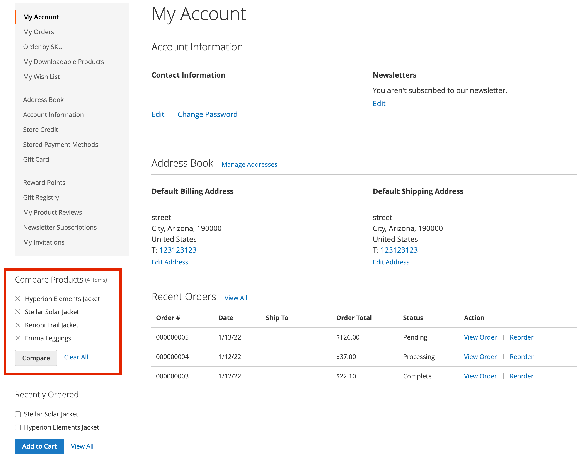

# Confronta prodotti

Confronta prodotti genera un confronto dettagliato affiancato di due o più prodotti. A seconda del tema, il collegamento Aggiungi per confrontare potrebbe essere rappresentato da un&#39;icona o da un testo. Il _Confronta prodotti_ il blocco viene in genere visualizzato nella barra laterale sinistra o destra di una pagina di catalogo.

{width="700" zoomable="yes"}

A differenza della [Prodotti visualizzati/confrontati di recente](products-viewed-compared.md) , l&#39;amministratore non include impostazioni di configurazione aggiuntive per Confronta prodotti.

## Confronta i prodotti sul vetrina

Sono disponibili alcuni modi per utilizzare l’elenco di confronto nella vetrina.

### Dalle pagine del catalogo

1. Il cliente trova i prodotti che desidera confrontare e fa clic sul pulsante **[!UICONTROL Add to Compare]** collegamento per ciascuno.

1. Passa a una pagina categoria associata.

   A seconda del tema e del layout della pagina, è possibile che _Confronta prodotti_ nella barra laterale. In tal caso, vengono elencati gli elementi della categoria contrassegnati per il confronto.

   Il cliente può fare clic su _Elimina_ (  ) per qualsiasi prodotto per rimuoverlo dal rapporto di confronto, oppure fai clic su **[!UICONTROL Clear All]** per rimuovere tutti gli elementi e ricominciare dalle selezioni di confronto.

1. Clic **[!UICONTROL Compare]**.

1. Per stampare le informazioni di confronto, fare clic su **[!UICONTROL Print This Page]**.

1. Per rimuovere un singolo prodotto dalla pagina di confronto, fai clic su _Elimina_ (  ).

### Da un messaggio di notifica

1. Dopo che un cliente ha aggiunto un prodotto a un elenco di confronto, la pagina mostra un messaggio di notifica.

1. Nella notifica del messaggio in alto visualizzata, fai clic sul pulsante _elenco di confronto_ collegamento.

   {width="700" zoomable="yes"}

Questa azione reindirizza il cliente alla lista di confronto in cui può accedere alle azioni aggiuntive.

### Dalla sezione _Confronta prodotti_ blocco

1. Il cliente trova i prodotti che desidera confrontare e fa clic sul pulsante **[!UICONTROL Add to Compare]** collegamento per ciascuno.

1. Nell’intestazione accanto al campo di ricerca, fai clic su _Confronta prodotti_ collegamento.

   {width="700" zoomable="yes"}

### Dalla dashboard Il mio account

1. Il cliente aggiunge i prodotti necessari all’elenco di confronto.

1. Passa a **[!UICONTROL My Account]**.

1. In _Confronta prodotti_ blocco, clic **[!UICONTROL Compare]**.

   {width="700" zoomable="yes"}

## Azioni aggiuntive dell’elenco di confronto

| [!UICONTROL Action] | Descrizione |
|------|-----------|
|  | Elimina un singolo elemento dall&#39;elenco di confronto. |
| **[!UICONTROL Add to Cart]** | Aggiunge il prodotto al carrello. Se il prodotto ha delle configurazioni, la pagina reindirizza il cliente alla pagina del prodotto in cui seleziona le opzioni configurabili e quindi fai clic su **[!UICONTROL Add to Cart]**. |
| _Icona elenco desideri_ | Aggiunge un prodotto alla lista dei desideri (richiede che la funzionalità della lista dei desideri sia abilitata nella configurazione del negozio). |
| _Stampa questa pagina_ | Stampa la pagina dell&#39;elenco di confronto. |

{style="table-layout:auto"}
