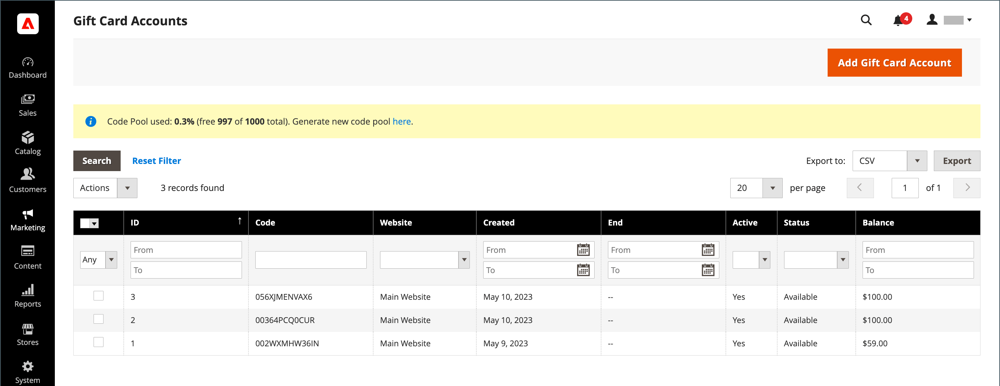

# Conti gift card

Per ogni gift card acquistata viene automaticamente creato un account gift card. Il valore della gift card può quindi essere applicato all&#39;acquisto di un prodotto nel tuo negozio. Puoi anche creare account gift card dall’amministratore come promozione o servizio per i clienti. Il numero di conto gift card corrisponde al codice gift card.

{width="700" zoomable="yes"}

## Configura account gift card

La configurazione della gift card stabilisce le impostazioni predefinite per tutte le gift card per la vista store e gestisce il pool di codice. Il pool di codici è un insieme di codici gift card univoci in un formato specifico. I codici del pool vengono utilizzati ogni volta che viene creato un conto gift card. È responsabilità dell&#39;amministratore del negozio verificare che siano disponibili codici sufficienti per le vendite con gift card. Assicurati di generare un pool di codici prima di offrire carte regalo in vendita. Per impostazione predefinita, Adobe Commerce genera 1.000 codici. Un nuovo pool di codici viene generato solo se nel pool corrente non sono disponibili altri codici.

### Passaggio 1: configurare le notifiche e-mail

1. Nella barra laterale _Admin_, passa a **[!UICONTROL Stores]** > _[!UICONTROL Settings]_>**[!UICONTROL Configuration]**.

1. Nel pannello a sinistra, espandi **[!UICONTROL Sales]** e scegli **[!UICONTROL Gift Cards]**.

1. Espandere  nella sezione _[!UICONTROL Gift Card Email Settings]_ed effettuare le seguenti operazioni:

   - Impostare **[!UICONTROL Gift Card Notification Email Sender]** sull&#39;identità dello store che viene visualizzata come mittente delle notifiche gift card.

   - Imposta **[!UICONTROL Gift Card Notification Email Template]** sul modello utilizzato per la notifica.

   {width="600" zoomable="yes"}

1. Espandere  nella sezione _[!UICONTROL Email Sent from Gift Card Account Management]_ed effettuare le seguenti operazioni:

   - Impostare **[!UICONTROL Gift Card Email Sender]** sull&#39;identità dello store per essere visualizzato come mittente delle gift card.

   - Impostare **[!UICONTROL Gift Card Template]** sul modello da utilizzare per la gift card.

Consulta [Archivia indirizzi e-mail](../configuration-reference/general/store-email-addresses.md) per specifici campi e opzioni di configurazione.

### Passaggio 2: completare le impostazioni generali

1. Espandere  nella sezione _[!UICONTROL Gift Card General Settings]_.

1. Per consentire al cliente di riscattare il valore sulla carta per contanti, impostare **[!UICONTROL Redeemable]** su `Yes`.

1. Per **[!UICONTROL Lifetime (days)]**, immettere il numero di giorni prima della scadenza della carta.

   Se non è presente alcuna data di scadenza, lasciare vuoto il campo.

   >[!NOTE]
   >
   >A seconda della tua posizione, la scadenza delle gift card potrebbe non essere consentita. Controlla le leggi locali prima di impostare una vita per le tue carte regalo.

1. Per consentire ai clienti di immettere un messaggio da allegare alla gift card, impostare **[!UICONTROL Allow Gift Message]** su `Yes` e immettere il numero di caratteri disponibili per il messaggio per **[!UICONTROL Gift Message Maximum Length]**.

1. Imposta **[!UICONTROL Generate Gift Card Account when Orders Item is]** su uno dei seguenti:

   - `Ordered` - Il conto gift card viene creato al momento dell&#39;ordine.
   - `Invoiced` - Il conto gift card viene creato dopo l&#39;acquisizione del pagamento e la fatturazione dell&#39;ordine.

   {width="600" zoomable="yes"}

### Passaggio 3: stabilire il pool di codici gift card

1. Espandere  nella sezione _[!UICONTROL Gift Card Account General Settings]_ed effettuare le seguenti operazioni:

   {width="600" zoomable="yes"}

   - Per personalizzare il codice, completa quanto segue in base alle tue preferenze:

      - Lunghezza codice
      - Formato del codice
      - Prefisso codice
      - Suffisso codice
      - Trattino Ogni X Caratteri

   - Per determinare il numero di codici da generare, immettere **[!UICONTROL New Pool Size]**.

   - Per specificare quando si riceve la notifica per il riassortimento del pool di codici, immettere **[!UICONTROL Low Code Pool Threshold]**.

1. Prima di generare il pool di codici, fare clic su **[!UICONTROL Save Config]**.

1. Fare clic su **[!UICONTROL Generate]**.

1. Al termine, fare clic su **[!UICONTROL Save Config]**.

## Rivedi un conto gift card esistente

1. Per trovare il numero del conto gift card per un ordine corrente, eseguire le operazioni seguenti:

   - Nella barra laterale _Admin_, passa a **[!UICONTROL Sales]** > _[!UICONTROL Operations]_>**[!UICONTROL Orders]**.

   - Trovare l&#39;ordine nell&#39;elenco e fare clic su **[!UICONTROL View]** nella colonna _[!UICONTROL Action]_.

   - Scorri verso il basso fino alla sezione _[!UICONTROL Items Ordered]_.

   Il numero è nella colonna _[!UICONTROL Product]_, in **[!UICONTROL Gift Card Accounts]**.

1. Nella barra laterale _Admin_, passa a **[!UICONTROL Marketing]** > _[!UICONTROL Promotions]_>**[!UICONTROL Gift Card Accounts]**.

1. Trova il conto gift card nella griglia e aprilo in modalità di modifica.

   Il codice gift card viene visualizzato nella parte superiore della sezione _Informazioni_.

   {width="600" zoomable="yes"}

## Creare un conto gift card

1. Nella barra laterale _Admin_, passa a **[!UICONTROL Marketing]** > _[!UICONTROL Promotions]_>**[!UICONTROL Gift Card Accounts]**.

1. Nell&#39;angolo superiore destro fare clic su **[!UICONTROL Add Gift Card Account]**.

1. Nella sezione _[!UICONTROL Information]_, impostare **[!UICONTROL Active]**su `Yes` ed eseguire le operazioni seguenti:

   - Per rendere il saldo della carta rimborsabile al momento del pagamento o trasferito al credito del negozio del cliente, impostare **[!UICONTROL Redeemable]** su `Yes`.

   - Scegliere **[!UICONTROL Website]** in cui è possibile utilizzare l&#39;account gift card.

   - Immettere il **[!UICONTROL Balance]** iniziale sulla gift card.

   - _(Facoltativo)_ Per impostare un **[!UICONTROL Expiration Date]** per la gift card, selezionare la data dal calendario .

     Se non specificato, il conto gift card non scade.

     {width="600" zoomable="yes"}

1. Nel pannello a sinistra, scegli **[!UICONTROL Send Gift Card]** ed effettua le seguenti operazioni:

   - Immettere l&#39;indirizzo **[!UICONTROL Recipient Email]**.

   - Immettere **[!UICONTROL Recipient Name]**.

   - Impostare **[!UICONTROL Send Email from the Following Store View]** sulla visualizzazione dello store visualizzata come mittente della notifica gift card.

   {width="600" zoomable="yes"}

1. Per salvare il nuovo account, effettuare una delle seguenti operazioni:

   - Se non sei pronto a inviare la gift card, fai clic su **[!UICONTROL Save]**.

   - Per salvare le modifiche e inviare la gift card tramite e-mail al destinatario, fare clic su **Salva e invia e-mail**.

## Visualizza cronologia account gift card

1. Vai a **[!UICONTROL Marketing]** > _[!UICONTROL Promotions]_>**[!UICONTROL Gift Card Accounts]**.

1. Apri la gift card in modalità di modifica.

1. Viene visualizzato il **[!UICONTROL History]** della gift card.

   {width="600" zoomable="yes"}

| Colonna | Descrizione |
|--- |--- |
| [!UICONTROL ID] | Un numero univoco di azione con gift card. |
| [!UICONTROL Date] | Data dell’azione. |
| [!UICONTROL Action] | Determina tutte le azioni possibili con una gift card. Opzioni: `Created` / `Updated` / `Sent` / `Used` / `Redeemed` / `Expired` |
| [!UICONTROL Balance Change] | Visualizza l&#39;importo di cui è stato modificato il saldo della gift card. |
| [!UICONTROL Balance] | Indica il saldo disponibile. |
| [!UICONTROL More Information] | Visualizza informazioni su chi ha modificato il saldo della gift card. |

{style="table-layout:auto"}

## Eliminare un conto gift card

1. Nella barra laterale _Admin_, passa a **[!UICONTROL Marketing]** > _[!UICONTROL Promotions]_>**[!UICONTROL Gift Card Accounts]**.

1. Selezionare l&#39;account gift card da eliminare e aprirlo in modalità di modifica.

1. Nella barra dei menu fare clic su **[!UICONTROL Delete]**.

1. Per confermare l&#39;azione, fare clic su **[!UICONTROL OK]**.

## Descrizioni delle colonne

| Colonna | Descrizione |
|--- |--- |
| [!UICONTROL ID] | Identificatore numerico univoco assegnato al conto gift card. |
| [!UICONTROL Code] | Il codice che deve essere inserito per applicare una gift card. |
| [!UICONTROL Website] | Indica i siti Web in cui è disponibile il conto gift card. |
| [!UICONTROL Created] | Data di creazione. |
| [!UICONTROL End] | Data di scadenza della gift card, se programmata. |
| [!UICONTROL Active] | Determina se la gift card è attiva. |
| [!UICONTROL Status] | Determina se la gift card viene riscattata nell&#39;account del cliente o se è disponibile. Opzioni: `Used` / `Redeemed` / `Expired` |
| [!UICONTROL Balance] | Indica il saldo disponibile. |

{style="table-layout:auto"}
