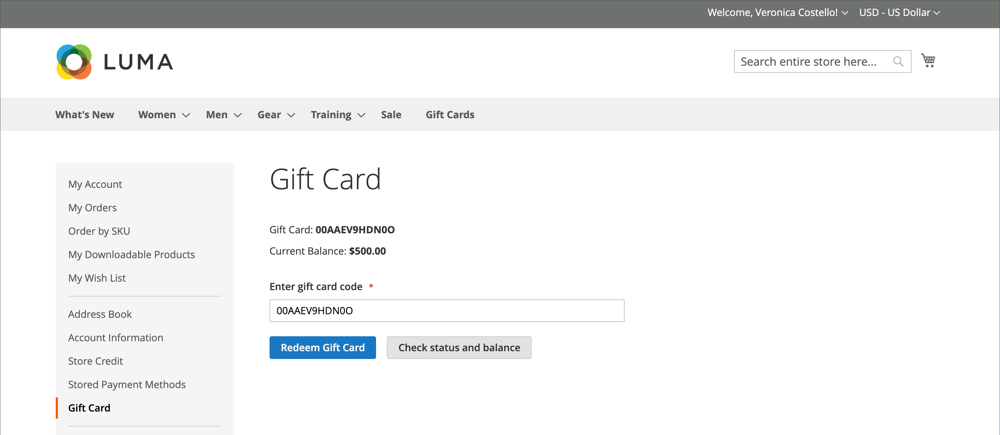
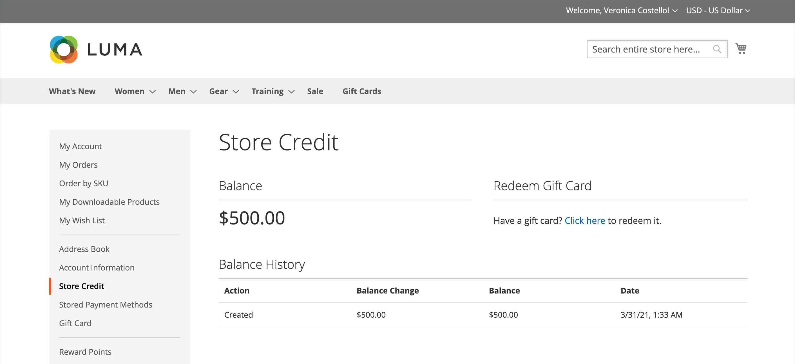

# Acquisto e rimborso gift card

{{ee-feature}}

Le gift card vengono riscattate nel carrello in modo simile al modo in cui un coupon viene applicato a un ordine. Durante il pagamento, l&#39;acquirente inserisce il codice gift card per applicare un importo dalla gift card all&#39;acquisto. I titolari di carte regalo che dispongono di conti cliente possono controllare lo stato e il saldo rimanente dalla dashboard del proprio account. Le gift card singole e multiple possono essere utilizzate per pagare tutto o parte di un ordine.

Il codice gift card applicato può essere visualizzato aprendo l&#39;ordine in _Amministratore_, che consente di recuperare il codice per inserirlo in una gift card fisica, se necessario. Se un ordine gift card viene annullato o rimborsato, è necessario annullare manualmente il relativo conto gift card. Puoi eliminare completamente l’account o disattivarlo.

{width="700" zoomable="yes"}

Ad esempio, un cliente che fa acquisti nel negozio Luma demo può acquistare una gift card virtuale o fisica.

**gift card virtuale** - Una gift card virtuale Luma viene inviata al destinatario tramite e-mail con un messaggio facoltativo. Può essere riscattato in qualsiasi sito web della famiglia Luma e non scade mai.

**gift card fisica** - Una gift card Luma è confezionata in un mailer artistico personalizzato e inviata gratuitamente al destinatario. Può essere prodotto in anticipo, etichettato con codici univoci e riscattato in negozio, per telefono o su qualsiasi sito web della famiglia Luma. Non scade mai.

**gift card combinata** - Una gift card combinata ha le caratteristiche di una gift card virtuale e fisica. Una gift card combinata Luma viene spedita e inviata al destinatario via e-mail. L&#39;indirizzo e-mail e di spedizione sono necessari durante l&#39;acquisto della gift card. Non scade mai.

## Ciclo di vita gift card

1. **Il cliente determina il valore della gift card**.

   Il cliente determina il valore della gift card dalla pagina del prodotto. A seconda della configurazione, è disponibile un campo prezzo fisso, un elenco di opzioni di prezzo o entrambi. Tutti gli importi vengono visualizzati nella valuta utilizzata nel punto vendita.

1. **Il cliente completa le informazioni sulla gift card**.

   Per una gift card fisica, il cliente immette il **Nome mittente** e **Nome destinatario**. Per le gift card virtuali o combinate, il cliente immette anche **E-mail mittente** e **E-mail destinatario**. Se il cliente ha effettuato l’accesso, il nome del mittente (e l’e-mail del mittente, se applicabile) vengono immessi automaticamente dal proprio account. A seconda della configurazione, il cliente potrebbe anche immettere un messaggio al destinatario.

1. **Il cliente completa l&#39;estrazione**.

   La gift card viene visualizzata come una riga nel carrello con i dettagli che mostrano il nome del mittente, del destinatario e del messaggio, se applicabile. L&#39;importo associato alla gift card viene convertito nella valuta di base del negozio quando viene aggiunto al carrello.

1. **Il cliente riceve la conferma dell&#39;ordine**.

   L&#39;acquirente della gift card può fare clic sul collegamento nella conferma per tenere traccia dell&#39;ordine dalla dashboard del proprio account.

1. **Il destinatario riceve la gift card**.

   Per le gift card virtuali o combinate, il destinatario riceve un&#39;e-mail con il codice gift card, il nome del mittente e il messaggio, se applicabile. Se si acquistano più gift card in un unico ordine e il tipo è virtuale o combinato, tutti i codici gift card corrispondenti vengono inviati al destinatario in un&#39;unica e-mail. Le gift card fisiche possono essere spedite direttamente al destinatario o al cliente, che può quindi consegnarle personalmente.

1. **Il destinatario applica una gift card all&#39;acquisto**.

   Il destinatario acquista un articolo nel tuo Negozio e applica il codice gift card durante il pagamento. Ogni volta che viene applicata una gift card durante il pagamento, l&#39;importo viene visualizzato nel blocco dei totali dell&#39;ordine e viene sottratto dal totale complessivo. Il saldo completo di ogni gift card viene sottratto dal totale del carrello. Se per un acquisto vengono utilizzate più carte regalo, queste vengono applicate in ordine crescente, a partire dalla carta con il saldo rimanente più piccolo, fino a quando non vengono applicate tutte o il totale complessivo è zero. Quando il totale complessivo raggiunge lo zero, l&#39;ultimo conto gift card applicato al carrello riceve una detrazione parziale. Le schede che non sono state applicate al carrello non ricevono una detrazione del saldo. Gli importi vengono detratti dai conti gift card solo dopo l&#39;ordine.

## Esperienza vetrina

Funzionamento delle carte regalo sul vetrina:

- Il codice gift card può essere applicato nel carrello o al momento del pagamento per coprire l&#39;importo totale dell&#39;ordine.

- Nel catalogo, una gift card viene presentata come un tipo separato di prodotto.

- Il codice gift card viene attivato dopo la fatturazione dell&#39;ordine. Se l&#39;ordine non viene pagato, il cliente ricevente non può utilizzare la gift card.

- Gli account per i codici regalo vengono creati per tenere traccia del saldo di un voucher specifico. L&#39;amministratore dello store può regolare manualmente il saldo.

Il cliente ricevente può utilizzare _[!UICONTROL Gift Card]_sezione del dashboard account per verificare il saldo [conto gift card](product-gift-card-accounts.md) e riscattare le gift card per [credito store](../customers/store-credit-using.md).

{width="700" zoomable="yes"}

### Verifica lo stato e il saldo della gift card

1. Dalla vetrina, il cliente effettua l’accesso e apre la pagina del proprio account cliente.

1. Il cliente apre il **[!UICONTROL Gift Card]** e immette il codice gift card.

1. Il cliente fa clic **[!UICONTROL Check status and balance]**.

{width="700" zoomable="yes"}

Viene visualizzato il saldo della gift card.

### Attivazione gift card

1. Il giorno _[!UICONTROL Gift Card]_, il cliente immette il codice gift card.

1. Il cliente fa clic **[!UICONTROL Redeem Gift Card]**.

{width="700" zoomable="yes"}

L&#39;importo della gift card viene attivato e aggiunto al saldo totale del credito del negozio.

{width="700" zoomable="yes"}

Tutte le operazioni per il saldo gift card sono disponibili sul sito _[!UICONTROL Store Credit]_pagina.

### Applicare una gift card durante il pagamento

Se la gift card non è rimborsabile, il cliente può applicare il codice della gift card durante il pagamento.

1. Durante il _Revisione e pagamenti_ fase, il cliente fa clic su **[!UICONTROL Apply Gift Card]**.

1. Immette il codice gift card e quindi fa clic su **[!UICONTROL Apply]**.

   Lo sconto deve essere riportato nella _[!UICONTROL Order Summary]_.

1. Clic **[!UICONTROL Place Order]** per finalizzare l&#39;ordine.
