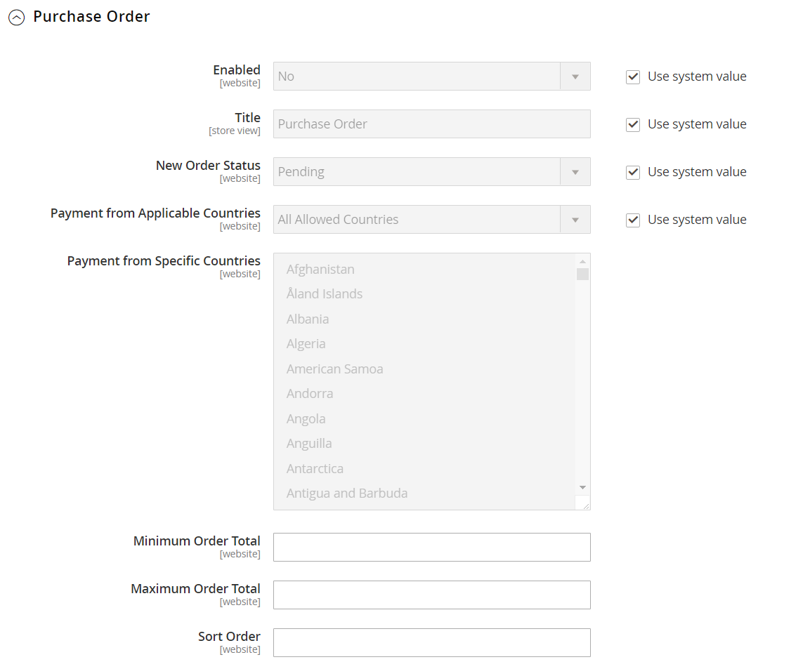

# Ordini di acquisto

A _ordine fornitore_ (PO) consente ai clienti commerciali di pagare per gli acquisti autorizzati facendo riferimento al numero dell&#39;ordine di acquisto. L’ordine di acquisto viene autorizzato ed emesso in anticipo dalla società che effettua l’acquisto. Durante il pagamento, il cliente sceglie Ordine di acquisto come metodo di pagamento. Al ricevimento della fattura, la società elabora il pagamento nel sistema di contabilità fornitori e paga l&#39;acquisto.

Prima di accettare il pagamento tramite ordine di acquisto, è necessario verificare sempre la solvibilità del cliente commerciale.

**_Per configurare il pagamento in base all&#39;ordine fornitore:_**

1. Il giorno _Amministratore_ barra laterale, vai a **[!UICONTROL Stores]** > _[!UICONTROL Settings]_>**[!UICONTROL Configuration]**.

1. Nel pannello a sinistra, espandi **[!UICONTROL Sales]** e scegli **[!UICONTROL Payment Methods]**.

1. Sotto _[!UICONTROL Other Payment Methods]_, espandi  il **[!UICONTROL Purchase Order]**sezione.

   {width="600" zoomable="yes"}

   Per una descrizione dettagliata di ciascuna di queste impostazioni di configurazione, vedi [Ordine di acquisto](../configuration-reference/sales/payment-methods.md#purchase-order) nel _Guida di riferimento alla configurazione_.

   >[!NOTE]
   >
   >Se necessario, cancellare prima **[!UICONTROL Use system value]** per modificare queste impostazioni.

1. Per attivare questo metodo di pagamento, imposta **[!UICONTROL Enabled]** a `Yes`.

1. Per **[!UICONTROL Title]**, immettere un titolo che identifichi questo metodo di pagamento durante il pagamento.

1. Imposta **[!UICONTROL New Order Status]** a `Pending` fino all&#39;autorizzazione del pagamento.

1. Imposta **[!UICONTROL Payment from Applicable Countries]** a uno dei seguenti elementi:

   - `All Allowed Countries` - Clienti di tutti [paesi](../getting-started/store-details.md#country-options) specificato nella configurazione del negozio può utilizzare questo metodo di pagamento.
   - `Specific Countries` - Dopo aver scelto questa opzione, il _[!UICONTROL Payment from Specific Countries]_viene visualizzato. Per selezionare più paesi, tenere premuto il tasto Ctrl (PC) o il tasto Comando (Mac) e fare clic su ciascuna opzione.

1. Imposta **[!UICONTROL Minimum Order Total]** e **[!UICONTROL Maximum Order Total]** agli importi necessari per beneficiare di questo metodo di pagamento.

   >[!NOTE]
   >
   >Un ordine è qualificato se il totale è compreso tra i valori totali minimi o massimi o corrisponde esattamente a tali valori.

1. Per **[!UICONTROL Sort Order]**, immettere un numero che determini la posizione di questo elemento nell&#39;elenco dei metodi di pagamento visualizzato durante l&#39;estrazione.

   Questo numero è relativo agli altri metodi di pagamento. (`0` = innanzitutto, `1` = secondo, `2` = terzo e così via.)

1. Al termine, fai clic su **[!UICONTROL Save Config]**.
