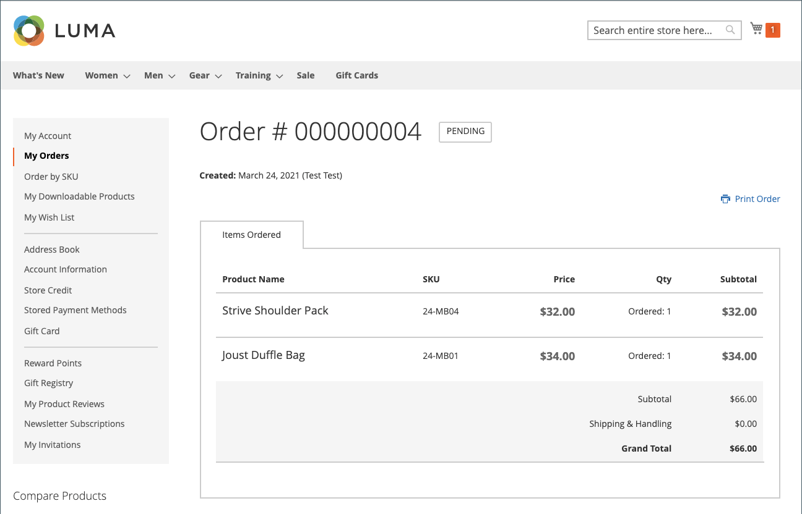

# Consenti riordini

Se questa opzione è abilitata, è possibile effettuare i riordini direttamente dal conto cliente o dall&#39;ordine originale in _Amministratore_. I riordini sono attivati per impostazione predefinita.

{width="700" zoomable="yes"}

## Criteri per l&#39;abilitazione del riordino per un ordine

- Il _Consenti riordino_ l&#39;opzione di configurazione deve essere abilitata.

- Se l&#39;ordine è in `Hold` o in `Payment Review` stato, l&#39;opzione Riordina è disabilitata.

- Se uno degli elementi nell&#39;ordine non è disponibile, non è disponibile o è disattivato, l&#39;opzione di riordino è disattivata nella vetrina.

- Un _Amministratore_ può riordinare anche se uno qualsiasi degli elementi è esaurito o disabilitato.

## Configura per consentire riordini cliente

1. Il giorno _Amministratore_ barra laterale, vai a **[!UICONTROL Stores]** > _[!UICONTROL Settings]_>**[!UICONTROL Configuration]**.

1. Nel pannello a sinistra, espandi **[!UICONTROL Sales]** e scegli **[!UICONTROL Sales]** sotto.

1. Espandi  il **[!UICONTROL Reorder]** sezione.

   {width="600" zoomable="yes"}

1. Imposta **[!UICONTROL Allow Reorder]** a `Yes`.

   Questa impostazione abilita la funzionalità di riordino dal conto cliente nella vetrina o nell&#39;elenco degli ordini in Admin.

1. Clic **[!UICONTROL Save Config]**.

## Riordina dalla vetrina

Un cliente può avviare la funzionalità di riordino per un ordine specifico da due pagine:

- _I miei ordini_ pagina

- _Vista ordine_ pagina

### I miei ordini

Il _Riordina_ viene sempre visualizzato nell’elenco con Ordini (anche se tutti i prodotti dell’ordine non sono disponibili per il riordino).

{width="700" zoomable="yes"}

**Caso 1.** Tutti i prodotti dell&#39;ordine sono **disponibile** per riordinare

L’utente viene reindirizzato al carrello e tutti i prodotti vengono aggiunti al carrello

{width="700" zoomable="yes"}

**Caso 2.** Alcuni/tutti i prodotti dell&#39;ordine sono **non disponibile** per riordinare

>[!NOTE]
>
>È possibile riordinare `Not Visible Individually` prodotti.

Il _Riordina_ non viene visualizzato sul _I miei ordini_ e _Visualizza ordine_ pagine.

{width="700" zoomable="yes"}

### Pagina di visualizzazione ordine

**Caso 1.** Tutti i prodotti dell&#39;ordine sono disponibili per il riordino

L’utente viene reindirizzato al carrello e tutti i prodotti vengono aggiunti al carrello

**Caso 2.** Alcuni/tutti i prodotti dell&#39;ordine sono **non disponibile** per riordinare

>[!NOTE]
>
>È possibile riordinare `Not Visible Individually` prodotti.

Il _Riordina_ non viene visualizzato sul _I miei ordini_ e _Visualizza ordine_ pagine.

{width="700" zoomable="yes"}

### Il carrello non è vuoto

Se il carrello non è vuoto e l’utente fa clic su **[!UICONTROL Reorder]** (dal _I miei ordini_  o _Vista ordine_ ), i prodotti esistenti rimangono nel carrello con i prodotti di riordino aggiunti.

{width="700" zoomable="yes"}

## Riordina dall’Amministratore

1. Il giorno _Amministratore_ barra laterale, vai a **[!UICONTROL Sales]** > **[!UICONTROL Orders]**.

1. Individua l’ordine e apri in **[!UICONTROL View]** modalità.

1. Clic **[!UICONTROL Reorder]** che viene visualizzato nella barra dei pulsanti superiore.

   {width="600" zoomable="yes"}

   Dopo aver fatto clic su **[!UICONTROL Reorder]**, il _Crea nuovo ordine_ Viene visualizzata la pagina con i prodotti riordinati.

   {width="600" zoomable="yes"}

1. Completa tutti i campi obbligatori in base alle esigenze.

1. Per inviare l&#39;ordine, fare clic su **[!UICONTROL Submit Order]**.
