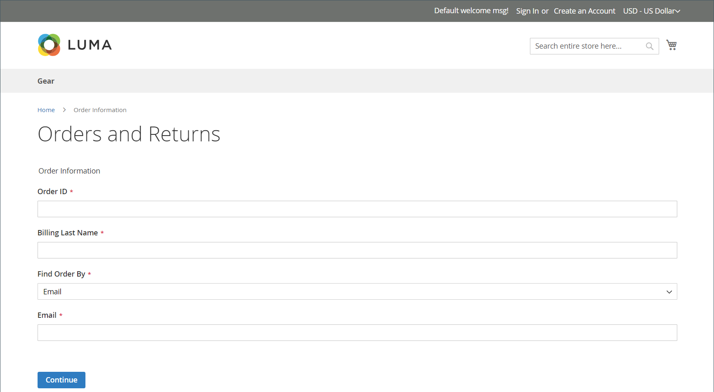

# Restituisce l’esperienza della vetrina

{{ee-feature}}

I clienti possono utilizzare una delle seguenti opzioni per richiedere un RMA dalla vetrina:

- [Widget ordini e restituzioni](../content-design/widget-orders-returns.md) nella barra laterale
- _Ordini e restituzioni_ collegamento nel piè di pagina

Come best practice, è consigliabile includere una descrizione dei requisiti e dei processi RMA nella politica del Servizio Clienti.

>[!NOTE]
>
>Se desideri raccogliere ulteriori informazioni relative alle restituzioni, puoi aggiungere i tuoi [attributi di restituzione](attributes-returns.md) personalizzati.

Tutte le informazioni RMA del cliente vengono visualizzate nella pagina **[!UICONTROL My Returns]** nel dashboard dell&#39;account del cliente.

{width="700" zoomable="yes"}

## Richiedi un RMA

Il cliente completa i seguenti passaggi nella vetrina per inviare una RMA:

1. Nel piè di pagina, fa clic su **[!UICONTROL Orders and Returns]**.

1. Immette le informazioni sull&#39;ordine:

   - ID ordine
   - Cognome fatturazione
   - E-mail

1. Clic su **[!UICONTROL Continue]**.

   {width="700" zoomable="yes"}

1. Sotto la data dell&#39;ordine, fa clic su **[!UICONTROL Return]**.

   {width="700" zoomable="yes"}

1. Seleziona l&#39;elemento da restituire e immette **[!UICONTROL Quantity to Return]**.

1. Imposta **[!UICONTROL Resolution]** su uno dei seguenti elementi:

   - Exchange
   - [Rimborso](../customers/refunds-customer-account.md)
   - [Credito store](../customers/store-credit-using.md)

1. Imposta **[!UICONTROL Item Condition]** su uno dei seguenti elementi:

   - `Unopened`
   - `Opened`
   - `Damaged`

1. Imposta **[!UICONTROL Reason to Return]** su uno dei seguenti elementi:

   - `Wrong Color`
   - `Wrong Size`
   - `Out of Service`
   - `Other`

   {width="700" zoomable="yes"}

1. Se necessario, imposta **[!UICONTROL Contact Email Address]** e **[!UICONTROL Comments]**.

   >[!NOTE]
   >
   >Se l&#39;ordine contiene diversi articoli e il cliente desidera restituire un altro articolo, può fare clic su **[!UICONTROL Add Item To Return]**, selezionare l&#39;articolo e quindi impostare tutte le opzioni menzionate.

1. Clic su **[!UICONTROL Submit]**.
