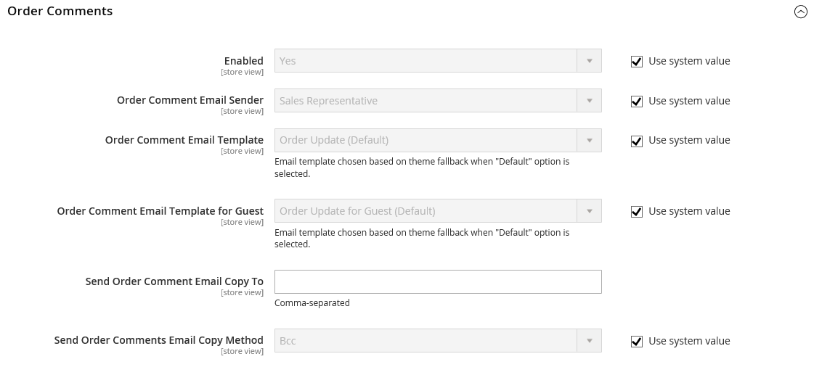

# E-mail di vendita

Diversi messaggi e-mail vengono attivati dagli eventi relativi a un ordine e la configurazione è simile. Accertati di identificare il contatto del negozio che viene visualizzato come mittente del messaggio, il modello di e-mail da utilizzare e chiunque debba ricevere una copia del messaggio. Le e-mail di vendita possono essere inviate quando attivate da un evento o da un intervallo predeterminato.

{width="600" zoomable="yes"}

## Passaggio 1: Aggiornare i modelli e-mail

Assicurati di aggiornare il modello [intestazione e-mail](../systems/email-template-custom.md#header-template) in modo che rifletta il tuo marchio e gli altri modelli e-mail in base alle esigenze. Per un elenco completo dei modelli, vedere [Modelli e-mail](../systems/email-templates.md).

## Passaggio 2: Scegli il tipo di trasmissione

1. Nella barra laterale _Admin_, passa a **[!UICONTROL Stores]** > _[!UICONTROL Settings]_>**[!UICONTROL Configuration]**.

1. Nel pannello a sinistra, espandi **[!UICONTROL Sales]** e scegli **[!UICONTROL Sales Emails]**.

1. Se necessario, espandere  nella sezione **[!UICONTROL General Settings]**.

   {width="600" zoomable="yes"}

   Per impostazione predefinita, l&#39;invio asincrono è impostato su `Disable`. Per modificare l&#39;impostazione di sistema, deselezionare la casella di controllo **[!UICONTROL Use system value]** e impostare **[!UICONTROL Asynchronous sending]** su una delle seguenti opzioni:

   - `Disable` - Invia e-mail di vendita quando attivato da un evento.
   - `Enable` - Invia e-mail di vendita a intervalli regolari predeterminati.

   Il supporto Adobe Commerce consiglia di abilitare l’invio asincrono per migliorare le prestazioni di posizionamento dell’ordine. Consulta [Best practice di configurazione per l&#39;elaborazione degli ordini](https://experienceleague.adobe.com/docs/commerce-operations/implementation-playbook/best-practices/maintenance/order-processing-configuration.html?lang=it) nella Knowledge Base di supporto di Adobe Commerce.

## Passaggio 3: Completa i dettagli di ogni messaggio e-mail di vendita

1. Se necessario, espandere  nella sezione **[!UICONTROL Order]**.

   {width="600" zoomable="yes"}

1. Verificare che **[!UICONTROL Enabled]** sia impostato su `Yes` (impostazione predefinita).

1. Impostare **[!UICONTROL New Order Confirmation Email]** sul contatto dell&#39;archivio che viene visualizzato come mittente del messaggio.

1. Impostare **[!UICONTROL New Order Confirmation Template]** sul modello utilizzato per l&#39;e-mail inviata ai clienti registrati.

1. Imposta **[!UICONTROL New Order Confirmation Template for Guest]** sul modello utilizzato per l&#39;e-mail inviata agli ospiti che non hanno un account con il tuo store.

1. Per **[!UICONTROL Send Order Email Copy To]**, immettere l&#39;indirizzo di posta elettronica di tutti coloro che devono ricevere una copia del nuovo indirizzo di posta elettronica dell&#39;ordine.

   Se invii una copia a più destinatari, separa ogni indirizzo con una virgola.

1. Imposta **[!UICONTROL Send Order Email Copy Method]** su uno dei seguenti:

   - `Bcc` - Invia una _copia di cortesia cieca_ includendo il destinatario nell&#39;intestazione della stessa e-mail inviata al cliente. Il destinatario Ccn non è visibile al cliente.
   - `Separate Email` - Invia la copia come messaggio e-mail separato.

1. Espandere  nella sezione **[!UICONTROL Order Comments]** e ripetere i passaggi seguenti.

   {width="600" zoomable="yes"}

1. Completa la configurazione per i restanti tipi di e-mail di vendita:

   - **[!UICONTROL Invoice]** / **[!UICONTROL Invoice Comments]**
   - **[!UICONTROL Shipment]** / **[!UICONTROL Shipment Comments]**
   - **[!UICONTROL Credit Memo]** / **[!UICONTROL Credit Memo Comments]**

1. Al termine, fare clic su **[!UICONTROL Save Config]**.

   Quando richiesto, fare clic sul collegamento [Gestione cache](../systems/cache-management.md) nel messaggio nella parte superiore dell&#39;area di lavoro e cancellare tutte le cache non valide.
