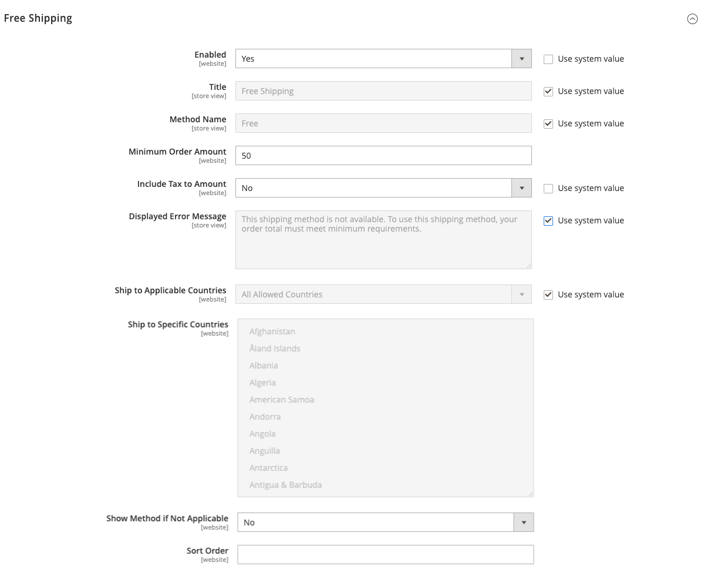

# Spedizione gratuita

_Spedizione gratuita_ è una delle promozioni più efficaci che si possono offrire. Può essere basato su un acquisto minimo o impostato come [regola prezzo carrello](../merchandising-promotions/price-rules-cart.md) che viene applicato quando viene soddisfatta una serie di condizioni. Se entrambi si applicano allo stesso ordine, l’impostazione di configurazione ha la precedenza sulla regola del carrello.

>[!NOTE]
>
>Controlla la configurazione del vettore di spedizione per eventuali impostazioni aggiuntive necessarie per la spedizione gratuita.

## Passaggio 1: configurare la spedizione gratuita

1. Il giorno _Amministratore_ barra laterale, vai a **[!UICONTROL Stores]** > _[!UICONTROL Settings]_>**[!UICONTROL Configuration]**.

1. Nel pannello a sinistra, espandi **[!UICONTROL Sales]** e scegli **[!UICONTROL Delivery Methods]**.

1. Espandi  il **[!UICONTROL Free Shipping]** sezione.

   >[!NOTE]
   >
   >Se necessario, deselezionare **[!UICONTROL Use system value]** per modificare le seguenti impostazioni come descritto.

1. Imposta **[!UICONTROL Enabled]** a `Yes`.

1. Per **[!UICONTROL Title]**, immettere un titolo che identifichi il metodo di spedizione gratuita durante il pagamento e un **[!UICONTROL Method Name]** per descriverlo.

1. Per **[!UICONTROL Minimum Order Amount]**, immettere il valore totale minimo idoneo per la spedizione gratuita.

   >[!TIP]
   >
   >Per utilizzare la spedizione gratuita con [tariffe delle tabelle](shipping-table-rate.md), rendere _[!UICONTROL Minimum Order Amount]_talmente alto che non si incontra mai. L&#39;utilizzo di questo valore elevato impedisce l&#39;applicazione della spedizione gratuita, a meno che non venga attivata da una regola di prezzo.

1. Imposta **[!UICONTROL Include Tax to Amount]**:

   - `Yes` - Include l&#39;imposta durante il calcolo dell&#39;importo minimo dell&#39;ordine (Subtotale + Imposta - Sconto).
   - `No` - Non include l&#39;imposta durante il calcolo dell&#39;importo minimo dell&#39;ordine (Subtotale - Sconto).

   {width="600" zoomable="yes"}

1. Per **[!UICONTROL Displayed Error Message]**, inserisci il messaggio da visualizzare se la spedizione gratuita non è più disponibile.

1. Imposta **[!UICONTROL Ship to Applicable Countries]**:

   - `All Allowed Countries` - Clienti di tutti [paesi](../getting-started/store-details.md#country-options) specificato nella configurazione del negozio può utilizzare la spedizione gratuita.

   - `Specific Countries` - Dopo aver scelto questo valore, il _[!UICONTROL Ship to Specific Countries]_viene visualizzato. Selezionare ogni paese nell&#39;elenco in cui è possibile utilizzare la spedizione gratuita.

1. Imposta **[!UICONTROL Show Method if Not Applicable]**:

   - `Yes` - Mostra sempre il metodo di Spedizione gratuita, anche quando non applicabile.
   - `No` - Mostra il metodo Spedizione gratuita solo quando applicabile.

1. Per **[!UICONTROL Sort Order]**, immettere il numero che determina la posizione della spedizione gratuita nell&#39;elenco dei metodi di consegna durante il pagamento.

   `0` = innanzitutto, `1` = secondo, `2` = terzo e così via.

1. Clic **[!UICONTROL Save Config]**.

## Passaggio 2: abilitare la spedizione gratuita nella configurazione del vettore

Assicurati di completare tutte le configurazioni necessarie per ogni vettore che intendi utilizzare per la spedizione gratuita. Ad esempio, se [Configurazione gruppo di continuità](ups.md) se non è stato completato, aggiorna le seguenti impostazioni per abilitare e configurare la spedizione gratuita.

1. In _[!UICONTROL Delivery Methods]_, espandere  il **[!UICONTROL UPS]**sezione.

1. Imposta **[!UICONTROL Free Method]** a `UPS Ground` o un altro tipo che si desidera designare per la spedizione gratuita.

1. Per richiedere un ordine minimo per la spedizione gratuita, impostare **[!UICONTROL Enable Free Shipping Threshold]** a `Enable`.

   Se si sceglie di utilizzare un ordine minimo, inserire l&#39;importo richiesto per **[!UICONTROL Free Shipping Amount Threshold]**.

1. Clic **[!UICONTROL Save Config]**.
