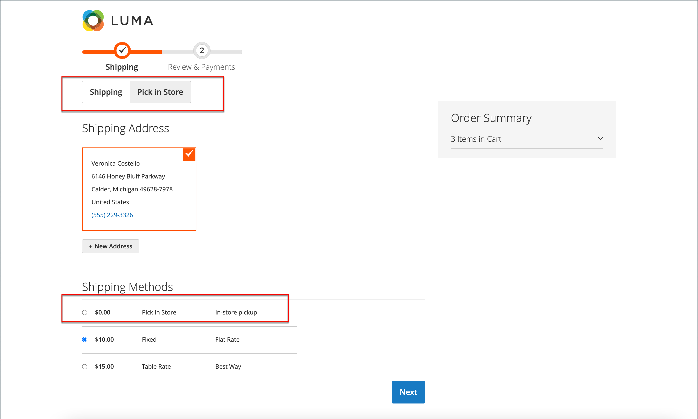

# Consegna in-store

Con il metodo di consegna in-store, il cliente può selezionare un’origine da utilizzare come luogo di prelievo durante il pagamento.

{width="700" zoomable="yes"}

Durante il pagamento nella vetrina:

1. Il cliente fa clic su **[!UICONTROL Pick In Store]** o seleziona il metodo di spedizione _[!UICONTROL In-Store Pickup Delivery]_.
1. Viene visualizzata la scheda Estrazione di _[!UICONTROL Pick In Store]_.

Quando il cliente ha un indirizzo o ha compilato in precedenza il modulo dell&#39;indirizzo di spedizione prima di passare alla scheda _[!UICONTROL Pick In Store]_:

- L&#39;origine più vicina all&#39;indirizzo del cliente entro il raggio configurato viene automaticamente preselezionata come negozio di ritiro.
- Quando il cliente fa clic su **[!UICONTROL Select Other]**, viene aperto il modulo di ricerca _[!UICONTROL Select Store]_. Nell&#39;elenco vengono visualizzati solo gli archivi entro la distanza (raggio) configurata per l&#39;archivio preselezionato. Tutti i negozi dell&#39;elenco sono ordinati in base alla distanza dal negozio preselezionato.
- Quando il cliente immette un codice postale o un nome di città nel campo di ricerca, nell’elenco vengono visualizzati solo gli archivi entro la distanza configurata (raggio) dalla posizione cercata. Tutti gli archivi dell&#39;elenco vengono ordinati in base alla distanza dalla posizione cercata.
- Quando il cliente cancella il codice postale o il nome della città dal campo di ricerca, tutti i negozi di ritiro assegnati ai prodotti nel carrello vengono mostrati al cliente. Tutti gli archivi dell&#39;elenco vengono ordinati in ordine crescente rispetto ai codici sorgente senza limitazioni di distanza (raggio).

Se il cliente non ha un indirizzo o non ha compilato il modulo dell&#39;indirizzo di spedizione prima di passare alla scheda _[!UICONTROL Pick In Store]_:

- Nella pagina viene visualizzato il messaggio _Impossibile preselezionare il percorso di prelievo in base alle informazioni disponibili_.
- Quando il cliente fa clic su **[!UICONTROL Select Store]**, viene aperto il modulo di ricerca _[!UICONTROL Select Store]_.
- Tutti i negozi di ritiro assegnati ai prodotti nel carrello vengono visualizzati in ordine crescente dei codici sorgente senza limitazioni di distanza (raggio).
- Quando il cliente immette un codice postale o un nome di città nel campo di ricerca, nell’elenco vengono visualizzati solo gli archivi entro la distanza configurata (raggio) dalla posizione cercata. Tutti gli archivi dell&#39;elenco vengono ordinati in base alla distanza dalla posizione cercata.

## Prima della configurazione

- Assicuratevi di avere un magazzino e una sorgente non di default. Per ulteriori informazioni su come configurare un&#39;origine come percorso di prelievo, vedere [Aggiungere un&#39;origine](../inventory-management/sources-add.md).
- Assicurarsi di aver configurato un algoritmo di priorità della distanza. Per ulteriori informazioni, vedere [Configurare l&#39;algoritmo di priorità della distanza](../inventory-management/distance-priority-algorithm.md).
- Assicurati di aver [scaricato e importato](../inventory-management/cli.md#import-geocodes) tutti i geocodici necessari per il calcolo offline.
- Verifica di aver configurato le impostazioni di [Calcolo destinazione imposta predefinita](../configuration-reference/sales/tax.md#default-tax-destination-calculation).

>[!IMPORTANT]
>
>**Nella vetrina, i risultati della ricerca vengono filtrati in base alla distanza (raggio) per visualizzare i risultati rilevanti:**  
>Se il cliente dispone di un indirizzo di spedizione, l&#39;ubicazione di base per il calcolo della distanza (raggio) viene ricavata dall&#39;indirizzo di spedizione.  
>Se il cliente non dispone di un indirizzo di spedizione, la posizione di base per calcolare la distanza viene ricavata dalle impostazioni [Calcolo destinazione imposta predefinita](../configuration-reference/sales/tax.md#default-tax-destination-calculation). Queste impostazioni sono impostate per la visualizzazione Store ed è necessario configurare le impostazioni di Calcolo destinazione imposta predefinita per garantire il corretto funzionamento della ricerca nel negozio di ritiro.

## Configurare la consegna in-store

Innanzitutto, verifica che la consegna in-store sia abilitata.

1. Nella barra laterale _Admin_, passa a **[!UICONTROL Stores]** > _[!UICONTROL Settings]_>**[!UICONTROL Configuration]**.

1. Nel pannello a sinistra, espandi **[!UICONTROL Sales]** e scegli **[!UICONTROL Delivery Methods]**.

1. Espandere  nella sezione **[!UICONTROL In-Store Delivery]**.

   {width="600" zoomable="yes"}

1. Imposta **[!UICONTROL Enabled]** su `Yes`.

   >[!NOTE]
   >
   >Se necessario, deselezionare la casella di controllo **[!UICONTROL Use system value]** per modificare il valore predefinito di qualsiasi campo.

1. Immettere **[!UICONTROL Method Name]** che descrive il metodo di calcolo utilizzato per produrre una stima di spedizione.

   Il nome del metodo viene visualizzato accanto alla tariffa stimata calcolata nel carrello.

1. Immetti **[!UICONTROL Title]** che desideri visualizzare per la sezione _Consegna in-store_ durante l&#39;estrazione.

   Il titolo predefinito è `In-Store Pickup Delivery`.

1. Per addebitare ai clienti il servizio di ritiro in negozio, immettere la tariffa nel campo **[!UICONTROL Price]**.

1. Immetti **[!UICONTROL Search Radius]** in chilometri per la ricerca del luogo di ritiro del negozio al momento del pagamento.

1. Per **[!UICONTROL Displayed Error Message]**, immettere il messaggio che viene visualizzato se la consegna in-store non è più disponibile.

   Il messaggio predefinito è `In-Store Delivery is not available. To use this delivery method, please contact us.`

1. Fare clic su **[!UICONTROL Save Config]**.
