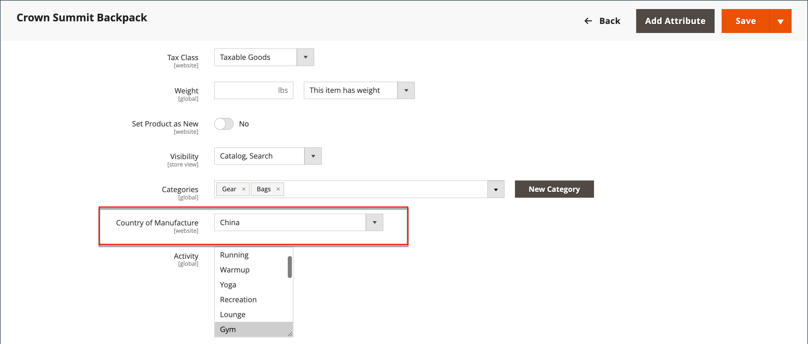

# Configurare le etichette di spedizione

Le seguenti impostazioni devono essere effettuate a livello di prodotto e nella configurazione di ciascun gestore utilizzato per stampare le etichette. Per stampare le etichette, tutti i gestori devono aprire un account. Quindi, completa la configurazione nel tuo archivio per ogni gestore che intendi utilizzare.

## Requisiti del vettore

| [!UICONTROL Carrier] | Requisiti |
|-------|--------|
| [USP](usps.md) | Richiede un account USPS. A partire dal 23 febbraio 2018, USPS richiede che tutte le etichette di spedizione includano l&#39;affrancatura. |
| [UPS](ups.md) | Richiede un account UPS. Le etichette di spedizione sono disponibili solo per le spedizioni che hanno origine nelle credenziali specifiche degli Stati Uniti sono necessarie per i negozi al di fuori degli Stati Uniti. |
| [FedEx](fedex.md) | Richiede un account FedEx. Per i negozi al di fuori degli Stati Uniti, le etichette di spedizione sono supportate solo per le spedizioni internazionali. FedEx non consente spedizioni nazionali al di fuori degli Stati Uniti |
| [DHL](dhl.md) | Richiede un account DHL. Le etichette di spedizione sono supportate solo per le spedizioni originarie degli Stati Uniti |

{style="table-layout:auto"}

## Fase 1: Verificare il paese di produzione

Il paese di fabbricazione è richiesto per tutti i prodotti spediti a livello internazionale da USPS e FedEx. Se hai molti prodotti da aggiornare, puoi: [importa](../systems/data-import.md) o utilizzare la griglia Inventario per aggiornare più record.

1. Il giorno _Amministratore_ barra laterale, vai a **[!UICONTROL Catalog]** > **[!UICONTROL Products]**.

1. Aggiornare il record dell&#39;etichetta di spedizione utilizzando uno dei metodi seguenti.

### Metodo 1: aggiornamento di un singolo record

1. Nella griglia, individua il prodotto da aggiornare e apri in modalità di modifica.

1. Aggiornare il **Paese di fabbricazione** secondo necessità.

   {width="700" zoomable="yes"}

1. Clic **[!UICONTROL Save]**.

### Metodo 2: aggiornamento di più record

1. Nella griglia, seleziona la casella di controllo di ciascun prodotto da aggiornare.

   Ad esempio, tutti i prodotti fabbricati in Cina.

1. Imposta il **[!UICONTROL Actions]** controllo a `Update Attributes` e fai clic su **[!UICONTROL Submit]**.

1. In _Aggiorna attributi_ modulo, trova il **Paese di fabbricazione** e selezionare il **Cambia** casella di controllo.

1. Scegli il paese.

1. Clic **[!UICONTROL Save]**.

## Passaggio 2 Verifica le informazioni di archiviazione

1. Il giorno _Amministratore_ barra laterale, vai a **[!UICONTROL Stores]** > _[!UICONTROL Settings]_>**[!UICONTROL Configuration]**.

1. Nel pannello a sinistra, espandi **[!UICONTROL Sales]** e scegli **[!UICONTROL Shipping Settings]**.

1. Espandi  il **[!UICONTROL Origin]** e verificare che i campi seguenti siano completi:

   - **[!UICONTROL Street Address]** - Via e numero civico del luogo di spedizione. Ad esempio, l&#39;ubicazione della società o del magazzino. Questo campo è obbligatorio per le etichette di spedizione.
   - **[!UICONTROL Street Address Line 2]** - Eventuali informazioni aggiuntive sull’indirizzo, come il pavimento o l’ingresso. Si consiglia di utilizzare questo campo.

   {width="600" zoomable="yes"}

1. In _Vendite_ nel pannello a sinistra, scegli **[!UICONTROL Delivery Methods]**.

1. Espandi  il **[!UICONTROL USPS]** e verificare che i campi seguenti siano completi:

   - **[!UICONTROL Secure Gateway URL]** - Il sistema immette automaticamente l&#39;URL del gateway.
   - **[!UICONTROL Password]** - La password viene fornita da USPS e consente l&#39;accesso al sistema tramite i servizi Web.
   - **Lunghezza, Larghezza, Altezza, Girth** - Le dimensioni predefinite del pacchetto. Per visualizzare questi campi, impostare **[!UICONTROL Size]** a `Large`.

1. Espandi  il **FedEx** e verificare che i campi seguenti siano completi:

   - Numero misuratore
   - Chiave
   - Password

   Queste informazioni sono fornite dal gestore e devono poter accedere al sistema tramite i servizi Web.

1. Nel pannello a sinistra, espandi **[!UICONTROL General]** e scegli **[!UICONTROL General]** sotto.

1. Espandi  il **[!UICONTROL Store Information]** e verificare che i campi seguenti siano completi:

   - **[!UICONTROL Store Name]** : nome della visualizzazione store o store.
   - **[!UICONTROL Store Contact Telephone]** - Il numero di telefono del contatto principale per la visualizzazione del negozio o del negozio.
   - **[!UICONTROL Country]** - Il paese in cui ha sede il tuo negozio.
   - **[!UICONTROL VAT Number]** - Se applicabile, il numero di imposta sul valore aggiunto del tuo negozio. (Non richiesto per i negozi con sede negli Stati Uniti)
   - **[!UICONTROL Store Contact Address]** - Indirizzo del contatto principale per la visualizzazione del negozio o del negozio.

1. Se si dispone di più archivi e le informazioni di contatto sono diverse da quelle predefinite, impostare **[!UICONTROL Store View]** per ciascuno di essi e verifica che le informazioni siano complete.

   Se le informazioni non sono presenti, quando si tenta di stampare le etichette viene visualizzato un errore.

   {width="600" zoomable="yes"}

1. Clic **[!UICONTROL Save Config]**.
