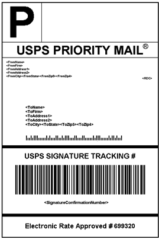

# Etichette di spedizione

Commerce include un elevato livello di integrazione con i principali vettori di spedizione, che consente di accedere ai sistemi di spedizione dei vettori per tenere traccia degli ordini, creare etichette di spedizione e altro ancora. Le etichette di spedizione possono essere create per le spedizioni regolari e i prodotti con autorizzazione alla restituzione. Oltre alle informazioni fornite dal vettore di spedizione, l&#39;etichetta include anche il numero di ordine Commerce, il numero del pacchetto e la quantità totale di pacchetti per la spedizione.

{width="300"}

- [Configurare le etichette di spedizione](shipping-label-configure.md)
- [Creare etichette e pacchetti di spedizione](shipping-label-create.md)

## Flusso di lavoro etichetta spedizione

Le etichette di spedizione possono essere prodotte al momento della creazione di una spedizione o successivamente. Le etichette di spedizione vengono memorizzate in formato PDF e scaricate nel computer.

### Passaggio 1: il commerciante invia la richiesta di etichetta di spedizione

Il gestore del negozio completa le informazioni necessarie per generare le etichette e invia la richiesta.

### Passaggio 2: richiesta inviata al vettore

Commerce contatta il vettore di spedizione e crea un ordine nel sistema del vettore. Viene creato un ordine separato per ogni pacchetto spedito.

### Passaggio 3: il gestore invia l’etichetta e il numero di tracciamento

Il vettore invia l&#39;etichetta di spedizione e il numero di registrazione per la spedizione.

- Una singola spedizione con più pacchetti riceve più etichette di spedizione.

- Se si generano più volte le stesse etichette di spedizione, i numeri di registrazione originali vengono mantenuti.

- Per i prodotti restituiti con numeri RMA, i vecchi numeri di tracciamento vengono sostituiti da nuovi.

### Passaggio 4: l&#39;esercente scarica e stampa l&#39;etichetta

Una volta generata l&#39;etichetta di spedizione, la nuova spedizione viene salvata e l&#39;etichetta può essere stampata. Se non è possibile creare l&#39;etichetta di spedizione a causa di problemi di connessione o per altri motivi, la spedizione non viene creata. A seconda delle impostazioni del browser, è possibile aprire e stampare il file PDF. Ogni etichetta viene visualizzata in una pagina separata di PDF.
