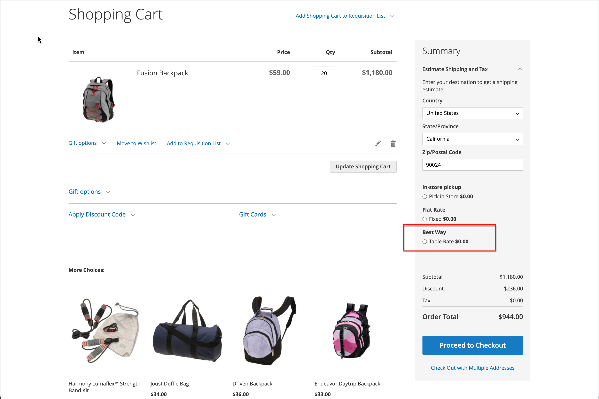

# Tariffa tabella spedizione

Il metodo di spedizione _tariffa tabella_ fa riferimento a una tabella di dati per calcolare le tariffe di spedizione in base a una combinazione di condizioni, tra cui:

- Peso rispetto alla destinazione
- Prezzo v. destinazione
- Numero di elementi rispetto alla destinazione

Ad esempio, se il tuo magazzino è a Los Angeles, spedire a San Diego costa meno che in Vermont. Puoi utilizzare le tariffe di spedizione per trasferire i risparmi ai tuoi clienti.

I dati utilizzati per calcolare le tariffe delle tabelle vengono preparati in un foglio di calcolo e importati nell&#39;archivio. Quando il cliente richiede un preventivo, i risultati vengono visualizzati nella sezione delle stime di spedizione del carrello.

>[!NOTE]
>
>È possibile attivare un solo set di dati sulla velocità della tabella alla volta.

{width="700" zoomable="yes"}

## Passaggio 1: completare le impostazioni predefinite

Il primo passo è quello di completare le impostazioni predefinite per le tariffe della tabella. Puoi completare questo passaggio senza modificare l’ambito della configurazione.

1. Nella barra laterale _Admin_, passa a **[!UICONTROL Stores]** > _[!UICONTROL Settings]_>**[!UICONTROL Configuration]**.

1. Nella sezione _[!UICONTROL Sales]_&#x200B;del pannello sinistro, scegli **[!UICONTROL Delivery Methods]**.

1. Espandere  nella sezione **[!UICONTROL Table Rates]**.

   >[!NOTE]
   >
   >Se necessario, deselezionare la casella di controllo **[!UICONTROL Use system value]** per modificare le impostazioni seguenti come descritto.

   {width="600" zoomable="yes"}

1. Imposta **[!UICONTROL Enabled]** su `Yes`.

1. Immettere **[!UICONTROL Title]** che si desidera visualizzare per la sezione tariffe tabella durante l&#39;estrazione.

   Il titolo predefinito è `Best Way`.

1. Immettere **[!UICONTROL Method Name]** che si desidera visualizzare come etichetta accanto alla tariffa calcolata nel carrello.

1. Impostare **[!UICONTROL Condition]** su uno dei seguenti metodi di calcolo:

   - `Weight v. Destination`
   - `Price v. Destination`
   - `Number of Items v. Destination`

1. Per gli ordini che includono prodotti virtuali, impostare **[!UICONTROL Include Virtual Products in Price Calculation]** su `Yes` per includere i prodotti virtuali nel calcolo.

   >[!NOTE]
   >
   >Poiché i prodotti virtuali, ad esempio i servizi, non hanno peso, non possono modificare il risultato di un calcolo basato sulla condizione Peso rispetto alla destinazione. Tuttavia, i prodotti virtuali possono modificare il risultato di un calcolo basato sulla condizione Prezzo v. Destinazione o Numero di articoli vs. Destinazione.

1. Configura le opzioni relative alle commissioni di gestione in base alle tue esigenze.

   La tariffa di imballaggio è facoltativa e viene visualizzata come un costo aggiuntivo che viene aggiunto alle spese di spedizione. Se si desidera includere una tariffa di imballaggio, eseguire le operazioni seguenti:

   - Imposta **[!UICONTROL Calculate Handling Fee]**:

      - `Fixed`
      - `Percent`

   - Immettere la tariffa **[!UICONTROL Handling Fee]** in base al metodo utilizzato per calcolare la tariffa.

     Ad esempio, se l&#39;addebito è basato su una tariffa fissa, immettere l&#39;importo come decimale, ad esempio `4.90`. Tuttavia, se la commissione di gestione si basa su una percentuale dell&#39;ordine, immettere l&#39;importo come percentuale. Ad esempio, se si sta addebitando il 6% dell&#39;ordine, immettere il valore come `.06`.

1. Se necessario, modificare **[!UICONTROL Displayed Error Message]**.

   Questa casella di testo è preimpostata con un messaggio predefinito, ma è possibile immettere un messaggio diverso da visualizzare se questo metodo di consegna non è più disponibile.

1. Imposta **[!UICONTROL Ship to Applicable Countries]**:

   - `All Allowed Countries` - I clienti di tutti i [paesi](../getting-started/store-details.md#country-options) specificati nella configurazione dell&#39;archivio possono utilizzare questo metodo di consegna.
   - `Specific Countries` - Quando si sceglie questa opzione, viene visualizzato l&#39;elenco _[!UICONTROL Ship to Specific Countries]_. Seleziona ogni paese nell’elenco in cui può essere utilizzato questo metodo di consegna.

1. Imposta **[!UICONTROL Show Method if Not Applicable]** su `Yes` se vuoi mostrare le tariffe della tabella sempre

1. Per **[!UICONTROL Sort Order]**, immettere un numero per determinare la sequenza di visualizzazione della funzione Tasso tabella per la spedizione se elencata con altri metodi di consegna durante l&#39;estrazione.

   `0` = primo, `1` = secondo, `2` = terzo e così via.

1. Fare clic su **[!UICONTROL Save Config]**.

## Passaggio 2: preparare i dati della velocità della tabella

1. Nell&#39;angolo in alto a sinistra, impostare **[!UICONTROL Store View]** su `Main Website` o su qualsiasi altro sito Web in cui si applica la configurazione.

   >[!NOTE]
   >
   >Se necessario, deselezionare la casella di controllo **[!UICONTROL Use system value]** per modificare le impostazioni seguenti come descritto.

1. Modifica **[!UICONTROL Condition]** in base alle esigenze.

1. Fare clic su **[!UICONTROL Export CSV]**.

   {width="700" zoomable="yes"}

1. Salva il file `tablerates.csv` nel sistema.

1. Aprire il file in un&#39;applicazione per fogli di calcolo.

1. Completare la tabella con i valori appropriati per la condizione di calcolo della spedizione.

   - Utilizzare un asterisco (*) come carattere jolly che rappresenta tutti i valori possibili in qualsiasi categoria.
   - La colonna _[!UICONTROL Country]_&#x200B;deve contenere un [codice di tre caratteri valido][1] per ogni riga.
   - Ordina i dati per _[!UICONTROL Region/State]_&#x200B;in modo che le posizioni specifiche si trovino nella parte superiore dell&#39;elenco e le posizioni dei caratteri jolly nella parte inferiore. Questo metodo elabora le regole prima con i valori assoluti e successivamente con i valori jolly.
   - Gli intervalli di codici postali o Zip non sono supportati. Utilizzare un asterisco (*) per consentire tutti i codici all&#39;interno dell&#39;area o dello stato oppure specificare un singolo codice per una posizione specifica nella colonna _[!UICONTROL Zip/Postal Code]_.
   - I valori nella colonna _[!UICONTROL Weight (and above)]_&#x200B;possono avere un massimo di quattro posizioni decimali (ad esempio `2.5075`). L’utilizzo di più posizioni decimali nei dati causa un errore di importazione.

   {width="500"}

1. Salva il file `tablerates.csv`.

## Passaggio 3: importare i dati dei tassi della tabella

1. Torna alla sezione **[!UICONTROL Table Rates]** della configurazione dell&#39;archivio.

1. Nell&#39;angolo in alto a sinistra, impostare **[!UICONTROL Store View]** sul sito Web in cui viene utilizzato questo metodo.

1. Per **[!UICONTROL Import]**, fai clic su **[!UICONTROL Choose File]** e seleziona il file `tablerates.csv` completato per importare le tariffe.

   {width="600" zoomable="yes"}

1. Fare clic su **[!UICONTROL Save Config]**.

## Passaggio 4: verificare le tariffe

Per verificare che i dati della tariffa della tabella siano corretti, eseguire il processo di pagamento con diversi indirizzi diversi per assicurarsi che le tariffe di spedizione e imballaggio siano calcolate correttamente.

### Esempio 1: prezzo e destinazione

In questo esempio viene utilizzata la condizione Prezzo v. Destinazione per creare una serie di tre diverse tariffe di spedizione in base all&#39;importo del subtotale dell&#39;ordine per gli Stati Uniti continentali, l&#39;Alaska e le Hawaii. L&#39;asterisco (*) è un carattere jolly che rappresenta tutti i valori.

| PAESE | REGIONE/STATO | CAP | SUBTOTALE ORDINE (e versioni successive) | PREZZO DI SPEDIZIONE |
|--- |--- |--- |--- |--- |
| Stati Uniti | CIAO | * | 100 | 10 |
| Stati Uniti | CIAO | * | 50 | 15 |
| Stati Uniti | CIAO | * | 0 | 20 |
| Stati Uniti | AK | * | 100 | 10 |
| Stati Uniti | AK | * | 50 | 15 |
| Stati Uniti | AK | * | 0 | 20 |
| Stati Uniti | * | * | 100 | 5 |
| Stati Uniti | * | * | 50 | 10 |
| Stati Uniti | * | * | 0 | 15 |

{style="table-layout:auto"}

### Esempio 2: peso e destinazione

In questo esempio viene utilizzata la condizione Peso rispetto alla destinazione per creare tariffe di spedizione diverse in base al peso dell&#39;ordine.

| PAESE | REGIONE/STATO | CAP | PESO (e superiore) | PREZZO DI SPEDIZIONE |
|--- |--- |--- |--- |--- |
| AUS | NT | * | 9 | 39,95 |
| AUS | NT | * | 0 | 19,95 |
| AUS | VIC | * | 9 | 19,95 |
| AUS | VIC | * | 0 | 5,95 |
| AUS | WA | * | 9 | 39,95 |
| AUS | WA | * | 0 | 19,95 |
| AUS | * | * | 9 | 29,95 |
| AUS | * | * | 0 | 9,95 |

{style="table-layout:auto"}

### Esempio 3: limitare la spedizione gratuita agli Stati Uniti continentali

1. Creare un file `tablerates.csv` che includa tutte le destinazioni dello stato per le quali si desidera fornire la spedizione gratuita.

1. Completa la configurazione della velocità della tabella con le seguenti impostazioni:

   | Impostazione | Valore |
   |----------|-------|
   | [!UICONTROL Condition] | `Price v. Destination` |
   | [!UICONTROL Method Name] | `Free Shipping` |
   | [!UICONTROL Ship to Applicable Countries] | `Specific Countries` |
   | [!UICONTROL Ship to Specific Countries] | `Select only United States` |
   | [!UICONTROL Show method if not applicable] | `No` |

   {style="table-layout:auto"}

1. Nell&#39;angolo in alto a sinistra, impostare **[!UICONTROL Store View]** su `Main Website` o su qualsiasi altro sito Web in cui si applica la configurazione.

1. Per **[!UICONTROL Import]**, fai clic su **[!UICONTROL Choose File]** e seleziona il file `tablerates.csv` completato per importare le tariffe.

[1]: https://en.wikipedia.org/wiki/ISO_3166-1_alpha-3
