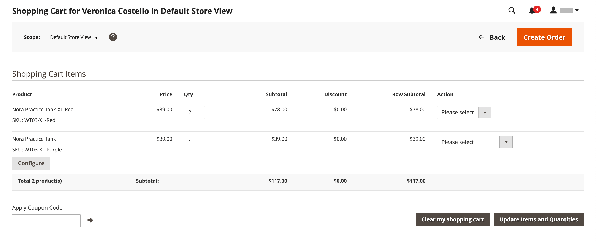
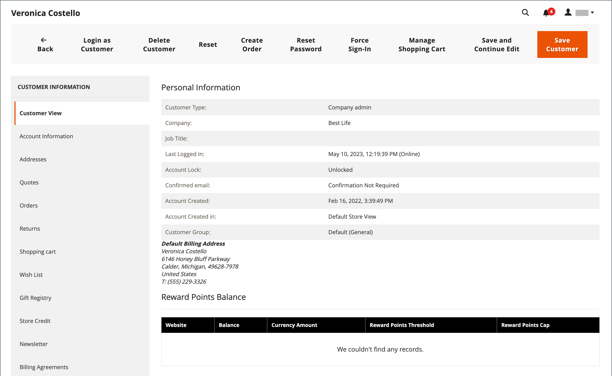
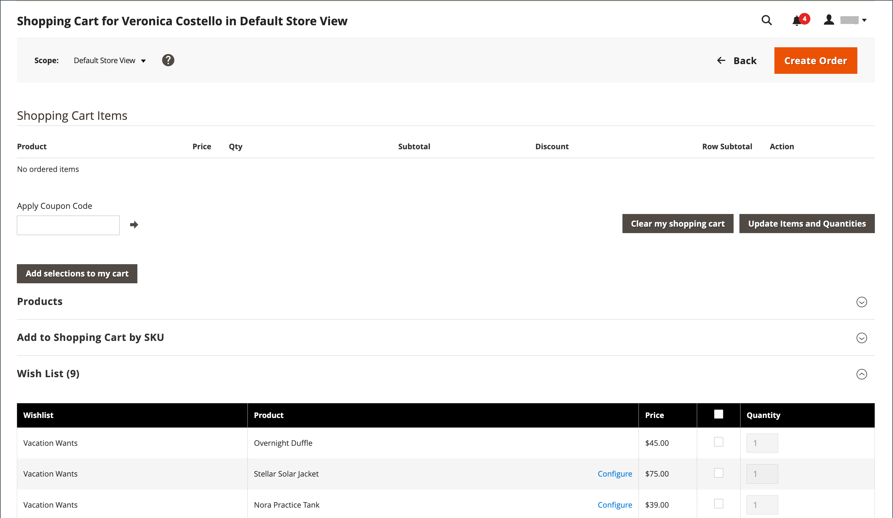
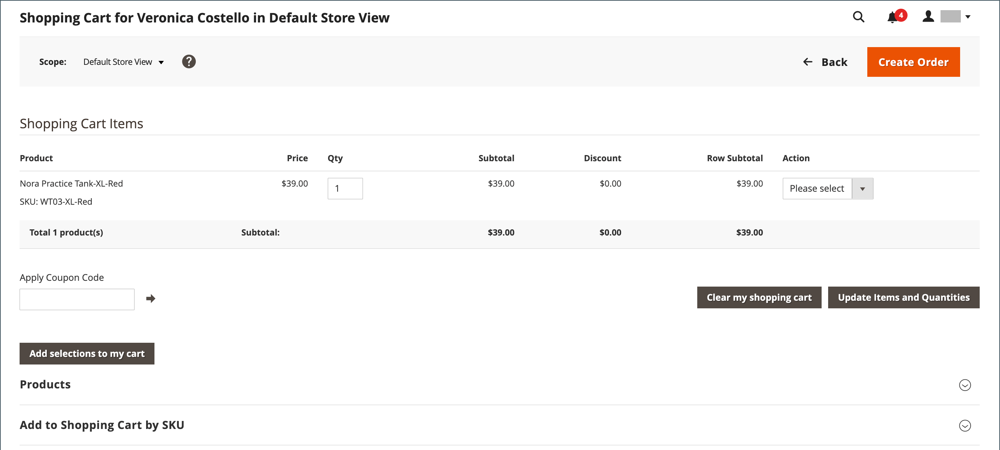
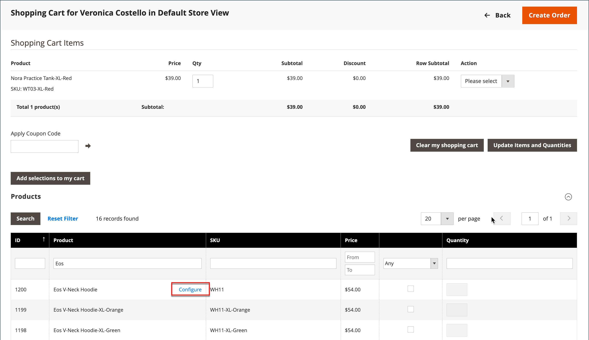

# Gestire un carrello

{{ee-feature}}

Per iniziare una sessione di acquisto assistito, il cliente deve aver effettuato l’accesso al proprio account dalla vetrina per rendere disponibili le informazioni. Se il cliente non ha un account, puoi [crearne uno](../customers/account-create.md).

{width="600" zoomable="yes"}

## Controllo Azioni

| Opzione | Descrizione |
|--- |--- |
| [!UICONTROL Remove] | Rimuove gli articoli dal carrello corrente |
| [!UICONTROL Move to Wish List] | Sposta gli elementi nella lista dei desideri cliente selezionata |

{style="table-layout:auto"}

## Pulsanti di controllo

| Pulsante | Descrizione |
|--- |--- |
| [!UICONTROL Clear my shopping cart] | Rimuove tutti gli elementi dal carrello. |
| [!UICONTROL Update Items and Quantities|]Immettere la quantità richiesta nel campo **[!UICONTROL Qty]** e aggiornare il numero di elementi nel carrello. |
| [!UICONTROL Add selections to my cart] | Aggiunge al carrello i prodotti di tutte le sezioni. |

{style="table-layout:auto"}

## Verificare che il cliente abbia effettuato l’accesso

1. Nella barra laterale _Admin_, passa a **[!UICONTROL Customers]** > **[!UICONTROL Now Online]**.

   Tutti i visitatori del negozio e i clienti connessi vengono visualizzati nell’elenco.

   {width="700" zoomable="yes"}

## Acquisti assistiti da offerte

1. Nella barra laterale _Admin_, passa a **[!UICONTROL Customers]** > **[!UICONTROL All Customers]**.

1. Nell’elenco, apri il record cliente in modalità di modifica.

   >[!TIP]
   >
   >Per trovare rapidamente il record cliente, utilizzare il controllo [Filtri](../getting-started/admin-grid-controls.md).

   Nel profilo cliente in _[!UICONTROL Personal Information]_, la data e l&#39;ora_[!UICONTROL Last Logged In]_ mostrano che il cliente è online.

   {width="600" zoomable="yes"}

1. Per accedere alla modalità di acquisto assistito, fare clic su **[!UICONTROL Manage Shopping Cart]** nella barra dei pulsanti superiore.

   {width="600" zoomable="yes"}

## Aggiungi prodotti al carrello per attributo

1. Espandere  nella sezione **[!UICONTROL Products]**.

1. Trova un prodotto utilizzando uno dei filtri nella parte superiore di ogni colonna.

1. Fare clic su **[!UICONTROL Search]**.

1. Utilizza una delle seguenti serie di passaggi in base al tipo di prodotto:

### Aggiungere un prodotto semplice

1. Fare clic sul prodotto che si desidera ordinare.

   Questa azione seleziona il record e imposta **[!UICONTROL Quantity]** sul valore predefinito di `1`.

1. Se necessario, aggiornare la quantità ordinata.

1. Sulla sinistra sopra la griglia, fare clic su **[!UICONTROL Add selections to my cart]**.

   {width="600" zoomable="yes"}

   La riga viene aggiunta al carrello nella parte superiore della pagina.

   {width="600" zoomable="yes"}

### Aggiungi un prodotto con configurazione

Prima di aggiungere al carrello è necessario configurare tre tipi di prodotti: `Bundle Product`, `Configurable Product` e `Grouped Product`.

1. Nella griglia, fare clic su **[!UICONTROL Configure]** accanto al nome del prodotto.

   {width="600" zoomable="yes"}

1. Nella finestra di dialogo _Prodotti associati_, scegli ogni opzione di prodotto per descrivere l&#39;elemento da ordinare, immetti **[!UICONTROL Quantity]** e fai clic su **[!UICONTROL OK]**.

   Il prodotto viene selezionato con un segno di spunta e la quantità ordinata viene visualizzata nella griglia.

1. Per aggiungere il prodotto al carrello, fare clic su **[!UICONTROL Add selections to my cart]**.

   {width="600" zoomable="yes"}

1. Se necessario, aggiorna le opzioni prodotto nel carrello:

   - Fare clic su **[!UICONTROL Configure]**.

   - Aggiornare le opzioni e quindi fare clic su **[!UICONTROL OK]**.

## Aggiungi prodotto per SKU

1. Espandere  nella sezione **[!UICONTROL Add to Shopping Cart by SKU]**.

1. Aggiungi i prodotti singolarmente per **[!UICONTROL SKU]** o aggiungi i prodotti caricando un file CSV.

### Aggiungi elementi singolarmente per SKU

1. Immettere **[!UICONTROL SKU]** e **[!UICONTROL Qty]** dell&#39;elemento da ordinare.

1. Per ordinare un altro prodotto, fare clic su **[!UICONTROL Add another]**.

   {width="600" zoomable="yes"}

1. Fare clic su **[!UICONTROL Add selections to my cart]**.

1. Se l&#39;elemento è un prodotto configurabile, scegliere le opzioni del prodotto quando richiesto e quindi fare clic su **[!UICONTROL Add to Shopping Cart]**.

### Aggiungere prodotti caricando un file CSV

1. Prepara un [file csv](../systems/data-csv.md) con gli elementi da aggiungere al carrello.

   Il file deve contenere solo due colonne, con `sku` e `qty` nell&#39;intestazione.

1. Carica il file preparato:

   - Fare clic su **[!UICONTROL Choose File]**.

   - Seleziona il file da caricare dalla directory.

## Trasferisci un articolo

Puoi trasferire gli articoli nel carrello dalla lista dei desideri di un cliente e gli articoli visualizzati, confrontati o ordinati di recente. Il numero di elementi in ogni sezione viene visualizzato tra parentesi dopo l&#39;intestazione della sezione.

1. Espandere  in una delle sezioni seguenti:

   - [!UICONTROL Wish List]
   - [!UICONTROL Products in the Comparison List]
   - [!UICONTROL Recently Compared Products]
   - [!UICONTROL Recently Viewed Products]
   - [!UICONTROL Last Ordered Items]

1. Nella griglia, selezionare ogni prodotto da ordinare e immettere **[!UICONTROL Quantity]**.

1. Per immettere le opzioni per un prodotto configurabile, fare clic su **[!UICONTROL Configure]** e impostare le opzioni del prodotto in base alle esigenze.

1. Fare clic su **[!UICONTROL Add selections to my cart]**.

1. Applica uno o più codici coupon, se disponibili:

   - Per **[!UICONTROL Apply Coupon Code]**, immettere un codice coupon valido.

   - Fai clic sulla freccia _Applica_ (  ).

1. Regola la quantità ordinata in base alle esigenze:

   - Nella colonna **[!UICONTROL Qty]** del prodotto da adeguare, immettere l&#39;importo corretto.

   - Fare clic su **[!UICONTROL Update Items and Quantities]**.

## Crea l’ordine

1. Fare clic su **[!UICONTROL Create Order]**.

   Nella pagina _[!UICONTROL Create New Order]_sono visualizzati gli articoli nel carrello, seguiti dalle informazioni di spedizione e pagamento.

1. Completare le informazioni relative alla spedizione e al pagamento.

1. Fare clic su **[!UICONTROL Submit Order]**.

Per ulteriori informazioni, consulta [Creare un ordine](customer-account-create-order.md).

## Rimuovere tutti gli elementi da un carrello

La rimozione di tutti gli articoli dal carrello di un cliente in modalità di acquisto assistito è utile se il cliente desidera ricominciare da capo, ha aggiunto articoli non corretti o deve cancellare il carrello prima di effettuare un nuovo ordine. In questo modo il carrello conterrà solo i prodotti che il cliente desidera acquistare.

1. Nella barra laterale _Admin_, passa a **[!UICONTROL Customers]** > **[!UICONTROL All Customers]**.

1. Nell’elenco, apri il record cliente in modalità di modifica.

1. Fai clic su **[!UICONTROL Manage Shopping Cart]** nella barra dei pulsanti superiore.

1. Fare clic su **[!UICONTROL Clear my shopping cart]**.

   {width="600" zoomable="yes"}

1. Quando richiesto, fare clic su **[!UICONTROL OK]** per confermare l&#39;azione.
