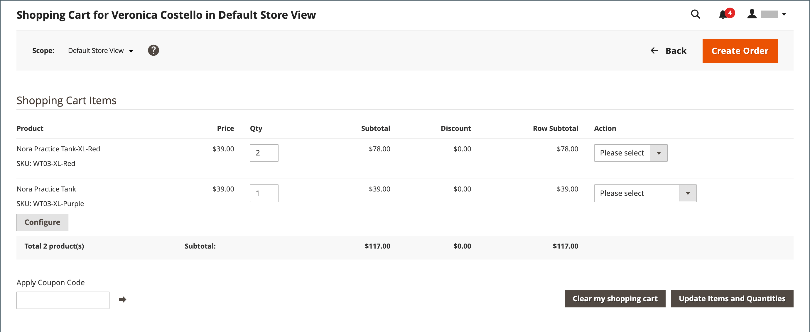
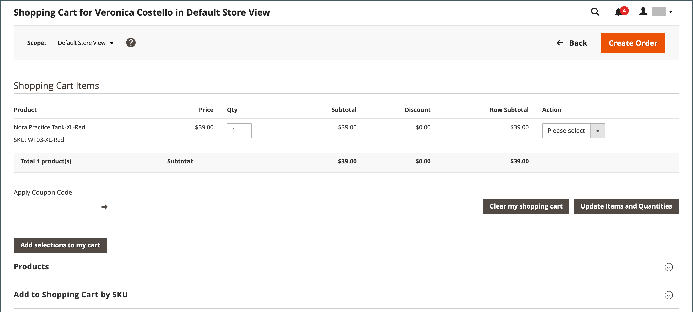

# Gestire un carrello

{{ee-feature}}

Per iniziare una sessione di acquisto assistito, il cliente deve aver effettuato l’accesso al proprio account dalla vetrina per rendere disponibili le informazioni. Se il cliente non dispone di un account, puoi [creane uno](../customers/account-create.md).

{width="600" zoomable="yes"}

## Controllo Azioni

| Opzione | Descrizione |
|--- |--- |
| [!UICONTROL Remove] | Rimuove gli articoli dal carrello corrente |
| [!UICONTROL Move to Wish List] | Sposta gli elementi nella lista dei desideri cliente selezionata |

{style="table-layout:auto"}

## Pulsanti di controllo

| Pulsante | Descrizione |
|--- |--- |
| [!UICONTROL Clear my shopping cart] | Cancella il carrello corrente da tutti i prodotti. |
| [!UICONTROL Update Items and Quantities|]Inserire la quantità richiesta nel campo **[!UICONTROL Qty]** e aggiorna il numero di elementi nel carrello. |
| [!UICONTROL Add selections to my cart] | Aggiunge al carrello i prodotti di tutte le sezioni. |

{style="table-layout:auto"}

## Verificare che il cliente abbia effettuato l’accesso

1. Il giorno _Amministratore_ barra laterale, vai a **[!UICONTROL Customers]** > **[!UICONTROL Now Online]**.

   Tutti i visitatori del negozio e i clienti connessi vengono visualizzati nell’elenco.

   {width="700" zoomable="yes"}

## Acquisti assistiti da offerte

1. Il giorno _Amministratore_ barra laterale, vai a **[!UICONTROL Customers]** > **[!UICONTROL All Customers]**.

1. Nell’elenco, apri il record cliente in modalità di modifica.

   >[!TIP]
   >
   >Per trovare il record cliente in modo rapido, utilizzare [Filtri](../getting-started/admin-grid-controls.md) controllo.

   Nel profilo cliente in _[!UICONTROL Personal Information]_, il_[!UICONTROL Last Logged In]_ la data e l&#39;ora mostrano che il cliente è online.

   {width="600" zoomable="yes"}

1. Per accedere alla modalità di acquisto assistito, fai clic su **[!UICONTROL Manage Shopping Cart]** nella barra dei pulsanti superiore.

   {width="600" zoomable="yes"}

## Aggiungi prodotti al carrello per attributo

1. Espandi  il **[!UICONTROL Products]** sezione.

1. Trova un prodotto utilizzando uno dei filtri nella parte superiore di ogni colonna.

1. Clic **[!UICONTROL Search]**.

1. Utilizza una delle seguenti serie di passaggi in base al tipo di prodotto:

### Aggiungere un prodotto semplice

1. Fare clic sul prodotto che si desidera ordinare.

   Questa azione seleziona il record e imposta **[!UICONTROL Quantity]** al valore predefinito di `1`.

1. Se necessario, aggiornare la quantità ordinata.

1. A sinistra, sopra la griglia, fare clic su **[!UICONTROL Add selections to my cart]**.

   {width="600" zoomable="yes"}

   La riga viene aggiunta al carrello nella parte superiore della pagina.

   {width="600" zoomable="yes"}

### Aggiungi un prodotto con configurazione

Ci sono tre tipi di prodotti che devono essere configurati prima di aggiungere al carrello: `Bundle Product`, `Configurable Product`, e `Grouped Product`.

1. Nella griglia, fai clic su **[!UICONTROL Configure]** accanto al nome del prodotto.

   {width="600" zoomable="yes"}

1. In _Prodotti associati_ , scegliere ogni opzione di prodotto per descrivere l&#39;elemento da ordinare, immettere il **[!UICONTROL Quantity]** e fai clic su **[!UICONTROL OK]**.

   Il prodotto viene selezionato con un segno di spunta e la quantità ordinata viene visualizzata nella griglia.

1. Per aggiungere il prodotto al carrello, fai clic su **[!UICONTROL Add selections to my cart]**.

   {width="600" zoomable="yes"}

1. Se necessario, aggiorna le opzioni prodotto nel carrello:

   - Clic **[!UICONTROL Configure]**.

   - Aggiorna le opzioni e fai clic su **[!UICONTROL OK]**.

## Aggiungi prodotto per SKU

1. Espandi  il **[!UICONTROL Add to Shopping Cart by SKU]** sezione.

1. Aggiungi singoli prodotti da **[!UICONTROL SKU]** oppure aggiungi prodotti caricando un file CSV.

### Aggiungi elementi singolarmente per SKU

1. Inserisci il **[!UICONTROL SKU]** e **[!UICONTROL Qty]** dell&#39;articolo da ordinare.

1. Per ordinare un altro prodotto, fai clic su **[!UICONTROL Add another]**.

   {width="600" zoomable="yes"}

1. Clic **[!UICONTROL Add selections to my cart]**.

1. Se l&#39;elemento è un prodotto configurabile, scegliere le opzioni del prodotto quando richiesto e quindi fare clic su **[!UICONTROL Add to Shopping Cart]**.

### Aggiungere prodotti caricando un file CSV

1. Prepara un [file csv](../systems/data-csv.md) con gli elementi da aggiungere al carrello.

   Il file deve contenere solo due colonne, con `sku` e `qty` nell’intestazione.

1. Carica il file preparato:

   - Clic **[!UICONTROL Choose File]**.

   - Seleziona il file da caricare dalla directory.

## Trasferisci un articolo

Puoi trasferire gli articoli nel carrello dalla lista dei desideri di un cliente e gli articoli visualizzati, confrontati o ordinati di recente. Il numero di elementi in ogni sezione viene visualizzato tra parentesi dopo l&#39;intestazione della sezione.

1. Espandi  una delle seguenti sezioni:

   - [!UICONTROL Wish List]
   - [!UICONTROL Products in the Comparison List]
   - [!UICONTROL Recently Compared Products]
   - [!UICONTROL Recently Viewed Products]
   - [!UICONTROL Last Ordered Items]

1. Nella griglia, selezionare ogni prodotto da ordinare e immettere il **[!UICONTROL Quantity]**.

1. Per immettere le opzioni per un prodotto configurabile, fai clic su **[!UICONTROL Configure]** e imposta le opzioni prodotto in base alle esigenze.

1. Clic **[!UICONTROL Add selections to my cart]**.

1. Applica uno o più codici coupon, se disponibili:

   - Per **[!UICONTROL Apply Coupon Code]**, immetti un codice coupon valido.

   - Fai clic su _Applica_ (  ).

1. Regola la quantità ordinata in base alle esigenze:

   - In **[!UICONTROL Qty]** nella colonna del prodotto da adeguare, immettere l&#39;importo corretto.

   - Clic **[!UICONTROL Update Items and Quantities]**.

## Crea l’ordine

1. Clic **[!UICONTROL Create Order]**.

   Il _[!UICONTROL Create New Order]_pagina mostra gli articoli nel carrello, seguito dalle informazioni di spedizione e pagamento.

1. Completare le informazioni relative alla spedizione e al pagamento.

1. Clic **[!UICONTROL Submit Order]**.

Per ulteriori informazioni, consulta [Crea un ordine](customer-account-create-order.md).
