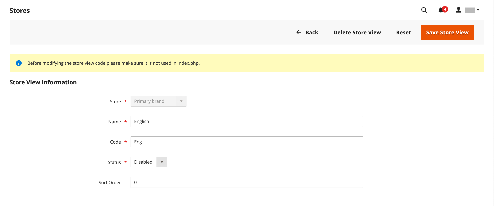

# Visualizzazioni dello store

Le visualizzazioni del Negozio vengono in genere utilizzate per rendere il negozio disponibile in diverse lingue. Gli acquirenti possono utilizzare il selettore della lingua nell’intestazione del negozio per modificare la visualizzazione del negozio.

{width="550"}

## Aggiungi una visualizzazione store

1. Nella barra laterale _Admin_, passa a **[!UICONTROL Stores]** > _[!UICONTROL Settings]_>**[!UICONTROL All Stores]**.

   {width="700" zoomable="yes"}

1. Fare clic su **[!UICONTROL Create Store View]**.

   {width="600" zoomable="yes"}

1. Imposta **[!UICONTROL Store]** sull&#39;archivio padre della visualizzazione.

1. Immettere **[!UICONTROL Name]** per la visualizzazione archivio.

   Il nome viene visualizzato nel selettore della lingua nell’intestazione dello store. Esempio: `Spanish`.

1. Per **[!UICONTROL Code]**, immettere il codice che identifica la visualizzazione (in caratteri minuscoli).

   Esempio: `spanish`.

1. Per attivare la visualizzazione, impostare **[!UICONTROL Status]** su `Enabled`.

1. (Facoltativo) Immettere un numero **[!UICONTROL Sort Order]** per determinare la sequenza in cui la visualizzazione è elencata con altre visualizzazioni.

1. Fare clic su **[!UICONTROL Save Store View]**.

## Modificare una visualizzazione dello store

Poiché il nome della vista viene visualizzato nel selettore lingua, potrebbe essere utile modificare il nome della vista predefinita in modo più descrittivo. Il campo _Name_ è semplicemente un&#39;etichetta e può essere facilmente modificato.

Se nell&#39;installazione di Adobe Commerce o Magento Open Source è presente una configurazione multisito o multisito, non modificare il campo Codice archivio senza verificare che nel file `index.php` non sia presente alcun riferimento al valore. Se non hai accesso al server per esaminare il file, chiedi aiuto a uno sviluppatore.

| Campo | Valore originale | Valore aggiornato |
| ----- | -------------- | ------------- |
| [!UICONTROL Name] | `Default Store View` | `English` |
| [!UICONTROL Code] | `default` | `english` |

{style="table-layout:auto"}

1. Nella barra laterale _Admin_, passa a **[!UICONTROL Stores]** > _[!UICONTROL Settings]_>**[!UICONTROL All Stores]**.

1. Nella colonna _[!UICONTROL Store View]_della griglia fare clic sul nome della visualizzazione che si desidera modificare.

   Durante la modifica della visualizzazione predefinita, i campi _[!UICONTROL Store]_e_[!UICONTROL Status]_ non sono disponibili.

   {width="600" zoomable="yes"}

1. Aggiorna i campi seguenti in base alle esigenze:

   - **[!UICONTROL Store]** (solo visualizzazioni non predefinite)
   - **[!UICONTROL Name]**
   - **[!UICONTROL Code]** (solo se non utilizzato in `index.php`)
   - **[!UICONTROL Status]** (solo visualizzazioni non predefinite)
   - **[!UICONTROL Sort Order]**

1. Fare clic su **[!UICONTROL Save Store View]**.
