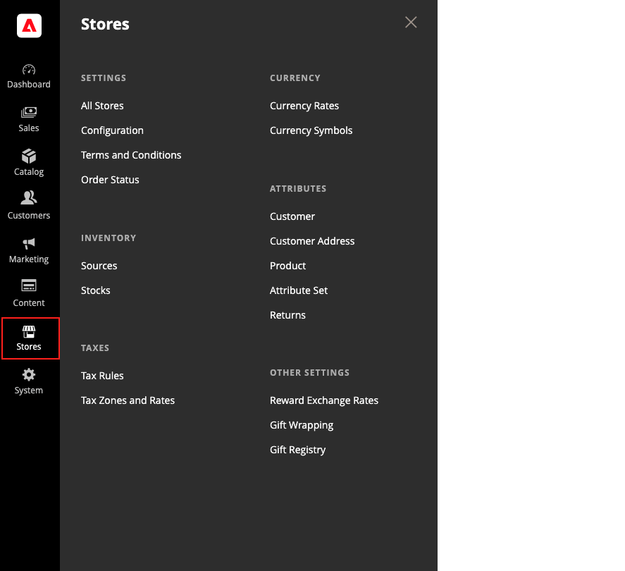

# Menu [!UICONTROL Stores]

Il menu _[!UICONTROL Stores]_&#x200B;consente di accedere alle impostazioni utilizzate meno frequentemente, ma a cui si fa riferimento durante l&#39;installazione di Adobe Commerce o Magento Open Source. Queste funzioni includono l’impostazione della gerarchia del negozio, la configurazione, le impostazioni di vendita e ordine, le imposte e la valuta, gli attributi del prodotto, le valutazioni di recensione del prodotto e i gruppi di clienti.

>[!BEGINTABS]

>[!TAB Adobe Commerce]

[!BADGE Solo PaaS]{type=Informative url="https://experienceleague.adobe.com/it/docs/commerce/user-guides/product-solutions" tooltip="Applicabile solo ai progetti Adobe Commerce on Cloud (infrastruttura PaaS gestita da Adobe) e ai progetti on-premise."}

{width="500" zoomable="yes"}

>[!TAB Adobe Commerce as a Cloud Service]

[!BADGE Solo SaaS]{type=Positive url="https://experienceleague.adobe.com/it/docs/commerce/user-guides/product-solutions" tooltip="Applicabile solo ai progetti Adobe Commerce as a Cloud Service e Adobe Commerce Optimizer (infrastruttura SaaS gestita da Adobe)."}

{width="500" zoomable="yes"}

>[!ENDTABS]

## Visualizza il menu [!UICONTROL Stores]

Nella barra laterale _Admin_, fai clic su **[!UICONTROL Stores]**.

## Sezioni principali

### [!UICONTROL Settings]

Gestisci la gerarchia di [siti Web, archivi e visualizzazioni dello store](stores.md#store-and-site-structure) nell&#39;installazione di Adobe Commerce o Magento Open Source e tutte le [impostazioni di configurazione](../configuration-reference/guide-overview.md). Inoltre, puoi impostare i [Termini e condizioni](terms-and-conditions.md) di una vendita e gestire le [impostazioni dello stato dell&#39;ordine](order-status.md#custom-order-status).

### [!UICONTROL Inventory]

[Gestisci e crea scorte](../inventory-management/introduction.md) per collegare i tuoi canali di vendita o siti Web a [sorgenti](../inventory-management/sources-manage.md). Le scorte forniscono una quantità aggregata di prodotti vendibili. I commercianti single Source utilizzano il titolo predefinito, mentre i commercianti multi-Source utilizzano titoli personalizzati aggiuntivi.

### [!UICONTROL Taxes]

Gestisci tutti i tipi di [funzioni fiscali](taxes.md) nel tuo store, imposta le regole fiscali per il tuo store, definisci le classi fiscali per clienti e prodotti e gestisci le aree e le aliquote fiscali. Puoi anche importare i dati dell’aliquota fiscale nel tuo store.

### [!UICONTROL Currency]

Gestisci i tassi per le [valute](currency.md) accettate come pagamento nel tuo Negozio e personalizza i simboli di valuta visualizzati nei prezzi dei prodotti e nei documenti di vendita.

### [!UICONTROL Attributes]

Gestisci gli attributi utilizzati per [informazioni sul cliente](../customers/attribute-properties.md) o [informazioni sul prodotto](../catalog/attribute-product-create.md), resi e valutazioni del prodotto. È possibile creare attributi, modificare attributi esistenti e gestire [set di attributi](../catalog/attribute-sets.md).

### [!UICONTROL Other Settings]

Gestisci impostazioni aggiuntive per [premi tassi di cambio](../merchandising-promotions/reward-exchange-rates.md), [confezione regalo](cart-configuration.md#gift-wrap) e [registri regali](../merchandising-promotions/gift-registries.md).
