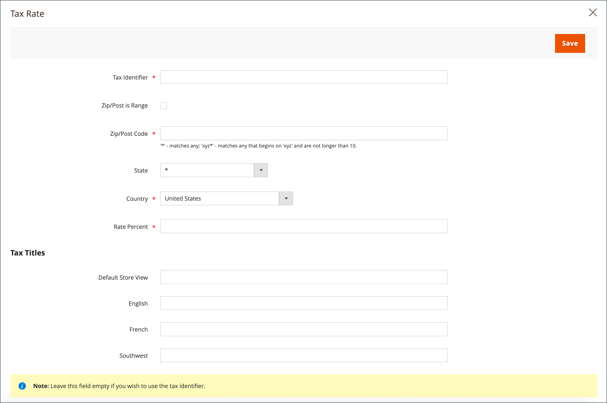

# Regole fiscali

Le regole fiscali includono una combinazione di classe di prodotto, classe di cliente e aliquota. A ogni cliente viene assegnata una classe di clienti e a ogni prodotto viene assegnata una classe di prodotti. Commerce analizza il carrello di ciascun cliente e calcola l’imposta appropriata in base al cliente, alle classi di prodotti e all’area geografica. L&#39;area geografica si basa sull&#39;indirizzo di spedizione, sull&#39;indirizzo di fatturazione o sull&#39;origine di spedizione del cliente.

>[!NOTE]
>
>Quando è necessario definire numerose aliquote fiscali, è possibile semplificarne il processo importandole.

{width="600" zoomable="yes"}

## Passaggio 1: Completare le informazioni sulle regole fiscali

1. Nella barra laterale _Admin_, passa a **[!UICONTROL Stores]** > _[!UICONTROL Taxes]_>**[!UICONTROL Tax Rules]**.

1. Nell&#39;angolo superiore destro fare clic su **[!UICONTROL Add New Tax Rule]**.

1. In _Informazioni regola fiscale_, immettere **[!UICONTROL Name]** per la nuova regola.

   {width="600" zoomable="yes"}

1. Scegliere **[!UICONTROL Tax Rate]** applicabile alla regola.

   Per modificare un&#39;aliquota esistente, effettuare le seguenti operazioni:

   - Passa il puntatore del mouse sull&#39;aliquota e fai clic sull&#39;icona _Modifica_ .

   - Aggiornare il modulo secondo necessità e fare clic su **[!UICONTROL Save]**.

1. Per inserire le aliquote, utilizzare uno dei metodi seguenti:

### Metodo 1: inserire manualmente le aliquote

1. Fare clic su **[!UICONTROL Add New Tax Rate]**.

1. Completare il modulo in base alle esigenze (vedere [Aree e aliquote fiscali](tax-zones-rates.md)).

1. Al termine, fare clic su **[!UICONTROL Save]**.

   {width="600" zoomable="yes"}

### Metodo 2: Aliquote di imposta all&#39;importazione

1. Scorri fino alla sezione nella parte inferiore della pagina.

1. Per importare le aliquote, effettuare le seguenti operazioni:

   - Fare clic su **[!UICONTROL Choose File]** e passare al file CSV con le aliquote da importare.

   - Fare clic su **[!UICONTROL Import Tax Rates]**.

1. Per esportare le aliquote, fare clic su **[!UICONTROL Export Tax Rates]** (vedere [Importa/esporta aliquote](../systems/data-transfer-tax-rates.md)).

{width="600" zoomable="yes"}

## Passaggio 2: completare le impostazioni aggiuntive

1. Per aprire la sezione, scegliere **[!UICONTROL Additional Settings]**.

   {width="600" zoomable="yes"}

1. Scegliere **[!UICONTROL Customer Tax Class]** a cui applicare la regola.

   - Per modificare una classe fiscale cliente, fare clic sull&#39;icona _Modifica_ , aggiornare il modulo in base alle esigenze e fare clic su **[!UICONTROL Save]**.

   - Per creare una classe fiscale, fare clic su **[!UICONTROL Add New Tax Class]**, completare il modulo in base alle esigenze e fare clic su **[!UICONTROL Save]**.

1. Scegliere **[!UICONTROL Product Tax Class]** a cui applicare la regola.

   - Per modificare una classe fiscale prodotti, fare clic sull&#39;icona _Modifica_ , aggiornare il modulo in base alle esigenze e fare clic su **[!UICONTROL Save]**.

   - Per creare una classe fiscale, fare clic su **[!UICONTROL Add New Tax Class]**, completare il modulo in base alle esigenze e fare clic su **[!UICONTROL Save]**.

1. Quando sono applicabili più imposte, immettere un numero per indicare la priorità di questa imposta per **[!UICONTROL Priority]**.

   Se si applicano due regole fiscali con la stessa priorità, le imposte vengono aggiunte. Se vengono applicate due imposte con impostazioni di priorità diverse, le imposte vengono composte.

1. Se si desidera che le imposte siano basate sul subtotale dell&#39;ordine, selezionare la casella di controllo **[!UICONTROL Calculate off Subtotal Only]**.

1. Per **[!UICONTROL Sort Order]**, immettere un numero per indicare l&#39;ordine di questa regola fiscale quando elencata con altri.

1. Al termine, fare clic su **[!UICONTROL Save Rule]**.

## Demo sulle regole di valuta e fiscali

Scopri come gestire la valuta e le regole fiscali guardando questo video:

>[!VIDEO](https://video.tv.adobe.com/v/343657/?quality=12&learn=on)
