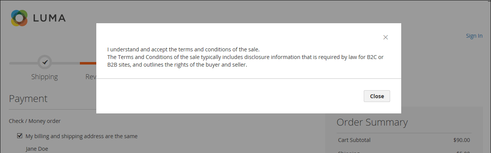

# Termini e condizioni per il pagamento

Quando la funzionalità _Termini e condizioni_ manuale è abilitata, i clienti devono accettare i termini e le condizioni della vendita prima che l&#39;acquisto sia finalizzato. I Termini e Condizioni della vendita di solito includono informazioni di divulgazione che potrebbero essere richieste dalla legge per i siti B2C o B2B e delineano i diritti dell&#39;acquirente e del venditore. Il messaggio Termini e condizioni viene visualizzato dopo le informazioni sul pagamento, immediatamente prima del pulsante _Inserisci ordine_.

{width="700" zoomable="yes"}

## Passaggio 1: abilitare termini e condizioni per il pagamento

1. Nella barra laterale _Admin_, passa a **[!UICONTROL Stores]** > _[!UICONTROL Settings]_>**[!UICONTROL Configuration]**.

1. Nel pannello a sinistra, espandi **[!UICONTROL Sales]** e scegli **[!UICONTROL Checkout]**.

1. Espandere  nella sezione **[!UICONTROL Checkout Options]**.

   {width="600" zoomable="yes"}

1. Verificare che **[!UICONTROL Enable Onepage Checkout]** sia impostato su `Yes`.

1. Imposta **[!UICONTROL Enable Terms and Conditions]** su `Yes`.

1. Fare clic su **[!UICONTROL Save Config]**.

## Passaggio 2: aggiungere le informazioni sui termini e le condizioni

1. Nella barra laterale _Admin_, passa a **[!UICONTROL Stores]** > _[!UICONTROL Settings]_>**[!UICONTROL Terms and Conditions]**.

   {width="600" zoomable="yes"}

1. Nell&#39;angolo superiore destro fare clic su **[!UICONTROL Add New Condition]**.

1. Immettere **[!UICONTROL Condition Name]** come riferimento interno.

   {width="600" zoomable="yes"}

1. Imposta **[!UICONTROL Status]** su `Enabled`.

1. Imposta **[!UICONTROL Applied]** su uno dei seguenti:

   - `Automatically` - Le condizioni vengono accettate automaticamente al momento dell&#39;estrazione.
   - `Manually` - I clienti devono accettare manualmente le condizioni per effettuare un ordine.

1. Imposta **[!UICONTROL Show Content as]** su uno dei seguenti:

   - `Text` - Visualizza i termini e le condizioni come testo non formattato.
   - `HTML` - Visualizza il contenuto come HTML che può essere formattato.

1. Selezionare ogni **[!UICONTROL Store View]** in cui si desidera utilizzare i termini e le condizioni.

1. Scorri verso il basso e completa le informazioni da visualizzare:

   - Immettere **[!UICONTROL Checkbox Text]** da utilizzare come testo per il collegamento Termini e condizioni. Ad esempio, `I understand and accept the terms and conditions of the sale`.

   - Nella casella **[!UICONTROL Content]** immettere il testo completo dei termini e delle condizioni della vendita.

1. (Facoltativo) Immettere **[!UICONTROL Content Height (css)]** in pixel per determinare l&#39;altezza della casella di testo in cui viene visualizzata l&#39;istruzione dei termini e delle condizioni durante l&#39;estrazione.

   Ad esempio, per impostare la casella di testo con un&#39;altezza di 1 pollice su uno schermo da 96 dpi, immettere `96`. Se il contenuto si estende oltre l&#39;altezza della casella, viene visualizzata una barra di scorrimento.

1. Fare clic su **[!UICONTROL Save Condition]**.
