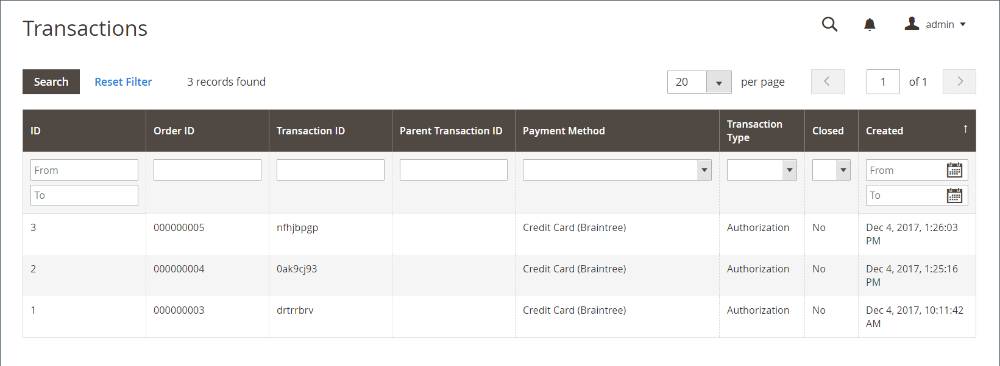

# Transazioni

Il _Transazioni_ pagina elenca tutte le attività di pagamento che hanno avuto luogo tra il tuo negozio e un sistema di pagamento e fornisce l&#39;accesso a informazioni più dettagliate.

## Visualizza transazioni

Il giorno _Amministratore_ barra laterale, vai a **[!UICONTROL Sales]** > _[!UICONTROL Operations]_>**[!UICONTROL Transactions]**.

{width="600" zoomable="yes"}

| Colonna | Descrizione |
|--- |--- |
| [!UICONTROL ID] | Un identificatore numerico univoco assegnato a ogni transazione. |
| [!UICONTROL Order ID] | Identificatore univoco assegnato quando un cliente effettua un ordine. |
| [!UICONTROL Transaction ID] | Identificatore numerico univoco assegnato quando una transazione si verifica dopo che un cliente ha effettuato un ordine. |
| [!UICONTROL Parent Transaction ID] | Numero ID della transazione padre. |
| [!UICONTROL Payment Method] | Il metodo di pagamento associato a una transazione. |
| [!UICONTROL Transaction Type] | Tipo di transazione, che può essere Ordine, Autorizzazione, Acquisizione, Annullamento o Rimborso. |
| [!UICONTROL Closed] | Indica se una transazione è chiusa o meno. |
| [!UICONTROL Created] | Ora e data di creazione della transazione. |

{style="table-layout:auto"}

## Visualizza dettagli transazione

Fare clic sulla voce da visualizzare.

Nella pagina dei dettagli della transazione è possibile visualizzare la griglia dei dettagli della transazione e delle transazioni figlio.

### Dati transazione

Questa sezione include informazioni sulla transazione e fornisce un collegamento alla pagina dell&#39;ordine in **ID ordine** colonna.

| Colonna | Descrizione |
|--- |--- |
| [!UICONTROL Transaction ID] | Numero ID transazione. |
| [!UICONTROL Parent Transaction ID] | Numero ID corrispondente della transazione padre, se applicabile. |
| [!UICONTROL Transaction Type] | Tipo di transazione, che può essere Ordine, Autorizzazione, Acquisizione, Annullamento o Rimborso. |
| [!UICONTROL Is Closed] | Indica se una transazione è chiusa o meno. |
| [!UICONTROL Created At] | Ora e data di creazione della transazione. |

{style="table-layout:auto"}

### Transazioni figlio

Le transazioni figlio vengono visualizzate nella griglia dopo la creazione delle fatture per [ordini](orders.md). Questo formato consente di tenere traccia della cronologia delle transazioni, seguendo una gerarchia di transazioni.

### [!UICONTROL Transaction Details]

Questa sezione include le informazioni aggiuntive per una determinata transazione. Le informazioni vengono visualizzate sotto forma di chiavi e valori. Le chiavi disponibili sono:

- authAmount
- authCode
- RispostaVSR
- BillTo
- cardCodeResponse
- cliente
- customerIP
- lineItems
- marketType
- ordine
- pagamento
- prodotto
- recurringBilling
- responseCode
- responseReasonCode
- responseReasonDescription
- settleImporto
- soluzione
- submitTimeLocal
- submitTimeUTC
- taxExempt
- transactionStatus

>[!NOTE]
>
>Se i dettagli della transazione non sono disponibili o sono obsoleti, fare clic su **[!UICONTROL Fetch]** nella barra dei pulsanti per aggiornarli.
