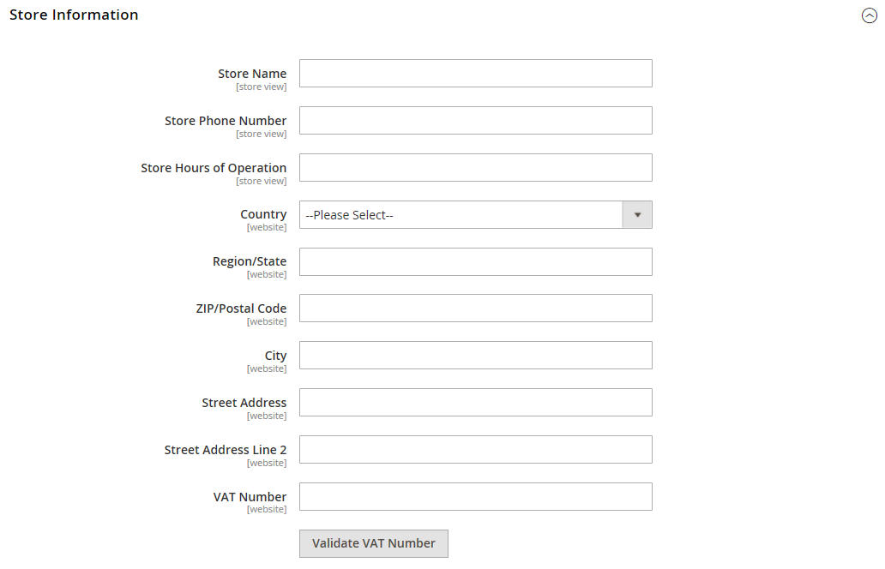

# Imposta sul valore aggiunto

Alcuni paesi applicano un&#39;imposta sul valore aggiunto, o IVA, su beni e servizi. Ci possono essere diverse aliquote IVA a seconda della fase nel processo di produzione o distribuzione, materiali o servizi che si vendono ai clienti. È possibile applicare più di un&#39;aliquota IVA per calcolare correttamente l&#39;imposta dovuta.

Commerce può essere configurato per addebitare un&#39;imposta sul valore aggiunto in base all&#39;indirizzo dell&#39;esercente o del cliente, se entrambi si trovano nello stesso paese. I calcoli IVA si basano in genere sulla destinazione della spedizione, anziché sul punto di origine. Per la maggior parte degli scenari è sufficiente un&#39;impostazione di configurazione che calcola l&#39;IVA in base all&#39;indirizzo di spedizione del cliente.

## Scenari di esempio

- Nel caso di un&#39;impresa soggetta all&#39;IVA in un paese dell&#39;UE che fornisce beni a un privato in un altro paese dell&#39;UE, l&#39;IVA è calcolata come &quot;vendita a distanza&quot; in base all&#39;ubicazione dell&#39;esercente.

- Un&#39;azienda nei Paesi Bassi che effettua un acquisto da un negozio nel Regno Unito che spedisce a un indirizzo nel Regno Unito è tenuta a pagare le aliquote IVA del Regno Unito.

- Per la vendita di [prodotti scaricabili](../catalog/product-create-downloadable.md), o _beni digitali_ Tuttavia, l’aliquota IVA si basa sulla destinazione della spedizione e non sulla sede dell’esercente. Consulta [Luogo di cessione di beni digitali](taxes.md#place-of-supply-for-digital-goods-eu).

>[!TIP]
>
>Alcune spedizioni transfrontaliere e B2B hanno requisiti fiscali più complessi. Per espandere le funzionalità native dell’installazione di Commerce, è consigliabile aggiungere una soluzione di gestione delle imposte dalla [Marketplace](https://marketplace.magento.com/extensions/accounting-finance/taxes.html).

## Configura IVA

Le istruzioni seguenti includono una procedura di esempio per impostare un&#39;IVA del 20% nel Regno Unito per le vendite ai clienti al dettaglio. Per altre aliquote e altri paesi, seguire la procedura generale ma inserire informazioni specifiche che corrispondono al paese, all&#39;aliquota IVA, ai tipi di cliente e così via.

>[!NOTE]
>
>Prima di procedere, assicurati di scoprire quali regole e regolamenti si applicano all&#39;IVA nella tua zona.

In talune operazioni tra imprese, l’IVA non viene calcolata. Il Commerce può convalidare l&#39;ID IVA di un cliente per garantire che l&#39;IVA sia valutata correttamente (o non valutata). Consulta [Convalida ID IVA](#vat-id-validation).

### Passaggio 1: impostare le classi imposta cliente

Il processo di creazione di una regola fiscale inizia con l&#39;aggiunta di un&#39;aliquota.

1. Il giorno _Amministratore_ barra laterale, vai a **[!UICONTROL Stores]** > _[!UICONTROL Taxes]_>**[!UICONTROL Tax Zones and Rates]**.

   {width="600" zoomable="yes"}

1. Assicurati che esista una classe fiscale cliente appropriata da utilizzare con l’IVA.

   Per questo esempio, assicurati che esista una classe fiscale cliente denominata _Cliente al dettaglio_. Se questa classe fiscale non esiste, fare clic su **[!UICONTROL Add New Tax Rate]**.

1. Inserisci il **[!UICONTROL Tax Identifier]** per la nuova classe di imposta.

   Tutte le aliquote vengono visualizzate nel _Aliquota fiscale_ campo in _Informazioni sulle regole fiscali_ quando si creano regole fiscali.

1. Per impostare l’intervallo del codice postale (da / a), seleziona la **[!UICONTROL Zip/Post is Range]** casella di controllo.

1. Scegli la **[!UICONTROL Country]** dove si applica l’aliquota.

1. Inserisci il **[!UICONTROL Rate Percent]** che verrebbe utilizzato per il calcolo dell’aliquota all’acquisto.

1. Al termine, fai clic su **[!UICONTROL Save Rate]**.

In base all&#39;aliquota fiscale sottomessa, è possibile creare regole fiscali successive. In assenza di aliquote fiscali, la creazione di norme fiscali diventa impossibile.

### Passaggio 2: impostare le classi di imposta prodotto

1. Il giorno _Amministratore_ barra laterale, vai a **[!UICONTROL Stores]** >  _[!UICONTROL Taxes]_>**[!UICONTROL Tax Rules]**.

1. Clic **[!UICONTROL Add New Tax Rule]**.

1. Espandi  il **[!UICONTROL Additional Settings]** sezione.

   {width="600" zoomable="yes"}

1. Sotto _Classe imposta prodotto_, fai clic su **[!UICONTROL Add New Tax Class]**.

1. Per aggiungere la nuova classe all&#39;elenco delle classi di imposta prodotti disponibili e creare tre nuove classi, immettere il **[!UICONTROL Name]** della nuova classe di imposta e fare clic sul segno di spunta:

   - `VAT Standard`
   - `VAT Reduced`
   - `VAT Zero`

1. Clic **[!UICONTROL Save Class]** per ogni nuova classe aggiunta.

1. Clic **[!UICONTROL Save Rule]**.

### Passaggio 3: Impostare aree e aliquote fiscali

1. Il giorno _Amministratore_ barra laterale, vai a **[!UICONTROL Stores]** >  _[!UICONTROL Taxes]_>**[!UICONTROL Tax Zones and Rates]**.

   In questo esempio è possibile rimuovere le aliquote fiscali statunitensi o lasciarle invariate.

1. Clic **[!UICONTROL Add New Tax Rate]**.

   {width="600" zoomable="yes"}

1. Definisci i nuovi tassi come segue:

   **Norma IVA**

   - Identificatore imposta: `VAT Standard`
   - Paese e Stato: `United Kingdom`
   - Percentuale tasso: `20.00`

   **IVA ridotta**

   - Identificatore imposta: `VAT Reduced`
   - Paese e Stato: `United Kingdom`
   - Percentuale tasso: `5.00`

1. Clic **[!UICONTROL Save Rate]** per ogni tariffa.

### Passaggio 4: Impostare le regole fiscali

Una regola fiscale è una combinazione di una classe fiscale cliente, una classe fiscale prodotto e un&#39;aliquota.

1. Il giorno _Amministratore_ barra laterale, vai a **[!UICONTROL Stores]** > _[!UICONTROL Taxes]_>**[!UICONTROL Tax Rules]**.

1. Aggiungere nuove regole fiscali come segue:

   **Norma IVA**

   - Nome: `VAT Standard`
   - Classe imposta cliente: `Retail Customer`
   - Classe imposta prodotto: `VAT Standard`
   - Aliquota: `VAT Standard Rate`

   **Iva ridotta**

   - Nome: `VAT Reduced`
   - Classe imposta cliente: `Retail Customer`
   - Classe imposta prodotto: `VAT Reduced`
   - Aliquota: `VAT Reduced Rate`

1. Clic **[!UICONTROL Save Rule]** per ogni tariffa.

### Passaggio 5: applicare le classi di imposta ai prodotti

1. Il giorno _Amministratore_ barra laterale, vai a **[!UICONTROL Catalog]** > **[!UICONTROL Manage Products]**.

1. Apri un prodotto dal catalogo in modalità di modifica.

1. Il giorno _Generale_ pagina, trova il **[!UICONTROL Tax Class]** e selezionare il **[!UICONTROL VAT Class]** applicabile al prodotto.

1. Al termine, fai clic su **[!UICONTROL Save]**.

   {width="600" zoomable="yes"}

## Descrizioni dei campi

### Informazioni archivio

Commerce utilizza quanto segue [Impostazioni di configurazione delle informazioni di archiviazione](../configuration-reference/general/general.md#store-information) per calcolare l&#39;IVA in base alle informazioni relative agli esercenti.

**[!UICONTROL VAT Number]** - la partita IVA assegnata all&#39;esercente.

**[!UICONTROL Validate VAT Number]** - [Convalida IVA](#vat-id-validation) conferma che il numero di partita IVA corrisponde al record corrispondente nella [Commissione europea](https://ec.europa.eu/taxation_customs/vies/) database.

### Informazioni cliente

Commerce utilizza i campi seguenti per calcolare l’IVA in base a [informazioni sul cliente](../customers/account-dashboard-account-information.md)).

#### Informazioni account

**[!UICONTROL Tax/VAT Number]** - Se applicabile, la partita IVA o la partita IVA assegnata al cliente.

#### Indirizzi

**[!UICONTROL VAT Number]** - Se applicabile, la partita IVA associata a un indirizzo di fatturazione o di spedizione specifico del cliente. Per la vendita di [beni digitali](taxes.md#place-of-supply-for-digital-goods-eu)) all&#39;interno dell&#39;UE, l&#39;importo dell&#39;IVA dipende dalla destinazione della spedizione.

### Account cliente

Commerce utilizza quanto segue [impostazioni di configurazione cliente](../customers/account-options-new.md) per calcolare l&#39;IVA.

**[!UICONTROL Show VAT Number on Storefront]** - Determina se il campo Partita IVA cliente è incluso nella Rubrica disponibile nel conto cliente.

**[!UICONTROL Default Value for Disable Automatic Group Changes Based on VAT ID]** - L’ID IVA è un identificatore interno del numero di IVA del cliente quando viene utilizzato nella convalida dell’IVA. Durante la convalida dell’IVA, Commerce conferma che il numero corrisponde al valore [Commissione europea](https://ec.europa.eu/taxation_customs/vies/) database. I clienti possono essere assegnati automaticamente a uno dei quattro gruppi predefiniti in base ai risultati della convalida.

## Convalida ID IVA

_Convalida ID IVA_ calcola automaticamente l&#39;imposta richiesta per le transazioni B2B che hanno luogo all&#39;interno dell&#39;Unione europea (UE), in base alla localizzazione dell&#39;esercente e del cliente. Commerce esegue la convalida dell’ID IVA utilizzando i servizi web della [Commissione europea][1] server.

>[!NOTE]
>
>Le norme fiscali relative all’IVA non influiscono su altre norme fiscali e non impediscono l’applicazione di altre norme fiscali. È possibile applicare una sola regola fiscale alla volta.

- L&#39;IVA viene addebitata se l&#39;esercente e il cliente si trovano nello stesso paese dell&#39;UE.
- L&#39;IVA non viene addebitata se il commerciante e il cliente si trovano in paesi dell&#39;UE diversi ed entrambe le parti sono imprese registrate nell&#39;UE.

L&#39;amministratore del negozio crea più di un gruppo di clienti predefinito che può essere assegnato automaticamente al cliente durante la creazione dell&#39;account, la creazione o l&#39;aggiornamento degli indirizzi e il pagamento. Ne consegue che le vendite all&#39;interno del paese (nazionale) e all&#39;interno dell&#39;UE sono soggette a norme fiscali diverse.

>[!IMPORTANT]
>
>Se vendi prodotti virtuali o scaricabili che non richiedono la spedizione, l’aliquota IVA del paese di ubicazione di un cliente deve essere utilizzata sia per le vendite intra-unionali che per quelle nazionali. Creare singole regole fiscali aggiuntive per le classi imposta prodotto corrispondenti ai prodotti virtuali.

### Flusso di lavoro di registrazione cliente

Se la convalida dell&#39;ID IVA è abilitata, dopo la registrazione a ciascun cliente viene proposto di inserire il numero di partita IVA. Tuttavia, solo gli acquirenti che sono clienti IVA registrati sono tenuti a compilare questo campo.

Quando un cliente specifica il numero di partita IVA e altri campi di indirizzo e sceglie di salvare, il sistema salva l&#39;indirizzo e invia la richiesta di convalida del codice IVA al server della Commissione europea. In base ai risultati della convalida, a un cliente viene assegnato uno dei gruppi predefiniti. Questo gruppo può essere modificato se un cliente o un amministratore modifica l&#39;ID IVA dell&#39;indirizzo predefinito o l&#39;intero indirizzo predefinito. A volte, il gruppo può essere modificato temporaneamente (la modifica del gruppo viene emulata) durante il checkout di una pagina.

Se questa opzione è abilitata, è possibile sostituire la convalida dell&#39;ID IVA per i singoli clienti selezionando la casella di controllo nella _[!UICONTROL Customer Information]_pagina.

### Flusso di lavoro di cassa

Se la convalida IVA di un cliente viene eseguita durante il pagamento, l&#39;identificativo della richiesta IVA e la data della richiesta IVA vengono salvati nella sezione Cronologia commenti dell&#39;ordine.

Il comportamento del sistema relativo alla convalida dell&#39;ID IVA e alla modifica del gruppo di clienti durante l&#39;estrazione dipende dalla configurazione delle impostazioni Convalida per ogni transazione e Disattiva modifica automatica gruppo. Questa sezione descrive l&#39;implementazione della funzionalità di convalida dell&#39;ID IVA per l&#39;estrazione sul front-end.

Se il cliente utilizza Google Express Checkout, PayPal Express Checkout o un altro metodo di pagamento esterno, il pagamento viene eseguito completamente sul lato del gateway dei pagamenti esterno. Per questo scenario, il _Convalida per ogni transazione_ non può essere applicata e il gruppo di clienti non può cambiare durante il pagamento.

{width="550" zoomable="yes"}

### Configura convalida ID IVA

Per configurare la convalida dell&#39;ID IVA, è innanzitutto necessario impostare i gruppi di clienti necessari e creare le classi di imposta, le aliquote e le regole correlate. Quindi, abilita la convalida dell’ID IVA per l’archivio e completa la configurazione.

Gli esempi seguenti mostrano come le classi e le aliquote fiscali vengono utilizzate per la convalida dell&#39;ID IVA. Rivedi gli esempi e segui le istruzioni per l’impostazione delle classi e delle regole fiscali necessarie per il tuo Negozio.

#### Esempio: regole fiscali minime richieste per la convalida dell&#39;ID IVA

| Regola fiscale #1 |  |
|--- |--- |
| Classe imposta cliente | Le classi di imposta cliente devono includere:  Una classe per i clienti domestici.  Classe per clienti con ID IVA formattati in modo errato. Classe per i clienti la cui convalida dell&#39;ID IVA non è riuscita. |
| Classe imposta prodotto | Le classi di imposta prodotto devono includere una classe per i prodotti di tutti i tipi, ad eccezione di bundle e virtual. |
| Aliquota fiscale | L&#39;aliquota deve includere l&#39;aliquota IVA del paese dell&#39;esercente. |

{style="table-layout:auto"}

| Regola fiscale #2 |   |
|--- |--- |
| Classe imposta cliente | Una classe per clienti intra-unione. |
| Classe imposta prodotto | Una classe per prodotti di tutti i tipi, eccetto virtuale. |
| Aliquota fiscale | Aliquote IVA per tutti i paesi dell&#39;UE, ad eccezione del paese dell&#39;esercente. Attualmente questo tasso è dello 0%. |

{style="table-layout:auto"}

| Regola fiscale #3 | (Richiesto per prodotti virtuali e scaricabili) |
|--- |--- |
| Classe imposta cliente | Le classi di imposta cliente devono includere:  Una classe per clienti domestici  Classe per clienti con ID IVA A non valido per clienti per i quali la convalida dell&#39;ID IVA non è riuscita |
| Classe imposta prodotto | Classe per prodotti virtuali. |
| Aliquota fiscale | Aliquota IVA del paese dell&#39;esercente. |

{style="table-layout:auto"}

| Regola fiscale #4 | (Richiesto per prodotti virtuali e scaricabili) |
|--- |--- |
| Classe imposta cliente | Una classe per clienti intra-unione. |
| Classe imposta prodotto | Classe per prodotti virtuali. |
| Aliquota fiscale | Aliquote IVA per tutti i paesi dell&#39;UE, ad eccezione del paese dell&#39;esercente. Attualmente questo tasso è dello 0%. |

{style="table-layout:auto"}

#### Passaggio 1: creare gruppi di clienti correlati all&#39;IVA

La convalida ID IVA assegna automaticamente uno dei quattro gruppi di clienti predefiniti ai clienti in base ai risultati della convalida ID IVA:

- Residenti nazionali
- intra-UE
- ID IVA non valido
- Errore di convalida

Puoi creare gruppi di clienti per la convalida dell&#39;ID IVA o utilizzare gruppi esistenti, se conformi alla logica aziendale. Quando si configura la convalida dell&#39;ID IVA, è necessario assegnare ciascuno dei gruppi di clienti creati come impostazione predefinita per i clienti con risultati di convalida dell&#39;ID IVA appropriati.

#### Passaggio 2: creare classi, aliquote e regole relative all&#39;IVA

Ogni regola fiscale è definita da tre entità:

- Classi imposta cliente
- Classi imposta prodotto
- Aliquote fiscali

Creare [norme fiscali](tax-rules.md) per utilizzare in modo efficace la convalida ID IVA.

- Le regole fiscali includono le aliquote e [classi fiscali](tax-class.md).
- Le classi di imposta sono assegnate a [gruppi di clienti](../customers/customer-groups.md).

#### Passaggio 3: abilitare e configurare la convalida dell’ID IVA

1. Il giorno _Amministratore_ barra laterale, vai a **[!UICONTROL Stores]** > _[!UICONTROL Settings]_>**[!UICONTROL Configuration]**.

1. Se necessario, impostare **[!UICONTROL Store View]** per la configurazione.

1. Nel pannello a sinistra, espandi **[!UICONTROL Customers]** e scegli **[!UICONTROL Customer Configuration]**.

1. Espandi  il **[!UICONTROL Create New Account Options]** sezione.

   Nell&#39;esempio seguente, le impostazioni generali del cliente non correlate alla convalida dell&#39;IVA sono dim.

   {width="600" zoomable="yes"}

1. Imposta **[!UICONTROL Enable Automatic Assignment to Customer Group]** a `Yes` e completa i campi seguenti, in base alle esigenze.

   - **[!UICONTROL Default Group]**
   - **[!UICONTROL Default Value for Disable Automatic Group Changes Based on VAT ID]**
   - **[!UICONTROL Show VAT Number on Storefront]**

1. Al termine, fai clic su **[!UICONTROL Save Config]**.

#### Passaggio 4: imposta l&#39;ID IVA e il paese di ubicazione

1. Nel pannello a sinistra, espandi **[!UICONTROL General]** e scegli **[!UICONTROL General]** sotto.

1. Espandi  il **[!UICONTROL Store Information]** sezione.

   {width="600" zoomable="yes"}

1. Seleziona il **[!UICONTROL Country]**.

1. Immetti il **[!UICONTROL VAT Number]** e fai clic su **[!UICONTROL Validate VAT Number]**.

   Il risultato viene visualizzato immediatamente.

1. Al termine, fai clic su **[!UICONTROL Save Config]**.

#### Passaggio 5: verificare l&#39;elenco dei paesi membri dell&#39;UE

1. Continuando in _Generale_ pagina di configurazione, espandi  il **[!UICONTROL Countries Options]** sezione.

   {width="600" zoomable="yes"}

1. In **[!UICONTROL European Union Countries]** verificare che ogni paese membro dell&#39;UE sia selezionato.

   Per modificare l&#39;impostazione predefinita, deselezionare **Usa valori di sistema** casella di controllo. Tenere premuto il tasto Ctrl (PC) o Comando (Mac) e fare clic su ogni paese che si desidera aggiungere o rimuovere.

1. Al termine, fai clic su **[!UICONTROL Save Config]**.

[1]: https://ec.europa.eu/taxation_customs/vies/
