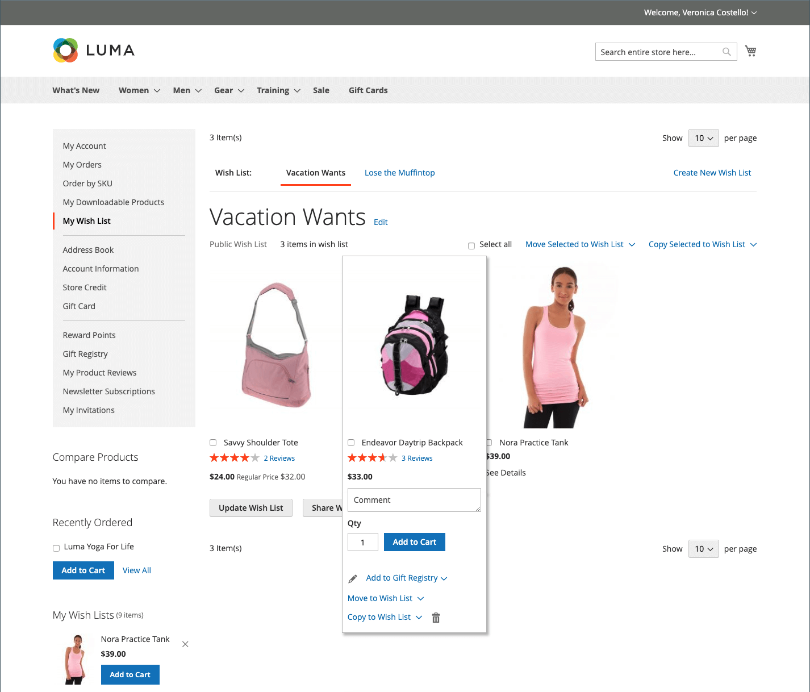

# Esperienza vetrina elenco desideri

Una lista dei desideri è un modo conveniente per i clienti di richiamare i prodotti che preferiscono, ma non sono pronti per acquistare. Gli articoli di una lista dei desideri possono essere condivisi con altri o aggiunti al carrello. Se il cliente dispone di più elenchi di desideri, il nome della lista corrente viene visualizzato nella parte superiore della pagina. I clienti possono gestire i propri elenchi di desideri dal dashboard dell’account. Gli amministratori del negozio possono inoltre aiutare i clienti a gestire le loro liste dei desideri dall’amministratore.

{width="700" zoomable="yes"}

 Adobe Commerce supporta l’utilizzo di più elenchi di desideri per account cliente.

 La base di codice del Magento Open Source supporta l’utilizzo di una singola lista di desideri per account cliente.

## Creare una lista dei desideri

 (Solo Adobe Commerce)

Nella vetrina, un cliente può creare una lista dei desideri dal proprio dashboard dell’account, da una pagina del prodotto, da una pagina del catalogo e dal carrello.

### Metodo 1: da un conto cliente

1. Nella barra laterale del dashboard dell’account, il cliente sceglie **[!UICONTROL My Wish List]**.

1. Nell’angolo in alto a destra, fa clic su **[!UICONTROL Create New Wish List]**.

1. Inserire il nome della lista dei desideri.

1. Per consentire ad altri di visualizzare la propria lista dei desideri, seleziona la **[!UICONTROL Public Wish List]** casella di controllo.

   >[!NOTE]
   >
   >La differenza principale tra `Public` e `Private` elenchi di desideri è che le liste di desideri private non sono [ricercabile](wishlist-configuration.md#add-wish-list-search) tramite elenchi di desideri.

1. Al termine, fai clic su **[!UICONTROL Save]**.

   {width="700" zoomable="yes"}

### Metodo 2: dalla pagina del catalogo

1. Dalla vetrina, il cliente accede alla pagina del catalogo contenente il prodotto che desidera aggiungere a una lista dei desideri.

1. Passa il mouse sopra il prodotto.

1. Il cliente fa clic sulla freccia accanto al _Aggiungi alla lista dei desideri_ e seleziona il **[!UICONTROL Create New Wish List]**.

1. Inserisce il nome della lista dei desideri.

1. Per consentire ad altri di visualizzare la propria lista dei desideri, seleziona la **[!UICONTROL Public Wish List]** casella di controllo.

1. Al termine, fai clic su **[!UICONTROL Save]**.

### Metodo 3: dalla pagina dei dettagli del prodotto

1. Dalla vetrina, il cliente accede alla pagina dei dettagli del prodotto che desidera aggiungere a una lista dei desideri.

1. Fai clic sulla freccia accanto a **[!UICONTROL Add to Wish List]** e sceglie **[!UICONTROL Create New Wish List]**.

1. Entra nel **[!UICONTROL Wish List Name]**.

1. Per consentire ad altri di visualizzare la propria lista dei desideri, seleziona la **[!UICONTROL Public Wish List]** casella di controllo.

1. Al termine, fai clic su **[!UICONTROL Save]**.

   {width="700" zoomable="yes"}

### Metodo 4: dal carrello

1. Il cliente apre il **[!UICONTROL Shopping Cart]** pagina.

1. Sotto l&#39;elemento, fare clic sulla freccia accanto a **[!UICONTROL Move to Wishlist]** e sceglie **[!UICONTROL Create New Wish List]**.

1. Entra nel **[!UICONTROL Wish List Name]**.

1. Per consentire ad altri di visualizzare la propria lista dei desideri, seleziona la **[!UICONTROL Public Wish List]** casella di controllo.

1. Al termine, fai clic su **[!UICONTROL Save]**.

{width="700" zoomable="yes"}

## Aggiornare l’elenco dei prodotti

1. Dalla lista dei desideri, il cliente punta al prodotto per visualizzare le opzioni.

1. Per aggiungere una **[!UICONTROL Comment]** sul prodotto, immette il testo nella casella sotto il prezzo.

   {width="700" zoomable="yes"}

1. Per modificare la selezione delle opzioni prodotto, fai clic su **[!UICONTROL Edit]** ed effettua quanto segue:

   - Aggiorna le opzioni nella pagina dei dettagli del prodotto.
   - Clic **[!UICONTROL Update Wish List]**.

## Aggiungere un prodotto della lista dei desideri al carrello

1. Nella lista dei desideri, il cliente punta al prodotto che desideri aggiungere.

1. Aggiorna il **[!UICONTROL Qty]** e modificare le altre opzioni in base alle esigenze.

1. Clic **[!UICONTROL Add to Cart]**.

## Condividi la lista desideri

1. Il cliente fa clic **[!UICONTROL Share Wishlist]**.

1. Inserisce l&#39;indirizzo e-mail di ogni persona che deve ricevere la lista dei desideri, separati da una virgola.

1. Aggiunge un **[!UICONTROL Message]** da includere nell’e-mail.

1. Clic **[!UICONTROL Share Wish List]**.

   {width="700" zoomable="yes"}

   Il messaggio viene inviato dal primario [contatto store](../getting-started/store-details.md#store-email-addresses) e include una miniatura di ciascun prodotto, con collegamenti al tuo store.

   {width="500" zoomable="yes"}

## Modifica elenchi di desideri

I clienti possono modificare la propria lista dei desideri in diversi modi dalla dashboard dell’account.

### Sposta elementi in un altro elenco

 (Solo Adobe Commerce)

1. Il cliente seleziona la casella di controllo di ogni elemento da spostare.

1. Clic **[!UICONTROL Move Selected to Wish List]** ed esegue una delle operazioni seguenti:

   - Seleziona una lista desideri esistente.
   - Clic **[!UICONTROL Create New Wish List]**.

### Copia elementi in un altro elenco

 (Solo Adobe Commerce)

1. Seleziona la casella di controllo di ogni elemento da spostare.

1. Clic **[!UICONTROL Copy Selected to Wish List]** ed esegue una delle operazioni seguenti:

   - Seleziona una lista desideri esistente.
   - Clic **[!UICONTROL Create New Wish List]**.

## Eliminare una lista dei desideri

 (Solo Adobe Commerce)

1. Il cliente apre la lista dei desideri da eliminare.

1. Clic **[!UICONTROL Delete Wish List]**.

1. Quando viene richiesto di confermare, fa clic su **[!UICONTROL OK]**.

>[!IMPORTANT]
>
>Questa azione non può essere annullata.

## Trasferisci voci elenco desideri al carrello

Per trasferire tutti gli elementi della lista dei desideri nel carrello, il cliente fa clic su **[!UICONTROL Add All to Cart]**.

Per aggiungere un singolo articolo, il cliente effettua le seguenti operazioni:

1. Passa il puntatore del mouse sull&#39;elemento e immette **[!UICONTROL Qty]** che desiderano aggiungere al carrello.

1. Clic **[!UICONTROL Add to Cart]**.

## Trovare una lista dei desideri del cliente

Se il [Widget ricerca elenco desideri](wishlist-configuration.md#add-wish-list-search) nelle pagine del negozio, i clienti possono effettuare ricerche in base al nome o all&#39;indirizzo e-mail del proprietario della lista dei desideri.

1. Dal widget di ricerca della lista dei desideri, il cliente seleziona un’opzione di ricerca.

1. Immette il nome o l&#39;indirizzo e-mail del proprietario della lista dei desideri e i clic **[!UICONTROL Search]**.

   Il _Ricerca elenco desideri_ La pagina viene aperta e tutte le liste dei desideri corrispondenti vengono visualizzate nella sezione dei risultati della ricerca.

   >[!NOTE]
   >
   >Nei risultati della ricerca vengono visualizzate solo le liste dei desideri pubbliche; le liste dei desideri private dei clienti non sono visualizzabili pubblicamente.

1. Per visualizzare l&#39;elenco delle voci dell&#39;elenco dei desideri, fare clic su **[!UICONTROL View]**.

   Per ogni lista dei desideri vengono visualizzati il nome del proprietario e la data dell&#39;ultimo aggiornamento.

1. Per aggiungere un prodotto al carrello, il cliente seleziona la casella di controllo sotto il prodotto e fa clic su **[!UICONTROL Add to Cart]**.

   Puoi anche aggiungere alla tua lista dei desideri articoli che ti piacciono di un altro cliente.
