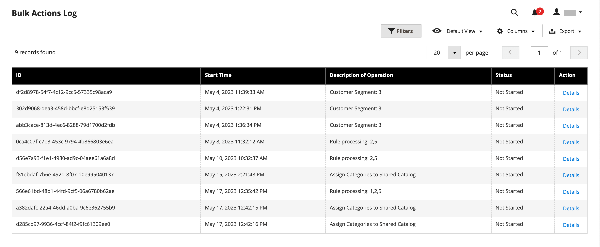

# Azioni in blocco

{{ee-feature}}

Il registro delle azioni in blocco registra i dettagli delle operazioni di massa asincrone eseguite in background, ad esempio l&#39;importazione/esportazione o l&#39;assegnazione di [prezzi personalizzati](../b2b/catalog-shared-manage.md#update-custom-pricing) a più prodotti in un [catalogo condiviso](../b2b/catalog-shared.md).

{width="600" zoomable="yes"}

## Configurare azioni in blocco

1. Nella barra laterale _Admin_, passa a **[!UICONTROL Stores]** > _[!UICONTROL Settings]_>**[!UICONTROL Configuration]**.

1. Nel pannello a sinistra, espandi **[!UICONTROL Advanced]** e scegli **[!UICONTROL System]**.

1. Espandere  nella sezione **[!UICONTROL Bulk Actions]** e impostare l&#39;opzione di salvataggio del registro:

   **[!UICONTROL Days Saved in Log]** — Immettere il numero di giorni in cui le azioni in blocco vengono salvate in un registro.

   {width="600" zoomable="yes"}

   Per un elenco dettagliato delle impostazioni di configurazione, vedere [_Azioni in blocco_](../configuration-reference/advanced/system.md) nel _Riferimento configurazione_.

1. Al termine, fare clic su **[!UICONTROL Save Config]**.

## Visualizza azioni in blocco

1. Nella barra laterale _Admin_, passa a **[!UICONTROL System]** > _[!UICONTROL Actions Logs]_>**[!UICONTROL Bulk Actions]**.

1. Trova l’azione desiderata nel registro.

1. Nella colonna _[!UICONTROL Action]_fare clic su **[!UICONTROL Details]**.
