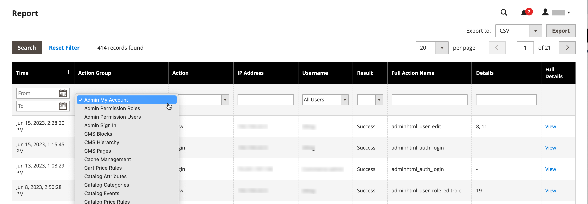

# Rapporto Registri azioni

{{ee-feature}}

Il _Registri azioni_ Il rapporto visualizza un record dettagliato di tutte le azioni amministratore abilitate per la registrazione. Ogni record è contrassegnato con marca temporale e registra l’indirizzo IP e il nome dell’utente. I dettagli del registro includono i dati utente amministratore e le relative modifiche apportate durante l’azione.

Le azioni che desideri visualizzare nel rapporto devono essere abilitate nel [Registrazione azioni amministratore](action-log.md) nelle impostazioni del negozio. Se il tipo di azione è selezionato (abilitato), questi tipi di azioni amministratore vengono visualizzati nel rapporto Registri azioni.

Il rapporto può essere filtrato utilizzando le opzioni in ogni colonna. È possibile impostare un&#39;unica opzione di filtro o impostare opzioni di filtro per più colonne per limitare il report ad elencare azioni specifiche. Puoi anche esportare i dati dei rapporti in formato CSV o XML Excel.

Il rapporto Action Logs (Registri azioni azioni) include le seguenti informazioni:

- **[!UICONTROL Time]** - Data e ora in cui si è verificata l’azione
- **[!UICONTROL Action Group]** : visualizza il tipo di azione, correlato alle azioni abilitate su _Registrazione azioni amministratore_ schermata nelle impostazioni del negozio
- **[!UICONTROL Action]** - Visualizza l&#39;azione registrata
- **[!UICONTROL IP Address]** - Visualizza l&#39;indirizzo IP del computer su cui è stata eseguita l&#39;azione
- **[!UICONTROL Username]** : visualizza l’ID di accesso dell’utente che ha eseguito l’azione
- **[!UICONTROL Result]** - Visualizza l&#39;esito positivo o negativo dell&#39;azione dell&#39;utente
- **[!UICONTROL Full Action Name]** - Visualizza il nome dell&#39;azione di back-end
- **[!UICONTROL Details]** - Visualizza la categoria dell&#39;azione di back-end
- **[!UICONTROL Full Details]** - Visualizza tutti i dettagli registrati dell’azione di amministrazione

## Visualizzare il rapporto Action Logs

1. Il giorno _Amministratore_ barra laterale, vai a **[!UICONTROL System]** > _[!UICONTROL Actions Logs]_>**[!UICONTROL Report]**.

   {width="600" zoomable="yes"}

1. Per visualizzare tutti i dettagli di un’azione di amministrazione elencata, fai clic su **[!UICONTROL View]**.

   {width="600" zoomable="yes"}

## Filtrare il rapporto Registri azioni

Puoi definire i campi delle opzioni filtro e quindi fare clic su **[!UICONTROL Search]** per limitare le azioni visualizzate.

Per cancellare le opzioni del filtro e tornare al rapporto completo, fai clic su **[!UICONTROL Reset Filter]**.

{width="600" zoomable="yes"}

| Campo | descrizione |
|--- |--- |
| [!UICONTROL Time] | In entrata **[!UICONTROL From]**, fai clic su per selezionare una data dal calendario dinamico per definire la data di inizio per il filtro. In entrata **[!UICONTROL To]**, fai clic su per selezionare una data per definire la data di fine per il filtro. |
| [!UICONTROL Action Group] | Scegli un gruppo di azioni. |
| [!UICONTROL Action] | Scegli un&#39;azione. |
| [!UICONTROL IP Address] | Immettere l&#39;indirizzo IP del computer utilizzato per un&#39;azione. |
| [!UICONTROL Username] | Scegli un nome utente. Il valore predefinito è `All Users`. |
| [!UICONTROL Result] | Scegliere Operazione completata o Operazione non riuscita. |
| [!UICONTROL Full Action Name] | Immetti il testo da cercare nel campo. |
| [!UICONTROL Details] | Immetti il testo da cercare nel campo. |

{style="table-layout:auto"}

## Esportare il rapporto Action Logs

1. Per **[!UICONTROL Export to]**, scegli un formato di esportazione:

   - `CSV` - File di valori separati da virgole contenente dati di testo normale
   - `Excel XML` - Formato di dati di fogli di calcolo basato su XML

1. Clic **[!UICONTROL Export]**.

   Il file generato viene salvato automaticamente nella cartella specificata per i download.

   {width="200"}
