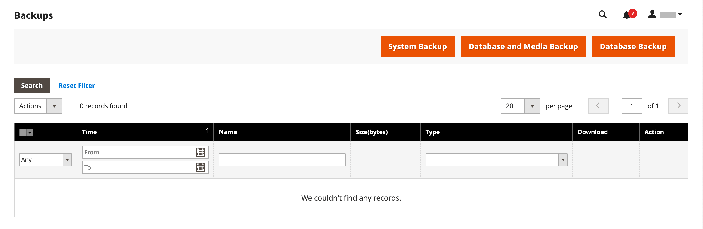

# Backup del sistema

Adobe Commerce e Magento Open Source consentono di eseguire il backup di diverse parti del sistema, ad esempio file system, database e file multimediali, e di eseguire il rollback automaticamente. Nella griglia della pagina _Backup_ viene visualizzato un record per ogni backup. Se si elimina un record dall&#39;elenco, viene eliminato anche il file archiviato. I file di backup del database vengono compressi utilizzando il formato GZ. Per i backup di sistema e i backup di database e supporti, viene utilizzato il formato TGZ. Come best practice, è consigliabile limitare l’accesso agli strumenti di backup ed eseguire il backup prima di installare estensioni e aggiornamenti.

- **Limita l&#39;accesso agli strumenti di backup.** L&#39;accesso allo strumento di gestione dei backup e del rollback può essere limitato configurando [ruoli utente](permissions-user-roles.md) per le risorse di backup e rollback. Per limitare l’accesso, lascia deselezionata la casella di controllo corrispondente. Per consentire l&#39;accesso alle risorse di rollback, è necessario concedere anche l&#39;accesso alle risorse di backup.

- **Eseguire il backup prima di installare estensioni e aggiornamenti.** Esegui sempre un backup prima di installare un&#39;estensione o un aggiornamento.

{{$include /help/_includes/backups-note.md}}

## Abilitare e pianificare i backup

1. Nella barra laterale _Admin_, passa a **[!UICONTROL Stores]** > _[!UICONTROL Settings]_>**[!UICONTROL Configuration]**.

1. Nel pannello a sinistra, espandi **[!UICONTROL Advanced]** e scegli **[!UICONTROL System]**.

1. Espandere  **[!UICONTROL Backup Settings]**.

1. Imposta **[!UICONTROL Enabled Schedule Backup]** su `Yes`.

1. Per pianificare i backup automatici, impostare le opzioni di pianificazione:

   - Imposta **[!UICONTROL Enabled Schedule Backup]** su `Yes`.
   - Impostare **[!UICONTROL Scheduled Backup Type]** sul tipo di backup da eseguire all&#39;intervallo pianificato.
   - Impostare **[!UICONTROL Start Time]** sull&#39;ora del giorno per eseguire l&#39;operazione di backup.
   - Imposta **[!UICONTROL Frequency]** su `Daily`, `Weekly` o `Monthly`.
   - Imposta **[!UICONTROL Maintenance Mode]** su `Yes`.

   {width="600" zoomable="yes"}

1. Al termine, fare clic su **[!UICONTROL Save Config]**.

## Creare un backup

1. Nella barra laterale _Admin_, passa a **[!UICONTROL System]** > _[!UICONTROL Tools]_>**[!UICONTROL Backups]**.

1. Nell&#39;angolo superiore destro fare clic sul tipo di backup che si desidera creare:

   - **[!UICONTROL System Backup]** - Crea un backup completo del database e del file system. Durante il processo, è possibile scegliere di includere la cartella dei supporti nel backup.

   - **[!UICONTROL Database and Media Backup]** - Crea un backup del database e della cartella dei supporti.

   - **[!UICONTROL Database Backup]** - Crea un backup del database.

   {width="600" zoomable="yes"}

1. Per attivare la modalità di manutenzione dell&#39;archivio durante il backup, selezionare la casella di controllo.

   Al termine del backup, la modalità di manutenzione viene disattivata automaticamente.

1. Per un backup di sistema, selezionare la casella di controllo **[!UICONTROL Include Media folder to System Backup]** per includere la cartella dei supporti.

1. Quando richiesto, conferma l’azione.

<!-- Last updated from includes: 2023-02-22 09:59:54 -->
