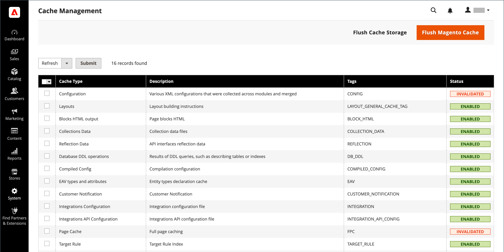
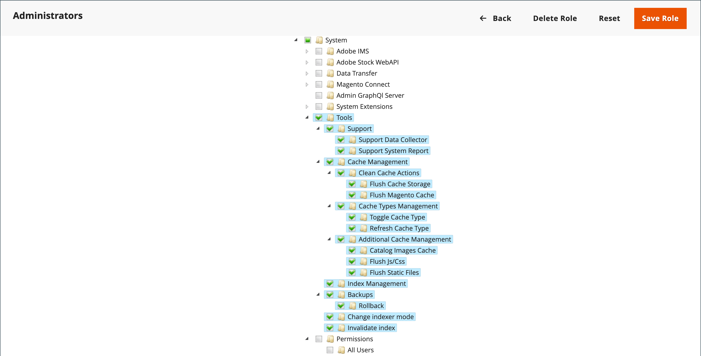

# Gestione della cache

Adobe Commerce e Magento Open Source Cache Management System offrono un modo semplice per migliorare le prestazioni del sito. Quando una cache richiede un aggiornamento, viene visualizzata una notifica con un collegamento alla pagina [!UICONTROL Cache Management] per completare l&#39;aggiornamento.

{width="500"}

La pagina _[!UICONTROL Cache Management]_&#x200B;mostra lo stato di ogni cache primaria e del relativo tag associato. I pulsanti grandi nell’angolo in alto a destra possono essere utilizzati per effettuare il flushing della cache o dell’archiviazione cache completa. Nella parte inferiore della pagina, pulsanti aggiuntivi consentono di svuotare la cache delle immagini dei prodotti del catalogo e la cache JavaScript/CSS.

>[!IMPORTANT]
>
>Quando vengono modificate le entità catalogo, questo può influenzare altre pagine e annullare la validità di più cache contemporaneamente. Quando si controlla la pagina Gestione cache, è possibile che vengano visualizzati elementi non validi che richiedono l&#39;aggiornamento quando sono stati _&#x200B;**non modificati direttamente**&#x200B;_. Ad esempio, l’annullamento della validità si verifica quando si modifica un prodotto del catalogo assegnato a una categoria o quando si modifica una regola di prodotto correlata.

Dopo aver cancellato una cache, aggiorna sempre il browser per assicurarti di poter visualizzare i file più recenti. La cancellazione della cache di Commerce non comporta la cancellazione della cache del browser Web. Per visualizzare il contenuto aggiornato, potrebbe essere necessario cancellare la cache del browser.

Ulteriori informazioni tecniche sul caching di Adobe Commerce sono disponibili nella [Panoramica sulla cache](https://developer.adobe.com/commerce/frontend-core/guide/caching/){:target=&quot;_blank&quot;} della _Guida allo sviluppo di Commerce Frontend_.

Accedere alla pagina _[!UICONTROL Cache Management]_&#x200B;eseguendo una delle operazioni seguenti:

- Fare clic sul collegamento **[!UICONTROL Cache Management]** nel messaggio sopra l&#39;area di lavoro.
- Nella barra laterale _Admin_, passa a **[!UICONTROL System]** > _[!UICONTROL Tools]_>**[!UICONTROL Cache Management]**.

{width="700" zoomable="yes"}

## Best practice per il caching

La reindicizzazione e il caching hanno scopi diversi in Commerce. [Gli indici](index-management.md) tengono traccia delle informazioni del database per migliorare le prestazioni di ricerca, velocizzare il recupero dei dati per gli storefront e altro ancora. Le cache consentono di salvare i dati caricati, le immagini, i formati e così via per migliorare le prestazioni di caricamento e accesso alla vetrina.

- Svuota sempre la cache dopo aver installato estensioni/moduli. Puoi installare una o più estensioni, quindi svuotare la cache.
- Svuota la cache dopo l’installazione di Commerce. Per le nuove installazioni, è inoltre necessario reindicizzare.
- Svuota la cache dopo l’aggiornamento da una versione di Open Source o Commerce a un’altra.
- Quando si scaricano le cache, considerare il tipo di cache e pianificare lo scaricamento durante gli orari non di picco. Ad esempio, scegli un’ora in cui pochi clienti utilizzano il sito, ad esempio la sera tardi o la mattina presto. La cancellazione dei tipi di cache durante il picco della domanda può aumentare il carico sull’amministratore e causare l’inattività del sito fino al completamento dell’operazione.
- Durante la [reindicizzazione](index-management.md) non è necessario svuotare la cache.

## Risorse del ruolo Gestione cache

Puoi assegnare agli utenti l’accesso a specifiche azioni di manutenzione della cache per ruolo, comprese le opzioni per visualizzare, attivare e disattivare le cache. L’Adobe consiglia di abilitare le azioni di svuotamento solo per gli utenti a livello di amministratore. L&#39;accesso a tutte le funzioni di gestione della cache può influire sulle prestazioni della vetrina.

{width="600" zoomable="yes"}

Per informazioni sull&#39;assegnazione di risorse per concedere l&#39;accesso agli account utente amministratore, vedere [Risorse ruolo](permissions-user-roles.md#role-resources). Le risorse seguenti controllano l’accesso agli strumenti di gestione della cache:

- [!UICONTROL Clean Cache Actions]

   - [!UICONTROL Flush Cache Storage]
   - [!UICONTROL Flush Magento Cache]

- [!UICONTROL Cache Type Management]

   - [!UICONTROL Toggle Cache Type]
   - [!UICONTROL Refresh Cache Type]

- [!UICONTROL Additional Cache Management]

   - [!UICONTROL Catalog Images Cache]
   - [!UICONTROL Flush Js/Css]
   - [!UICONTROL Flush Static Files]

## Aggiorna cache specifiche

1. Per ogni cache da aggiornare, seleziona la casella di controllo all’inizio della riga.

1. Impostare **[!UICONTROL Actions]** su `Refresh` e fare clic su **[!UICONTROL Submit]**.

## Esegui aggiornamento di massa delle azioni

1. Per selezionare un gruppo di cache, impostare **[!UICONTROL Mass Actions]** su una delle seguenti opzioni:

   - `Select All`
   - `Select Visible`

1. Selezionare la casella di controllo per ogni cache da aggiornare.

1. Impostare **[!UICONTROL Actions]** su `Refresh` e fare clic su **[!UICONTROL Submit]**.

## Svuota la cache delle immagini del prodotto

1. In _[!UICONTROL Additional Cache Management]_, fare clic su **[!UICONTROL Flush Catalog Images Cache]**&#x200B;per cancellare i file di immagine del prodotto pregenerati.

   Il messaggio `Image cache was cleaned` viene visualizzato nella parte superiore dell&#39;area di lavoro.

1. Cancella la cache del browser.

## Scaricare la cache JavaScript/CSS

1. In _[!UICONTROL Additional Cache Management]_, cancellare i file JavaScript e CSS che sono stati uniti in un singolo file facendo clic su **[!UICONTROL Flush JavaScript/CSS Cache]**.

   Il messaggio `The JavaScript/CSS cache has been cleaned` viene visualizzato nella parte superiore dell&#39;area di lavoro.

1. Cancella la cache del browser.

## Svuota utilizzando la riga di comando

Gli amministratori di sistema e gli sviluppatori con accesso al server applicazioni Commerce possono inoltre gestire la configurazione della cache e della cache dalla riga di comando utilizzando Commerce CLI. Vedi [Gestione della cache](https://experienceleague.adobe.com/it/docs/commerce-operations/configuration-guide/cli/manage-cache#clean-and-flush-cache-types){:target=&quot;_blank&quot;} nella _Guida alla configurazione_.

## Controlli

| Controllo | Descrizione |
|---------------------------|------------------------------------------------------------------------------------------------------------------------------------------------------------------------------------------------------------------------------------------------------------------------------------------------------------------------------------------------------------|
| [!UICONTROL Mass Actions] | Seleziona la casella di controllo di più cache. Opzioni:  **[!UICONTROL Select All]**- Seleziona la casella di controllo di tutte le cache. **&#x200B; Deseleziona tutto &#x200B;**— deseleziona la casella di controllo di tutte le cache. **[!UICONTROL Select Visible]** — seleziona la casella di controllo di tutte le cache visibili.  **[!UICONTROL Unselect Visible]**- Cancella la casella di controllo di tutte le cache visibili. |
| [!UICONTROL Actions] | Determina l&#39;azione da applicare a tutte le cache selezionate. Opzioni:  **[!UICONTROL Enable]**- Abilita tutte le cache selezionate. **[!UICONTROL Disable]** - Disattiva tutte le cache selezionate.  **[!UICONTROL Refresh]**- Aggiorna tutte le cache selezionate. |
| [!UICONTROL Submit] | Applica l&#39;azione a tutte le cache selezionate. |

{style="table-layout:auto"}

### Pulsanti

| Pulsante | Descrizione |
|-----------------------------------------|----------------------------------------------------------------------------------------------------------------------------------------------------------------------------------------------------------------------------------------|
| [!UICONTROL Flush Magento Cache] | Rimuove tutti gli elementi nella cache predefinita di Commerce (`var/cache`), in base ai tag Commerce associati. |
| [!UICONTROL Flush Cache Storage] | Rimuove tutti gli elementi dalla cache, indipendentemente dal tag di Commerce. Se il sistema utilizza un percorso di cache alternativo, tutti i file memorizzati in cache utilizzati da altre applicazioni vengono rimossi durante il processo. |
| [!UICONTROL Flush Catalog Images Cache] | Rimuove tutte le immagini di catalogo ridimensionate e filigranate automaticamente archiviate in `media/catalog/product/cache`. Se le immagini caricate di recente non sono incluse nel catalogo, prova a scaricare il catalogo e ad aggiornare il browser. |
| [!UICONTROL Flush JavaScript/CSS Cache] | Rimuove la copia unita dei file JavaScript e CSS dalla cache. Se le modifiche recenti al foglio di stile o al JavaScript non vengono riportate nell’archivio, prova a svuotare la cache JavaScript/CSS e ad aggiornare il browser. |
| [!UICONTROL Flush Static Files Cache] | Rimuove i file di visualizzazione preelaborati e i file statici. |

{style="table-layout:auto"}

### Cache

Nella pagina [!UICONTROL Cache Management] sono elencati i tipi di cache che è possibile gestire dall&#39;amministratore con il relativo stato corrente. Questa sezione descrive i tipi di cache predefiniti supportati da Adobe Commerce. Le colonne _Tag cache_ e _ID cache_ descrivono i valori utilizzati nel codice dell&#39;applicazione Commerce:

- `cache_type_id` definisce l&#39;identificatore univoco per un tipo di cache.

- `%CACHE_TYPE_TAG%` definisce il tag univoco da utilizzare nell&#39;ambito del tipo di cache.

Sviluppatori e integratori di sistemi utilizzano questi valori per configurare e gestire la memorizzazione in cache durante la personalizzazione o l’integrazione con Adobe Commerce, ad esempio lo sviluppo di integrazioni tramite API GraphQL. `cache type id` viene utilizzato anche per la gestione della cache dalla riga di comando del server applicazioni tramite Commerce CLI. Ad esempio, ` bin/magento cache:status config` visualizza lo stato corrente della cache di configurazione.

>[!NOTE]
>
>Sviluppatori e integratori di sistemi possono personalizzare ed estendere il sistema di gestione della cache di Commerce per supportare moduli e integrazioni personalizzati. Per informazioni dettagliate, vedere [Configurare il caching](https://experienceleague.adobe.com/it/docs/commerce-operations/configuration-guide/cache/caching-overview) nella _Guida alla configurazione di Adobe Commerce_.

<!-- prettier-ignore -->

#### Dettagli elenco cache

| Cache | Descrizione | Tag cache | ID cache |
|-------|------------|----------|----------|
| [!UICONTROL Configuration] | Commerce raccoglie la configurazione XML da tutti i moduli, la unisce e salva il risultato unito nella cache. **[!UICONTROL System]**- `config.xml`,`local.xml` **[!UICONTROL Module]** - `config.xml`  La cache contiene anche le impostazioni specifiche dell&#39;archivio memorizzate nel file system e nel database. Pulisci o svuota questo tipo di cache dopo aver modificato i file di configurazione. | `CONFIG` | `config` |
| [!UICONTROL Layouts] | Layout di pagina compilati, ovvero i componenti di layout di tutti i componenti. Pulisci o svuota questo tipo di cache dopo aver modificato i file di layout. | `LAYOUT_GENERAL_CACHE_TAG` | `layout` |
| [!UICONTROL Blocks HTML output] | Frammenti di pagina HTML per blocco. Pulite o svuotate questo tipo di cache dopo aver modificato il livello di vista. | `BLOCK_HTML` | `block_html` |
| [!UICONTROL Collections Data] | File di dati di raccolta che memorizzano i risultati delle query di database. Se necessario, Commerce pulisce automaticamente questa cache, ma gli sviluppatori di terze parti possono inserire qualsiasi dato in qualsiasi segmento della cache. Pulisci o svuota questo tipo di cache se il modulo personalizzato utilizza una logica che determina voci della cache che Commerce non è in grado di pulire. | `COLLECTION_DATA` | `collections` |
| [!UICONTROL Reflections] | Cancella i dati di riflessione dell’interfaccia API, in genere generati durante il runtime. | `REFLECTION` | `reflection` |
| `Database DDL operations` | Schema del database. Se necessario, Commerce pulisce automaticamente questa cache, ma gli sviluppatori di terze parti possono inserire qualsiasi dato in qualsiasi segmento della cache. Pulisci o svuota questo tipo di cache dopo aver apportato modifiche personalizzate allo schema del database. In altre parole, si tratta di aggiornamenti che Commerce non genera. Un modo per aggiornare automaticamente lo schema del database è utilizzare il comando magento setup:db-schema:upgrade. | `DB_DDL` | `db_ddl` |
| [!UICONTROL Compiled Config] | Risultati della compilazione del codice. | `COMPILED_CONFIG` | `compiled_config` |
| [!UICONTROL Webhooks Response Cache] | Memorizza nella cache le risposte alle richieste di webhook. Per ulteriori informazioni, consulta la [Guida ai webhook](https://developer.adobe.com/commerce/extensibility/webhooks/release-notes/#enhancements-2) nella documentazione per gli sviluppatori di Commerce. | `WEBHOOKS_RESPONSE` | `webhooks_response` |
| [!UICONTROL EAV types and attributes] | Memorizza nella cache la dichiarazione dei tipi di entità per i metadati relativi agli attributi del valore dell&#39;attributo di entità (EAV). Gli attributi includono le etichette dei negozi, i collegamenti al codice PHP correlato, il rendering degli attributi, le impostazioni di ricerca e così via. In genere non è necessario pulire o svuotare questo tipo di cache. | `EAV` | `eav` |
| [!UICONTROL Customer Notification] | Notifiche temporanee visualizzate nell’interfaccia utente. | `CUSTOMER_NOTIFICATION` | `customer_notification` |
| [!UICONTROL GraphQL Query Resolver Results] | Memorizza nella cache i risultati dei risolutori di query GraphQL per le entità cliente, pagina CMS, blocco CMS e galleria di supporti del prodotto. Mantieni questa cache abilitata per migliorare le prestazioni del GraphQL. | `GRAPHQL_QUERY_RESOLVER_RESULT` | `graphql_query_resolver_result` |
| [!UICONTROL Integrations Configuration] | File di configurazione dell’integrazione. Pulisci o svuota la cache dopo aver modificato o aggiunto le integrazioni. | `INTEGRATION` | `config_integration` |
| [!UICONTROL Integrations API Configuration] | È stata compilata la configurazione delle API di integrazione per le integrazioni store. | `INTEGRATION_API_CONFIG` | `config_integration_api` |
| [!UICONTROL Admin UI SDK Cache] | Memorizza nella cache le personalizzazioni per l’Amministratore. Consulta [Configurazione e test amministratore](https://developer.adobe.com/commerce/extensibility/admin-ui-sdk/configuration/) nella _Guida dell&#39;SDK per l&#39;interfaccia utente amministratore_. | `ADMIN_UI_SDK` | `admin_ui_sdk` |
| [!UICONTROL Page Cache] | Memorizzazione in cache di pagine intere. | `FPC` | `full_page` |
| [!UICONTROL Target Rule] | Indice delle regole di destinazione | `TARGET_RULE` | `target_rule` |
| [!UICONTROL Web Services Configuration] | Memorizzazione in cache della struttura API web. | `WEBSERVICE` | `config_webservice` |
| [!UICONTROL Translations] | File di traduzione. | `TRANSLATE` | `translate` |

{style="table-layout:auto"}

## Memorizzazione in cache a pagina intera

Adobe Commerce e Magento Open Source utilizzano il caching a pagina intera sul server per visualizzare rapidamente le pagine per categorie, prodotti e CMS. La memorizzazione nella cache a pagina intera migliora i tempi di risposta e riduce il carico sul server. Senza la memorizzazione nella cache, ogni pagina potrebbe dover eseguire blocchi di codice e recuperare informazioni dal database. Tuttavia, con il caching a pagina intera abilitato, una pagina completamente generata può essere letta direttamente dalla cache.

>[!NOTE]
>
>Si consiglia di utilizzare [Cache vernice](https://varnish-cache.org/){:target=&quot;_blank&quot;} solo in un ambiente di produzione.

Il contenuto nella cache può essere utilizzato per elaborare le richieste provenienti da tipi di visite simili. Di conseguenza, le pagine mostrate a un visitatore occasionale potrebbero differire dalle pagine mostrate a un cliente. Ai fini del caching, ogni visita è di tre tipi:

- `Non-sessioned` - Durante una visita non in sessione, l&#39;acquirente visualizza le pagine, ma non interagisce con il negozio. Il sistema memorizza in cache il contenuto di ogni pagina visualizzata e le distribuisce ad altri acquirenti non sessionati.
- `Sessioned` - Durante una visita con sessione, agli acquirenti che interagiscono con l&#39;archivio viene assegnato un ID sessione. Le interazioni includono attività come il confronto di prodotti o l’aggiunta di prodotti al carrello. Le pagine in cache generate durante la sessione vengono utilizzate solo da quell’acquirente durante la sessione.
- `Customer` - Le sessioni per i clienti vengono create per i clienti che accedono e acquistano utilizzando il proprio account registrato. Durante la sessione, ai clienti possono essere presentate offerte speciali, promozioni e prezzi in base al gruppo di clienti assegnato.

Per informazioni tecniche, vedere [Configurare e utilizzare Vernice](https://experienceleague.adobe.com/docs/commerce-operations/configuration-guide/cache/varnish/config-varnish.html?lang=it){:target=&quot;_blank&quot;} e [Utilizzare Redis per la pagina Commerce e la cache predefinita](https://experienceleague.adobe.com/docs/commerce-operations/configuration-guide/cache/redis/redis-pg-cache.html?lang=it){:target=&quot;_blank&quot;} nella _Guida alla configurazione_.

**_Per configurare la cache a pagina intera:_**

1. Nella barra laterale _Admin_, passa a **[!UICONTROL Stores]** > _[!UICONTROL Settings]_>**[!UICONTROL Configuration]**.

1. Nel pannello a sinistra, espandi **[!UICONTROL Advanced]** e scegli **[!UICONTROL System]**.

1. Espandere  nella sezione **[!UICONTROL Full Page Cache]**.

   {width="600" zoomable="yes"}

1. Imposta **[!UICONTROL Caching Application]** su uno dei seguenti:

   - `Built-in Application`
   - `Varnish Caching`

1. Per impostare il timeout per la cache delle pagine, immettere **[!UICONTROL TTL for public content]**. Il valore predefinito è `86400`

1. Per specificare il numero massimo di [handle di layout](https://developer.adobe.com/commerce/frontend-core/guide/layouts/#layout-handles) da elaborare sull&#39;endpoint HTTP [`{BASE-URL}/page_cache/block/esi`](https://experienceleague.adobe.com/docs/commerce-operations/configuration-guide/cache/use-varnish-esi.html?lang=it), immettere **[!UICONTROL Handles param size]**. La limitazione delle dimensioni può migliorare la sicurezza e le prestazioni. Il valore predefinito è `100`

1. Se si utilizza Vernice, completare la sezione **[!UICONTROL Varnish Configuration]** come segue:

   - **[!UICONTROL Access list]** - Immettere gli indirizzi IP che possono eliminare la configurazione Vernice per generare un file di configurazione. Separa più voci con una virgola. Il valore predefinito è `localhost`.

   - **[!UICONTROL Backend host]** - Immettere l&#39;indirizzo IP dell&#39;host backend che genera i file di configurazione. Il valore predefinito è `localhost`.

   - **[!UICONTROL Backend port]** - Identificare la porta back-end utilizzata per generare i file di configurazione. Valore predefinito: `8080`.

   - **[!UICONTROL Grace period]** - Specificare il numero di secondi da utilizzare come periodo di tolleranza per generare i file di configurazione. Vedere [Configurazione avanzata vernice](https://experienceleague.adobe.com/docs/commerce-operations/configuration-guide/cache/config-varnish-advanced.html?lang=it) nella _Guida alla configurazione_.

   - Per esportare la configurazione come file `varnish.vcl`, fare clic sul pulsante della versione di vernice utilizzata.

   {width="600" zoomable="yes"}

1. Al termine, fare clic su **[!UICONTROL Save Config]**.
