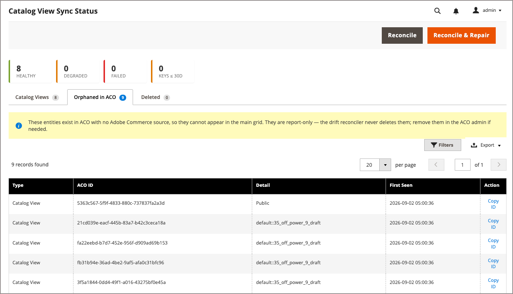

# Monitoraggio dello stato di sincronizzazione della visualizzazione catalogo

Utilizzare la pagina Stato di sincronizzazione della visualizzazione del catalogo per monitorare la sincronizzazione e risolvere i problemi relativi alle visualizzazioni del catalogo proiettate in Adobe Commerce Optimizer. Per ogni catalogo condiviso personalizzato, [!DNL Adobe Commerce Optimizer Connector for B2B] crea una visualizzazione catalogo per ogni visualizzazione archivio nell&#39;ambito del sito Web del catalogo condiviso. Ogni vista catalogo è configurata con un criterio di assortimento, il relativo listino prezzi collegato e la chiave pubblica utilizzata per convalidare i token di accesso limitato. Adobe Commerce conserva i metadati di visualizzazione del catalogo corrispondenti, tra cui la chiave privata e l’ID predefinito del listino prezzi.

>[!NOTE]
>
>Per tenere traccia dello stato di sincronizzazione per i feed dati del catalogo, utilizzare la pagina [[!UICONTROL Data Feed Sync Status]](data-feed-sync-status.md).

## Pubblico e disponibilità {#audience}

[!BADGE Solo PaaS]{type=Informative url="https://experienceleague.adobe.com/it/docs/commerce/user-guides/product-solutions" tooltip="Applicabile solo ai progetti Adobe Commerce on Cloud Infrastructure e on-premise."}

La pagina [!UICONTROL Catalog View Sync Status] è disponibile per i commercianti Adobe Commerce on Cloud Infrastructure e on-premise che utilizzano cataloghi condivisi B2B con l&#39;integrazione [!DNL Adobe Commerce Optimizer Connector for B2B]. La pagina viene installata e attivata automaticamente quando viene installata l’estensione del connettore.

## Accedere alla pagina Stato di sincronizzazione della vista catalogo {#access-catalog-view-sync-status-page}

Dall&#39;area di amministrazione, passare a **[!UICONTROL System]** > **[!UICONTROL Data Transfer]** > **[!UICONTROL Catalog View Sync Status]**.

{width="600" zoomable="yes"}

La pagina presenta tre schede:

- **[!UICONTROL Catalog Views]** - Visualizzazioni catalogo create dal connettore, con integrità di sincronizzazione per ciascuna. Vedi [Riepilogo stato sincronizzazione visualizzazione catalogo](#catalog-view-sync-status-summary).
- **[!UICONTROL Orphaned in ACO]** - Entità esistenti in [!DNL Adobe Commerce Optimizer] senza origine [!DNL Adobe Commerce] corrispondente. Vedere [Orfano nella scheda ACO](#orphaned-in-aco-tab).
- **[!UICONTROL Deleted]** - Record di proiezioni della vista catalogo rimosse perché il catalogo condiviso è stato eliminato. Vedi [Scheda eliminata](#deleted-tab).

## Riepilogo stato sincronizzazione visualizzazione catalogo {#catalog-view-sync-status-summary}

Le schede di riepilogo nella parte superiore della pagina mostrano il numero di visualizzazioni del catalogo in ogni stato di integrità, più un conteggio delle chiavi di accesso con restrizioni che scadono entro 30 giorni:

| Scheda | Descrizione |
| --- | --- |
| **Integro** | Visualizzazioni del catalogo senza alcuna deriva rilevata. |
| **Danneggiato** | Visualizzazioni del catalogo con deriva riparabile. |
| **Non riuscito** | Visualizzazioni catalogo che non sono mai state create o che sono state eliminate direttamente in [!DNL Adobe Commerce Optimizer]. |
| **Tasti ≤ 30D** | Chiavi di accesso limitate con scadenza entro 30 giorni. |

Nella griglia viene visualizzata una riga per ogni vista catalogo:

| Campo | Descrizione |
| --- | --- |
| **Visualizzazione catalogo** | Identificatore della visualizzazione catalogo proiettata in [!DNL Adobe Commerce Optimizer]. |
| **Source** | Catalogo condiviso da cui è stata proiettata la vista catalogo. Seleziona il collegamento per aprire il catalogo condiviso in Admin. |
| **Visualizzazione archivio** | La vista store rappresentata dalla vista catalogo. |
| **Aziende** | Numero di società attualmente collegate a questa visualizzazione catalogo. |
| **Stato** | Stato di sincronizzazione complessivo della visualizzazione del catalogo. Vedere [Valori stato sincronizzazione](#sync-status-values). |
| **Criterio** | Se il criterio di assortimento assegnato a questa visualizzazione catalogo corrisponde alla configurazione [!DNL Adobe Commerce]. |
| **Listino prezzi** | Indica se il listino prezzi assegnato alla vista catalogo corrisponde alla configurazione [!DNL Adobe Commerce]. |
| **Chiave di accesso** | Indica se una chiave di accesso limitato è collegata a questa visualizzazione catalogo. |
| **Scadenza chiave** | Data di scadenza della chiave di accesso limitato della visualizzazione catalogo e numero di giorni rimanenti. |
| **Deriva** | Tipo di deriva eventualmente rilevato. |
| **Ultimo/i riconciliato/i** | L’ultima volta che il processo di riconciliazione ha selezionato questa vista catalogo. |
| **Azione** | **[!UICONTROL View details]** apre la pagina dei dettagli dello stato di sincronizzazione della visualizzazione del catalogo per visualizzare lo stato corrente, la deriva, le chiavi di accesso e gli eventi recenti. **[!UICONTROL Open in ACO admin]** apre la pagina dei dettagli di visualizzazione del catalogo in [!DNL Adobe Commerce Optimizer] Studio. **[!UICONTROL Copy ID]** copia l&#39;ID della vista catalogo come riferimento. Vedi [Riconciliare e correggere la deriva](#reconcile-and-repair-drift). |

## Valori di stato di sincronizzazione {#sync-status-values}

| Stato | Significato |
| --- | --- |
| **Integro** | Nessuna deriva rilevata. La visualizzazione catalogo, il criterio, il listino prezzi e le chiavi corrispondono alla configurazione [!DNL Adobe Commerce]. |
| **Danneggiato** | È stata rilevata una deriva che può essere riparata, ad esempio un criterio o un listino prezzi è stato modificato direttamente in [!DNL Adobe Commerce Optimizer]. |
| **Non riuscito** | La visualizzazione catalogo non è mai stata creata o è stata eliminata direttamente in [!DNL Adobe Commerce Optimizer]. |
| **In sospeso** | La vista catalogo non è ancora stata riconciliata o è in attesa della prima proiezione. |
| **Ritiro** | Il catalogo condiviso è stato eliminato in [!DNL Adobe Commerce] e la visualizzazione del catalogo rientra nel periodo di tolleranza per l&#39;eliminazione. |
| **Eliminato** | La proiezione della vista catalogo è stata rimossa dopo il periodo di tolleranza. Viene conservato come record nella scheda [!UICONTROL Deleted] per 90 giorni. |
| **Orfano** | La visualizzazione o la chiave del catalogo esiste in [!DNL Adobe Commerce Optimizer] ma non ha un&#39;origine [!DNL Adobe Commerce] corrispondente. Vedere [Orfano nella scheda ACO](#orphaned-in-aco-tab). |

### Configurare il periodo di tolleranza per l’eliminazione {#configure-the-deletion-grace-period}

Il periodo di tolleranza per l’eliminazione specifica la finestra di conservazione dei dati per le visualizzazioni di catalogo e i dati associati dopo l’eliminazione del catalogo condiviso associato. Il valore predefinito è 7 giorni.
Alla scadenza della finestra, tutti i dati vengono rimossi.

#### Modificare l’impostazione di conservazione dei dati

1. Apri l&#39;amministratore [!DNL Adobe Commerce].

1. Dal menu **[!UICONTROL Stores]**, selezionare **[!UICONTROL Configuration]** > **[!UICONTROL Services]** > **[!UICONTROL ACO Catalog View Sync]** > **[!UICONTROL Deletion]** > **[!UICONTROL Deletion Grace Period (days)]**.

1. Aggiornare il valore **[!UICONTROL Deletion Grace Period (days)]** in base alle esigenze.

   Per rimuovere una proiezione ACO della vista catalogo immediatamente dopo l&#39;eliminazione di un catalogo condiviso, impostare questo valore su `0`.

1. Selezionare **[!UICONTROL Save Config]**.

Per informazioni dettagliate, vedere [Servizi > Sincronizzazione visualizzazione catalogo ACO](../configuration-reference/services/aco-catalog-view-sync.md) per tutte le impostazioni di sincronizzazione e riconciliazione della deriva disponibili.

## Riconciliare e correggere le differenze di configurazione {#reconcile-and-repair-drift}

[!DNL Adobe Commerce] è l&#39;origine autorevole per la proiezione di cataloghi condivisi B2B. Reconciliation confronta la configurazione di [!DNL Adobe Commerce] con [!DNL Adobe Commerce Optimizer] e segnala o corregge eventuali differenze.

>[!IMPORTANT]
>
>Le modifiche apportate direttamente in [!DNL Adobe Commerce Optimizer] a una vista di catalogo, a un criterio, a un listino prezzi o a una chiave gestita dal connettore non sono l&#39;origine principale della verità. Reconciliation riporta queste come differenze di configurazione e, quando si esegue il ripristino, le ripristina in modo che corrispondano a [!DNL Adobe Commerce]. Apportare modifiche alla configurazione in [!DNL Adobe Commerce], non in [!DNL Adobe Commerce Optimizer]. Il ripristino non rimuove i criteri aggiunti manualmente insieme a quello gestito dal connettore.

Utilizza i pulsanti a livello di pagina per riconciliare:

- **[!UICONTROL Reconcile]** - Controlla le differenze di configurazione e aggiorna lo stato di sincronizzazione senza apportare modifiche in [!DNL Adobe Commerce Optimizer].

- **[!UICONTROL Reconcile & Repair]** - Controlla le differenze di configurazione e ripristina automaticamente la configurazione prevista per eventuali differenze riparabili.

  Selezionando **[!UICONTROL Reconcile & Repair]** viene inviata una richiesta di riconciliazione asincrona e viene restituito prima dell&#39;esecuzione del ripristino. Un messaggio di conferma informa che lo stato verrà aggiornato a breve, ma la pagina non viene ricaricata automaticamente. Attendere il completamento dell&#39;elaborazione, quindi aggiornare la griglia per verificare il risultato.

Utilizza il menu **[!UICONTROL Action]** su una riga per:

- **[!UICONTROL View details]** - Aprire la pagina dei dettagli Stato sincronizzazione visualizzazione catalogo per visualizzare lo stato corrente, la deriva, le chiavi di accesso e gli eventi recenti.
- **[!UICONTROL Open in ACO admin]** - Aprire la pagina dei dettagli di visualizzazione del catalogo in [!DNL Adobe Commerce Optimizer] Studio.
- **[!UICONTROL Copy ID]** - Copia l&#39;ID della vista catalogo come riferimento.

## Orfano nella scheda ACO {#orphaned-in-aco-tab}

La scheda **[!UICONTROL Orphaned in ACO]** elenca le visualizzazioni del catalogo e le chiavi di accesso con restrizioni esistenti in [!DNL Adobe Commerce Optimizer] ma prive dell&#39;origine [!DNL Adobe Commerce] corrispondente, ad esempio le entità create manualmente in [!DNL Adobe Commerce Optimizer] Studio anziché dal connettore. Queste entità non possono essere visualizzate nella griglia principale perché non è presente alcun record [!DNL Adobe Commerce] con cui confrontarle.

{width="600" zoomable="yes"}

| Campo | Descrizione |
| --- | --- |
| **Tipo** | Categoria dell&#39;entità orfana: [!UICONTROL Catalog View] o [!UICONTROL Access Key]. |
| **ID ACO** | Identificatore dell&#39;entità in [!DNL Adobe Commerce Optimizer]. |
| **Dettagli** | Contesto aggiuntivo sull’entità, ad esempio il relativo criterio. |
| **Visualizzato per primo** | Quando la riconciliazione ha rilevato per la prima volta questa entità. |
| **Azione** | Selezionare **[!UICONTROL Copy ID]** per copiare l&#39;identificatore di entità. Utilizzare l&#39;ID copiato per individuare e rimuovere l&#39;entità dalle visualizzazioni del catalogo di [!DNL Adobe Commerce Optimizer] Studio. |

>[!NOTE]
>
>Questa scheda è solo per report. Reconciliation non elimina mai le entità orfane. Rimuoverli direttamente in [!DNL Adobe Commerce Optimizer] Studio se non sono più necessari.

## Scheda Eliminata {#deleted-tab}

Nella scheda **[!UICONTROL Deleted]** sono elencate le proiezioni della vista catalogo rimosse perché il catalogo condiviso è stato eliminato in [!DNL Adobe Commerce]. Poiché il catalogo condiviso e la relativa vista catalogo non esistono più, queste righe non vengono collegate in alcun punto. Vengono conservati solo come record di ciò che è stato rimosso.

{width="600" zoomable="yes"}

| Campo | Descrizione |
| --- | --- |
| **Visualizzazione catalogo** | Identificatore della visualizzazione catalogo rimossa. |
| **Source** | Catalogo condiviso eliminato. |
| **Visualizzazione archivio** | Visualizzazione archivio rappresentata dalla visualizzazione catalogo. |
| **Eliminato Alle** | Quando la proiezione è stata rimossa. |

Le righe in questa scheda vengono cancellate automaticamente dopo 90 giorni.

## Limitazioni note

- Nessun indicatore visivo in [!DNL Adobe Commerce Optimizer] Studio che distingue le visualizzazioni catalogo gestite dal connettore da quelle create manualmente. Utilizzare questa pagina, non l&#39;interfaccia utente di [!DNL Adobe Commerce Optimizer] Studio, per determinare le operazioni di gestione del connettore.
- La colonna **[!UICONTROL ACO ID]** della scheda **[!UICONTROL Orphaned in ACO]** identifica una visualizzazione catalogo, un criterio o una chiave di accesso, non un identificatore univoco. La denominazione delle colonne è soggetta a modifiche.

>[!MORELIKETHIS]
>
> - [Gestisci configurazione visualizzazione catalogo](/help/b2b/catalog-views-manage.md): controlla le visualizzazioni catalogo dall&#39;account condiviso del catalogo o dell&#39;azienda
> - [Stato sincronizzazione feed dati](data-feed-sync-status.md)
> - [Servizi > Sincronizzazione visualizzazione catalogo ACO](../configuration-reference/services/aco-catalog-view-sync.md) — Configura i periodi di tolleranza per l&#39;eliminazione e la creazione e il riconciliatore delle deviazioni
> - [Gestione chiavi di accesso con restrizioni](restricted-access-keys.md): consente di gestire le chiavi di cui viene visualizzata la scadenza della pagina
> - [Monitorare la sincronizzazione della visualizzazione catalogo per i cataloghi condivisi B2B](https://experienceleague.adobe.com/it/docs/commerce/aco-optimizer-connector/manage-sync/catalog-view-sync/catalog-view-sync-status) nella *Guida di Adobe Commerce Optimizer Connector*
> - [Visualizzazioni catalogo privato](https://experienceleague.adobe.com/it/docs/commerce/optimizer/setup/private-catalog-view)
> - [Chiavi di accesso limitate](https://experienceleague.adobe.com/it/docs/commerce/optimizer/setup/restricted-access-keys)
