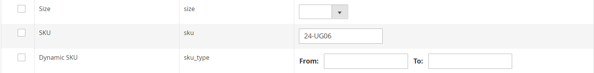

# Importa prezzi livello

anziché immettere [prezzi di livello](../catalog/product-price-tier.md) manualmente per ogni prodotto, può essere più efficiente per [importa](data-import.md) i dati relativi ai prezzi. Prima di iniziare, creare un file di esempio dei dati dei prezzi dei livelli esportati che è possibile utilizzare come modello.

{width="700" zoomable="yes"}

## Passaggio 1: esportare i dati dei prezzi del livello

Nell&#39;esempio seguente vengono esportati i dati relativi ai prezzi dei livelli per un singolo prodotto. Quindi, puoi utilizzare i dati esportati come modello per le importazioni in blocco di dati relativi ai prezzi dei livelli. Per ulteriori informazioni sull&#39;esportazione di dati di prezzi avanzati, vedere [Dati di determinazione prezzi avanzata](data-attributes-product.md#advanced-pricing-attributes).

{width="600" zoomable="yes"}

1. On _Amministratore_ barra laterale, vai a  **[!UICONTROL System]** > _[!UICONTROL Data Transfer]_>**[!UICONTROL Export]**.

1. Sotto _[!UICONTROL Export Settings]_, impostato **[!UICONTROL Entity Type]**a `Advanced Pricing`.

1. In **[!UICONTROL Entity Attributes]** nella griglia, scorrere verso il basso fino agli attributi SKU ed effettuare le seguenti operazioni:

   - Per i prezzi dei livelli basati su una percentuale di sconto, inserisci lo SKU di ciascun prodotto da esportare, separato da una virgola.

     {width="600" zoomable="yes"}

   - Per i prezzi dei livelli basati su un importo fisso, immettere lo SKU di ciascun prodotto.

   - Scorri verso il basso e fai clic su **[!UICONTROL Continue]**.

1. Individua il file di esportazione nel percorso di download per il browser Web e apri il file.

   {width="600" zoomable="yes"}

**_Dati prezzo livello esportato_**

Nei dati esportati sono incluse le seguenti colonne:

- `sku`
- `tier_price_website`
- `tier_price_customer_group`
- `tier_price_qty`
- `tier_price`
- `tier_price_value_type`

I dati esportati vengono utilizzati come modello per l&#39;importazione dei dati relativi ai prezzi dei livelli.

## Passaggio 2: aggiornare i dati

1. Aggiornare i dati relativi al prezzo del livello per ciascun prodotto, in base alle esigenze.

   Tutti i prodotti senza aggiornamenti di prezzo di livello possono essere eliminati dal file CSV. Non è necessario reimportare i prodotti che non sono stati modificati.

1. **[!UICONTROL Save]** il file CSV aggiornato.

>[!NOTE]
>
>Le dimensioni di un file di importazione non possono superare i 2 MB.

## Passaggio 3: importare i dati aggiornati

1. On _Amministratore_ barra laterale, vai a **[!UICONTROL System]** > _[!UICONTROL Data Transfer]_>**[!UICONTROL Import]**.

1. Sotto _Importa impostazioni_, impostato **[!UICONTROL Entity Type]** a `Advanced Pricing`.

1. Imposta **[!UICONTROL Import Behavior]** a `Add/Update`.

1. Sotto **[!UICONTROL File to Import]**, fai clic su **[!UICONTROL Choose File]** e seleziona il file che hai preparato per l’importazione dalla directory.

1. Nell’angolo superiore destro, fai clic su **[!UICONTROL Check Data]**.

1. Se il file è valido, fare clic su **[!UICONTROL Import]**.

   In caso contrario, correggere ogni problema relativo ai dati elencati nel messaggio e riprovare a importare il file.
