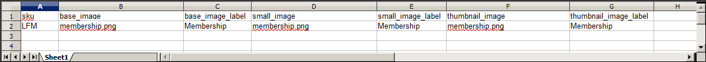

# Importazione immagine prodotto

È possibile importare in Adobe Commerce e Magento Open Source più immagini di prodotto di ciascun tipo e associarle a un prodotto specifico. Il percorso e il nome file di ciascuna immagine del prodotto vengono immessi nel file CSV e i file immagine da importare vengono caricati nel percorso corrispondente sul server Commerce o sul server esterno.

Commerce crea una propria struttura di directory per le immagini dei prodotti organizzata alfabeticamente. Quando esportate dati di prodotto con immagini esistenti in un file CSV, potete visualizzare il percorso alfabetico prima del nome di ogni immagine. Tuttavia, quando importate nuove immagini, non è necessario specificare un percorso, poiché Commerce gestisce automaticamente la struttura di directory. Tuttavia, assicurarsi di immettere il percorso relativo della directory di importazione prima del nome file di ciascuna immagine da importare.

Per caricare le immagini, è necessario disporre delle credenziali di accesso e delle autorizzazioni corrette per accedere alla cartella Commerce sul server. Con le credenziali corrette, puoi utilizzare qualsiasi utility SFTP per caricare i file dal computer desktop al server.

Prima di provare a importare molte immagini, rivedere i passaggi del metodo di importazione che si desidera utilizzare ed eseguire il processo con alcuni prodotti. Dopo aver compreso come funziona, si avrà la certezza di importare grandi quantità di immagini.

>[!IMPORTANT]
>
>Si consiglia di utilizzare un programma che supporti la codifica UTF-8 per modificare i file CSV, ad esempio Blocco note++. Microsoft® Excel inserisce caratteri aggiuntivi nell&#39;intestazione di colonna del file CSV, impedendo in tal modo la reimportazione dei dati in Commerce.

## Metodo 1: importare immagini dal server locale

1. Nel server Commerce caricare i file immagine nella cartella `var/import/images` o in una sottocartella, ad esempio `var/import/images/product_images`. Questa è la cartella principale predefinita per l’importazione delle immagini del prodotto.

   ```
   <Magento root folder>/var/import/images
   ```

   >[!NOTE]
   >
   >A partire dalla versione `2.3.2` di Adobe Commerce e Magento Open Source, il percorso specificato in **[!UICONTROL Images File Directory]** concatena l&#39;importazione nella directory base delle immagini - `<Magento-root-folder>/var/import/images`. Per le versioni precedenti di Adobe Commerce e Magento Open Source, puoi utilizzare una cartella diversa sul server Commerce, purché durante il processo di importazione sia specificato il percorso della cartella.

1. Nei dati CSV, immettere il nome di ogni file di immagine da importare nella riga corretta, da `sku`, e nella colonna corretta in base al tipo di immagine (`base_image`, `small_image`, `thumbnail_image` o `additional_images`).

   >[!NOTE]
   >
   >Per le immagini nella cartella di importazione predefinita (`var/import/images`), non includere il percorso precedente al nome del file nei dati CSV.

   Il file CSV deve includere solo la colonna `sku` e le colonne immagine correlate.

   {width="600" zoomable="yes"}

1. Segui le istruzioni per [importare](data-import.md) i dati.

1. Dopo aver selezionato il file da importare, immettere il percorso relativo seguente **[!UICONTROL Images File Directory]**.

   ```
   var/import/images
   ```

   {width="600" zoomable="yes"}

   >[!TIP]
   >
   >Lascia _[!UICONTROL Images File Directory]_&#x200B;vuoto per usare la directory `<Magento-root-folder>/var/import/images`. A partire da Adobe Commerce e Magento Open Source versione 2.3.2, questa è la directory base predefinita per le immagini di importazione.

   Se si importano più immagini per un singolo `sku`, inserire le immagini in una colonna denominata `additional_images` (aggiungere la colonna se non è già stata aggiunta), separate da virgole. Esempio: `image02.jpg,image03.jpg`

## Metodo 2: importare immagini da un server esterno

1. Carica le immagini da importare nella cartella specificata sul server esterno.

1. Nei dati CSV, immetti l&#39;URL completo di ciascun file di immagine nella colonna corretta per tipo di immagine (`base_image`, `small_image`, `thumbnail_image` o `additional_images`).

   ```
   https://example.com/images/image.jpg
   ```

1. Segui le istruzioni per [importare](data-import.md) i dati.

## Metodo 3: importare immagini con l&#39;archiviazione remota

1. Nel modulo di archiviazione remota, caricare i file immagine nella cartella `var/import/images` o in una sottocartella, ad esempio `var/import/images/product_images`. Questa è la cartella principale predefinita per l’importazione delle immagini del prodotto.

   ```bash
   <remote-storage-root-folder>/var/import/images
   ```

   >[!NOTE]
   >
   >A partire dalla versione `2.3.2` di Adobe Commerce e Magento Open Source, il percorso specificato in _[!UICONTROL Images File Directory]_&#x200B;concatena l&#39;importazione nella directory base delle immagini: `<remote-storage-root-folder>/var/import/images`. Per le versioni precedenti di Adobe Commerce e Magento Open Source, puoi utilizzare una cartella diversa sul server Commerce, purché durante il processo di importazione sia specificato il percorso della cartella.

1. Nei dati CSV, immettere il nome di ogni file di immagine da importare nella riga corretta, da `sku`, e nella colonna corretta in base al tipo di immagine (`base_image`, `small_image`, `thumbnail_image` o `additional_images`).

   >[!NOTE]
   >
   >Per le immagini nella cartella di importazione predefinita (`var/import/images`), non includere il percorso precedente al nome del file nei dati CSV.

   Il file CSV deve includere solo la colonna `sku` e le colonne immagine correlate.

   {width="600" zoomable="yes"}

1. Segui le istruzioni per [importare](data-import.md) i dati.

1. Dopo aver selezionato il file da importare, immettere il percorso relativo seguente **[!UICONTROL Images File Directory]**.

   ```
   var/import/images/product_images
   ```

   >[!TIP]
   >
   >Lascia vuoto _[!UICONTROL Images File Directory]_&#x200B;per usare la directory `<Magento-root-folder>/var/import/images`. A partire da Adobe Commerce e Magento Open Source versione 2.3.2, questa è la directory base predefinita per le immagini di importazione.

   Se si importano più immagini per un singolo `sku`, inserire le immagini in una colonna denominata `additional_images` (aggiungere la colonna se non è già stata aggiunta), separate da virgole: `image02.jpg,image03.jpg`

Per ulteriori informazioni sull&#39;attivazione e la gestione del modulo di archiviazione remota, vedere [Configurare l&#39;archiviazione remota](https://experienceleague.adobe.com/docs/commerce-operations/configuration-guide/storage/remote-storage/remote-storage.html?lang=it) nella _Guida alla configurazione_.

>[!NOTE]
>
>L&#39;importazione di immagini di prodotto non avvia il ridimensionamento dell&#39;immagine. Le immagini dei prodotti vengono ridimensionate sul front-end da `pub/get.php`. Assicurarsi che `pub/get.php` funzioni correttamente; in caso contrario, le immagini potrebbero non essere ridimensionate.
