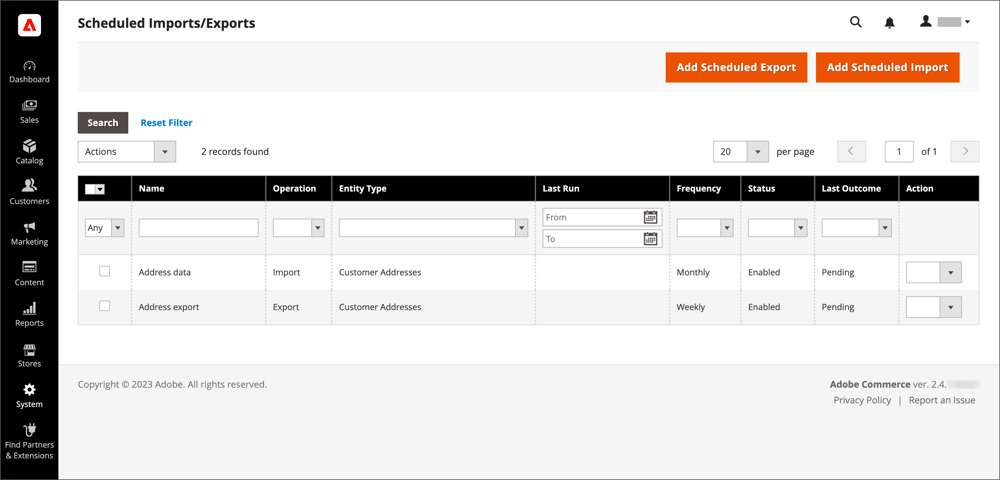

# Importazione ed esportazione pianificate

{{ee-feature}}

Le importazioni e le esportazioni programmate possono essere eseguite su base giornaliera, settimanale o mensile. I file da importare o esportare possono trovarsi su server Adobe Commerce locali o su server FTP remoti. L&#39;importazione/esportazione pianificata è implementata per impostazione predefinita e non richiede configurazione aggiuntiva. Tutte le importazioni e le esportazioni pianificate vengono gestite dallo scheduler processi Cron.

## Accedere alle operazioni di importazione/esportazione pianificate

1. Nella barra laterale _Admin_, passa a **[!UICONTROL System]** > _[!UICONTROL Data Transfer]_>**[!UICONTROL Scheduled Imports/Exports]**.

   {width="700" zoomable="yes"}

1. Per creare un nuovo processo di importazione o esportazione pianificato, fare clic sul pulsante appropriato e seguire le istruzioni per il tipo di processo pianificato.

   - [Aggiungi esportazione pianificata](#schedule-an-export)
   - [Aggiungi importazione pianificata](#schedule-an-import)

1. Quando il record viene salvato, il processo viene visualizzato nella griglia _[!UICONTROL Scheduled Import/Export]_.

   >[!NOTE]
   >
   >Quando si crea o si aggiorna un&#39;importazione/esportazione pianificata, viene apportata una modifica alla configurazione del sistema. Dopo il salvataggio, assicurati di risolvere l’avviso di annullamento della validità della cache che viene visualizzato nella parte superiore della pagina Amministratore e di svuotare la cache per applicare la pianificazione nuova o aggiornata.

1. Dopo ogni processo pianificato, una copia del file viene inserita nella directory `var/log/import_export` sul server locale di Adobe Commerce.

   I dettagli di ciascuna operazione non vengono scritti nel registro. Se si verifica un errore, viene inviata una notifica del processo di importazione/esportazione non riuscito, con una descrizione dell’errore.

## Pianificare un’importazione

Per il formato di file di importazione e i tipi di entità di importazione disponibili, il processo di importazione pianificato è simile al processo di importazione manuale:

- Il file di importazione deve essere in formato .CSV
- Puoi importare dati di prodotti e clienti

Il vantaggio dell&#39;utilizzo dell&#39;importazione pianificata è che è possibile importare automaticamente un file di dati più volte dopo aver specificato i parametri di importazione e pianificato una sola volta.

I dettagli di ciascuna operazione di importazione non vengono scritti in un log, ma quando si verifica un errore si riceve un messaggio di posta elettronica di _Importazione non riuscita_ con una descrizione dell&#39;errore. Il risultato dell&#39;ultimo processo di importazione programmato viene visualizzato nella colonna Ultimo risultato della pagina Importazione/esportazione programmata.

Dopo ogni operazione di importazione, una copia del file di importazione viene inserita nella directory `var/log/import_export` del server in cui viene distribuito Adobe Commerce o Magento Open Source. Al nome del file di importazione vengono aggiunti la marca temporale, il marcatore dell’entità importata (prodotti o clienti) e il tipo di operazione (in questo caso, importazione).

Dopo ogni processo di importazione pianificato, viene eseguita automaticamente un&#39;operazione di reindicizzazione. Nel front-end, le modifiche nelle descrizioni e in altre informazioni di testo vengono applicate dopo che i dati aggiornati vengono inviati al database e le modifiche nei prezzi vengono applicate solo dopo l&#39;operazione di reindicizzazione.

### Passaggio 1: completare le impostazioni di importazione

1. Nella barra laterale _Admin_, passa a **[!UICONTROL System]** > _[!UICONTROL Data Transfer]_>**[!UICONTROL Scheduled Import/Export]**.

1. Nell&#39;angolo superiore destro fare clic su **[!UICONTROL Add Scheduled Import]**.

1. Impostare le opzioni di programmazione e importazione:

   - **[!UICONTROL Name]** — Immettere un nome per l&#39;importazione pianificata.

   - **[!UICONTROL Description]** — Immettere una breve descrizione che illustri lo scopo dell&#39;importazione e il relativo utilizzo.

   - **[!UICONTROL Entity Type]** — Impostato su uno dei seguenti:

      - `Products`
      - `Advanced Pricing`
      - `Customers and Addresses (single file)`
      - `Customer Addresses`
      - `Customer Finances`
      - `Customers Main File`
      - `Stock Sources`

   - **[!UICONTROL Import Behavior]** — Impostato su uno dei seguenti:

      - `Add/Update Complex Data` - Aggiunge o aggiorna nuovi dati complessi ai dati complessi esistenti per le voci esistenti nel database. Questo è il valore predefinito.
      - `Replace` - Scrive sul complesso esistente per le entità esistenti nel database.
      - `Delete Entities` — Elimina le voci esistenti nel database.
      - `Custom Action` - Personalizza le entità esistenti nel database.

     >[!NOTE]
     >
     >Per i tipi di entità _[!UICONTROL Advanced Pricing]_,_[!UICONTROL Products]_, _[!UICONTROL Customers and Addresses (single file)]_e_[!UICONTROL Stock Sources]_, vengono visualizzati i seguenti comportamenti di importazione: `Add/Update`, `Replace` e `Delete`. Per i tipi di entità _Finanze cliente_, _File principale clienti_ e _Clienti e indirizzi_, vengono visualizzati i seguenti comportamenti di importazione: `Add/Update Complex Data`, `Delete Entities` e `Custom Action`.

   - **[!UICONTROL Start Time]** — Impostare su ora, minuto e secondo per l&#39;inizio pianificato dell&#39;importazione.

   - **[!UICONTROL Frequency]** — Impostato su uno dei seguenti: `Daily`, `Weekly` o `Monthly`

   - **[!UICONTROL On Error]** - Impostato su uno dei seguenti: `Stop Import` o `Continue Processing`

   - **[!UICONTROL Status]** - Per attivare l&#39;importazione pianificata, impostare su `Enabled`.

   - **[!UICONTROL Field Separator]** — Immettere il carattere utilizzato per separare i campi nel file di importazione. Il carattere predefinito è una virgola.

   - **[!UICONTROL Multiple Value Separator]** - Immettere il carattere utilizzato per separare più valori all&#39;interno di un campo.

   {width="600" zoomable="yes"}

### Passaggio 2: completare le informazioni sul file di importazione

1. Imposta **[!UICONTROL Server Type]** su uno dei seguenti:

   - `Local Server` - Importa i dati dallo stesso server in cui è installato Adobe Commerce.
   - `Remote FTP` - Importa i dati da un server remoto.

   {width="600" zoomable="yes"}

   >[!NOTE]
   >
   >Quando il modulo di archiviazione remota è abilitato, `Local Server` passa automaticamente a `Remote Storage`.

1. Immettere **[!UICONTROL File Directory]** da cui ha origine il file di importazione.

   - `Local Server` - Immettere un percorso relativo nell&#39;installazione di Commerce. Ad esempio, `var/import`. Se il modulo di archiviazione remota è configurato, utilizzare `import_export/import`.
   - `Remote FTP server` - Immettere l&#39;URL completo e il percorso della cartella di importazione sul server remoto.

1. Immettere **[!UICONTROL File Name]** da importare.

1. Per **[!UICONTROL Images File Directory]**, immettere il percorso della directory in cui sono memorizzate le immagini del prodotto.

   In un server locale immettere un percorso relativo, ad esempio: `var/import`. In un archivio remoto, immettere un percorso relativo, ad esempio: `import_export/import` o `import_export/import/some/dir`.

### Passaggio 3: configurare le e-mail di importazione non riuscita

{width="600" zoomable="yes"}

1. Impostare **[!UICONTROL Failed Email Receiver]** sul contatto dell&#39;archivio che deve ricevere la notifica se si verifica un errore durante l&#39;importazione.

1. Impostare **[!UICONTROL Failed Email Sender]** sul contatto dell&#39;archivio che viene visualizzato come mittente della notifica.

1. Imposta **[!UICONTROL Failed Email Template]** sul modello utilizzato per la notifica.

1. Per **[!UICONTROL Send Failed Email Copy To]**, immettere l&#39;indirizzo di posta elettronica di tutti coloro che devono ricevere una copia della notifica.

   Separa più indirizzi e-mail con una virgola.

1. Imposta **[!UICONTROL Failed Email Copy Method]** su uno dei seguenti:

   - `Bcc` - Invia una copia di cortesia nascosta della notifica di importazione non riuscita. Il nome e l’indirizzo del destinatario sono inclusi nella distribuzione e-mail originale, ma non sono visibili.
   - `Separate Email` - Invia una copia della notifica di importazione non riuscita come messaggio e-mail separato.

1. Al termine, fare clic su **[!UICONTROL Save]**.

   Il nuovo processo di importazione pianificato viene aggiunto all&#39;elenco nella pagina _[!UICONTROL Scheduled Import/Export]_. Da questa pagina, può essere eseguito immediatamente per il test e modificato. Il file di importazione viene convalidato prima dell’esecuzione di ciascun processo di importazione.

>[!NOTE]
>
>Quando si crea o si aggiorna un&#39;importazione/esportazione pianificata, viene apportata una modifica alla configurazione del sistema. Dopo il salvataggio, assicurati di risolvere l’avviso di annullamento della validità della cache che viene visualizzato nella parte superiore della pagina Amministratore e di svuotare la cache per applicare la pianificazione nuova o aggiornata.

### Descrizioni dei campi

#### [!UICONTROL Import Settings]

| Campo | Descrizione |
| ----- | ----------- | 
| [!UICONTROL Name] | Nome dell’importazione. Consente di distinguere se vengono create molte importazioni pianificate diverse. |
| [!UICONTROL Description] | (Facoltativo) È possibile immettere una descrizione. |
| [!UICONTROL Entity Type] | Definisce i dati da importare. |
| [!UICONTROL Import Behavior] | Definisce la complessità dei dati gestiti se le entità importate esistono nel database. I dati complessi per i prodotti includono categorie, siti web, opzioni personalizzate, prezzi di livello, prodotti correlati, up-sell, cross-selling e dati sui prodotti associati. I dati complessi per i clienti includono gli indirizzi. Opzioni: **[!UICONTROL Add/Update Complex Data]**- I nuovi dati complessi vengono aggiunti o aggiornati ai dati complessi esistenti per le voci esistenti nel database. Questo è il valore predefinito. **[!UICONTROL Add/Update]** - Nuovi dati aggiunti alle voci esistenti nel database. Tutti i campi eccetto `sku` possono essere aggiornati per i prodotti. Eventuali valori di campo multipli non elencati nel file CSV, ad esempio categorie o siti Web, rimangono nel database dopo l’importazione. **[!UICONTROL Replace]**- I dati complessi esistenti per le entità esistenti vengono sostituiti. **[!UICONTROL Delete Entities]** - Se le entità importate esistono nel database, vengono eliminate dal database. **[!UICONTROL Custom Action]**- Le entità complesse esistenti vengono personalizzate durante il processo di importazione. |
| [!UICONTROL Start Time] | Imposta l’ora di inizio, i minuti e i secondi dell’importazione. |
| [!UICONTROL Frequency] | Definisci la frequenza di esecuzione dell’importazione. Opzioni: `Daily` / `Weekly` / `Monthly` |
| [!UICONTROL On Error] | Definire il comportamento del sistema in caso di errori durante la convalida del file. Opzioni: **Interrompi importazione** — Il file non viene importato se vengono rilevati errori durante la convalida. Questo è il valore predefinito. **Continua elaborazione** - Se durante la convalida vengono rilevati errori, ma è possibile eseguire l&#39;importazione, il file viene importato. |
| [!UICONTROL Status] | L’importazione è abilitata per impostazione predefinita. È possibile sospenderla impostando lo stato su `Disabled`. |
| [!UICONTROL Field Separator] | Determina il carattere utilizzato per separare i campi. Valore predefinito: `,` (virgola) |
| [!UICONTROL Multiple Value Separator] | Determina il carattere utilizzato per separare più valori all&#39;interno di un campo. Valore predefinito: `,` (virgola) |

{style="table-layout:auto"}

#### [!UICONTROL Import File Information]

| Campo | Descrizione |
| ----- | ----------- | 
| [!UICONTROL Server Type] | È possibile importare da un file nello stesso server in cui è distribuito Commerce (selezionare `Local Server`) o dal server FTP remoto (selezionare `Remote FTP`). Se si seleziona _[!UICONTROL Remote FTP]_, verranno visualizzate ulteriori opzioni per le credenziali e le impostazioni di trasferimento dei file. Se il modulo di archiviazione remota è abilitato, il tipo `Local Server` viene automaticamente cambiato in `Remote Storage`. |
| [!UICONTROL File Directory] | Specificare la directory in cui si trova il file di importazione. Se Tipo server è impostato su _[!UICONTROL Local Server]_, specificare il percorso relativo alla directory di installazione di Commerce. Ad esempio: `var/import` o `import_export/import` per l&#39;archiviazione remota. |
| [!UICONTROL File Name] | Specificare il nome del file di importazione. |
| [!UICONTROL Images File Directory] | Immettere il percorso della directory in cui sono memorizzate le immagini del prodotto. Per un server locale, immettere un percorso relativo. Ad esempio: `var/import` o `import_export/import` per l&#39;archiviazione remota. |

{style="table-layout:auto"}

#### [!UICONTROL Import Failed Emails]

| Campo | Descrizione |
| ----- | ----------- | 
| [!UICONTROL Failed Email Receiver] | Se l’importazione non riesce, specifica l’indirizzo e-mail a cui viene inviata una notifica e-mail (e-mail di importazione non riuscita). |
| [!UICONTROL Failed Email Sender] | Specifica l’indirizzo e-mail utilizzato come mittente per l’e-mail di importazione non riuscita. |
| [!UICONTROL Failed Email Template] | Seleziona un modello per l’e-mail di importazione non riuscita. Per impostazione predefinita, è disponibile solo l&#39;opzione Importazione non riuscita (modello predefinito da impostazioni internazionali). È possibile creare modelli personalizzati in _[!UICONTROL System]_>_[!UICONTROL Transactional Emails]_. |
| [!UICONTROL Send Failed Email Copy To] | L’indirizzo e-mail a cui viene inviata una copia dell’e-mail di importazione non riuscita. |
| [!UICONTROL Send Failed Email Copy Method] | Seleziona il metodo di invio della copia per l’e-mail di importazione non riuscita. |

{style="table-layout:auto"}

## Pianificare un’esportazione

L&#39;esportazione pianificata è simile a un&#39;esportazione manuale [Export](data-export.md) nel formato di file di esportazione disponibile e nei tipi di entità che è possibile esportare:

- Puoi esportare in formato CSV
- Puoi esportare i dati di prodotti e clienti

Il vantaggio di utilizzare l&#39;esportazione pianificata è che è possibile esportare i dati più volte automaticamente, dopo aver specificato i parametri di esportazione, e pianificare una sola volta.

I dettagli di ciascuna esportazione non vengono scritti in un registro, ma in caso di errore si riceve un messaggio e-mail Esportazione non riuscita, contenente la descrizione dell’errore. Il risultato dell&#39;ultimo processo di esportazione viene visualizzato nella colonna Ultimo risultato della pagina Importazione/esportazione pianificata.

Dopo ogni esportazione, il file di esportazione viene inserito nel percorso definito dall&#39;utente e una copia nella directory `var/log/import_export` sul server in cui è distribuito Adobe Commerce o Magento Open Source. Al nome del file di esportazione vengono aggiunti la marca temporale e l’indicatore dell’entità esportata (prodotti o clienti) e il tipo di operazione (in questo caso, esportazione).

### Passaggio 1: completare le impostazioni di esportazione

1. Nella barra laterale _Admin_, passa a **[!UICONTROL System]** > _[!UICONTROL Data Transfer]_>**[!UICONTROL Scheduled Import/Export]**.

1. Nell&#39;angolo superiore destro fare clic su **[!UICONTROL Add Scheduled Export]** ed eseguire le operazioni seguenti:

   - Immetti **[!UICONTROL Name]** per l&#39;esportazione pianificata.

   - Immettere un breve **[!UICONTROL Description]** che illustri lo scopo dell&#39;esportazione e il relativo utilizzo.

   - Imposta **[!UICONTROL Entity Type]** su uno dei seguenti:

      - `Advanced Pricing`
      - `Products`
      - `Customer Financing`
      - `Customers Main File`
      - `Customer Addresses`
      - `Stock Sources`

     La sezione _[!UICONTROL Entity Attributes]_nella parte inferiore della pagina viene aggiornata per riflettere il tipo di entità selezionato.

   - Impostare **[!UICONTROL Start Time]** sull&#39;ora, il minuto e il secondo per cui è pianificato l&#39;inizio dell&#39;esportazione.

   - Imposta **[!UICONTROL Frequency]** su uno dei seguenti:

      - `Daily`
      - `Weekly`
      - `Monthly`

1. Per attivare l&#39;esportazione pianificata, impostare **[!UICONTROL Status]** su `Enabled`.

1. Accettare `CSV` come predefinito **[!UICONTROL File Format]**.

   {width="600" zoomable="yes"}

### Passaggio 2: completare le informazioni del file di esportazione

1. Imposta **[!UICONTROL Server Type]** su uno dei seguenti:

   - `Local Server` - Per salvare il file di esportazione nello stesso server in cui è installato Commerce.
   - `Remote FTP` - Per salvare il file di esportazione su un server remoto.

   {width="600" zoomable="yes"}

   >[!NOTE]
   >
   >Quando il modulo di archiviazione remota è abilitato, `Local Server` passa automaticamente a `Remote Storage`.

1. Per **[!UICONTROL File Directory]**, immettere la directory in cui salvare il file di esportazione nel modo seguente:

   - Per **[!UICONTROL Local Server]**, immettere un percorso relativo nell&#39;installazione di Commerce, ad esempio `var/export`. Se il modulo di archiviazione remota è configurato, utilizzare `import_export/export`.
   - Per **[!UICONTROL Remote FTP server]**, immettere l&#39;URL completo e il percorso della cartella di destinazione sul server di destinazione.

1. Se il server _[!UICONTROL Remote FTP]_è selezionato, immettere le credenziali di connessione al server e selezionare altre impostazioni:

   - Per **[!UICONTROL FTP Host[:Port]]**, immettere l&#39;indirizzo host FTP remoto.
   - Per **[!UICONTROL User Name]**, immettere il nome utente utilizzato per accedere al server remoto.
   - Per **[!UICONTROL Password]**, immettere la password dell&#39;account del nome utente specificato.
   - Per **[!UICONTROL File Mode]**, scegliere `Binary` o `ASCII`.
   - Per **[!UICONTROL Passive Mode]**, scegliere `No` o `Yes`.

### Passaggio 3: configurare le e-mail con errori di esportazione

1. Impostare **[!UICONTROL Failed Email Receiver]** sul contatto dell&#39;archivio che deve ricevere la notifica se si verifica un errore durante l&#39;esportazione.

1. Impostare **[!UICONTROL Failed Email Sender]** sul contatto dell&#39;archivio che viene visualizzato come mittente della notifica.

1. Imposta **[!UICONTROL Failed Email Template]** sul modello utilizzato per la notifica.

1. Per **[!UICONTROL Send Failed Email Copy To]**, immettere l&#39;indirizzo di posta elettronica di tutti coloro che devono ricevere una copia della notifica.

   Per più indirizzi e-mail, separali con una virgola.

1. Imposta **[!UICONTROL Failed Email Copy Method]** su uno dei seguenti:

   - `Bcc` - Invia una copia di cortesia cieca. Il nome e l’indirizzo del destinatario sono inclusi nella distribuzione e-mail originale, ma non sono visibili.
   - `Separate Email` - Invia la copia come messaggio di posta elettronica separato.

### Passaggio 4: scegliere gli attributi di entità

1. Nella sezione _[!UICONTROL Entity Attributes]_scegliere gli attributi che si desidera includere nei dati di esportazione.

   - Per filtrare i dati di esportazione in base al valore degli attributi, immettere il valore dell&#39;attributo nella colonna _[!UICONTROL Filter]_.
   - Per escludere prodotti o clienti con determinati valori di attributo, immettere i valori degli attributi che si desidera escludere e selezionare la casella di controllo nella colonna Ignora.

1. Al termine, fare clic su **[!UICONTROL Save]**.

   Il nuovo processo di esportazione pianificato viene aggiunto all&#39;elenco nella pagina _[!UICONTROL Scheduled Import/Export]_. Da questa pagina è possibile eseguirla immediatamente, per testarla e modificarla.

>[!NOTE]
>
>Quando si crea o si aggiorna un&#39;importazione/esportazione pianificata, viene apportata una modifica alla configurazione del sistema. Dopo il salvataggio, assicurati di risolvere l’avviso di annullamento della validità della cache che viene visualizzato nella parte superiore della pagina Amministratore e di svuotare la cache per applicare la pianificazione nuova o aggiornata.

### Descrizioni dei campi

#### [!UICONTROL Export Settings]

| Campo | Descrizione |
| ----- | ----------- | 
| [!UICONTROL Name] | Nome dell’esportazione. Consente di distinguere se vengono create molte esportazioni pianificate diverse. |
| [!UICONTROL Description] | (Facoltativo) Una descrizione dell&#39;esportazione pianificata. |
| [!UICONTROL Entity Type] | Identifica i dati da esportare. Dopo la selezione, gli attributi di entità vengono visualizzati di seguito. Opzioni: `Advanced Pricing` / `Products` / `Customer Finances` / `Customers Main File` / `Customer Addresses` / `Stock Sources` |
| [!UICONTROL Start Time] | Imposta l’ora di inizio, i minuti e i secondi dell’esportazione. |
| [!UICONTROL Frequency] | Definisci la frequenza con cui viene eseguito il processo di esportazione. Opzioni: `Daily` / `Weekly` / `Monthly` |
| [!UICONTROL Status] | Per impostazione predefinita, è abilitata una nuova esportazione pianificata. È possibile sospenderla impostando Stato su Disattivato. Opzioni: `Enabled` / `Disabled` |
| [!UICONTROL File Format] | Selezionare il formato del file di esportazione. Attualmente è disponibile solo l&#39;opzione `.CSV`. |

{style="table-layout:auto"}

#### [!UICONTROL Export Settings Information]

| Campo | Descrizione |
| ----- | ----------- | 
| [!UICONTROL Server Type] | Determina la posizione del file di esportazione. Opzioni: **Server locale** - Posiziona il file di esportazione nello stesso server in cui è distribuito Commerce. Se il modulo di archiviazione remota è abilitato, `Local Server` viene cambiato in `Remote Storage`. **FTP remoto** - inserisce il file di esportazione in un server remoto. Vengono visualizzate opzioni aggiuntive per le credenziali e le impostazioni di trasferimento dei file. |
| [!UICONTROL File Directory] | Specificare la directory in cui si trova il file di esportazione. Se _[!UICONTROL Server Type]_è impostato su `Local Server`, specificare il percorso relativo al percorso di installazione di Commerce. Ad esempio, `var/export` o `import_export/export` per l&#39;archiviazione remota. |

{style="table-layout:auto"}

#### [!UICONTROL Export Failed Emails]

| Campo | Descrizione |
| ----- | ----------- | 
| [!UICONTROL Failed Email Receiver] | Specifica l’indirizzo e-mail a cui inviare una notifica e-mail (e-mail di esportazione non riuscita) se l’esportazione non riesce. |
| [!UICONTROL Failed Email Sender] | Specifica l’indirizzo e-mail utilizzato come mittente e-mail non riuscito per l’esportazione. |
| [!UICONTROL Failed Email Template] | Seleziona un modello per l’e-mail di esportazione non riuscita. Per impostazione predefinita, è disponibile solo l&#39;opzione `Export Failed (Default Template from Locale)`. |
| [!UICONTROL Send Failed Email Copy To] | L’indirizzo e-mail a cui viene inviata una copia dell’e-mail di esportazione non riuscita. |
| [!UICONTROL Send Failed Email Copy Method] | Specifica il metodo di invio della copia per l’e-mail di esportazione non riuscita. |

{style="table-layout:auto"}
