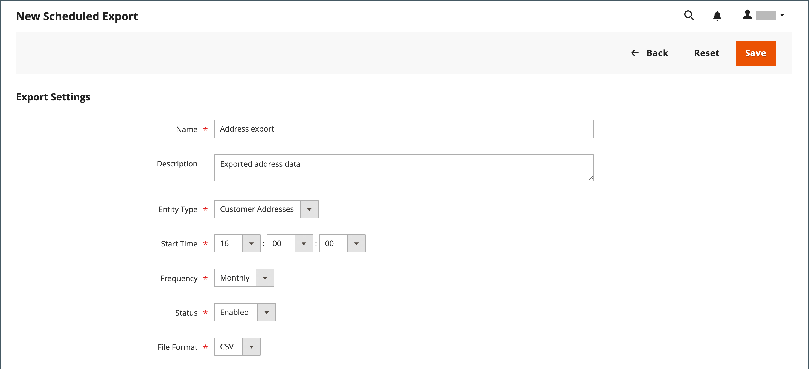

# Importazione ed esportazione pianificate

{{ee-feature}}

Le importazioni e le esportazioni programmate possono essere eseguite su base giornaliera, settimanale o mensile. I file da importare o esportare possono trovarsi su server Adobe Commerce locali o su server FTP remoti. L&#39;importazione/esportazione pianificata è implementata per impostazione predefinita e non richiede configurazione aggiuntiva. Tutte le importazioni e le esportazioni pianificate vengono gestite dallo scheduler processi Cron.

## Accedere alle operazioni di importazione/esportazione pianificate

1. Il giorno _Amministratore_ barra laterale, vai a **[!UICONTROL System]** > _[!UICONTROL Data Transfer]_>**[!UICONTROL Scheduled Imports/Exports]**.

   {width="700" zoomable="yes"}

1. Per creare un nuovo processo di importazione o esportazione pianificato, fare clic sul pulsante appropriato e seguire le istruzioni per il tipo di processo pianificato.

   - [Aggiungi esportazione pianificata](#schedule-an-export)
   - [Aggiungi importazione pianificata](#schedule-an-import)

1. Quando il record viene salvato, il processo viene visualizzato nel _[!UICONTROL Scheduled Import/Export]_griglia.

   >[!NOTE]
   >
   >Quando si crea o si aggiorna un&#39;importazione/esportazione pianificata, viene apportata una modifica alla configurazione del sistema. Dopo il salvataggio, assicurati di risolvere l’avviso di annullamento della validità della cache che viene visualizzato nella parte superiore della pagina Amministratore e di svuotare la cache per applicare la pianificazione nuova o aggiornata.

1. Dopo ogni processo pianificato, una copia del file viene inserita nel `var/log/import_export` sul server locale di Adobe Commerce.

   I dettagli di ciascuna operazione non vengono scritti nel registro. Se si verifica un errore, viene inviata una notifica del processo di importazione/esportazione non riuscito, con una descrizione dell’errore.

## Pianificare un’importazione

Per il formato di file di importazione e i tipi di entità di importazione disponibili, il processo di importazione pianificato è simile al processo di importazione manuale:

- Il file di importazione deve essere in formato .CSV
- Puoi importare dati di prodotti e clienti

Il vantaggio dell&#39;utilizzo dell&#39;importazione pianificata è che è possibile importare automaticamente un file di dati più volte dopo aver specificato i parametri di importazione e pianificato una sola volta.

I dettagli di ciascuna operazione di importazione non vengono scritti in un registro, ma in caso di errore viene visualizzato un messaggio _Importazione non riuscita_ e-mail con una descrizione dell’errore. Il risultato dell&#39;ultimo processo di importazione programmato viene visualizzato nella colonna Ultimo risultato della pagina Importazione/esportazione programmata.

Dopo ogni operazione di importazione, una copia del file di importazione viene inserita nel `var/log/import_export` sul server in cui è distribuito Adobe Commerce o Magento Open Source. Al nome del file di importazione vengono aggiunti la marca temporale, il marcatore dell’entità importata (prodotti o clienti) e il tipo di operazione (in questo caso, importazione).

Dopo ogni processo di importazione pianificato, viene eseguita automaticamente un&#39;operazione di reindicizzazione. Nel front-end, le modifiche nelle descrizioni e in altre informazioni di testo vengono applicate dopo che i dati aggiornati vengono inviati al database e le modifiche nei prezzi vengono applicate solo dopo l&#39;operazione di reindicizzazione.

### Passaggio 1: completare le impostazioni di importazione

1. Il giorno _Amministratore_ barra laterale, vai a **[!UICONTROL System]** > _[!UICONTROL Data Transfer]_>**[!UICONTROL Scheduled Import/Export]**.

1. Nell’angolo superiore destro, fai clic su **[!UICONTROL Add Scheduled Import]**.

1. Impostare le opzioni di programmazione e importazione:

   - **[!UICONTROL Name]** — Inserire un nome per l&#39;importazione programmata.

   - **[!UICONTROL Description]** — Inserire una breve descrizione che illustri lo scopo dell&#39;importazione e il relativo utilizzo.

   - **[!UICONTROL Entity Type]** — Impostate una delle seguenti opzioni:

      - `Products`
      - `Advanced Pricing`
      - `Customers and Addresses (single file)`
      - `Customer Addresses`
      - `Customer Finances`
      - `Customers Main File`
      - `Stock Sources`

   - **[!UICONTROL Import Behavior]** — Impostate una delle seguenti opzioni:

      - `Add/Update Complex Data` — aggiunge o aggiorna nuovi dati complessi ai dati complessi esistenti per le voci esistenti nel database. Questo è il valore predefinito.
      - `Replace` — Scrive su un complesso esistente per le entità esistenti nel database.
      - `Delete Entities` — Elimina le voci esistenti nel database.
      - `Custom Action` : personalizza le entità esistenti nel database.

     >[!NOTE]
     >
     >Per _[!UICONTROL Advanced Pricing]_,_[!UICONTROL Products]_, _[!UICONTROL Customers and Addresses (single file)]_, e_[!UICONTROL Stock Sources]_ tipi di entità, vengono visualizzati i seguenti comportamenti di importazione: `Add/Update`, `Replace`, e `Delete`. Per _Finanze cliente_, _File principale clienti_, e _Clienti e indirizzi_ tipi di entità, vengono visualizzati i seguenti comportamenti di importazione: `Add/Update Complex Data`, `Delete Entities`, e `Custom Action`.

   - **[!UICONTROL Start Time]** — Imposta l&#39;ora, il minuto e il secondo in cui è pianificato l&#39;inizio dell&#39;importazione.

   - **[!UICONTROL Frequency]** — Impostate una delle seguenti opzioni: `Daily`, `Weekly`, o `Monthly`

   - **[!UICONTROL On Error]** - Impostare su una delle seguenti opzioni: `Stop Import` o `Continue Processing`

   - **[!UICONTROL Status]** — Per attivare l&#39;importazione pianificata, impostare su `Enabled`.

   - **[!UICONTROL Field Separator]** — Immettere il carattere utilizzato per separare i campi nel file di importazione. Il carattere predefinito è una virgola.

   - **[!UICONTROL Multiple Value Separator]** — Immettere il carattere utilizzato per separare più valori all&#39;interno di un campo.

   {width="600" zoomable="yes"}

### Passaggio 2: completare le informazioni sul file di importazione

1. Imposta **[!UICONTROL Server Type]** a uno dei seguenti elementi:

   - `Local Server` : importa i dati dallo stesso server in cui è installato Adobe Commerce.
   - `Remote FTP` : importa i dati da un server remoto.

   {width="600" zoomable="yes"}

   >[!NOTE]
   >
   >Quando il modulo di storage remoto è attivato, `Local Server` passa automaticamente a `Remote Storage`.

1. Inserisci il **[!UICONTROL File Directory]** origine del file di importazione.

   - `Local Server` - Immetti un percorso relativo nell’installazione di Commerce. Ad esempio, `var/import`. Se è configurato il modulo di archiviazione remota, utilizzare `import_export/import`.
   - `Remote FTP server` - Immettere l&#39;URL completo e il percorso della cartella di importazione sul server remoto.

1. Inserisci il **[!UICONTROL File Name]** da importare.

1. Per **[!UICONTROL Images File Directory]**, immetti il percorso della directory in cui sono memorizzate le immagini del prodotto.

   In un server locale, immettere un percorso relativo quale: `var/import`. In un archivio remoto, immettere un percorso relativo quale: `import_export/import` o `import_export/import/some/dir`.

### Passaggio 3: configurare le e-mail di importazione non riuscita

{width="600" zoomable="yes"}

1. Imposta **[!UICONTROL Failed Email Receiver]** al contatto del punto vendita che deve ricevere una notifica se si verifica un errore durante l&#39;importazione.

1. Imposta **[!UICONTROL Failed Email Sender]** al contatto del punto vendita visualizzato come mittente della notifica.

1. Imposta **[!UICONTROL Failed Email Template]** al modello utilizzato per la notifica.

1. Per **[!UICONTROL Send Failed Email Copy To]**, immettere l&#39;indirizzo di posta elettronica di chiunque debba ricevere una copia della notifica.

   Separa più indirizzi e-mail con una virgola.

1. Imposta **[!UICONTROL Failed Email Copy Method]** a uno dei seguenti elementi:

   - `Bcc` - Invia una copia di cortesia nascosta della notifica di importazione non riuscita. Il nome e l’indirizzo del destinatario sono inclusi nella distribuzione e-mail originale, ma non sono visibili.
   - `Separate Email` - Invia una copia della notifica di importazione non riuscita come e-mail separata.

1. Al termine, fai clic su **[!UICONTROL Save]**.

   Il nuovo processo di importazione pianificato viene aggiunto all&#39;elenco nel _[!UICONTROL Scheduled Import/Export]_pagina. Da questa pagina, può essere eseguito immediatamente per il test e modificato. Il file di importazione viene convalidato prima dell’esecuzione di ciascun processo di importazione.

>[!NOTE]
>
>Quando si crea o si aggiorna un&#39;importazione/esportazione pianificata, viene apportata una modifica alla configurazione del sistema. Dopo il salvataggio, assicurati di risolvere l’avviso di annullamento della validità della cache che viene visualizzato nella parte superiore della pagina Amministratore e di svuotare la cache per applicare la pianificazione nuova o aggiornata.

### Descrizioni dei campi

#### [!UICONTROL Import Settings]

| Campo | Descrizione |
| ----- | ----------- | 
| [!UICONTROL Name] | Nome dell’importazione. Consente di distinguere se vengono create molte importazioni pianificate diverse. |
| [!UICONTROL Description] | (Facoltativo) È possibile immettere una descrizione. |
| [!UICONTROL Entity Type] | Definisce i dati da importare. |
| [!UICONTROL Import Behavior] | Definisce la complessità dei dati gestiti se le entità importate esistono nel database. I dati complessi per i prodotti includono categorie, siti web, opzioni personalizzate, prezzi di livello, prodotti correlati, up-sell, cross-selling e dati sui prodotti associati. I dati complessi per i clienti includono gli indirizzi. Opzioni: **[!UICONTROL Add/Update Complex Data]**- I nuovi dati complessi vengono aggiunti o aggiornati ai dati complessi esistenti per le voci esistenti nella banca dati. Questo è il valore predefinito. **[!UICONTROL Add/Update]** - Vengono aggiunti nuovi dati alle voci esistenti nel database. Tutti i campi tranne `sku` può essere aggiornato per i prodotti. Eventuali valori di campo multipli non elencati nel file CSV, ad esempio categorie o siti Web, rimangono nel database dopo l’importazione. **[!UICONTROL Replace]**- I dati complessi esistenti per le entità esistenti sono sostituiti. **[!UICONTROL Delete Entities]** - Le entità importate eventualmente presenti nel database vengono eliminate dal database. **[!UICONTROL Custom Action]**- Le entità complesse esistenti vengono personalizzate durante il processo di importazione. |
| [!UICONTROL Start Time] | Imposta l’ora di inizio, i minuti e i secondi dell’importazione. |
| [!UICONTROL Frequency] | Definisci la frequenza di esecuzione dell’importazione. Opzioni: `Daily` / `Weekly` / `Monthly` |
| [!UICONTROL On Error] | Definire il comportamento del sistema in caso di errori durante la convalida del file. Opzioni: **Interrompi importazione** — Il file non viene importato se durante la convalida vengono rilevati errori. Questo è il valore predefinito. **Continua elaborazione** - Se durante la convalida vengono rilevati errori, ma è possibile eseguire l&#39;importazione, il file viene importato. |
| [!UICONTROL Status] | L’importazione è abilitata per impostazione predefinita. Puoi sospenderla impostando Status (Stato) su `Disabled`. |
| [!UICONTROL Field Separator] | Determina il carattere utilizzato per separare i campi. Valore predefinito: `,` (virgola) |
| [!UICONTROL Multiple Value Separator] | Determina il carattere utilizzato per separare più valori all&#39;interno di un campo. Valore predefinito: `,` (virgola) |

{style="table-layout:auto"}

#### [!UICONTROL Import File Information]

| Campo | Descrizione |
| ----- | ----------- | 
| [!UICONTROL Server Type] | Puoi importare da un file sullo stesso server in cui è distribuito Commerce (seleziona `Local Server`) o dal server FTP remoto (selezionare `Remote FTP`). Se si seleziona _[!UICONTROL Remote FTP]_, vengono visualizzate opzioni aggiuntive per le credenziali e le impostazioni di trasferimento dei file. Se il modulo di archiviazione remota è attivato, `Local Server` Il tipo è cambiato automaticamente in `Remote Storage`. |
| [!UICONTROL File Directory] | Specificare la directory in cui si trova il file di importazione. Se il tipo di server è impostato su _[!UICONTROL Local Server]_, specifica il percorso relativo alla directory di installazione di Commerce. Ad esempio: `var/import` o `import_export/import` per l&#39;archiviazione remota. |
| [!UICONTROL File Name] | Specificare il nome del file di importazione. |
| [!UICONTROL Images File Directory] | Immettere il percorso della directory in cui sono memorizzate le immagini del prodotto. Per un server locale, immettere un percorso relativo. Ad esempio: `var/import` o `import_export/import` per l&#39;archiviazione remota. |

{style="table-layout:auto"}

#### [!UICONTROL Import Failed Emails]

| Campo | Descrizione |
| ----- | ----------- | 
| [!UICONTROL Failed Email Receiver] | Se l’importazione non riesce, specifica l’indirizzo e-mail a cui viene inviata una notifica e-mail (e-mail di importazione non riuscita). |
| [!UICONTROL Failed Email Sender] | Specifica l’indirizzo e-mail utilizzato come mittente per l’e-mail di importazione non riuscita. |
| [!UICONTROL Failed Email Template] | Seleziona un modello per l’e-mail di importazione non riuscita. Per impostazione predefinita, è disponibile solo l&#39;opzione Importazione non riuscita (modello predefinito da impostazioni internazionali). I modelli personalizzati possono essere creati in _[!UICONTROL System]_>_[!UICONTROL Transactional Emails]_. |
| [!UICONTROL Send Failed Email Copy To] | L’indirizzo e-mail a cui viene inviata una copia dell’e-mail di importazione non riuscita. |
| [!UICONTROL Send Failed Email Copy Method] | Seleziona il metodo di invio della copia per l’e-mail di importazione non riuscita. |

{style="table-layout:auto"}

## Pianificare un’esportazione

L&#39;esportazione programmata è simile a un manuale [Esporta](data-export.md) nel formato di file di esportazione disponibile e nei tipi di entità che è possibile esportare:

- Puoi esportare in formato CSV
- Puoi esportare i dati di prodotti e clienti

Il vantaggio di utilizzare l&#39;esportazione pianificata è che è possibile esportare i dati più volte automaticamente, dopo aver specificato i parametri di esportazione, e pianificare una sola volta.

I dettagli di ciascuna esportazione non vengono scritti in un registro, ma in caso di errore si riceve un messaggio e-mail Esportazione non riuscita, contenente la descrizione dell’errore. Il risultato dell&#39;ultimo processo di esportazione viene visualizzato nella colonna Ultimo risultato della pagina Importazione/esportazione pianificata.

Dopo ogni esportazione, il file di esportazione viene inserito nella posizione definita dall&#39;utente e una copia nel `var/log/import_export` sul server in cui è distribuito Adobe Commerce o Magento Open Source. Al nome del file di esportazione vengono aggiunti la marca temporale e l’indicatore dell’entità esportata (prodotti o clienti) e il tipo di operazione (in questo caso, esportazione).

### Passaggio 1: completare le impostazioni di esportazione

1. Il giorno _Amministratore_ barra laterale, vai a **[!UICONTROL System]** > _[!UICONTROL Data Transfer]_>**[!UICONTROL Scheduled Import/Export]**.

1. Nell’angolo superiore destro, fai clic su **[!UICONTROL Add Scheduled Export]** ed effettuare le seguenti operazioni:

   - Immetti un **[!UICONTROL Name]** per l’esportazione pianificata.

   - Inserisci una descrizione **[!UICONTROL Description]** ciò spiega lo scopo dell&#39;esportazione e come deve essere utilizzata.

   - Imposta **[!UICONTROL Entity Type]** a uno dei seguenti elementi:

      - `Advanced Pricing`
      - `Products`
      - `Customer Financing`
      - `Customers Main File`
      - `Customer Addresses`
      - `Stock Sources`

     Il _[!UICONTROL Entity Attributes]_nella parte inferiore della pagina viene aggiornata per riflettere il Tipo di entità selezionato.

   - Imposta **[!UICONTROL Start Time]** all&#39;ora, al minuto e al secondo previsti per l&#39;inizio dell&#39;esportazione.

   - Imposta **[!UICONTROL Frequency]** a uno dei seguenti elementi:

      - `Daily`
      - `Weekly`
      - `Monthly`

1. Per attivare l’esportazione pianificata, imposta **[!UICONTROL Status]** a `Enabled`.

1. Accetta `CSV` come impostazione predefinita **[!UICONTROL File Format]**.

   {width="600" zoomable="yes"}

### Passaggio 2: completare le informazioni del file di esportazione

1. Imposta **[!UICONTROL Server Type]** a uno dei seguenti elementi:

   - `Local Server` : per salvare il file di esportazione sullo stesso server in cui è installato Commerce.
   - `Remote FTP` — Consente di salvare il file di esportazione su un server remoto.

   {width="600" zoomable="yes"}

   >[!NOTE]
   >
   >Quando il modulo di storage remoto è attivato, `Local Server` passa automaticamente a `Remote Storage`.

1. Per **[!UICONTROL File Directory]**, immettere la directory in cui salvare il file di esportazione nel modo seguente:

   - Per **[!UICONTROL Local Server]**, immetti un percorso relativo all’interno dell’installazione di Commerce, ad esempio `var/export`. Se il modulo di archiviazione remota è configurato, utilizzare `import_export/export`.
   - Per **[!UICONTROL Remote FTP server]**, immetti l’URL completo e il percorso della cartella di destinazione sul server di destinazione.

1. Se il _[!UICONTROL Remote FTP]_server selezionato, immettere le credenziali di connessione al server e selezionare altre impostazioni:

   - Per **[!UICONTROL FTP Host[:Port]]**, immettere l&#39;indirizzo host FTP remoto.
   - Per **[!UICONTROL User Name]**, immettere il nome utente utilizzato per accedere al server remoto.
   - Per **[!UICONTROL Password]**, immetti la password dell’account del nome utente fornito.
   - Per **[!UICONTROL File Mode]**, scegli `Binary` o `ASCII`.
   - Per **[!UICONTROL Passive Mode]**, scegli `No` o `Yes`.

### Passaggio 3: configurare le e-mail con errori di esportazione

1. Imposta **[!UICONTROL Failed Email Receiver]** al contatto del punto vendita che deve ricevere una notifica se si verifica un errore durante l&#39;esportazione.

1. Imposta **[!UICONTROL Failed Email Sender]** al contatto del punto vendita visualizzato come mittente della notifica.

1. Imposta **[!UICONTROL Failed Email Template]** al modello utilizzato per la notifica.

1. Per **[!UICONTROL Send Failed Email Copy To]**, immettere l&#39;indirizzo di posta elettronica di chiunque debba ricevere una copia della notifica.

   Per più indirizzi e-mail, separali con una virgola.

1. Imposta **[!UICONTROL Failed Email Copy Method]** a uno dei seguenti elementi:

   - `Bcc` - Invia una copia di cortesia cieca. Il nome e l’indirizzo del destinatario sono inclusi nella distribuzione e-mail originale, ma non sono visibili.
   - `Separate Email` — Invia la copia come messaggio e-mail separato.

### Passaggio 4: scegliere gli attributi di entità

1. In _[!UICONTROL Entity Attributes]_, scegliere gli attributi da includere nei dati di esportazione.

   - Per filtrare i dati di esportazione in base al valore degli attributi, immettere il valore dell&#39;attributo in _[!UICONTROL Filter]_colonna.
   - Per escludere prodotti o clienti con determinati valori di attributo, immettere i valori degli attributi che si desidera escludere e selezionare la casella di controllo nella colonna Ignora.

1. Al termine, fai clic su **[!UICONTROL Save]**.

   Il nuovo processo di esportazione pianificato viene aggiunto all&#39;elenco nel _[!UICONTROL Scheduled Import/Export]_pagina. Da questa pagina è possibile eseguirla immediatamente, per testarla e modificarla.

>[!NOTE]
>
>Quando si crea o si aggiorna un&#39;importazione/esportazione pianificata, viene apportata una modifica alla configurazione del sistema. Dopo il salvataggio, assicurati di risolvere l’avviso di annullamento della validità della cache che viene visualizzato nella parte superiore della pagina Amministratore e di svuotare la cache per applicare la pianificazione nuova o aggiornata.

### Descrizioni dei campi

#### [!UICONTROL Export Settings]

| Campo | Descrizione |
| ----- | ----------- | 
| [!UICONTROL Name] | Nome dell’esportazione. Consente di distinguere se vengono create molte esportazioni pianificate diverse. |
| [!UICONTROL Description] | (Facoltativo) Una descrizione dell&#39;esportazione pianificata. |
| [!UICONTROL Entity Type] | Identifica i dati da esportare. Dopo la selezione, gli attributi di entità vengono visualizzati di seguito. Opzioni: `Advanced Pricing` / `Products` / `Customer Finances` / `Customers Main File` / `Customer Addresses` / `Stock Sources` |
| [!UICONTROL Start Time] | Imposta l’ora di inizio, i minuti e i secondi dell’esportazione. |
| [!UICONTROL Frequency] | Definisci la frequenza con cui viene eseguito il processo di esportazione. Opzioni: `Daily` / `Weekly` / `Monthly` |
| [!UICONTROL Status] | Per impostazione predefinita, è abilitata una nuova esportazione pianificata. È possibile sospenderla impostando Stato su Disattivato. Opzioni: `Enabled` / `Disabled` |
| [!UICONTROL File Format] | Selezionare il formato del file di esportazione. Attualmente solo il `.CSV` è disponibile. |

{style="table-layout:auto"}

#### [!UICONTROL Export Settings Information]

| Campo | Descrizione |
| ----- | ----------- | 
| [!UICONTROL Server Type] | Determina la posizione del file di esportazione. Opzioni: **Server locale** — inserisce il file di esportazione nello stesso server in cui viene distribuito Commerce. Se il modulo di archiviazione remota è attivato, `Local Server` è passato a `Remote Storage`. **FTP remoto** — inserisce il file di esportazione in un server remoto. Vengono visualizzate opzioni aggiuntive per le credenziali e le impostazioni di trasferimento dei file. |
| [!UICONTROL File Directory] | Specificare la directory in cui si trova il file di esportazione. Nel caso _[!UICONTROL Server Type]_è impostato su `Local Server`, specifica il percorso relativo al percorso di installazione di Commerce. Ad esempio: `var/export`, o `import_export/export` per l&#39;archiviazione remota. |

{style="table-layout:auto"}

#### [!UICONTROL Export Failed Emails]

| Campo | Descrizione |
| ----- | ----------- | 
| [!UICONTROL Failed Email Receiver] | Specifica l’indirizzo e-mail a cui inviare una notifica e-mail (e-mail di esportazione non riuscita) se l’esportazione non riesce. |
| [!UICONTROL Failed Email Sender] | Specifica l’indirizzo e-mail utilizzato come mittente e-mail non riuscito per l’esportazione. |
| [!UICONTROL Failed Email Template] | Seleziona un modello per l’e-mail di esportazione non riuscita. Per impostazione predefinita, solo il `Export Failed (Default Template from Locale)` è disponibile. |
| [!UICONTROL Send Failed Email Copy To] | L’indirizzo e-mail a cui viene inviata una copia dell’e-mail di esportazione non riuscita. |
| [!UICONTROL Send Failed Email Copy Method] | Specifica il metodo di invio della copia per l’e-mail di esportazione non riuscita. |

{style="table-layout:auto"}
