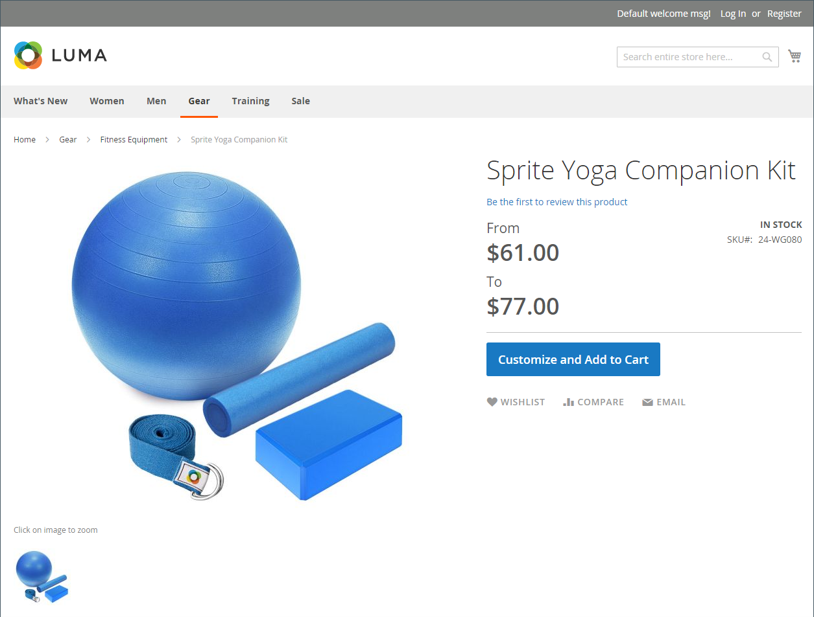

# Importa prodotti bundle

Un prodotto bundle presenta una selezione di articoli e consente ai clienti di scegliere quelli che desiderano acquistare. Tutti gli elementi che compongono un bundle esistono nel catalogo come [Prodotti semplici](../catalog/product-create-simple.md) o [Prodotti virtuali](../catalog/product-create-virtual.md). In genere, i prodotti bundle vengono creati e aggiornati dall’amministratore. Tuttavia, puoi anche importare i dati per creare un prodotto bundle oppure esportare i prodotti bundle esistenti, modificare i dati e importarli nuovamente nel catalogo. Lo Sprite Yoga Companion Kit è un pacchetto di dati di esempio utilizzato nei seguenti esempi.

{width="700" zoomable="yes"}

## Modificare l&#39;ordine degli elementi del bundle

Esistono due modi per modificare l’ordine degli elementi in un prodotto bundle.

### Metodo 1: trascinamento della selezione

Quando lavori con un prodotto [Bundle](../catalog/product-create-bundle.md) dell&#39;amministratore, puoi trascinare elementi e sezioni nella posizione desiderata.

{width="600" zoomable="yes"}

### Metodo 2: modificare i dati del prodotto

Il modo migliore per comprendere la struttura di un prodotto bundle è esportare il prodotto ed esaminare i dati in un foglio di calcolo. Per modificare l’ordine degli elementi del bundle, esporta il prodotto e aggiungi un parametro di posizione ai dati di ciascun elemento. I dati dell&#39;elemento si trovano nella colonna `bundle_values` del prodotto esportato. Quando vengono aperti in un foglio di calcolo, tutti gli elementi associati al prodotto si trovano in un&#39;unica cella come una lunga stringa di testo. La colonna `bundle_values` contiene i seguenti elementi per ogni elemento:

- Nome della sezione dell&#39;elemento
- Controllo input
- Indicatore voce richiesto
- SKU
- Colore
- Prezzo
- Indicatore di opzione predefinito
- Quantità predefinita
- Tipo di prezzo
- Indicatore quantità modificabile

#### Passaggio 1: esportare il prodotto del bundle

In questo passaggio, lo Sprite Yoga Companion Kit viene esportato come file ([CSV](data-csv.md)). Puoi utilizzare qualsiasi altro prodotto bundle presente nel catalogo.

1. Nella barra laterale _Admin_, passa a **[!UICONTROL System]** > _[!UICONTROL Data Transfer]_>**[!UICONTROL Export]**.

1. In _Impostazioni esportazione_, impostare **[!UICONTROL Entity Type]** su `Products`.

1. Nell&#39;elenco degli attributi del prodotto, scorri verso il basso fino a **[!UICONTROL SKU]** e immetti lo SKU del prodotto bundle da esportare.

   Lo SKU è `24-WG080` per il prodotto in questo esempio.

1. Scorri verso il basso fino alla parte inferiore della sezione e fai clic su **[!UICONTROL Continue]**.

1. Nella colonna _[!UICONTROL Action]_&#x200B;della griglia&#x200B;_[!UICONTROL File name]_, fare clic su **[!UICONTROL Select]** e scegliere `Download`.

   Il file viene visualizzato nel percorso di download utilizzato dal browser.

#### Passaggio 2: modificare i dati

1. Apri il file CSV scaricato in un foglio di calcolo.

1. Scorrere verso destra fino a visualizzare la colonna `bundle_values`.

   Nei dati `bundle_values`, ogni elemento è separato da virgole e ogni elemento del bundle è separato dal successivo da una barra verticale. L&#39;ultimo elemento non termina con una barra verticale. I dati del bundle esportato dovrebbero essere simili a quelli del seguente esempio:

   {width="600" zoomable="yes"}

1. Per semplificare la modifica, è possibile copiare i dati di `bundle_values` e incollarli in un editor di testo, quindi aggiungere un&#39;interruzione di riga dopo ogni elemento in modo che ogni elemento si trovi su una riga separata.

1. Dopo aver modificato i dati, rimuovere con attenzione le interruzioni di riga e incollare nuovamente i dati modificati nella colonna `bundle_values`.

   Nell&#39;illustrazione seguente viene aggiunto un parametro `position=[number]` a ogni cinghia di yoga per modificare l&#39;ordine degli elementi nell&#39;elenco dell&#39;archivio.

   {width="500" zoomable="yes"}

1. Dopo aver modificato i dati, **[!UICONTROL Save]** il file CSV.

#### Passaggio 3: importare il prodotto aggiornato

1. Nella barra laterale _Admin_, passa a **[!UICONTROL System]** > _[!UICONTROL Data Transfer]_>**[!UICONTROL Import]**.

1. In _[!UICONTROL Import Settings]_, impostare **[!UICONTROL Entity Type]**&#x200B;su `Products`.

1. Imposta **[!UICONTROL Import Behavior]** su `Replace`.

   Invece di aggiungere le modifiche come elementi aggiuntivi, questa opzione sovrascrive i dati precedenti per il prodotto bundle.

1. Scorri verso il basso fino alla sezione _File da importare_ e fai clic su **[!UICONTROL Choose File]**.

1. Seleziona il file CSV modificato.

1. Fare clic su **[!UICONTROL Check Data]** e attendere alcuni istanti per verificare i dati.

1. Se il file è valido, scegliere **[!UICONTROL Import]**.

1. Al termine del processo, passare a **[!UICONTROL System]** > _[!UICONTROL Tools]_>**[!UICONTROL Cache Management]**&#x200B;e fare clic su **[!UICONTROL Flush Cache Storage]**.

   In questo modo il prodotto aggiornato sarà immediatamente disponibile nella vetrina.
