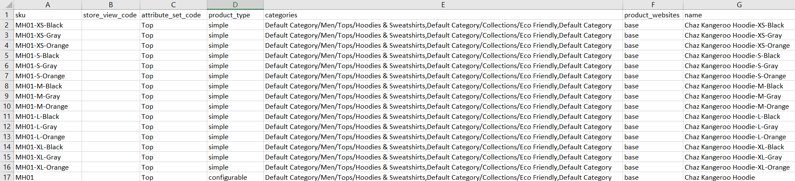
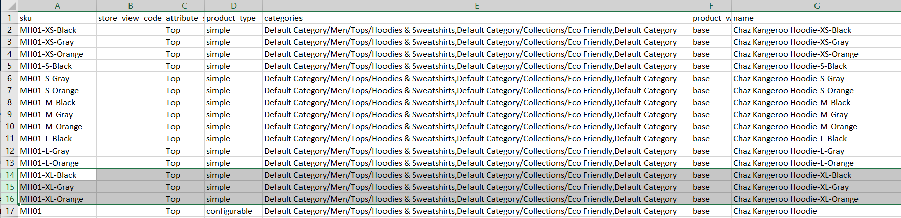
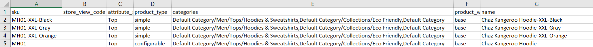
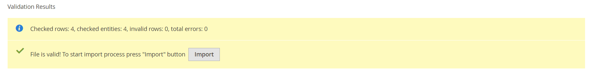

# Importare prodotti configurabili

Il modo migliore per capire come sono strutturati i dati di prodotto configurabili è esportare un prodotto configurabile e le relative varianti ed esaminare i dati in un foglio di calcolo.

Nell’esempio seguente, aggiungi un set di varianti di prodotto per una nuova dimensione in ogni colore. Innanzitutto, esporta il prodotto configurabile ed esamina la struttura dei dati. Quindi, aggiorni i dati e importali nuovamente nel catalogo. Se non desideri eseguire l’esportazione dei dati, puoi scaricare il file CSV utilizzato nell’esempio.

{width="700" zoomable="yes"}

## Passaggio 1: verificare le impostazioni e i valori degli attributi

1. Prima di iniziare, assicurati che gli attributi utilizzati per le varianti di prodotto abbiano le impostazioni di proprietà richieste.

   - [**[!UICONTROL Scope]**](../getting-started/websites-stores-views.md#scope-settings) - `Global`
   - [**[!UICONTROL Catalog Input Type for Store Owner]**](data-attributes-product.md) - Il tipo di input di qualsiasi attributo utilizzato per una variante di prodotto deve essere uno dei seguenti:

      - `Dropdown`
      - `Visual Swatch`
      - `Text Swatch`
      - `Multi-Select`

   - **[!UICONTROL Values Required]** - `Yes`

1. Se si aggiunge una dimensione o un colore o si apportano altre modifiche a un attributo esistente, assicurarsi di aggiornare l&#39;attributo con il nuovo valore.

1. Il giorno _Amministratore_ barra laterale, vai a **[!UICONTROL Stores]** > _[!UICONTROL Attributes]_>**[!UICONTROL Product]**.

1. Trova l’attributo nell’elenco e aprilo in modalità di modifica.

1. Aggiungi il nuovo valore all’attributo.

   Nell&#39;esempio seguente viene aggiunta una nuova dimensione a un campione di testo.

   {width="500" zoomable="yes"}

1. Al termine, fai clic su **[!UICONTROL Save Attribute]**.

1. Se stai aggiungendo un attributo, segui le istruzioni per [crea l’attributo](../catalog/attribute-product-create.md) prima di iniziare.

## Passaggio 2: esportare il prodotto configurabile

1. Il giorno _Amministratore_ barra laterale, vai a **[!UICONTROL Catalog]** > **[!UICONTROL Products]**.

1. Trova il prodotto configurabile da esportare:

   - Clic **[!UICONTROL Filters]**.
   - Imposta **[!UICONTROL Type]** a `Configurable Product` e fai clic su **[!UICONTROL Apply Filters]**.
   - Scegli il prodotto configurabile da utilizzare per l’esportazione dei test e prendi nota del **[!UICONTROL SKU]**.

1. Il giorno _Amministratore_ barra laterale, vai a **[!UICONTROL System]** > _[!UICONTROL Data Transfer]_>**[!UICONTROL Export]**.

   {width="600" zoomable="yes"}

1. Sotto _[!UICONTROL Export Setting]s_, eseguire le operazioni seguenti:

   - Imposta **[!UICONTROL Entity Type]** a `Products`.

   - Imposta **[!UICONTROL Export File Format]** a `CSV`.

1. Sotto _[!UICONTROL Entity Attributes]_, scorri verso il basso o utilizza il filtro delle etichette degli attributi per individuare **[!UICONTROL SKU]**attribuire ed effettuare le seguenti operazioni:

   - Inserisci lo SKU del prodotto configurabile che hai scelto di esportare e fai clic su **[!UICONTROL Continue]**.

     {width="600" zoomable="yes"}

   - Cerca il file nel percorso di download del browser web e aprilo come foglio di calcolo.

     Il file CSV ha una riga separata per ogni variante di prodotto semplice e una riga per il prodotto configurabile. Il `product_type column` mostra più varianti di prodotto semplici associate a un prodotto configurabile.

     {width="600" zoomable="yes"}

   - Scorrere fino all&#39;estrema destra del foglio di lavoro per trovare le colonne seguenti.

      - `configurable_variations` - Definisce la relazione uno-a-molti tra il record del prodotto configurabile e ogni variante.
      - `configurable_variation_labels` - Definisce l’etichetta che identifica ogni variante.

     In questo esempio, i dati si trovano nelle colonne CG e CH. A seconda del numero di varianti, la stringa di dati nel campo `configurable_variations` La colonna può essere lunga. I dati vengono utilizzati come indice delle varianti di prodotto associate e hanno la seguente struttura:

     ```text
     sku={{SKU_VALUE}},attribute1={{VALUE}},attribute2={{VALUE}}| sku={{SKU_VALUE}},attribute1={{VALUE}},attribute2={{VALUE}}
     ```

     Ogni SKU è separata da un simbolo di barra verticale (|) e gli attributi sono separati da una virgola. Il valore di ciascun attributo è rappresentato dal codice dell&#39;attributo, anziché dall&#39;etichetta dell&#39;attributo. I dati effettivi vengono visualizzati in questo modo:

     ```text
     sku=MH01-XS-Black,size=XS,color=Black|sku=MH01-XS-Gray,size=XS,color=Gray|sku=MH01-XS-Orange,size=XS,color=Orange</pre>
     ```

1. Una volta compresa la struttura dei dati di prodotto configurabili, puoi modificare i dati o aggiungere nuove varianti direttamente al file CSV.

   Per ulteriori informazioni, consulta [Dati complessi](data-attributes-product.md#complex-product-data-attributes).

## Passaggio 3: modificare i dati

Nell&#39;esempio seguente, il set di dimensioni XL viene copiato e incollato nel foglio di lavoro per creare un set di varianti di prodotto per una nuova dimensione in ciascun colore.

1. Copia il set di varianti di prodotto che desideri utilizzare come modello per i nuovi prodotti.

   {width="600" zoomable="yes"}

1. Inserire i record di righe copiati nel foglio di lavoro.

   Ora disponi di due set identici di varianti di prodotto semplici.

   {width="600" zoomable="yes"}

1. Se necessario, aggiorna i dati nelle seguenti colonne delle nuove varianti.

   - `sku`
   - `name`
   - `url_key`
   - `additional_attributes`

   Per questo esempio, tutte le `XL` i riferimenti vengono modificati in `XXL`.

1. Aggiornare le informazioni in `product_variations` del record di prodotto configurabile, in modo che le nuove varianti siano incluse come parte del prodotto configurabile.

   Nella riga con il record di prodotto configurabile fare clic sulla cella contenente `product_variations` dati. Quindi, nella barra della formula, copiate l&#39;ultimo insieme di parametri, iniziando dal simbolo di tubazione.

   {width="600" zoomable="yes"}

1. Incolla i parametri alla fine dei dati e modificali in base alle esigenze per le nuove varianti.

   In questo esempio, la proprietà `sku` e `size` I parametri vengono aggiornati per le nuove dimensioni XXL.

1. Prima di reimportare i dati nel catalogo, elimina le righe che non sono state modificate.

   In questo esempio, vengono importate nel catalogo solo le tre nuove varianti per la nuova dimensione e la riga con il prodotto configurabile aggiornato. Le altre righe possono essere eliminate dal file CSV. Tuttavia, assicurati di non eliminare la riga di intestazione con le etichette di colonna.

   {width="600" zoomable="yes"}

1. **[!UICONTROL Save]** il file CSV.

   I dati sono pronti per essere importati nel catalogo.

   >[!NOTE]
   >
   >Le dimensioni di un file di importazione non possono superare i 2 MB.

## Passaggio 4: importare i dati aggiornati

1. Il giorno _Amministratore_ barra laterale, vai a **[!UICONTROL System]** > _[!UICONTROL Data Transfer]_>**[!UICONTROL Import]**.

1. Sotto _[!UICONTROL Import Settings]_, impostato **[!UICONTROL Entity Type]**a `Products`.

1. Sotto _[!UICONTROL Import Behavior]_, impostato **[!UICONTROL Import Behavior]**a `Add/Update`.

   {width="600" zoomable="yes"}

1. Sotto _[!UICONTROL File to Import]_, fai clic su **[!UICONTROL Choose File]**e individua il file CSV preparato per l’importazione e scegli il file.

   {width="600" zoomable="yes"}

1. Nell’angolo superiore destro, fai clic su **[!UICONTROL Check Data]**.

1. Se il file è valido, fare clic su **[!UICONTROL Import]**.

   In caso contrario, correggi gli eventuali problemi rilevati nei dati e riprova.

   {width="600" zoomable="yes"}

1. Al termine dell’importazione, fai clic su **[!UICONTROL Cache Management]** nel messaggio nella parte superiore della pagina e aggiorna tutte le cache non valide.

   Le nuove varianti di prodotto sono ora disponibili nel catalogo dall’amministratore e nella vetrina. In questo esempio, la felpa è ora disponibile in dimensioni XXL per tutti i colori.
