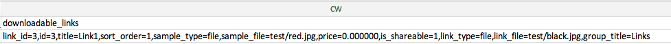

# Importare prodotti scaricabili

Il flusso per l’importazione dei prodotti scaricabili è lo stesso utilizzato per [Prodotti del bundle](data-transfer-bundle-products.md) o [Prodotti configurabili](data-transfer-configurable-products.md). La differenza è che un prodotto scaricabile ha [collegamenti scaricabili](../catalog/product-create-downloadable.md) e [esempi scaricabili](../catalog/product-create-downloadable.md) con le relative immagini.

La directory principale predefinita per i collegamenti e gli esempi scaricabili è `<Magento-root-folder>/pub/media/import`. Se il modulo di archiviazione remota è abilitato, la directory principale predefinita per i collegamenti e gli esempi scaricabili è `<remote-storage-root-folder>/media/import` directory.

Il file CSV ha colonne separate per `downloadable_links` e `downloadable_samples`.

- **Immagini di collegamento scaricabili** — Nell&#39;esempio seguente, le immagini di collegamento scaricabili (`red.jpg` e `black.jpg`) sono nel `<Magento-root-folder>/pub/media/import/test` cartella. Se l&#39;archiviazione remota è abilitata, queste immagini si trovano nel `<remote-storage-root-folder>/media/import/test` cartella.

  {width="600" zoomable="yes"}

- **Immagini di esempio scaricabili** — Nell&#39;esempio seguente, l&#39;immagine di esempio scaricabile (`white.jpg`) è nel `<Magento-root-folder>/pub/media/import/test` cartella. Se l&#39;archiviazione remota è abilitata, l&#39;immagine si trova nel `<remote-storage-root-folder>/media/import/test` cartella.

  {width="400" zoomable="yes"}

Per ulteriori informazioni sull&#39;attivazione e la gestione del modulo di storage remoto, vedere [Configurare l’archiviazione remota](https://experienceleague.adobe.com/docs/commerce-operations/configuration-guide/storage/remote-storage/remote-storage.html) nel _Guida alla configurazione_.
