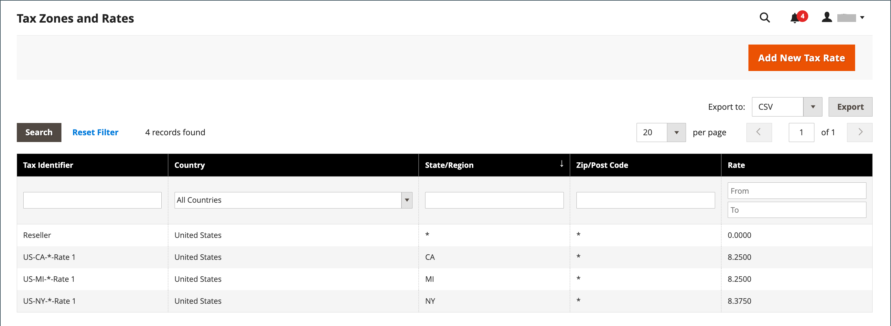

# Aggiorna dati aliquota

Se l&#39;azienda opera in più stati e si spedisce una grande quantità di prodotti, l&#39;inserimento manuale delle aliquote può richiedere molto tempo. È più veloce ed efficiente scaricare le aliquote fiscali tramite codice postale e importarle in Commerce. Nell&#39;esempio seguente viene illustrato come importare un set di aliquote specifiche dello stato scaricate da un&#39;origine attendibile. Avalara fornisce [tabelle delle aliquote](https://www.avalara.com/taxrates/en/download-tax-tables.html), che puoi scaricare gratuitamente, per ogni codice postale negli Stati Uniti.

>[!NOTE]
>
>Se ti interessa automatizzare le vendite e utilizzare i rapporti e la conformità fiscale, puoi trovare opzioni affidabili di Commerce nella [Partner commerciali](https://solutionpartners.adobe.com/s/directory/?solution=commerce) sito.

## Passaggio 1: esportare i dati dell&#39;aliquota commerciale

1. Il giorno _Amministratore_ barra laterale, vai a **[!UICONTROL System]** > _[!UICONTROL Data Transfer]_>**[!UICONTROL Import/Export Tax Rates]**.

1. Clic **[!UICONTROL Export Tax Rates]**.

1. Cercare il file nel percorso di download del browser Web.

1. Salva e apri il file in un foglio di calcolo.

   Questo esempio utilizza [!DNL OpenOffice Calc].

   I dati sull&#39;aliquota commerciale esportati includono le colonne riportate di seguito.
   - Codice
   - Paese
   - Stato
   - CAP
   - Tariffa
   - Intervallo da
   - Intervallo - A
   - Una colonna per ogni visualizzazione store

   {width="500" zoomable="yes"}

1. Aprire i nuovi dati dell&#39;aliquota in una seconda istanza del foglio di calcolo, in modo da visualizzarli affiancati.

1. Nei nuovi dati sull&#39;aliquota, prendere nota di eventuali dati aggiuntivi sull&#39;aliquota che potrebbe essere necessario impostare nel punto vendita prima dell&#39;importazione dei dati.

   Ad esempio, i dati sull&#39;aliquota per la California includono anche:

   - `TaxRegionName`
   - `CombinedRate`
   - `StateRate`
   - `CountyRate`
   - `CityRate`
   - `SpecialRate`

   Se devi importare altri [aree e aliquote fiscali](../stores-purchase/tax-zones-rates.md), devi innanzitutto definirli dall’amministratore del negozio e aggiornare [norme fiscali](../stores-purchase/tax-rules.md) secondo necessità. Quindi, esportate i dati e aprite il file in un editor di testo in modo che possa essere utilizzato come riferimento. Tuttavia, per semplificare questo esempio, vengono importate solo le colonne dell&#39;aliquota standard.

## Passaggio 2: preparare i dati di importazione

Sono aperti due fogli di calcolo affiancati. Una contiene la struttura del file di esportazione di Commerce e l’altra contiene i nuovi dati sull’aliquota da importare.

1. Per creare una posizione in cui lavorare nel foglio di calcolo con i nuovi dati dell’aliquota, inserisci tutte le colonne vuote a destra per aggiungere dati dal file di esportazione di Commerce. Taglia e incolla per aggiungere i dati, quindi ridisponi le colonne in modo che corrispondano all’ordine del file di dati di esportazione di Commerce.

1. Rinomina le intestazioni di colonna in modo che corrispondano ai dati di esportazione di Commerce.

1. Elimina le colonne prive di dati.

   In caso contrario, la struttura del file di importazione deve corrispondere ai dati di esportazione di Commerce originali.

1. Prima di salvare il file, scorri verso il basso e accertati che le colonne dell’aliquota contengano solo dati numerici.

   Qualsiasi testo trovato in una colonna di aliquota impedisce l&#39;importazione dei dati.

1. Salva i dati preparati come file CSV.

   Quando richiesto, verificare che una virgola sia utilizzata come delimitatore di campo e le virgolette doppie come delimitatore di testo. Quindi fai clic su **[!UICONTROL OK]**.

## Passaggio 3: importare le aliquote

1. Il giorno _Amministratore_ barra laterale, vai a **[!UICONTROL System]** > _[!UICONTROL Data Transfer]_>**[!UICONTROL Import/Export Tax Rates]**.

1. Clic **[!UICONTROL Choose File]** e scegli il file dell’aliquota CSV che hai preparato per l’importazione.

1. Clic **[!UICONTROL Import Tax Rates]**.

   L’importazione dei dati potrebbe richiedere alcuni minuti. Al termine del processo, il `The tax rate has been imported` viene visualizzato il messaggio. Se ricevi un messaggio di errore, correggi il problema nei dati e riprova.

1. Il giorno _Amministratore_ barra laterale, vai a **[!UICONTROL Stores]** > _[!UICONTROL Taxes]_>**[!UICONTROL Tax Zones and Rates]**.

   Le tariffe importate vengono visualizzate nell&#39;elenco.

1. Utilizzare i controlli pagina per visualizzare le nuove aliquote.

   {width="600" zoomable="yes"}

1. Esegui alcune transazioni di prova nel tuo negozio con clienti di diversi codici postali per assicurarti che le nuove aliquote fiscali funzionino correttamente.
