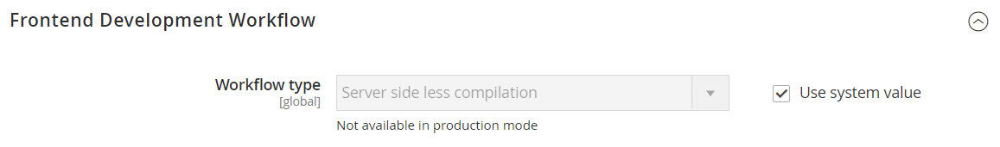
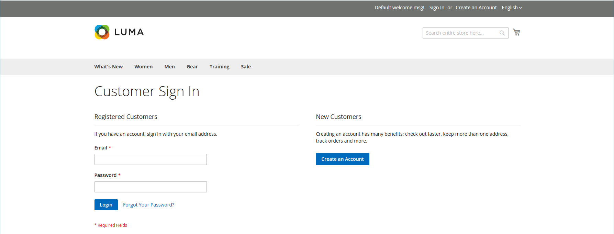

# Strumenti per sviluppatori

Utilizza gli strumenti per sviluppatori avanzati per determinare la modalità di compilazione durante lo sviluppo front-end, creare un inserisco nell&#39;elenco Consentiti di indirizzi IP e visualizzare gli hint per i percorsi dei modelli. Sono inoltre disponibili strumenti per apportare facilmente modifiche al testo nell’interfaccia della vetrina e dell’amministratore.

- [Registri azioni](action-log.md)  (solo Adobe Commerce)
- [Flusso di lavoro di sviluppo front-end](#frontend-development-workflow)
- [Utilizzo delle firme dei file statici](#static-file-signatures)
- [Ottimizzazione dei file di risorse](#optimizing-resource-files)
- [Limitazioni per i client di sviluppo](#client-restrictions)
- [Suggerimenti percorso modello](#template-path-hints)
- [Traduci in linea](#translate-inline)

## Modalità operative

È possibile distribuire l&#39;istanza Adobe Commerce o Magento Open Source per l&#39;esecuzione in _produzione_ o in _modalità sviluppatore_. È possibile accedere agli strumenti e alle impostazioni di configurazione specifici per gli sviluppatori solo quando l&#39;archivio è in esecuzione in _modalità sviluppatore_.

La modalità operativa può essere modificata solo dalla riga di comando del server da un utente con le autorizzazioni appropriate. Per ulteriori informazioni, vedere [Impostare la modalità operativa](https://experienceleague.adobe.com/docs/commerce-operations/configuration-guide/cli/set-mode.html) nella _Guida alla configurazione_.

La maggior parte degli argomenti nella documentazione per esercenti si applica a un’istanza di Commerce in esecuzione in modalità di produzione. Tuttavia, le impostazioni di configurazione e gli strumenti seguenti possono essere utilizzati solo quando l&#39;installazione è in esecuzione in modalità sviluppatore.

## Flusso di lavoro di sviluppo front-end

Il tipo di flusso di lavoro di sviluppo front-end determina se la compilazione Less viene eseguita sul lato client o server durante lo sviluppo. Less è un’estensione di CSS che dispone di funzioni e convenzioni aggiuntive e che produce codice semplificato. Per lo sviluppo dei temi, si consiglia la compilazione Less lato client. La compilazione lato server è la modalità predefinita. Le opzioni del flusso di lavoro di sviluppo non sono disponibili per i negozi in modalità di produzione.
Vedi [Compilazione LESS lato client rispetto a lato server](https://developer.adobe.com/commerce/frontend-core/guide/css/quickstart/compilation-mode/){:target="_blank"} nella documentazione per gli sviluppatori di Commerce.

>[!NOTE]
>
>La configurazione del flusso di lavoro di sviluppo front-end è disponibile solo in [modalità sviluppatore](../systems/developer-tools.md#operation-modes).

{width="600" zoomable="yes"}

1. Nella barra laterale _Admin_, passa a **[!UICONTROL Stores]** > _[!UICONTROL Settings]_>**[!UICONTROL Configuration]**.

1. Nel pannello a sinistra, espandi **[!UICONTROL Advanced]** e scegli **[!UICONTROL Developer]**.

1. Espandere  nella sezione **[!UICONTROL Front-end Development Workflow]**.

1. Imposta **[!UICONTROL Workflow Type]** su uno dei seguenti:

   - `Client side less compilation` - La compilazione viene eseguita nel browser utilizzando la libreria `less.js` nativa.
   - `Server side less compilation` - Compilazione eseguita sul server utilizzando la libreria meno PHP. Questa è la modalità predefinita per la produzione.

1. Al termine, fare clic su **[!UICONTROL Save Config]**.

## Firme file statiche

L&#39;aggiunta di una firma digitale all&#39;URL di file statici consente ai browser di rilevare quando è disponibile una versione più recente del file. I file statici che possono essere tracciati con le firme digitali includono JavaScript, CSS, immagini e font. La firma viene aggiunta al percorso direttamente dopo l’URL di base. Se la firma di un file è diversa da quella memorizzata nella cache del browser, viene utilizzata la versione più recente del file.

Consulta [Firma di contenuti statici](https://experienceleague.adobe.com/docs/commerce-operations/configuration-guide/cache/static-content-signing.html){:target="_blank"} nella documentazione per gli sviluppatori di Commerce.

>[!NOTE]
>
>La configurazione delle impostazioni di file statici è disponibile solo quando si lavora in [modalità sviluppatore](../systems/developer-tools.md#operation-modes).

{width="600" zoomable="yes"}

Per un elenco dettagliato delle impostazioni di configurazione, vedere [_Impostazioni file statici_](../configuration-reference/advanced/developer.md) nel _Riferimento configurazione_.

**_Per abilitare i file statici firmati:_**

1. Nella barra laterale _Admin_, passa a **[!UICONTROL Stores]** > _[!UICONTROL Settings]_>**[!UICONTROL Configuration]**.

1. Nel pannello a sinistra, espandi **[!UICONTROL Advanced]** e scegli **[!UICONTROL Developer]**.

1. Espandere  nella sezione **[!UICONTROL Static Files Settings]**.

1. Imposta **[!UICONTROL Sign Static Files]** su `Yes`.

1. Al termine, fare clic su **[!UICONTROL Save Config]**.

## Ottimizzazione dei file di risorse

Il tempo necessario per caricare i file di risorse può essere ridotto unendo e raggruppando i file e riducendo al minimo il codice.

- L&#39;unione combina file separati dello stesso tipo in un unico file.
- Il bundling è una tecnica che raggruppa file separati in modo da ridurre il numero di richieste HTTP necessarie per caricare una pagina.
- La minimizzazione rimuove spazi, interruzioni di riga e commenti, ma non influisce sulla funzionalità del codice. Poiché i file ridotti a icona non possono essere modificati, il processo deve essere applicato solo quando si è pronti per l’avvio in produzione.

Per impostazione predefinita, Adobe Commerce e Magento Open Source non uniscono, raggruppano o riducono a icona i file e lo sviluppatore del progetto deve determinare quali metodi di ottimizzazione file utilizzare.

Per ulteriori informazioni, consulta [Best practice per le prestazioni](https://experienceleague.adobe.com/docs/commerce-operations/performance-best-practices/overview.html).

>[!NOTE]
>
>I file CSS e JavaScript possono essere ottimizzati solo in [Modalità sviluppatore](../systems/developer-tools.md#operation-modes).

| Tipo di file | Operazioni supportate |
| --------------- | -------------------- |
| File CSS | `MergeMinify` |
| File JavaScript | `MergeBundleMinify` |
| File modello | `Minify` |

{style="table-layout:auto"}

**_Per ottimizzare i file di risorse:_**

1. Nella barra laterale _Admin_, passa a **[!UICONTROL Stores]** > _[!UICONTROL Settings]_>**[!UICONTROL Configuration]**.

1. Nel pannello a sinistra, espandi **[!UICONTROL Advanced]** e scegli **[!UICONTROL Developer]**.

1. Per ottimizzare i file CSS, espandi  nella sezione **[!UICONTROL CSS Settings]** ed effettua le seguenti operazioni:

   - Imposta **[!UICONTROL Merge CSS Files]** su `Yes`.
   - Imposta **[!UICONTROL Minify CSS Files]** su `Yes`.

   {width="600" zoomable="yes"}

[Impostazioni _CSS_](../configuration-reference/advanced/developer.md)

1. Per ottimizzare i file JavaScript, espandere  nella sezione **[!UICONTROL JavaScript Settings]** ed effettuare le seguenti operazioni:

   - Imposta **[!UICONTROL Merge JavaScript Files]** su `Yes`.
   - Imposta **[!UICONTROL Minify JavaScript Files]** su `Yes`.

   {width="600" zoomable="yes"}

1. Per minimizzare i file modello PHTML, espandere  nella sezione **[!UICONTROL Template Settings]** e impostare **[!UICONTROL Minify Html]** su `Yes`.

   {width="600" zoomable="yes"}

1. Al termine, fare clic su **[!UICONTROL Save Config]**.

## Limitazioni per i client

Prima di utilizzare uno strumento come [suggerimenti percorso modello](#template-path-hints), assicurati di aggiungere il tuo indirizzo IP al inserisco nell&#39;elenco Consentiti Developer Client Restrictions (Limitazioni client sviluppatore) per evitare di interrompere l&#39;esperienza di acquisto dei clienti nel negozio. Se non conosci il tuo indirizzo IP, puoi cercarlo online.

>[!NOTE]
>
>Le restrizioni per i client di sviluppo possono essere impostate solo in [Modalità sviluppatore](../systems/developer-tools.md#operation-modes).

Per informazioni tecniche, consulta [VCL personalizzato per consentire le richieste](https://experienceleague.adobe.com/docs/commerce-cloud-service/user-guide/cdn/custom-vcl-snippets/fastly-vcl-allowlist.html) nella _Guida di Commerce on Cloud Infrastructure_.

**_Per aggiungere il tuo indirizzo IP al inserisco nell&#39;elenco Consentiti di:_**

1. Nella barra laterale _Admin_, passa a **[!UICONTROL Stores]** > _[!UICONTROL Settings]_>**[!UICONTROL Configuration]**.

1. Nel pannello a sinistra, espandi **[!UICONTROL Advanced]** e scegli **[!UICONTROL Developer]**.

1. Espandere  nella sezione **[!UICONTROL Developer Client Restrictions]**.

   {width="600" zoomable="yes"}

1. Per **[!UICONTROL Allow IPs]**, immetti il tuo indirizzo IP.

   Se è necessario l’accesso da più indirizzi IP, separali con una virgola.

1. Al termine, fare clic su **[!UICONTROL Save Config]**.

1. Quando richiesto, aggiorna le cache non valide.

## Suggerimenti percorso modello

Gli hint di percorso del modello sono uno strumento diagnostico che aggiunge una notazione con il percorso di ciascun modello utilizzato nella pagina. Gli hint per il percorso del modello possono essere abilitati sia per la vetrina che per l’amministratore.

>[!NOTE]
>
>Gli Hint percorso modello possono essere modificati solo in [modalità sviluppatore](../systems/developer-tools.md#operation-modes).

Consulta [Individuare modelli, layout e stili](https://developer.adobe.com/commerce/frontend-core/guide/themes/debug/){:target="_blank"} nella documentazione per gli sviluppatori di Commerce.

{width="700" zoomable="yes"}

### Passaggio 1: aggiungi l’indirizzo IP al inserisco nell&#39;elenco Consentiti di

Prima di utilizzare i suggerimenti del percorso del modello, aggiungi il tuo indirizzo IP al [inserisco nell&#39;elenco Consentiti di](#client-restrictions) per evitare interferenze con i clienti che fanno acquisti nel negozio. Al termine, assicurati di cancellare la cache di Commerce per rimuovere tutti gli hint dall’archivio.

{width="600" zoomable="yes"}

### Passaggio 2: abilitare gli hint per il percorso del modello

1. Nella barra laterale _Admin_, passa a **[!UICONTROL Stores]** > _[!UICONTROL Settings]_>**[!UICONTROL Configuration]**.

1. Nel pannello a sinistra, espandi **[!UICONTROL Advanced]** e scegli **[!UICONTROL Developer]**.

1. Espandere  nella sezione **[!UICONTROL Debug]** ed effettuare le seguenti operazioni:

   {width="600" zoomable="yes"}

   - Per attivare i suggerimenti del percorso del modello per l&#39;archivio, impostare **[!UICONTROL Enabled Template Path Hints for Storefront]** su `Yes`.

   - Per abilitare i suggerimenti del percorso del modello per l&#39;archivio solo quando l&#39;URL include il parametro `templatehints`, impostare **Abilita suggerimenti per Storefront con parametro URL** su `Yes`. Impostate quindi il valore del parametro, se necessario. Il valore predefinito è `magento`, ma è possibile utilizzare un valore personalizzato. Ad esempio, se modifichi il valore in `lorem`, utilizzerai `mymagento.com?templatehints=lorem` per visualizzare gli hint del modello.

   - Per attivare i suggerimenti del percorso del modello per l&#39;amministratore, impostare **[!UICONTROL Enabled Template Path Hints for Admin]** su `Yes`.

   - Per includere i nomi dei blocchi, impostare **[!UICONTROL Add Block Class Type to Hints]** su `Yes`.

1. Al termine, fare clic su **[!UICONTROL Save Config]**.

### Passaggio 3: cancellare la cache

1. Nella barra laterale _Admin_, passa a **[!UICONTROL System]** > _[!UICONTROL Tools]_>**[!UICONTROL Cache Management]**.

1. Nell&#39;angolo superiore destro fare clic su **[!UICONTROL Flush Magento Cache]**.

## Traduci in linea

Puoi usare lo strumento Traduci in linea in [modalità sviluppatore](../systems/developer-tools.md#operation-modes) per ritoccare il testo nell&#39;interfaccia in modo da riflettere la tua voce e il tuo marchio. Quando è attivata la modalità Traduci in linea, tutto il testo sulla pagina che può essere modificato viene evidenziato in rosso. È facile modificare le etichette dei campi, i messaggi e altro testo visualizzato nella vetrina e in Amministrazione. Ad esempio, molti temi utilizzano la terminologia, ad esempio _Account personale_, _Elenco desideri_ e _Dashboard personale_, per aiutare i clienti a trovare il modo di procedere. Tuttavia, è possibile utilizzare semplicemente le parole _Account_, _Elenco desideri_ e _Dashboard_.

>[!NOTE]
>
>Lo strumento Traduci in linea è disponibile solo quando si lavora in [modalità sviluppatore](../systems/developer-tools.md#operation-modes).

Consulta [Panoramica sulle traduzioni](https://developer.adobe.com/commerce/frontend-core/guide/translations/) nella documentazione per gli sviluppatori di Commerce.

{width="700" zoomable="yes"}

Se il punto vendita è disponibile in più lingue, è possibile apportare regolazioni precise al testo tradotto per la lingua. Sul server, il testo dell’interfaccia viene mantenuto in un file CSV separato per ciascun blocco di output e organizzato in base alle impostazioni internazionali. In alternativa, invece di utilizzare lo strumento _Traduci in linea_, è possibile modificare i file CSV direttamente sul server. I file di traduzione sono archiviati in `app/code/Magento/<module_name>/i18n/<language_locale>.csv`.

>[!NOTE]
>
>Per utilizzare lo strumento Traduci in linea, il browser deve consentire la visualizzazione di popup.

### Passaggio 1: disabilitare le cache di output

1. Nella barra laterale _Admin_, passa a **[!UICONTROL System]** > _[!UICONTROL Tools]_>**[!UICONTROL Cache Management]**.

1. Selezionare le caselle di controllo seguenti:

   - `Blocks HTML output`
   - `Page Cache`
   - `Translations`

1. Impostare il controllo **[!UICONTROL Actions]** su `Disable` e fare clic su **[!UICONTROL Submit]**.

### Passaggio 2: abilitare lo strumento Traduci in linea

1. Nella barra laterale _Admin_, passa a **[!UICONTROL Stores]** > _[!UICONTROL Settings]_>**[!UICONTROL Configuration]**.

1. Per utilizzare una visualizzazione archivio specifica, impostare **[!UICONTROL Store View]** da aggiornare.

1. Nel pannello a sinistra, espandi **[!UICONTROL Advanced]** e scegli **[!UICONTROL Developer]**.

1. Espandere  nella sezione **[!UICONTROL Translate Inline]**.

   Deselezionare la casella di controllo **[!UICONTROL Use Website]** per modificare le impostazioni.

   L&#39;opzione _[!UICONTROL Enabled for Admin]_&#x200B;non è disponibile quando si modifica una visualizzazione archivio specifica.

   {width="600" zoomable="yes"}

1. Imposta **[!UICONTROL Enabled for Storefront]** su `Yes`.

1. Al termine, fare clic su **[!UICONTROL Save Config]**.

1. Quando richiesto, aggiorna le cache non valide, ma lascia le cache disabilitate invariate per il momento.

### Passaggio 3: aggiornare il testo

1. Apri la vetrina in un browser e passa alla pagina da modificare.

   Se necessario, utilizza il selettore lingua per modificare la visualizzazione dello store. Ogni stringa di testo che può essere tradotta è evidenziata in rosso. Quando passi il cursore del mouse su una casella di testo, viene visualizzata l&#39;icona di un libro (  ).

1. Fare clic sull&#39;icona libro per aprire la finestra _Traduci_ ed eseguire le operazioni seguenti:

   - Se la modifica riguarda la visualizzazione archivio specifica, selezionare la casella di controllo **[!UICONTROL Store View Specific]**.

   - Immettere il nuovo testo **[!UICONTROL Custom]**.

1. Al termine, fare clic su **[!UICONTROL Submit]**.

   {width="700" zoomable="yes"}

1. Per visualizzare le modifiche nell&#39;archivio, aggiorna il browser.

1. Ripetere questa procedura per modificare tutti gli elementi dell&#39;archivio.

### Passaggio 4: ripristinare le impostazioni originali

1. Torna all’Amministratore del tuo negozio.

1. Nella barra laterale _Admin_, passa a **[!UICONTROL Stores]** > _[!UICONTROL Settings]_>**[!UICONTROL Configuration]**.

1. Impostare **[!UICONTROL Store View]** sulla visualizzazione specifica modificata.

1. Nel pannello a sinistra, espandi **[!UICONTROL Advanced]** e scegli **[!UICONTROL Developer]**.

1. Espandere  nella sezione **[!UICONTROL Translate Inline]**.

1. Imposta **[!UICONTROL Enabled for Frontend]** su `No`.

1. Al termine, fare clic su **[!UICONTROL Save Config]**.

1. Nella barra laterale _Admin_, passa a **[!UICONTROL System]** > _[!UICONTROL Tools]_>**[!UICONTROL Cache Management]**.

1. Seleziona la casella di controllo delle seguenti cache di output precedentemente disabilitate:

   - `Blocks HTML output`
   - `Page Cache`
   - `Translations`

1. Impostare il controllo **[!UICONTROL Actions]** su `Enable` e fare clic su **[!UICONTROL Submit]**.

1. Quando richiesto, aggiorna le cache non valide.

### Passaggio 5: verificare le modifiche nel punto vendita

Vai alla vetrina ed esamina ogni pagina aggiornata per verificare che le modifiche siano corrette. In questo esempio, `Customer Login` è stato modificato in `Customer Sign In`. Se sono state apportate modifiche a una visualizzazione specifica, utilizza Selezione lingua per passare alla visualizzazione corretta.

{width="700" zoomable="yes"}
