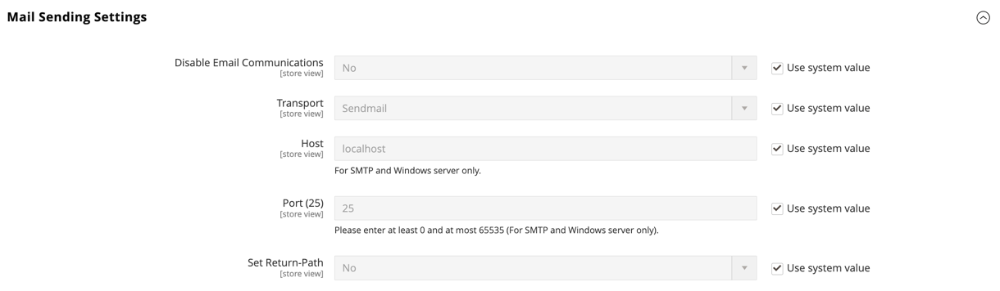

# Configurare le comunicazioni e-mail

Le _impostazioni di invio posta_ consentono di indirizzare le e-mail restituite o le risposte a un indirizzo specifico. Se l&#39;archivio è in esecuzione su un server SMTP o Windows, è possibile verificare le impostazioni dell&#39;host e della porta.

>[!IMPORTANT]
>
>**Avviso di protezione** Tutti i commercianti devono impostare immediatamente la configurazione di invio della posta per proteggersi da un potenziale exploit di esecuzione del codice remoto identificato di recente. Fino alla risoluzione del problema, si consiglia di evitare di utilizzare [!DNL Sendmail] per le comunicazioni e-mail. In _[!UICONTROL Mail Sending Settings]_, assicurarsi che_[!UICONTROL Set Return Path]_ sia impostato su `No`.

Per un elenco dettagliato delle impostazioni di configurazione, vedere [_[!UICONTROL Mail Sending Settings]_](../configuration-reference/advanced/system.md) in _Riferimento configurazione_.

## Configurare le comunicazioni e-mail

1. Nella barra laterale _Admin_, passa a **[!UICONTROL Stores]** > _[!UICONTROL Settings]_>**[!UICONTROL Configuration]**.

1. Nel pannello a sinistra, espandi **[!UICONTROL Advanced]** e scegli **[!UICONTROL System]**.

1. Espandere  nella sezione **[!UICONTROL Mail Sending Settings]** ed effettuare le seguenti operazioni:

   {width="600" zoomable="yes"}

   - Se necessario, impostare **[!UICONTROL Disable Email Communications]** su `No`.

   - Per **[!UICONTROL Transport]**, scegliere il tipo di trasporto per le comunicazioni e-mail dall&#39;archivio: `Sendmail` o `SMTP`

   - Se l&#39;esecuzione avviene su un server SMTP o Windows, verificare le impostazioni seguenti:

      - **[!UICONTROL Host]** - `localhost` o altro/i

      - **[!UICONTROL Port (25)]** - `25` o altro/i

   - Per **[!UICONTROL Set Return Path]**, scegliere una delle opzioni seguenti:

      - `No` - (misura di sicurezza consigliata) Le route hanno restituito l&#39;indirizzo e-mail dell&#39;archivio predefinito.
      - `Yes` - Le route hanno restituito l&#39;e-mail all&#39;indirizzo predefinito dell&#39;archivio.
      - `Specified` - Le route hanno restituito l&#39;indirizzo e-mail specificato in **[!UICONTROL Return Path Email]**.

   - Se l&#39;esecuzione avviene su un server SMTP, configurare la connessione:

      - **[!UICONTROL Username]** - Immettere il nome utente di accesso per il server SMTP.
      - **[!UICONTROL Password]** - Immettere la password di accesso al server SMTP.
      - **[!UICONTROL Auth]** - Scegliere il tipo di autenticazione per la connessione al server SMTP: `NONE`, `PLAIN` o `LOGIN`
      - **[!UICONTROL SSL]** - Scegliere il tipo di verifica per il certificato di sicurezza del server: `SSL` o `TLS`

     {width="600" zoomable="yes"}

1. Nel pannello a sinistra, espandi **[!UICONTROL Sales]** e scegli **[!UICONTROL Sales Emails]**.

1. Espandere  nella sezione **[!UICONTROL General Settings]**.

1. Imposta **[!UICONTROL Asynchronous sending]** su `Enable`.

   {width="600" zoomable="yes"}

   Per un elenco dettagliato delle impostazioni di configurazione, vedere [_Impostazioni generali_](../configuration-reference/sales/sales-emails.md) nel _Riferimento configurazione_.

1. Al termine, fare clic su **[!UICONTROL Save Config]**.
