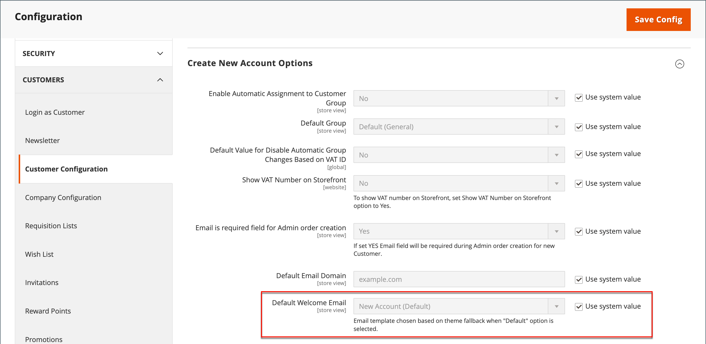

# Personalizzare i modelli e-mail

Commerce include un modello e-mail predefinito per la sezione del corpo di ogni messaggio inviato dal sistema. Per creare il messaggio completo, il modello per il contenuto del corpo viene combinato con i modelli di intestazione e piè di pagina. Il contenuto è formattato con HTML e CSS e può essere facilmente modificato e personalizzato aggiungendo [variabili](variables-predefined.md). I modelli e-mail possono essere personalizzati per ogni sito web, store o visualizzazione store. Se utilizzi modelli personalizzati, assicurati di aggiornare la [configurazione di sistema](email-templates.md#configure-email-templates) per garantire che venga utilizzato il modello corretto. Per informazioni su come utilizzare le istruzioni condizionali nella personalizzazione del modello e-mail, consulta la [documentazione per gli sviluppatori](https://developer.adobe.com/commerce/frontend-core/guide/templates/email/#theme-based-customizations-1).

{width="500" zoomable="yes"}

I modelli predefiniti includono il logo e le informazioni di archiviazione e possono essere utilizzati senza ulteriori personalizzazioni. Tuttavia, come best practice, è consigliabile visualizzare ogni modello e apportare le modifiche necessarie prima di inviarlo ai clienti.

- [Modello intestazione](email-template-custom.md#header-template)
- [Modello piè di pagina](email-template-custom.md#footer-template)
- [Modelli di messaggio](email-template-custom.md#message-templates)

{width="700" zoomable="yes"}

## Informazioni sul modello

| Campo | Descrizione |
| ----- | ----------- |
| [!UICONTROL Template Name] | Nome del modello personalizzato. |
| [!UICONTROL Insert Variable] | Inserisce una variabile nel modello in corrispondenza della posizione del cursore. |
| [!UICONTROL Template Subject] | L&#39;oggetto del modello viene visualizzato nella colonna Oggetto e può essere utilizzato per ordinare e filtrare i modelli nell&#39;elenco. |
| [!UICONTROL Template Content] | Il contenuto del modello in HTML. |
| [!UICONTROL Template Styles] | Nella casella _[!UICONTROL Template Styles]_&#x200B;è possibile immettere qualsiasi dichiarazione di stile CSS necessaria per formattare il modello. |

{style="table-layout:auto"}

## Modello intestazione

Dopo aver completato la [configurazione](email-templates.md#configure-email-templates), il modello di intestazione e-mail include il logo collegato all&#39;archivio. Se hai una conoscenza di base di HTML, puoi facilmente utilizzare [variabili predefinite](variables-predefined.md) per aggiungere le informazioni di contatto dell&#39;archivio all&#39;intestazione.

### Passaggio 1: Carica il modello predefinito

1. Nella barra laterale _Admin_, passa a **[!UICONTROL Marketing]** > _[!UICONTROL Communications]_>**[!UICONTROL Email Templates]**.

1. Fare clic su **[!UICONTROL Add New Template]**.

1. Nella sezione **[!UICONTROL Load default template]**, fare clic sul selettore **[!UICONTROL Template]** e scegliere `Magento_Email` > `Header`.

   {width="600" zoomable="yes"}

1. Fare clic su **[!UICONTROL Load Template]**.

   Il codice HTML e le variabili del modello vengono visualizzati nel modulo.

### Passaggio 2: Personalizzare il modello

1. Immetti **[!UICONTROL Template Name]** per l&#39;intestazione personalizzata.

1. Immettere **[!UICONTROL Template Subject]** per organizzare i modelli.

   Nella griglia, l&#39;elenco dei modelli può essere ordinato e filtrato in base alla colonna _[!UICONTROL Subject]_.

   {width="600" zoomable="yes"}

1. Nella casella **[!UICONTROL Template Content]**, modificare il HTML in base alle esigenze.

   >[!NOTE]
   >
   >Quando lavori nel codice del modello, fai attenzione a non sovrascrivere nulla che sia racchiuso tra parentesi graffe.

1. Per inserire una [variabile](variables-reference.md), posizionare il cursore nel codice in cui si desidera inserire la variabile e fare clic su **[!UICONTROL Insert Variable]**.

1. Scegli la variabile da inserire.

   {width="600" zoomable="yes"}

   Quando viene selezionata una variabile, nel codice viene inserito un tag [markup](markup-tags.md) per la variabile.

   Anche se le variabili dell&#39;indirizzo e-mail dell&#39;archivio sono quelle più spesso incluse nell&#39;intestazione, è possibile immettere il codice per qualsiasi variabile di sistema o [personalizzata](variables-custom.md) direttamente nel modello.

1. Se è necessario creare dichiarazioni CSS, immettere gli stili nella casella **[!UICONTROL Template Styles]**.

1. Quando si è pronti per rivedere il proprio lavoro, fare clic su **[!UICONTROL Preview Template]**.

   Apporta le modifiche necessarie al modello.

1. Al termine, fare clic su **[!UICONTROL Save Template]**.

   L’intestazione personalizzata viene ora visualizzata nell’elenco dei modelli e-mail disponibili.

### Passaggio 3: Aggiornare la configurazione

1. Nella barra laterale _Admin_, passa a **[!UICONTROL Content]** > _[!UICONTROL Design]_>**[!UICONTROL Configuration]**.

1. Nella griglia individuare la visualizzazione archivio che si desidera configurare e fare clic su **[!UICONTROL Edit]** nella colonna _[!UICONTROL Action]_.

1. Scorri verso il basso ed espandi il  nella sezione **[!UICONTROL Transactional Emails]**.

1. Scegli **[!UICONTROL Header Template]** utilizzato come predefinito per le notifiche e-mail.

1. Al termine, fare clic su **[!UICONTROL Save Config]**.

{width="600" zoomable="yes"}

## Modello piè di pagina

Il piè di pagina del modello e-mail contiene la riga di chiusura e di firma del messaggio e-mail. È possibile modificare la chiusura per adattarla al proprio stile e aggiungere ulteriori informazioni, ad esempio il nome e l&#39;indirizzo dell&#39;azienda sotto il proprio nome.

### Passaggio 1: Carica il modello predefinito

1. Nella barra laterale _Admin_, passa a **[!UICONTROL Marketing]** > _[!UICONTROL Communications]_>**[!UICONTROL Email Templates]**.

1. Fare clic su **[!UICONTROL Add New Template]**.

1. Nella sezione **[!UICONTROL Load default template]**, fare clic sul selettore **[!UICONTROL Template]** e scegliere `Magento_Email` > `Footer`.

1. Fare clic su **[!UICONTROL Load Template]**.

   Il codice HTML e le variabili del modello vengono visualizzati nel modulo.

### Passaggio 2: Personalizzare e visualizzare in anteprima il modello

1. Immettere **[!UICONTROL Template Name]** per il piè di pagina personalizzato.

1. Immettere **[!UICONTROL Template Subject]** per organizzare i modelli.

   Nella griglia, i modelli possono essere ordinati e filtrati in base alla colonna _[!UICONTROL Subject]_.

   {width="600" zoomable="yes"}

1. Nella casella **[!UICONTROL Template Content]**, modificare il HTML in base alle esigenze.

   >[!NOTE]
   >
   >Quando lavori nel codice del modello, fai attenzione a non sovrascrivere nulla che sia racchiuso tra parentesi graffe.

1. Per inserire una [variabile](variables-reference.md), posizionare il cursore nel codice in cui si desidera inserire la variabile e fare clic su **[!UICONTROL Insert Variable]**.

1. Scegli la variabile da inserire.

   Quando viene selezionata una variabile, nel codice viene inserito un tag [markup](markup-tags.md) per la variabile.

   Sebbene le variabili Contatto archivio siano quelle incluse più spesso nel piè di pagina, è possibile immettere il codice per qualsiasi variabile di sistema o [personalizzata](variables-custom.md) direttamente nel modello.

1. Se è necessario creare dichiarazioni CSS, immettere gli stili nella casella **[!UICONTROL Template Styles]**.

### Passaggio 3: Aggiornare la configurazione

1. Nella barra laterale _Admin_, passa a **[!UICONTROL Content]** > _[!UICONTROL Design]_>**[!UICONTROL Configuration]**.

1. Nella griglia individuare la visualizzazione archivio che si desidera configurare e fare clic su **[!UICONTROL Edit]** nella colonna _[!UICONTROL Action]_.

1. Scorri verso il basso ed espandi il  nella sezione **[!UICONTROL Transactional Emails]**.

1. Scegliere **[!UICONTROL Footer Template]** utilizzato come piè di pagina predefinito nelle notifiche e-mail.

1. Al termine, fare clic su **[!UICONTROL Save Config]**.

{width="600" zoomable="yes"}

## Modelli di messaggio

Il processo di personalizzazione del corpo di ogni messaggio è lo stesso utilizzato per personalizzare l’intestazione o il piè di pagina. L’unica differenza è il modello di messaggio per ogni attività o evento che attiva una notifica. Puoi utilizzare i modelli così come sono o personalizzarli in base alla tua voce e al tuo marchio. Oltre al testo del modello, è disponibile un&#39;ampia selezione di [variabili predefinite](variables-predefined.md) consentite e [variabili personalizzate](variables-custom.md) che è possibile creare e incorporare nel modello.

### Passaggio 1: Carica il modello predefinito

1. Nella barra laterale _Admin_, passa a **[!UICONTROL Marketing]** > _[!UICONTROL Communications]_>**[!UICONTROL Email Templates]**.

1. Fare clic su **[!UICONTROL Add New Template]**.

   {width="600" zoomable="yes"}

1. Effettua le seguenti operazioni:

   - In **[!UICONTROL Load default template]** scegliere **[!UICONTROL Template]** che si desidera personalizzare.

   - Fare clic su **[!UICONTROL Load Template]**.

### Passaggio 2: Personalizzare il modello

1. Per **[!UICONTROL Template Name]**, immettere un nome per il modello personalizzato.

1. Se necessario, modificare **[!UICONTROL Template Subject]**.

   Questa è la prima riga del messaggio, che è la formula di apertura predefinita. Puoi lasciarla così com’è, oppure inserire qualcosa di più descrittivo.

1. Prendi nota del percorso **[!UICONTROL Currently Used For]** del modello, che è il percorso utilizzato per aggiornare la configurazione.

   {width="600" zoomable="yes"}

1. Nella casella **[!UICONTROL Template Content]**, modificare il HTML in base alle esigenze.

   Il contenuto è costituito da una combinazione di tag HTML, direttive CSS, variabili e testo.

   >[!NOTE]
   >
   >Quando lavori nel codice del modello, fai attenzione a non sovrascrivere accidentalmente il codice racchiuso tra parentesi graffe.

1. Per inserire una variabile, posizionare il cursore nel codice nel punto in cui si desidera visualizzare la variabile.

   La selezione delle variabili varia in base al modello e include [variabili predefinite](variables-predefined.md) e [personalizzate](variables-custom.md) consentite, se disponibili.

1. Fare clic su **[!UICONTROL Insert Variable]** e scegliere la variabile da inserire.

   Un comando per inserire la variabile è racchiuso tra parentesi graffe e aggiunto al codice nella posizione del cursore. Ad esempio:

   `customVar code=my_custom_variable`

1. Per creare dichiarazioni CSS, immettere gli stili in **[!UICONTROL Template Styles]**.

   {width="600" zoomable="yes"}

   >[!NOTE]
   >
   >Gli stili personalizzati vengono applicati all&#39;e-mail solo se `{{template config_path="design/email/header_template"}}` è presente in _[!UICONTROL Template Styles]_. Per utilizzare CSS personalizzati senza un modello di intestazione predefinito, è necessario fornirli qui all&#39;interno del tag HTML `<style>`.

### Passaggio 3: Aggiornare la configurazione

L&#39;analisi delle breadcrumb di _[!UICONTROL Currently Used For]_&#x200B;mostra dove viene utilizzato il modello. In questo esempio, la configurazione del modello si trova nella pagina&#x200B;_[!UICONTROL Customer Configuration]_, nella sezione _[!UICONTROL Create New Account Options]_&#x200B;e nel campo&#x200B;_[!UICONTROL Default Welcome Email]_.

- Pagina - [!UICONTROL Customer Configuration]
- Sezione - [!UICONTROL Create New Account Options]
- Campo - [!UICONTROL Default Welcome Email]

1. Nella traccia delle breadcrumb **[!UICONTROL Currently Used For]**, fai clic sul collegamento per aprire la pagina di configurazione del modello.

   {width="600" zoomable="yes"}

1. Espandi  nella sezione e individua il campo per il modello di e-mail personalizzato.

1. Deselezionare la casella di controllo **[!UICONTROL Use system value]** e fare clic sul nome del modello personalizzato.

   {width="600" zoomable="yes"}

1. Al termine, fare clic su **[!UICONTROL Save Config]**.

1. Nel messaggio nella parte superiore dell&#39;area di lavoro, fare clic su **[!UICONTROL Cache Management]** e cancellare eventuali cache non valide.

### Passaggio 4: Anteprima e salvataggio del modello

1. Quando si è pronti per rivedere il proprio lavoro, fare clic su **[!UICONTROL Preview Template]**.

1. Aggiorna il modello in base alle esigenze.

1. Al termine, fare clic su **[!UICONTROL Save Template]**.

   Il modello personalizzato è ora disponibile nell’elenco dei modelli e-mail.
