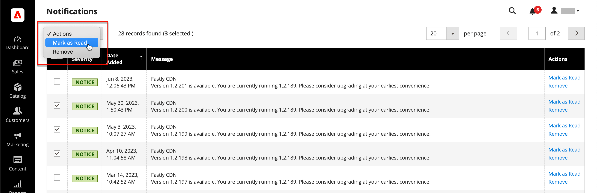

# Notifiche di sistema

Il _Notifiche_ pagina elenca tutti i messaggi classificati per gravità, con il più recente in alto. I comandi Azione possono essere utilizzati per contrassegnare i singoli messaggi come letti, visualizzare informazioni più dettagliate o rimuovere il messaggio dalla casella in entrata.

1. Effettua una delle seguenti operazioni per aprire _[!UICONTROL Notifications]_pagina:

   - Fai clic su _Notifica_ nell’intestazione. Se sono presenti uno o più nuovi messaggi, fai clic su **[!UICONTROL See All]**.

   - Il giorno _Amministratore_ barra laterale, vai a **[!UICONTROL System]** > _[!UICONTROL Other Settings]_>**[!UICONTROL Notifications]**.

1. In **[!UICONTROL Action]** eseguire una delle operazioni seguenti:

   - Per ulteriori informazioni, fai clic su **[!UICONTROL Read Details]** per aprire la pagina collegata in una nuova finestra.

   - Per mantenere il messaggio nella Posta in arrivo, fare clic su **[!UICONTROL Mark As Read]**.

     {width="700" zoomable="yes"}

   - Per eliminare il messaggio, fai clic su **[!UICONTROL Remove]**.

1. Per applicare un&#39;azione a più messaggi, eseguire una delle operazioni seguenti:

   - Seleziona la casella di controllo nella prima colonna per ogni messaggio da gestire.
   - Per selezionare più messaggi, imposta **[!UICONTROL Mass Actions]** secondo necessità.

1. Imposta il **[!UICONTROL Actions]** controllo a uno dei seguenti elementi:

   - `Mark as Read`
   - `Remove`

1. Clic **[!UICONTROL Submit]** per completare il processo.
