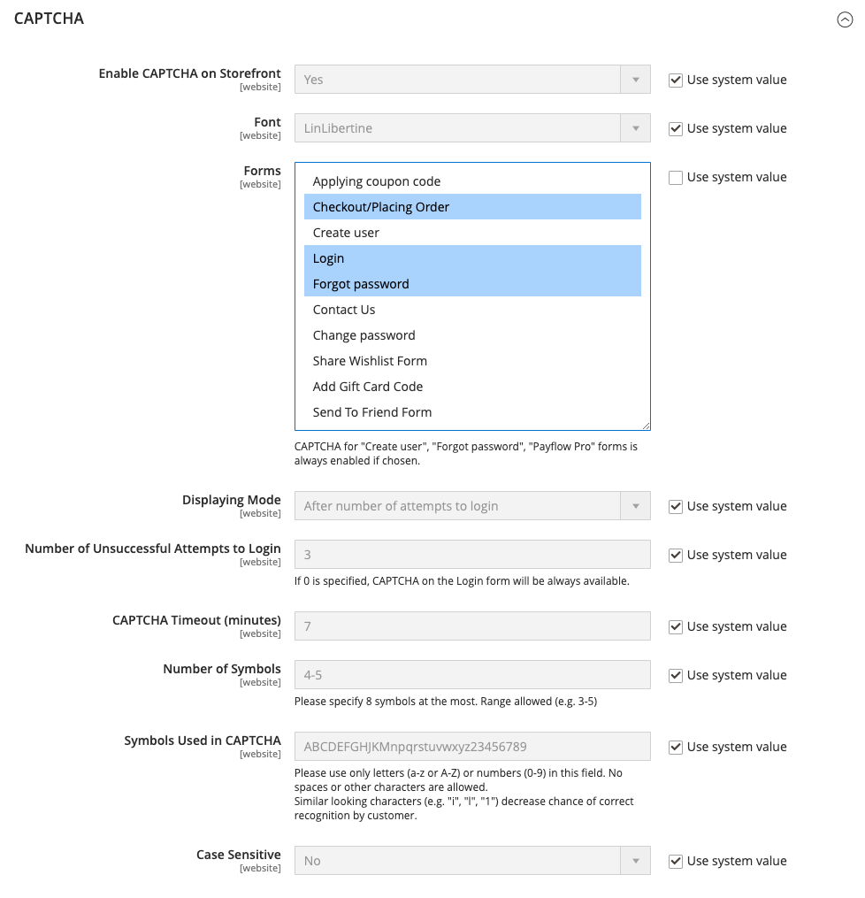

# CAPTCHA

Un CAPTCHA è un dispositivo visivo che assicura che un essere umano, anziché un computer (o &quot;bot&quot;), interagisca con il sito. CAPTCHA è l&#39;acronimo di _Completely Automated Public Turing test to tell Computers and Humans Apart_ (Test di Turing pubblico completamente automatizzato per distinguere computer e persone). Può essere utilizzato sia per l’accesso come amministratore che per varie azioni della vetrina avviate da clienti registrati. Adobe Commerce e Magento Open Source supportano il CAPTCHA standard descritto in questo argomento e [Google reCAPTCHA](security-google-recaptcha.md).

Per ricaricare il CAPTCHA il numero di volte necessario, fai clic sull’icona Ricarica nell’angolo superiore destro dell’immagine. Il CAPTCHA è completamente configurabile e può essere impostato ogni volta o solo dopo un determinato numero di tentativi di accesso non riusciti.

{width="700" zoomable="yes"}

## Configurare CAPTCHA per l’amministratore

Per un ulteriore livello di sicurezza, puoi aggiungere un CAPTCHA alla pagina Accesso amministratore e Password dimenticata. Gli utenti amministratori possono ricaricare il CAPTCHA visualizzato facendo clic sull&#39;icona _Ricarica_  nell&#39;angolo superiore destro dell&#39;immagine. Il numero di ricaricamenti è illimitato.

{width="300"}

1. Nella barra laterale _Admin_, passa a **[!UICONTROL Stores]** > _[!UICONTROL Settings]_>**[!UICONTROL Configuration]**.

1. Nel pannello a sinistra, espandi **[!UICONTROL Advanced]** e scegli **[!UICONTROL Admin]**.

1. Nell&#39;angolo superiore destro impostare **[!UICONTROL Store View]** su `Default`.

   Se l&#39;[ambito](../getting-started/websites-stores-views.md#scope-settings) dell&#39;installazione di Commerce include più siti Web, scegliere i siti Web in cui applicare la configurazione CAPTCHA.

1. Espandere  nella sezione **[!UICONTROL CAPTCHA]**.

1. Imposta **[!UICONTROL Enable CAPTCHA in Admin]** su `Yes`. Quindi completare le altre opzioni come segue:

   {width="600" zoomable="yes"}

   - Immettere il nome di **[!UICONTROL Font]** da utilizzare per i simboli CAPTCHA (impostazione predefinita: `LinLibertine`).

     Per aggiungere un tipo di carattere personalizzato, il file del tipo di carattere deve trovarsi nella stessa directory dell&#39;installazione di Commerce e deve essere dichiarato nel file `config.xml` del modulo Captcha in `app/code/Magento/Captcha/etc`.

   - Selezionare uno dei **[!UICONTROL Forms]** seguenti in cui deve essere utilizzato il CAPTCHA. Per scegliere più moduli, tenere premuto Ctrl (PC) o Comando (Mac).

      - `Admin Login`
      - `Admin Forgot Password`

   - Imposta **[!UICONTROL Displaying Modes]** su uno dei seguenti:

      - `Always` — CAPTCHA è sempre richiesto per accedere all&#39;amministratore.
      - `After number of attempts to login` - Questa opzione è valida solo per il modulo di accesso amministratore. Se selezionata, viene visualizzato il campo _[!UICONTROL Number of Unsuccessful Attempts to Login]_. Immetti il numero di tentativi di accesso che desideri consentire. Il valore 0 (zero) è simile all&#39;impostazione della modalità di visualizzazione su `Always`.

     Per tenere traccia del numero di tentativi di accesso non riusciti, viene conteggiato ogni tentativo di accesso con un unico indirizzo e-mail e da un indirizzo IP. Il numero massimo di tentativi di accesso consentiti dallo stesso indirizzo IP è 1.000. Questa limitazione si applica solo quando CAPTCHA è abilitato.

   - Per **[!UICONTROL Number of Unsuccessful Attempts to Login]**, immettere il numero di tentativi di accesso dell&#39;amministratore prima che venga visualizzato il CAPTCHA. Se impostato su zero (`0`), CAPTCHA è sempre obbligatorio.

   - Per **[!UICONTROL CAPTCHA Timeout (minutes)]**, immettere il numero di minuti prima della scadenza del CAPTCHA. Alla scadenza del CAPTCHA, l’amministratore deve ricaricare la pagina.

   - Immetti **[!UICONTROL Number of Symbols]** da visualizzare nel CAPTCHA. È possibile utilizzare fino a otto (`8`) simboli. Per un numero variabile di simboli che cambiano con ogni CAPTCHA, immettere un intervallo, ad esempio `5-8`.

   - Per **[!UICONTROL Symbols Used in CAPTCHA]**, immettere le lettere (a-z e A-Z) e i numeri (0-9) che si desidera visualizzare in modo casuale nel CAPTCHA. I simboli difficili da distinguere da altri simboli, ad esempio `i`, `l` o `1`, non sono inclusi nel set predefinito di simboli CAPTCHA.

   - Impostare **[!UICONTROL Case Sensitive]** su `Yes` se si desidera richiedere agli amministratori di immettere i caratteri in maiuscolo o minuscolo esattamente come mostrato nel CAPTCHA.

1. Al termine, fare clic su **[!UICONTROL Save Config]**.

## Configurare CAPTCHA per la vetrina

Ai clienti può essere richiesto di immettere un CAPTCHA ogni volta che accedono ai loro account o dopo diversi tentativi di accesso non riusciti. Inoltre, è possibile configurare numerosi moduli utilizzati nella vetrina per richiedere la verifica da parte di CAPTCHA.

{width="700" zoomable="yes"}

1. Nella barra laterale _Admin_, passa a **[!UICONTROL Stores]** > _[!UICONTROL Settings]_>**[!UICONTROL Configuration]**.

1. Nel pannello a sinistra, espandi **[!UICONTROL Customers]** e scegli **[!UICONTROL Customer Configuration]**.

1. Espandere  nella sezione **[!UICONTROL CAPTCHA]**.

{width="600" zoomable="yes"}

1. Imposta **[!UICONTROL Enable CAPTCHA on Storefront]** su `Yes`. Quindi completare le altre opzioni come segue:

   - Immettere il nome di **[!UICONTROL Font]** da utilizzare per i simboli CAPTCHA (impostazione predefinita: `LinLibertine`).

     Per aggiungere un carattere personalizzato, il file del carattere deve trovarsi nella stessa directory dell&#39;installazione di Commerce e deve essere dichiarato nel file `config.xml` del modulo CAPTCHA.

   - Selezionare uno dei **[!UICONTROL Forms]** seguenti in cui deve essere utilizzato il CAPTCHA. Per scegliere più moduli, tenere premuto Ctrl (PC) o Comando (Mac).

      - `Applying coupon code`
      - `Checkout/Placing Order`
      - `Create user`
      - `Login`
      - `Forgot password`
      - `Contact Us`
      - `Change password`
      - `Share Wishlist Form`
      - `Payflow Pro` (vedere [patch di sicurezza](https://experienceleague.adobe.com/docs/commerce-knowledge-base/kb/troubleshooting/payments/paypal-payflow-pro-active-carding-activity.html?lang=it) _articolo della Knowledge Base_)
      - `Send to Friend Form`  (solo Magento Open Source)
      - `Add Gift Card Code`  (solo Adobe Commerce)
      - `Create company`  (disponibile solo con Adobe Commerce B2B)

   - Imposta **[!UICONTROL Displaying Mode]** su uno dei seguenti:

      - `Always` — CAPTCHA è sempre richiesto per accedere ai moduli selezionati.
      - `After number of attempts to login` — Immettere il numero di tentativi di accesso prima che venga visualizzato il CAPTCHA. Il valore 0 (zero) è simile a &quot;Sempre&quot;. Se questa opzione è selezionata, viene visualizzato il numero di tentativi di accesso non riusciti. Questa opzione non si applica al modulo Password dimenticata, che se attivato mostra sempre il CAPTCHA.

   - Per **[!UICONTROL Number of Unsuccessful Attempts to Login]**, immettere il numero di volte in cui un cliente può effettuare l&#39;accesso senza successo prima che venga visualizzato il CAPTCHA. Se è impostato su zero (`0`), viene sempre utilizzato CAPTCHA.

   - Per **[!UICONTROL CAPTCHA Timeout (minutes)]**, immettere il numero di minuti prima della scadenza del CAPTCHA. Alla scadenza del CAPTCHA, il cliente deve ricaricare la pagina per generare un nuovo CAPTCHA.

   - Immetti **[!UICONTROL Number of Symbols]** da visualizzare nel CAPTCHA. È possibile utilizzare fino a otto (`8`) simboli. Per un numero variabile di simboli che cambiano con ogni CAPTCHA, immettere un intervallo, ad esempio `5-8`.

   - Per **[!UICONTROL Symbols Used in CAPTCHA]**, immettere le lettere (a-z e A-Z) e i numeri (0-9) che si desidera visualizzare in modo casuale nel CAPTCHA. Il set di caratteri predefinito non include simboli simili, ad esempio `I` o `1`. Per ottenere risultati ottimali, utilizzare simboli facilmente identificabili dagli utenti.

   - Impostare **[!UICONTROL Case Sensitive]** su `Yes` se si desidera richiedere ai clienti di immettere i caratteri in lettere maiuscole o minuscole esattamente come mostrato nel CAPTCHA.

1. Al termine, fare clic su **[!UICONTROL Save Config]**.
