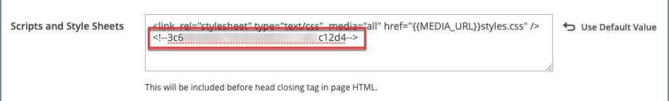
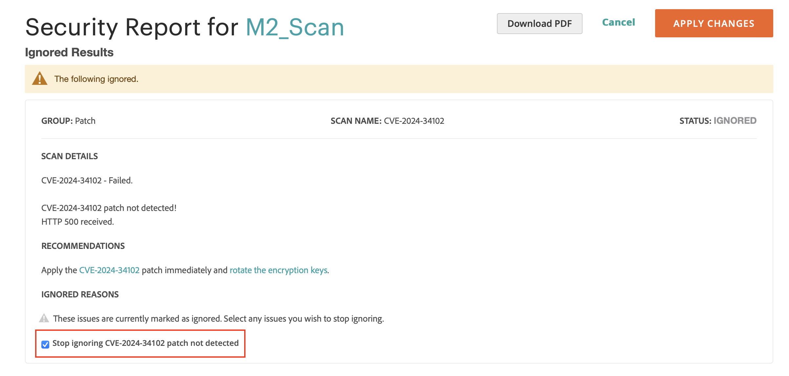

# Scansione di sicurezza

Monitora i siti Adobe Commerce e Magento Open Source per individuare rischi per la sicurezza e malware e ricevi aggiornamenti e notifiche per la sicurezza.

- Ottieni da insight lo stato di sicurezza in tempo reale del tuo negozio.
- Ricevi suggerimenti in base alle best practice per aiutare a risolvere i problemi.
- Pianifica un&#39;analisi della sicurezza da eseguire settimanalmente, quotidianamente o su richiesta.
- Esegui oltre 21.000 test di sicurezza per identificare potenziali malware.
- Accedi ai report cronologici di sicurezza che tengono traccia e monitorano l’avanzamento dei siti.
- Accedere al rapporto di scansione che mostra i controlli riusciti e non riusciti, con le azioni consigliate.

Lo strumento di analisi della sicurezza è disponibile gratuitamente nel dashboard dell&#39;[account Commerce/Magento](../getting-started/commerce-account-create.md). Per informazioni tecniche, vedere [Configurare lo strumento di analisi della sicurezza](https://experienceleague.adobe.com/en/docs/commerce-on-cloud/user-guide/launch/overview#set-up-the-security-scan-tool) nella _Guida di Commerce sull&#39;infrastruttura cloud_.

{width="600" zoomable="yes"}

## Esegui un&#39;analisi della sicurezza

1. Dalla home page di Commerce, accedi al tuo [account Commerce/Magento](../getting-started/commerce-account-create.md).

1. Rivedi e accetta i termini per l’utilizzo dello strumento Security Scan.

   1. Nel pannello a sinistra, scegli **[!UICONTROL Security Scan]**.
   1. Fare clic su **[!UICONTROL Go to Security Scan]**.
   1. Leggi **[!UICONTROL Terms and Conditions]**.
   1. Fare clic su **[!UICONTROL Agree]** per continuare.

1. Nella pagina _[!UICONTROL Monitored Websites]_, fare clic su **[!UICONTROL +Add Site]**.

   Se disponi di più siti con domini diversi, configura una scansione separata per ciascun dominio.

   {width="600" zoomable="yes"}

1. Per verificare la proprietà del dominio del sito aggiungendo un codice di conferma, eseguire una delle operazioni seguenti:

   **vetrina Commerce**:

   1. Immettere **[!UICONTROL Site URL]** e **[!UICONTROL Site Name]**.
   1. Fare clic su **[!UICONTROL Generate Confirmation Code]**.
   1. Fai clic su **Copia** per copiare il codice di conferma negli Appunti.

      {width="400" zoomable="yes"}

   1. Accedi all’amministratore del tuo archivio come utente con privilegi di amministratore completo ed effettua le seguenti operazioni:

      1. Nella barra laterale _Admin_, passa a **[!UICONTROL Content]** > _[!UICONTROL Design]_>**[!UICONTROL Configuration]**.
      1. Trovare il sito nell&#39;elenco e fare clic su **[!UICONTROL Edit]**.
      1. Espandere  nella sezione **[!UICONTROL HTML Head]**.
      1. Scorri verso il basso fino a **[!UICONTROL Scripts and Style Sheets]** e fai clic nella casella di testo alla fine di qualsiasi codice esistente. Incolla il codice di conferma nella casella di testo.

         {width="600" zoomable="yes"}

      1. Al termine, fare clic su **[!UICONTROL Save Configuration]**.

   **vetrina PWA**:

   1. Immettere **[!UICONTROL Site URL]** e **[!UICONTROL Site Name]**.

   1. Per **[!UICONTROL Confirmation Code]**, scegliere l&#39;opzione `META Tag` e quindi fare clic su **[!UICONTROL Generate Code]**.

   1. Fare clic su **[!UICONTROL Copy]** per copiare negli Appunti il tag META del codice di conferma generato.

      {width="400" zoomable="yes"}

   1. Vai alla directory del progetto PWA Studio storefront ed effettua le seguenti operazioni:

      1. Nella directory del progetto PWA Studio, vai a `packages > venia-concept > template.html`.
      1. Aggiungi il codice di conferma copiato (il tag META generato) all’intestazione del HTML e salva le modifiche.

         {width="600" zoomable="yes"}

      1. Torna a PWA Studio CLI e utilizza il filato per installare le dipendenze del progetto ed eseguire il comando project build.

         ```sh
         yarn install &&
         yarn build
         ```

      1. *Nel progetto Cloud*, crea una cartella `pwa` e copia il contenuto nella cartella `dist` del progetto storefront.

         ```sh
         mkdir pwa && cp -r <path to your storefront project>/dist/* pwa
         ```

      1. Utilizza lo strumento Git CLI per posizionare nell’area intermedia, eseguire il commit e inviare queste modifiche al progetto Cloud.

         ```sh
         git add . &&
         git commit -m "Added storefront file bundles" &&
         git push origin
         ```

         Al termine del processo di generazione, le modifiche verranno distribuite nella parte anteriore dello store di PWA.

1. Torna alla pagina _[!UICONTROL Security Scan]_nel tuo account Commerce e fai clic su **[!UICONTROL Verify Confirmation Code]**per stabilire la proprietà del dominio.

1. Dopo una conferma, configurare le opzioni **[!UICONTROL Set Automatic Security Scan]** per uno dei tipi seguenti:

   **Scansione settimanale (consigliata)**:

   Scegliere **[!UICONTROL Week Day]**, **[!UICONTROL Time]** e **[!UICONTROL Time Zone]** per eseguire l&#39;analisi ogni settimana.

   Per impostazione predefinita, la scansione inizia ogni settimana a mezzanotte del sabato (UTC) e continua fino alla prima domenica.

   {width="500" zoomable="yes"}

   **Scansione giornaliera**:

   Scegliere **[!UICONTROL Time]** e **[!UICONTROL Time Zone]** che l&#39;analisi deve essere eseguita ogni giorno.

   Per impostazione predefinita, la scansione inizia ogni giorno a mezzanotte (UTC).

   {width="500" zoomable="yes"}

1. Immettere **[!UICONTROL Email Address]** dove si desidera ricevere le notifiche delle scansioni completate e degli aggiornamenti di sicurezza.

   {width="400" zoomable="yes"}

1. Al termine, fare clic su **[!UICONTROL Submit]**.

   Dopo aver verificato la proprietà del dominio, il sito viene visualizzato nell&#39;elenco Siti Web monitorati dell&#39;account Commerce.

1. Se disponi di più siti web con domini diversi, ripeti questo processo per impostare un’analisi di sicurezza per ciascuno di essi.

## Gestisci errori di scansione

Lo strumento Security Scan consente di gestire gli errori di scansione direttamente dalla vista report. È possibile contrassegnare specifici errori di scansione come falsi positivi e escluderli dal punteggio di rischio.

### Vantaggi della gestione degli errori di scansione

La gestione degli errori di scansione consente di ottenere una panoramica più accurata della sicurezza dello store grazie a:

- Riduzione dei falsi positivi nei rapporti sulla sicurezza.
- Concentrarsi su questioni di sicurezza rilevanti che richiedono attenzione.
- Mantenere una visione più chiara dello stato di sicurezza reale del tuo negozio.
- Eliminazione della necessità di contattare il supporto per falsi positivi noti.
- Risparmio di tempo grazie alla gestione automatica degli errori di scansione già analizzati.

Di seguito sono riportati alcuni scenari comuni in cui è possibile contrassegnare un errore di scansione come falso positivo:

- Quando è già stata applicata una patch di sicurezza che lo strumento di scansione non ha rilevato.
- Quando un problema rilevato non è applicabile alla configurazione di archivio specifica.
- Quando hai implementato una misura di sicurezza alternativa che risolve il problema.
- Quando l&#39;errore di scansione si basa su una configurazione impostata intenzionalmente per le esigenze aziendali.

### Ignora errori di scansione

Per gestire gli errori di scansione identificati come falsi positivi, effettua le seguenti operazioni:

1. Dalla pagina _[!UICONTROL Monitored Websites]_, fare clic su **[!UICONTROL View Report]**per il sito che si desidera gestire.

1. Nella visualizzazione report, individuare la scansione non riuscita che si desidera contrassegnare come falso positivo.

1. Fare clic su **[!UICONTROL Ignore]** per l&#39;errore di scansione specifico.

   {width="600" zoomable="yes"}

1. Fai clic su **[!UICONTROL Apply Changes]** per salvare la selezione.

L&#39;errore di scansione ignorato viene spostato nella sezione _[!UICONTROL Ignored Results]_ed è escluso dal punteggio di rischio.

### Interrompi ignoramento errori di scansione

Se è necessario ripristinare un errore di scansione precedentemente ignorato nel monitoraggio attivo, eseguire la procedura seguente:

1. Nella visualizzazione report, scorrere fino alla sezione _[!UICONTROL Ignored Results]_.

1. Fare clic su **[!UICONTROL Stop Ignoring]** per l&#39;errore di scansione che si desidera ripristinare.

   {width="600" zoomable="yes"}

1. Fai clic su **[!UICONTROL Apply Changes]** per salvare la selezione.

L&#39;errore di scansione torna alla sezione _[!UICONTROL Failed Scans]_ed è incluso nel punteggio di rischio.

### Visualizza errori di scansione ignorati

I risultati ignorati vengono visualizzati in una sezione separata del rapporto e il punteggio di rischio viene aggiornato automaticamente in modo da riflettere solo gli errori di scansione attivi. È possibile gestire più errori di scansione contemporaneamente selezionando più elementi prima di applicare le modifiche.

{width="600" zoomable="yes"}
