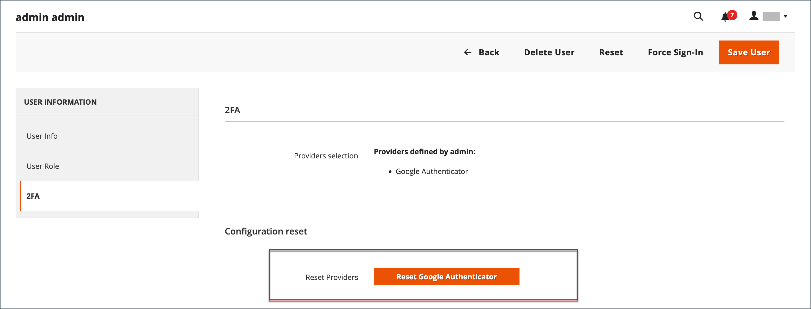

# Gestire l’autenticazione a due fattori

Gli utenti che non sono in grado di accedere a _Admin_ con autenticazione a due fattori (2FA) possono provare a sincronizzare o risolvere il problema. Puoi anche reimpostare gli autenticatori associati all’account. Quando viene reimpostato, l’utente deve effettuare di nuovo l’accesso e riconfigurare gli autenticatori richiesti.

In caso di problemi durante l&#39;accesso con 2FA, considerare quanto segue:

- Alcune app mobili includono opzioni di sincronizzazione. Questa opzione riconnette l’app e il server e sincronizza le impostazioni temporali sul dispositivo e sul server.
- La revoca di un dispositivo o il ripristino di un autenticatore può agevolare la connessione degli utenti.
- Può essere utile anche cancellare la cache web e i cookie per l’installazione di Adobe Commerce o Magento Open Source. Gli autenticatori, come Google, utilizzano i cookie generati per salvare l’accesso e la durata. Cancella i cookie per il tuo specifico browser e dominio di archiviazione.
- Il blocco dei cookie impedisce ad alcuni autenticatori, ad esempio [!DNL Google Authenticator], di completare il processo di verifica. Aggiungi al browser una regola che consenta i cookie per l’installazione di Adobe Commerce.

Per reimpostare gli autenticatori dalla riga di comando e per informazioni più avanzate sulla risoluzione dei problemi, vedere [Autenticazione a due fattori](https://developer.adobe.com/commerce/testing/functional-testing-framework/two-factor-authentication/) nella documentazione per gli sviluppatori.

**_Reimpostare gli autenticatori per un account utente:_**

>[!NOTE]
>
>Per reimpostare i provider 2FA per altri utenti, è necessario essere un _amministratore_ con autorizzazioni `All` o disporre di autorizzazioni `Custom` per il ruolo con [!UICONTROL System] > [!UICONTROL Permissions] > [!UICONTROL Two Factor Auth] e [!UICONTROL System] > [!UICONTROL Permissions] > [!UICONTROL All Users] selezionati. Per ulteriori informazioni, consulta [Ruoli utente](permissions-user-roles.md).

1. Nella barra laterale _Admin_, passa a **[!UICONTROL System]** > _[!UICONTROL Permissions]_>**[!UICONTROL All Users]**.

1. Seleziona l’utente e apri l’account in modalità di modifica.

1. Scorri verso il basso fino alla sezione _[!UICONTROL Current User Identity Verification]_e immetti la password.

1. Nel pannello a sinistra, fai clic su **[!UICONTROL 2FA]**.

1. Nella sezione _[!UICONTROL Configuration reset]_, fare clic su **[!UICONTROL Reset]**e **[!UICONTROL OK]**per confermare.

   {width="600" zoomable="yes"}

   Se l&#39;utente desidera ripristinare i metodi 2FA richiesti nel proprio account, deve riconfigurarli dalla pagina _Accedi_.

1. Al termine, fare clic su **[!UICONTROL Save User]**.
