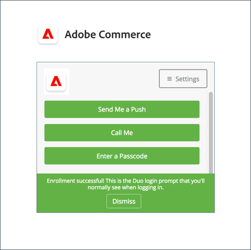
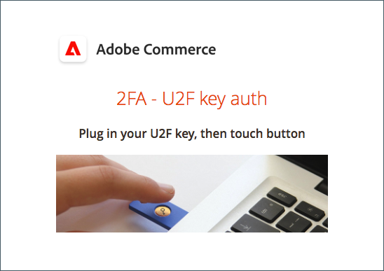

# Impostazione dell’autenticazione a due fattori per gli account utente

Queste istruzioni mostrano come impostare l’autenticazione a due fattori durante il primo accesso a Adobe Commerce o al Magento Open Source e come autenticare la tua identità utilizzando le app e i dispositivi seguenti.

Per istruzioni complete, vedere [Accesso amministratore](../getting-started/admin-signin.md).

>[!NOTE]
>
>Gli archivi che hanno abilitato l&#39;autenticazione [!DNL Adobe Identity Management Services] (IMS) hanno Adobe Commerce nativo e Magento Open Source 2FA disabilitato. Gli utenti amministratori che hanno effettuato l’accesso alla propria istanza di Commerce con le credenziali di Adobe non devono ripetere l’autenticazione per molte attività di amministrazione. L’autenticazione viene gestita da Adobe IMS quando l’utente amministratore accede alla sessione corrente. Vedi Panoramica sull&#39;integrazione di [[!DNL Adobe Identity Management Service] (IMS)](../getting-started/adobe-ims-integration-overview.md).

## [!DNL Google Authenticator]

### Passaggio 1: configurare [!DNL Google Authenticator]

1. Immetti le credenziali del tuo account e accedi a _Admin_. Viene visualizzata una nuova schermata di autenticazione con un codice QR.

1. Apri l&#39;app **[!UICONTROL Google Authenticator]** sul tuo dispositivo mobile.

1. Fare clic sul segno più ( **+** ) per aggiungere una voce e allineare la casella rossa con il codice QR da digitalizzare con la fotocamera dello smart phone.

1. Quando il telefono riconosce il codice QR e aggiunge una voce, immetti tale codice di 6 cifre nel campo _Amministratore_ **[!UICONTROL Authenticator code]**.

1. Al termine, fare clic su **[!UICONTROL Confirm]**.

   {width="300"}

### Passaggio 2: accedere con [!DNL Google Authenticator]

1. Immetti le credenziali del tuo account e accedi a Commerce _Admin_.

   {width="300"}

1. Apri [!DNL Google Authenticator] sul tuo dispositivo mobile.

1. Quando richiesto, immettere il codice di autenticazione a sei cifre.

1. Per salvare l&#39;autenticazione per gli accessi futuri, selezionare la casella di controllo **[!UICONTROL Trust this device, do not ask again]**.

1. Al termine, fare clic su **[!UICONTROL Confirm]**.

## [!DNL Duo Security]

[!DNL Duo] offre una versione di prova gratuita e addebiti in base al numero di utenti associati all&#39;account. Segui le [istruzioni per configurare il tuo account e scaricare l&#39;app](https://duo.com/product/multi-factor-authentication-mfa/duo-mobile-app).

### Passaggio 1: configurare [!DNL Duo Security]

1. Immetti le credenziali del tuo account e accedi a _Admin_.

1. Quando viene visualizzata la pagina di installazione di [!DNL Duo], fare clic su **[!UICONTROL Start setup]** ed eseguire le operazioni seguenti:

   {width="300"}

1. Seleziona il dispositivo.

1. Quando richiesto, immettere il numero di telefono e fare clic su **[!UICONTROL Continue]**.

   In questo esempio viene richiesto il numero di telefono perché si sta utilizzando un dispositivo mobile.

1. Quando viene richiesto di installare [!DNL Duo Mobile] per il tipo di telefono, fare clic su **[!UICONTROL I have Duo Mobile]**.

1. Apri [!DNL Duo Mobile] ed esegui la scansione del codice QR per sincronizzare l&#39;autenticatore con Adobe Commerce. Al termine dell’attivazione viene visualizzato un segno di spunta.

1. Per configurare le impostazioni per il dispositivo, scegliere l&#39;azione da eseguire all&#39;accesso.

   - `Ask me to choose an authenticator method` - Consente all&#39;utente di selezionare l&#39;accesso e l&#39;autenticazione in _Admin_.
   - `Automatically send this device a Duo Push` - Invia un messaggio al dispositivo per accettare o negare l&#39;accesso.
   - `Automatically call this device` — Chiama e fornisce un passcode da immettere per l&#39;accesso.

   {width="300"}

### Passaggio 2: accedere con [!DNL Duo Security]

Nell&#39;esempio seguente vengono illustrate le opzioni per `Ask me to choose an authenticator method`:

1. Quando richiesto, immetti le credenziali _Admin_ per accedere.

   {width="300"}

1. Scegliere il metodo da utilizzare per l&#39;autenticazione:

   - `Send Me a Push` - Fare clic per ricevere un avviso push a [!DNL Duo Mobile]. Accetta per autenticare.
   - `Call Me` — Fare clic su questa opzione, ricevere una chiamata con un codice e immettere il codice di accesso.
   - `Enter a Passcode` — Fare clic su questa opzione per ricevere e immettere un codice di accesso.

1. Completa il push o il codice per accedere completamente a _Admin_.

## [!DNL Authy]

[!DNL Authy] offre gratuitamente la propria app e il proprio servizio agli utenti. Segui le istruzioni per scaricare e configurare l’app per il dispositivo o il browser. Per ulteriori informazioni, consulta la [[!DNL Authy] documentazione](https://authy.com/features/setup/).

### Passaggio 1: configurare Authy

1. Immetti le credenziali del tuo account e accedi a _Admin_.

   Registrazione ![[!DNL Authy]](./assets/storefront-2fa-authy-auth.png){width="300"}

1. Quando ti viene richiesto di registrarti su Authy, effettua le seguenti operazioni:

   - Seleziona il tuo paese.

   - Immetti il numero di telefono.

   - Selezionare **[!UICONTROL Verification method]**: `SMS` o `Call Me`

   Fare clic su **[!UICONTROL Continue]**. Un messaggio viene inviato al telefono tramite SMS o chiamata.

1. Immettere il codice di verifica ricevuto e fare clic su **[!UICONTROL Verify]**.

1. Al termine, fare clic su **[!UICONTROL Confirm]**.

   ![[!DNL Authy] codice di verifica](./assets/storefront-2fa-authy-verify.png){width="300"}

### Passaggio 2: accedere con [!DNL Authy]

1. Immetti le credenziali del tuo account e accedi a _Admin_.

   ![[!DNL Authy] - accesso](./assets/storefront-2fa-authy-access.png){width="300"}

1. Scegliere uno dei metodi seguenti per l&#39;autenticazione:

   - `Use one touch` - Invia un avviso all&#39;app [!DNL Authy]. Nell’app, accetta l’accesso.
   - `Use authy token` - Richiede di immettere un codice dall&#39;app [!DNL Authy].

1. In caso di problemi di accesso, scegliere il metodo da utilizzare per ricevere il codice. Quindi, immetti il codice che ricevi per accedere a _Admin_.

   L’app include questi metodi di emergenza aggiuntivi.

   - `Send me a code via SMS` - SMS inviato al dispositivo mobile configurato.
   - `Send me a code via phone call` - L&#39;utente riceve una telefonata con un codice.

   Il tuo account viene verificato e aperto.

## U2F ([!DNL Yubikey] e altri dispositivi)

Segui le istruzioni del provider di soluzioni per configurare il dispositivo U2F. Per ulteriori informazioni, vedere la documentazione del fornitore, ad esempio [[!DNL YubiKey]](https://support.yubico.com/hc/en-us/articles/360013790339-Getting-Started-with-Your-YubiKey) di [!UICONTROL Yubico].

1. Immetti le credenziali del tuo account e accedi a _Admin_.

   {width="300"}

1. Premere il tasto.

   L&#39;autenticazione attiva immediatamente e apre _Admin_.

1. Inserire **[!UICONTROL U2F key]** in una porta USB del computer.
