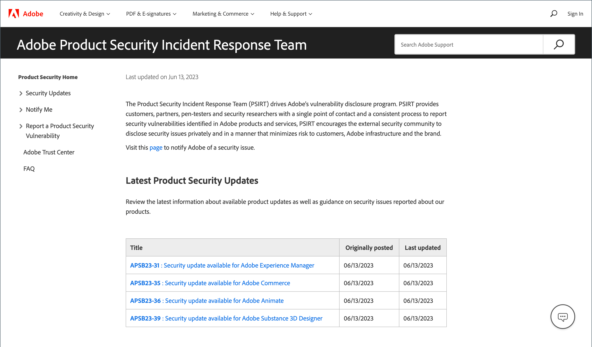

# Sicurezza

Esistono diversi modi per proteggere il tuo archivio e mantenere la sicurezza dei dati:

- Configura [autenticazione a due fattori](security-two-factor-authentication.md)
- Implementa [CAPTCHA](security-captcha.md) o [reCAPTCHA](security-google-recaptcha.md)
- Configura un [Analisi della sicurezza](security-scan.md) per ogni dominio nell&#39;installazione di Adobe Commerce o di Magento Open Source.

>[!NOTE]
>
>Gli archivi che hanno abilitato l&#39;autenticazione [!DNL Adobe Identity Management Services] (IMS) hanno Adobe Commerce nativo e Magento Open Source 2FA disabilitato. Gli utenti amministratori che hanno effettuato l’accesso alla propria istanza di Commerce con le credenziali di Adobe non devono ripetere l’autenticazione per molte attività di amministrazione. L’autenticazione viene gestita da Adobe IMS quando l’utente amministratore accede alla sessione corrente. Vedi Panoramica sull&#39;integrazione di [[!DNL Adobe Identity Management Service] (IMS)](../getting-started/adobe-ims-integration-overview.md).

Visita il [Centro sicurezza PC](https://helpx.adobe.com/it/security.html){:target=&quot;_blank&quot;} per ottenere le ultime notizie sulle potenziali vulnerabilità, registrati per ricevere le notifiche sulla sicurezza Adobe e accedi al Centro protezione Adobe.

{width="700" zoomable="yes"}

Per informazioni sulle best practice per la sicurezza, consulta [Proteggere il sito e l&#39;infrastruttura di Commerce](https://experienceleague.adobe.com/docs/commerce-operations/implementation-playbook/best-practices/launch/security-best-practices.html?lang=it) nella _playbook di implementazione_.

## Piano d&#39;azione sulla sicurezza

Se pensi che il tuo sito Adobe Commerce o di Magento Open Source sia compromesso, segui questo piano d’azione senza indugio.

1. **Diagnosi**: esegui un&#39;analisi per stabilire lo stato di sicurezza dell&#39;archivio Commerce. Commerce [Security Scan](security-scan.md) è un servizio gratuito offerto da Adobe che ti consente di monitorare i tuoi siti Commerce per rilevare rischi noti per la sicurezza e malware e di ricevere notifiche di sicurezza.

1. **Pulisci**: Assumi un [consulente qualificato](https://solutionpartners.adobe.com/s/directory/?partner_type=1) o un servizio online per pulire il tuo sito da qualsiasi codice dannoso. Alcuni membri della community Commerce consigliano [[!DNL Sucuri Website Malware Removal]](https://sucuri.net/website-antivirus/malware-removal). Controllare la cartella `/media` per il codice eseguibile rimanente. Rimuovi tutti gli utenti Admin sconosciuti e reimposta tutte le password Admin.

1. **Protect**: mantieni aggiornata l&#39;installazione di Commerce con la versione più recente. Se si utilizza una versione precedente, applicare tutte le patch di sicurezza non appena diventano disponibili. Rivedi e segui le [best practice per la sicurezza di Commerce](https://www.adobe.com/content/dam/cc/en/trust-center/ungated/whitepapers/experience-cloud/adobe-commerce-best-practices-guide.pdf). Iscriviti a [Avvisi sulla sicurezza di Commerce](https://www.adobe.com/subscription/adbeSecurityNotifications.html).

1. **Report**: se pensi di aver trovato una vulnerabilità specifica in Commerce, [apri un problema con Adobe](https://hackerone.com/adobe?type=team) e includi i dettagli tecnici.

1. **Aggiornamento**: per una maggiore tranquillità derivante dal supporto 24 ore su 24, 7 giorni su 7, pianifica ora l&#39;aggiornamento a [Adobe Commerce sulla nostra architettura cloud](https://business.adobe.com/it/products/magento/cloud-delivery.html).
