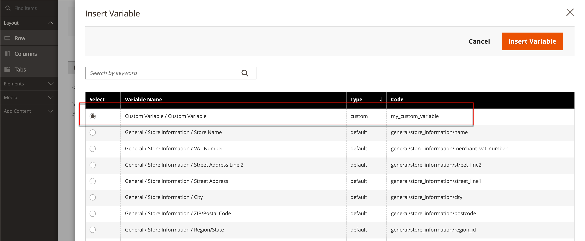

# Aggiungere variabili personalizzate

Per soddisfare le esigenze specifiche della tua azienda, puoi creare variabili personalizzate e inserirle in [pagine](../content-design/pages.md), [blocchi](../content-design/blocks.md), e [modelli e-mail](email-templates.md). L’elenco delle variabili consentite visualizzato quando fai clic su _Inserisci variabile_ il pulsante include entrambi [predefinito](variables-predefined.md) e le variabili personalizzate. L’elenco delle variabili disponibili per un modello e-mail specifico è determinato dai dati associati al modello. Consulta la [Riferimento variabile](variables-reference.md) per un elenco dei modelli e-mail utilizzati di frequente e delle relative variabili associate.

{width="600" zoomable="yes"}

>[!NOTE]
>
>Nei modelli per e-mail e newsletter è possibile utilizzare solo le variabili predefinite o personalizzate consentite.

## Passaggio 1: creare una variabile personalizzata

1. Il giorno _Amministratore_ barra laterale, vai a **[!UICONTROL System]** > _[!UICONTROL Other Settings]_>**[!UICONTROL Custom Variables]**.

1. Clic **[!UICONTROL Add New Variable]**.

1. Inserisci un identificatore per **[!UICONTROL Variable Code]**, utilizzando tutti i caratteri minuscoli senza spazi.

   Se necessario, è possibile utilizzare un carattere di sottolineatura o un trattino per rappresentare uno spazio. Ad esempio: `my_custom_variable`

1. Immetti un **[!UICONTROL Variable Name]**, utilizzato come riferimento interno. Ad esempio: `My Custom Variable`

1. Per immettere il valore associato alla variabile, eseguire una delle operazioni seguenti:

   - Per **[!UICONTROL Variable HTML Value]**, immetti il valore della variabile formattato con tag HTML semplici. Ad esempio:

     `<b>This formatted content appears in place of the variable.</b>`

   - Per **[!UICONTROL Variable Plain Value]**, immetti il valore della variabile come testo normale senza formattazione. Ad esempio:

     `This unformatted content appears in place of the variable.`

   >[!TIP]
   >
   >Se è necessario più spazio, trascinare l&#39;angolo inferiore destro della casella di testo.

   {width="600" zoomable="yes"}

1. Al termine, fai clic su **[!UICONTROL Save]**.

## Passaggio 2: inserire la variabile personalizzata nel contenuto

Utilizzare [!DNL Page Builder] per inserire una variabile personalizzata.

1. Apri la pagina, il blocco, la categoria o il prodotto in cui desideri aggiungere la variabile al contenuto.

1. Espandi  il **[!UICONTROL Content]** sezione.

1. Clic **[!UICONTROL Edit with Page Builder]**.

1. Nel pannello a sinistra, fai clic su **[!UICONTROL Elements]** ed effettuare una delle seguenti operazioni:

   - Fare clic in un&#39;area di testo esistente in cui si desidera inserire la variabile.

   - Trascina un nuovo **[!UICONTROL Text]** all&#39;area di visualizzazione.

1. All’estrema destra della barra degli strumenti dell’editor, fai clic su (  ) per inserire una variabile.

   ![[!DNL Page Builder] palco e pannello](./assets/variable-custom-pagebuilder-stage.png){width="600" zoomable="yes"}

1. Nell’elenco, seleziona la variabile personalizzata da inserire e fai clic su **[!UICONTROL Insert Variable]**.

   {width="600" zoomable="yes"}

   L’identificatore della variabile viene visualizzato come segnaposto nell’editor.

   ![[!DNL Page Builder] stage - segnaposto variabile](./assets/pagebuilder-variable-inserted.png){width="600" zoomable="yes"}

1. Al termine, fai clic su **[!UICONTROL Save]**.
